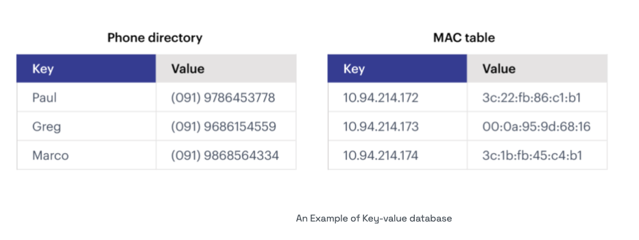
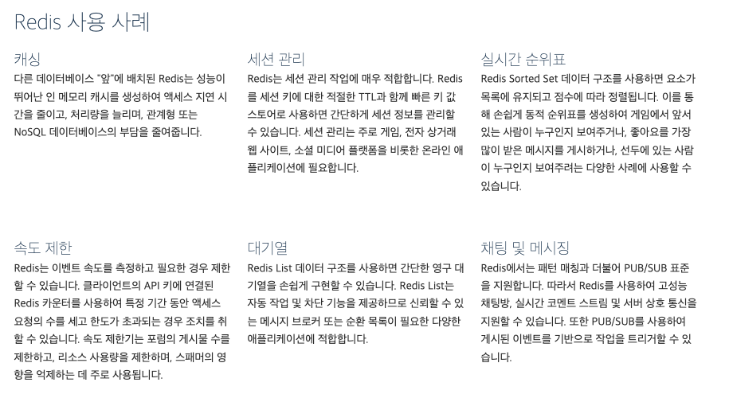

## Redis란?

---

> **레디스**(Redis)는 Remote Dictionary Server의 약자로서[[4\]](https://ko.wikipedia.org/wiki/레디스#cite_note-RedisFAQ-4), "키-값" 구조의 비정형 데이터를 저장하고 관리하기 위한 [오픈 소스](https://ko.wikipedia.org/wiki/오픈_소스) 기반의 비관계형 [데이터베이스 관리 시스템](https://ko.wikipedia.org/wiki/데이터베이스_관리_시스템)(DBMS)이다. 2009년 [살바토르 산필리포](https://ko.wikipedia.org/w/index.php?title=살바토르_산필리포&action=edit&redlink=1)(Salvatore Sanfilippo)가 처음 개발했다. 2015년부터 Redis Labs가 지원하고 있다. 모든 데이터를 메모리로 불러와서 처리하는 메모리 기반 [DBMS](https://ko.wikipedia.org/wiki/DBMS)이다. [BSD 라이선스](https://ko.wikipedia.org/wiki/BSD_라이선스)를 따른다. DB-Engines.com의 월간 랭킹에 따르면, 레디스는 가장 인기 있는 키-값 저장소이다.[[5\]](https://ko.wikipedia.org/wiki/레디스#cite_note-5) - 위키백과-

어렵게 써있지만 쉽게 말해서 Redis는 오픈 소스 기반의 **인메모리 데이터 구조 저장소**입니다. 이처럼 데이터가 메모리에 저장되기 때문에 읽기 및 쓰기 속도가 매우 빠른 특징이 있으며  주로 캐싱, 세션 관리, 메시지 브로커 등 빠른 데이터 처리와 접근이 필요한 다양한 시스템에서 사용됩니다.

## Redis 데이터 저장 방식

---

Redis 는 NoSQL 데이터베이스로 아래와 같이 Key-Value 형태로 데이터를 저장합니다.

출처 : https://redis.io/nosql/key-value-databases/

## Redis 주요 특징

---

- **인메모리 저장소**: 데이터를 메모리에 저장하여 매우 빠른 읽기 및 쓰기 성능을 제공합니다. 메모리 기반이라 디스크 I/O 병목이 없으며, 밀리초 단위의 응답 속도를 유지합니다.

- **다양한 데이터 구조 지원**: Redis는 단순한 키-값 저장소가 아니라, 다양한 데이터 구조를 지원합니다. 대표적으로 문자열, 해시, 리스트, 세트, 정렬된 세트, 비트맵, 하이퍼로그로그, 스트림 등의 자료구조를 저장하고 관리할 수 있습니다.

- **영속성**: Redis는 기본적으로 인메모리 저장소지만, 데이터를 영속적으로 보관하기 위해 디스크에 저장하는 기능도 있습니다. 이를 통해 메모리 데이터를 주기적으로 저장하거나 실시간으로 저장할 수 있습니다. 대표적인 방법으로 스냅샷(RDB) 방식과 AOF(Append-Only File) 방식이 있습니다.

- **분산 시스템 및 클러스터링**: Redis는 수평 확장성을 제공하며, 여러 서버에 데이터를 분산 저장할 수 있는 클러스터 모드를 지원합니다. 이를 통해 대규모 데이터셋을 처리하거나 높은 가용성을 유지할 수 있습니다.

- **캐싱**: Redis는 주로 캐시 용도로 사용됩니다. 웹 애플리케이션에서 자주 접근하는 데이터를 캐싱하여, 데이터베이스에 직접 접근하지 않고 Redis를 통해 빠르게 데이터를 조회할 수 있습니다. 이로 인해 전체 시스템 성능이 크게 향상될 수 있습니다.

- **세션 관리**: 웹 애플리케이션에서 세션 정보를 관리할 때, 세션 정보를 Redis에 저장하여 확장성과 성능을 높일 수 있습니다.

- **Pub/Sub**: Redis는 메시지 브로커 역할도 할 수 있습니다. Pub/Sub 기능을 사용하여 발행(Publish)자와 구독(Subscribe)자 간의 메시지 전달을 실시간으로 처리할 수 있습니다. 이를 통해 채팅 애플리케이션, 실시간 알림 시스템 등을 구현할 수 있습니다.

## Redis 활용 사례

---

- **캐시 시스템**: 데이터베이스의 읽기 부담을 줄이기 위한 캐시 레이어로 사용.

- **세션 관리**: 세션 데이터를 빠르게 읽고 쓰기 위한 인메모리 세션 스토리지로 사용.

- **메시지 큐**: Pub/Sub 모델을 이용해 실시간 메시징 시스템으로 활용.

- **순위표(Leaderboard)**: 정렬된 세트(Sorted Set)를 이용해 실시간으로 순위 데이터를 저장하고 조회.

- **분산 락**: 분산 환경에서 안전한 락을 구현하기 위한 분산 락 메커니즘으로 활용.

아래는 aws에서 말하는 Redis의 사용 사례 입니다.

출처 https://aws.amazon.com/ko/elasticache/what-is-redis/

## Redis 장/단점

---

### 장점

- 매우 빠른 성능(밀리초 단위 응답 시간).
- 다양한 데이터 구조 지원.
- 간단한 API와 사용법.
- 분산 클러스터링 지원으로 수평 확장이 가능.
- 데이터 영속성 옵션 제공.

### 단점

- 인메모리 기반이라 메모리 사용량이 많아질 수 있음.
- 메모리가 가득 차면 성능 저하가 발생하거나 데이터 손실 가능성.
- 복잡한 쿼리를 처리하기엔 제한적.

## 마무리

---

Redis는 속도가 중요한 시스템에서 캐시나 저장소로 많이 활용되며, 특히 대규모 트래픽을 처리하는 서비스에 적합한듯 합니다. 

다음 포스팅에서 Redis를 설치하는 방법을 다룰 생각입니다.  

감사합니다.

