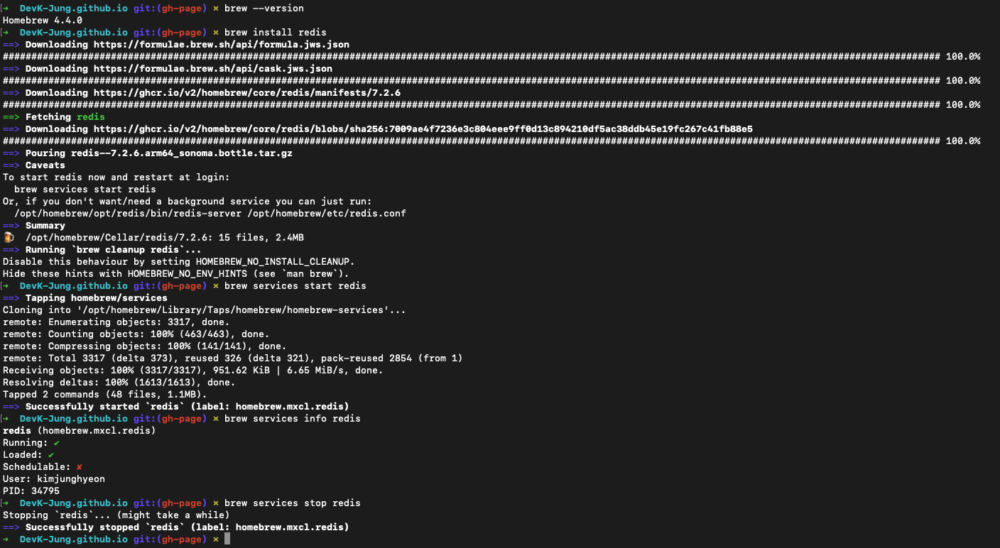

## Redis 설치하기

---

1. HomeBrew 설치(패키지 관리 시스템인 homeBrew를 먼저 설치해줍니다.

    ```shell
    /bin/bash -c "$(curl -fsSL https://raw.githubusercontent.com/Homebrew/install/HEAD/install.sh)"
    ```

2. Brew 설치 여부 확인

    ```shell
    brew --version
    ```

3. Redis 설치

    ```shell
    brew install redis
    ```

4. Redis 실행

    ```shell
    brew services start redis
    ```

5. Redis 실행 여부 확인

    ```shell
    brew services info redis
    ```

6. Redis 중지

    ```shell
    brew services stop redis
    ```

[참고](#https://redis.io/docs/latest/operate/oss_and_stack/install/install-redis/install-redis-on-mac-os/)

### 결과




## Redis 접속하기

---

- Redis 접속 명령어 <code>redis-cli</code> 를 입력 후 정상 접속됐는지 확인을 위해 <code>ping</code> 을 입력하면 <code>PONG</code> 을 응답해준다.

```shell
➜  DevK-Jung.github.io git:(gh-page) ✗ redis-cli
127.0.0.1:6379> ping
PONG
```