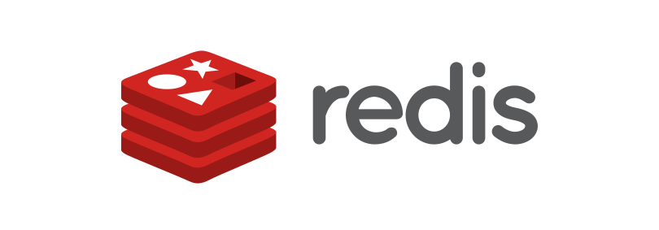

> Redis에서 키를 저장할 때 적절한 네이밍 컨벤션을 사용하는 것은 데이터 구조의 가독성과 관리 효율성을 높이는데 매우 중요합니다. 잘 설계된 네이민 컨벤션은 키 충돌을 방지하고 데이터 관리가 편해집니다. Redis는 기본적으로 문자열 기반의 키를 사용하므로, 키의 구조를 미리 계획하는 것이 좋습니다.

## Redis Key 네이밍 컨벤션

1. **네임스페이스 사용**:
   - 키를 논리적으로 그룹화하기 위해 **콜론(`:`)**을 사용하여 네임스페이스를 구분하는 것이 일반적입니다. 이를 통해 데이터를 카테고리별로 묶어서 관리할 수 있습니다.
   - 형식: `object_type:id:attribute`
   - 예시:
     - `user:1001:name` (사용자 1001의 이름)
     - `product:2002:price` (상품 2002의 가격)
     - `session:abc123:expires` (세션 `abc123`의 만료 시간)
2. **일관된 소문자 및 단수형 사용**:
   - 키는 일관성 있게 **소문자**로 작성하는 것이 좋습니다. 대소문자를 혼합하면 데이터 검색 및 관리가 복잡해질 수 있습니다.
   - 가능하면 **단수형** 명사를 사용하여 명확하고 간결하게 작성합니다.
   - 예시:
     - `user:1001:email` (소문자 및 단수형 사용)
3. **고유 ID 사용**:
   - 데이터를 구분하기 위해 **고유 식별자(ID)**를 키에 포함합니다. 일반적으로 데이터베이스에서 ID나 고유한 값으로 사용되는 값을 포함하는 것이 좋습니다.
   - 예시:
     - `order:1234:status` (주문 1234의 상태)
     - `product:2002:stock` (상품 2002의 재고)
4. **데이터 유형을 포함**:
   - 키 이름에 **데이터 유형**을 명시적으로 포함하는 것이 좋습니다. 예를 들어 리스트, 셋, 해시 등을 사용할 때는 이를 명시하면 데이터 관리가 더욱 쉬워집니다.
   - **형식**: `object_type:id:data_type`
   - 예시:
     - `user:1001:friends:set` (사용자 1001의 친구 목록(Set))
     - `product:2002:reviews:list` (상품 2002의 리뷰 리스트)
5. **짧고 명확하게**:
   - Redis는 메모리 기반 데이터베이스이므로, 너무 긴 키는 메모리를 낭비할 수 있습니다. 따라서 **짧고 명확한 키 이름**을 사용하는 것이 좋습니다.
   - 예시:
     - `usr:1001:email` 대신 `user:1001:email` (짧지만 의미가 분명한 키 사용)
6. **필요한 경우 날짜/시간 추가**:
   - 시간에 민감한 데이터를 처리할 때는 **날짜나 시간**을 키에 포함시키는 것도 좋은 방법입니다. 이를 통해 시간 기반의 데이터 관리를 쉽게 할 수 있습니다.
   - 예시:
     - `user:1001:login:20231007` (사용자 1001의 2023년 10월 7일 로그인 정보)
     - `order:1234:20231007:status` (2023년 10월 7일 주문 1234의 상태)
7. **키 길이 제한**:
   - Redis는 512MB 크기의 키를 허용하지만, 일반적으로 너무 긴 키를 사용하는 것은 비효율적입니다. **짧고 명확한** 키 네이밍을 유지하도록 합니다.
8. **접두사 사용 (환경 구분)**:
   - 개발 환경이나 서비스별로 키를 구분해야 할 경우, **접두사(prefix)**를 사용해 환경을 구분할 수 있습니다. 이를 통해 서로 다른 환경에서 동일한 키가 충돌하지 않도록 할 수 있습니다.
   - 예시:
     - `dev:user:1001:email` (개발 환경)
     - `prod:user:1001:email` (운영 환경)
9. **문서화 및 일관성 유지**:
   - 네이밍 규칙은 **일관성**이 매우 중요합니다. 팀에서 사용되는 모든 키에 대해 컨벤션을 미리 정하고 문서화하여, 키의 네이밍이 일관되게 유지되도록 합니다.

### Redis Key 네이밍 예시

| 키                       | 설명                      |
| ------------------------ | ------------------------- |
| `user:1001:name`         | 사용자 1001의 이름        |
| `order:20231007:status`  | 2023년 10월 7일 주문 상태 |
| `session:abc123:expires` | 세션 `abc123`의 만료 시간 |
| `product:2002:price`     | 상품 2002의 가격          |
| `dev:cache:product:1234` | 개발 환경에서의 상품 캐시 |

### 네이밍 컨벤션 장점

1. **가독성** : 데이터의 의미와 용도를 쉽게 파악할 수 있다.
2. **일관성** : 컨벤션을 따름으로써 코드의 일관성이 높아지고 유지보수가 쉬워진다.
3. **검색 및 필터링 용이성** : 패턴 매칭을 사용해 특정 유형의 Key를 쉽게 찾을 수 있다 .
4. **확장성** : 서로 다른 Key와 이름이 겹쳐 충돌할 일이 적어진다.

>  [비전공자도 이해할 수 있는 Redis 입문/실전 (조회 성능 최적화편) 강의를 보고 작성한 글입니다.](#https://www.inflearn.com/course/%EB%B9%84%EC%A0%84%EA%B3%B5%EC%9E%90-redis-%EC%9E%85%EB%AC%B8-%EC%84%B1%EB%8A%A5-%EC%B5%9C%EC%A0%81%ED%99%94/dashboard)
