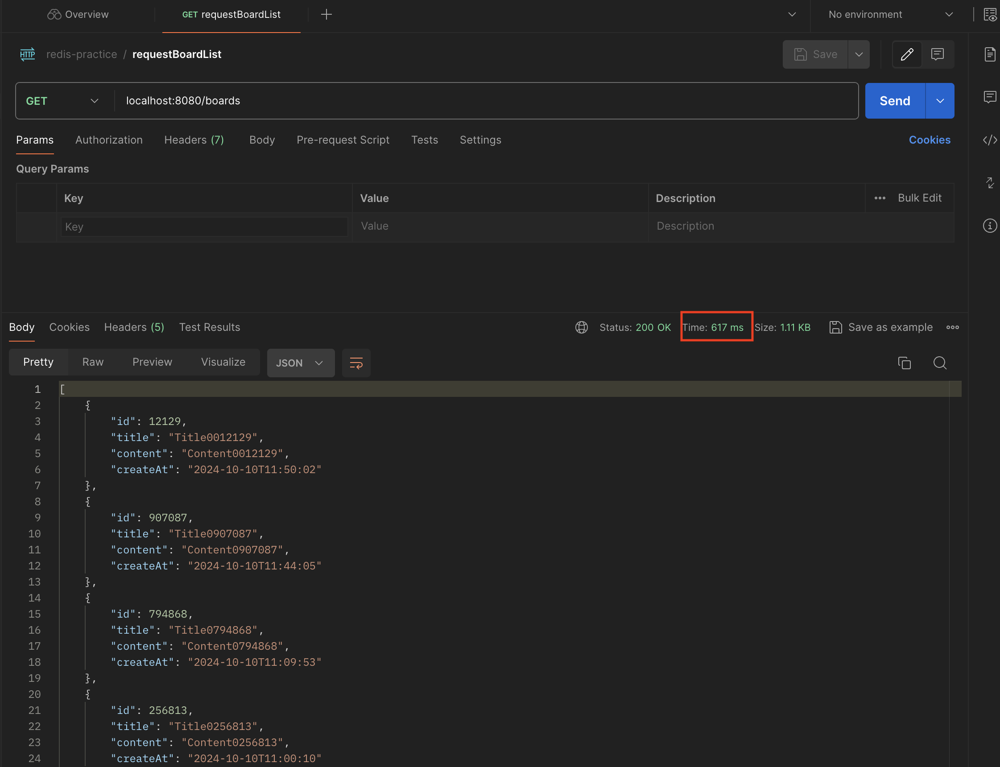
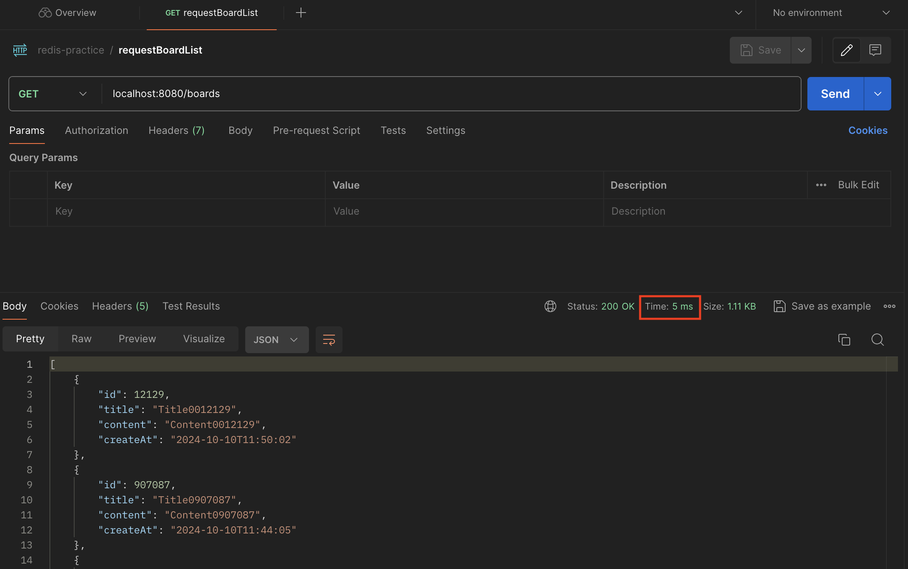

> Local 환경에서 Spring Boot 를 이용해 간단한 게시판 목록 조회 API를 구현하고 여기에 Redis 캐시를 사용해 성능을 개선해보겠습니다.
>
> > 개발 환경
> >
> > - Spring Boot 3.x.x
> > - MySQL 8.x
> > - JDK 17
> > - Spring Data JPA


## build.gradle 세팅

---

- 아래와 같이 build.gradle 설정을 해줍니다.

```groovy
plugins {
    id 'java'
    id 'org.springframework.boot' version '3.3.4'
    id 'io.spring.dependency-management' version '1.1.6'
}

group = 'com.example'
version = '0.0.1-SNAPSHOT'

java {
    toolchain {
        languageVersion = JavaLanguageVersion.of(17)
    }
}

configurations {
    compileOnly {
        extendsFrom annotationProcessor
    }
}

repositories {
    mavenCentral()
}

dependencies {
    implementation 'org.springframework.boot:spring-boot-starter-data-jpa'
    implementation 'org.springframework.boot:spring-boot-starter-web'
    implementation 'org.springframework.boot:spring-boot-starter-data-redis' // Redis
    compileOnly 'org.projectlombok:lombok'
    developmentOnly 'org.springframework.boot:spring-boot-devtools'
    runtimeOnly 'com.mysql:mysql-connector-j'
    annotationProcessor 'org.projectlombok:lombok'
    testImplementation 'org.springframework.boot:spring-boot-starter-test'
    testRuntimeOnly 'org.junit.platform:junit-platform-launcher'
}

tasks.named('test') {
    useJUnitPlatform()
}

```


## application.yml 설정

---

- datasource와 Redis 설정을 잡아줍니다.

```yaml
spring:
  profiles:
    default: local
  datasource: # Datasource 설정
    url: jdbc:mysql://localhost:3306/redis
    username: root
    password: password
    driver-class-name: com.mysql.jdbc.Driver
  jpa: # JPA 설정
    hibernate:
      ddl-auto: update
    show-sql: true
    properties:
      hibernate:
        dialect: org.hibernate.dialect.MySQLDialect
  data: # Redis 설정
    redis:
      host: localhost
      port: 6379

logging:
  level:
    org.springframework.cache: trace # 캐싱 로그 보기
```


## DB, Redis 실행

---

- docker를 사용하여 로컬에 mysql과 redis를 띄워줍니다.

### docker-compose.yml

```yaml
version: '3.8'
services:
  mysql:
    image: mysql:latest
    container_name: redis-mysql-container
    environment:
      MYSQL_ROOT_PASSWORD: password
      MYSQL_DATABASE: redis
    ports:
      - "3306:3306"
    volumes:
      - mysql_data:/var/lib/mysql
    networks:
      - app_network

  redis:
    image: redis:latest
    container_name: redis-container
    ports:
      - "6379:6379"
    volumes:
      - redis_data:/data
    networks:
      - app_network

volumes:
  mysql_data:
  redis_data:

networks:
  app_network:
    driver: bridge
```

### docker compose up 로 docker-compose.yml 실행

```sh
docker compose up -d
```


## 게시판 목록 구현

---

- Redis Caching 테스트를 위해 간단한 게시판 목록 조회 API를 구현합니다.

### Entity

```java
package com.example.redispractice.cache.board.entity;

import com.fasterxml.jackson.annotation.JsonFormat;
import com.fasterxml.jackson.databind.annotation.JsonDeserialize;
import com.fasterxml.jackson.databind.annotation.JsonSerialize;
import com.fasterxml.jackson.datatype.jsr310.deser.LocalDateTimeDeserializer;
import com.fasterxml.jackson.datatype.jsr310.ser.LocalDateTimeSerializer;
import jakarta.persistence.*;
import lombok.AccessLevel;
import lombok.Getter;
import lombok.NoArgsConstructor;
import org.springframework.data.annotation.CreatedDate;

import java.time.LocalDateTime;

@Getter
@Entity
@Table(name = "boards")
@NoArgsConstructor(access = AccessLevel.PROTECTED)
public class Board {
    @Id
    @GeneratedValue(strategy = GenerationType.IDENTITY)
    private Long id;
    private String title;
    private String content;
    @CreatedDate
    @JsonFormat(pattern = "yyyy-MM-dd'T'HH:mm:ss")
    @JsonSerialize(using = LocalDateTimeSerializer.class)
    @JsonDeserialize(using = LocalDateTimeDeserializer.class)
    private LocalDateTime createAt;

}
```


### Repository

```java
package com.example.redispractice.cache.board.repository;

import com.example.redispractice.cache.board.entity.Board;
import org.springframework.data.domain.Page;
import org.springframework.data.domain.Pageable;
import org.springframework.data.jpa.repository.JpaRepository;

public interface BoardRepository extends JpaRepository<Board, Long> {
    Page<Board> findAllByOrderByCreateAtDesc(Pageable pageable);
}

```


### Service

```java
package com.example.redispractice.cache.board.service;

import com.example.redispractice.cache.board.entity.Board;
import com.example.redispractice.cache.board.repository.BoardRepository;
import lombok.RequiredArgsConstructor;
import org.springframework.cache.annotation.Cacheable;
import org.springframework.data.domain.Page;
import org.springframework.data.domain.PageRequest;
import org.springframework.data.domain.Pageable;
import org.springframework.stereotype.Service;
import org.springframework.transaction.annotation.Transactional;

import java.util.List;

@Service
@Transactional
@RequiredArgsConstructor
public class BoardService {

    private final BoardRepository boardRepository;

    public List<Board> getBoards(int page, int size) {
        Pageable pageable = PageRequest.of(page - 1, size);

        Page<Board> pageOfBoards = boardRepository.findAllByOrderByCreateAtDesc(pageable);
        return pageOfBoards.getContent();
    }
}

```


### Controller

```java
package com.example.redispractice.cache.board.controller;

import com.example.redispractice.cache.board.entity.Board;
import com.example.redispractice.cache.board.service.BoardService;
import lombok.RequiredArgsConstructor;
import org.springframework.web.bind.annotation.GetMapping;
import org.springframework.web.bind.annotation.RequestMapping;
import org.springframework.web.bind.annotation.RequestParam;
import org.springframework.web.bind.annotation.RestController;

import java.util.List;

@RestController
@RequiredArgsConstructor
@RequestMapping("/boards")
public class BoardController {
    private final BoardService boardService;

    @GetMapping
    public List<Board> getBoards(
            @RequestParam(defaultValue = "1") int page,
            @RequestParam(defaultValue = "10") int size
    ) {
        return boardService.getBoards(page, size);
    }
}

```


### 테스트 데이터 추가

- 게시판에 목록 조회와 캐싱 확인을 위해 더미 데이터를 넣어줍니다.

```sql
-- 높은 재귀(반복) 횟수를 허용하도록 설정
-- (아래에서 생성할 더미 데이터의 개수와 맞춰서 작성하면 된다.)
SET SESSION cte_max_recursion_depth = 1000000;

-- boards 테이블에 더미 데이터 삽입
INSERT INTO boards (title, content, create_at)
WITH RECURSIVE cte (n) AS
                   (
                       SELECT 1
                       UNION ALL
                       SELECT n + 1 FROM cte WHERE n < 1000000 -- 생성하고 싶은 더미 데이터의 개수
                   )
SELECT
    CONCAT('Title', LPAD(n, 7, '0')) AS title,  -- 'Title' 다음에 7자리 숫자로 구성된 제목 생성
    CONCAT('Content', LPAD(n, 7, '0')) AS content,  -- 'Content' 다음에 7자리 숫자로 구성된 내용 생성
    TIMESTAMP(DATE_SUB(NOW(), INTERVAL FLOOR(RAND() * 3650 + 1) DAY) + INTERVAL FLOOR(RAND() * 86400) SECOND) AS created_at -- 최근 10년 내의 임의의 날짜와 시간 생성
FROM cte;
```


### 테스트

- 프로젝트를 실행시켜 postman을 통해 정상 동작하는지 확인합니다.
- 이때 캐싱 적용전 응답 시간을 확인해주세요.



## Redis Caching 적용

---

### RedisConfig

- Redis 와 연결을 담당하는 `LettuceConnectionFactory`를 Bean으로 등록해줍니다.

```java
package com.example.redispractice.cache.config;

import org.springframework.beans.factory.annotation.Value;
import org.springframework.context.annotation.Bean;
import org.springframework.context.annotation.Configuration;
import org.springframework.data.redis.connection.RedisStandaloneConfiguration;
import org.springframework.data.redis.connection.lettuce.LettuceConnectionFactory;

@Configuration
public class RedisConfig {

    @Value("${spring.data.redis.host}")
    private String host;
    @Value("${spring.data.redis.port}")
    private int port;

    @Bean
    public LettuceConnectionFactory lettuceConnectionFactory() {
        return new LettuceConnectionFactory(new RedisStandaloneConfiguration(host, port));
    }
}
```

- `LettuceConnectionFactory`
  - Reids 서버에 대해 연결을 생성하고 관리하는 역할
  - Redis의 Standalone 모드(단일 서버)와 연결하는 방식
- RedisStandaloneConfiguration
  - Redis 서버 연결에 필요한 설정을 담고있음(Redis 호스트와 포트 등)


### BoardCacheConfig

```java
package com.example.redispractice.cache.config;

import org.springframework.cache.CacheManager;
import org.springframework.cache.annotation.EnableCaching;
import org.springframework.context.annotation.Bean;
import org.springframework.context.annotation.Configuration;
import org.springframework.data.redis.cache.RedisCacheConfiguration;
import org.springframework.data.redis.cache.RedisCacheManager;
import org.springframework.data.redis.connection.RedisConnectionFactory;
import org.springframework.data.redis.serializer.Jackson2JsonRedisSerializer;
import org.springframework.data.redis.serializer.RedisSerializationContext;
import org.springframework.data.redis.serializer.StringRedisSerializer;

import java.time.Duration;

@Configuration
@EnableCaching // spring boot 캐싱 설정 활성화
public class RedisCacheConfig {

    @Bean
    public CacheManager boardCacheManage(RedisConnectionFactory redisConnectionFactory) {
        RedisCacheConfiguration redisCacheConfiguration = RedisCacheConfiguration
                .defaultCacheConfig()
                .serializeKeysWith(
                        RedisSerializationContext.SerializationPair.fromSerializer(
                                new StringRedisSerializer()
                        )
                ) // Redis에 Key 저장 시 String 으로 직렬화
                .serializeValuesWith(
                        RedisSerializationContext.SerializationPair.fromSerializer(
                                new Jackson2JsonRedisSerializer<Object>(Object.class)
                        )
                ) // Redis에 Value 저장 시 JSON 으로 직렬화
                .entryTtl(Duration.ofMinutes(1L)); // 만료기간(TTL) 설정

        return RedisCacheManager
                .RedisCacheManagerBuilder
                .fromConnectionFactory(redisConnectionFactory)
                .cacheDefaults(redisCacheConfiguration)
                .build();
    }

}
```

- `RedisConnectionFactory`
  - Redis와 연결을 처리하는 팩토리로, 이를 기반으로 RedisCacheManage를 생성
- `RedisCacheManager`
  - Spring에서 캐시를 관리하는 역할을 하며, Redis를 백엔드 캐시 스토리지로 사용

### Board 목록 조회 캐싱 적용

#### BoardService.java

```java
    @Cacheable(cacheNames = "getBoards", key = "'board:page:' + #page + ':size' + #size", cacheManager = "boardCacheManage")
    public List<Board> getBoards(int page, int size) {
        Pageable pageable = PageRequest.of(page - 1, size);

        Page<Board> pageOfBoards = boardRepository.findAllByOrderByCreateAtDesc(pageable);
        return pageOfBoards.getContent();
    }
```

- `@Cacheable`
  - 메소드의 실행 결과를 캐시하도록 지정, 캐시에 동일한 키가 존재하는지 확인하고, 만약 캐시에 저장된 값이 있으면 메소드를 실행하지 않고 캐시된 값을 반환, 캐시에 없을 경우 메소들르 실행하고 그 결과를 캐시에 저장
- `cacheNames="getBoards"`
  - 캐시 이름 지정
  - Spring에서는 캐시 이름을 기반으로 여러 캐시를 관리할 수 있으며, 캐시 이름에 따른 다른 데이터를 저장하거나 관리할 수 있습니다.
- `key = "'board:page:' + #page + ':size' + #size"`
  - 캐시에 저장되는 키 값 정의
- `cacheManager = "boardCacheManage"`
  - 사용할 캐시 매니저를 지정합니다.
  - 위에서 빈으로 등록한 `boardCacheManage `를 지정해줍니다.


### 테스트

- 캐싱 이전 (617ms) 에 비해 조회 속도가 훨씬 빨리진 것을 확인할 수 있습니다.



## 마무리

---

이렇게 이번 포스팅에서는 local 환경에서 간단한 목록 조회 API에 Redis를 활용해 캐싱 기능을 사용해 보았습니다.<br>다만 캐싱은 조회 성능을 크게 향상시킬 수 있지만, Redis를 도입하기 전에 몇 가지 사항을 고려해야 합니다. 먼저, 캐싱에 적합한 데이터인지 판단해야 하며, 캐시를 적용하기 전에 SQL 튜닝과 같은 다른 최적화 방법을 시도했는지도 확인해야 합니다. 이러한 검토 후에 캐싱을 도입하는 것이 바람직합니다.


위 코드는 제 github를 통해 확인하실 수 있습니다. - https://github.com/DevK-Jung/redis-practice/tree/feature/caching

>  [비전공자도 이해할 수 있는 Redis 입문/실전 (조회 성능 최적화편) 강의를 보고 작성한 글입니다.](https://www.inflearn.com/course/%EB%B9%84%EC%A0%84%EA%B3%B5%EC%9E%90-redis-%EC%9E%85%EB%AC%B8-%EC%84%B1%EB%8A%A5-%EC%B5%9C%EC%A0%81%ED%99%94/dashboard)
