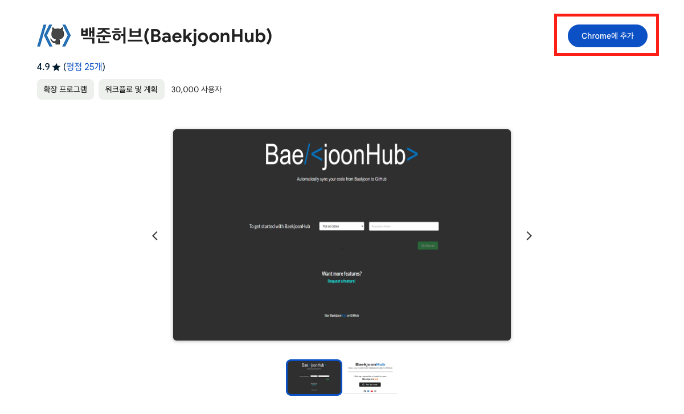
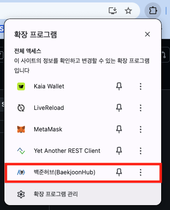
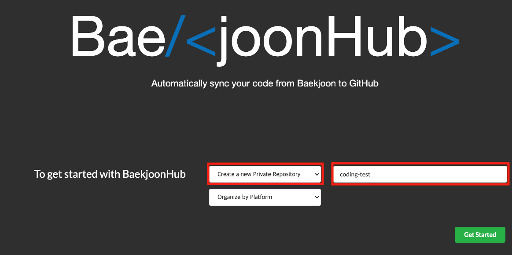
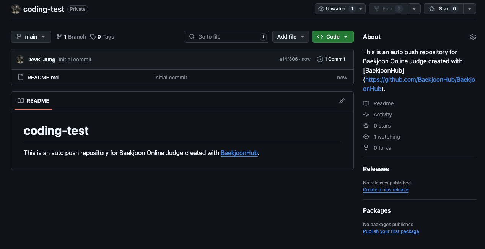
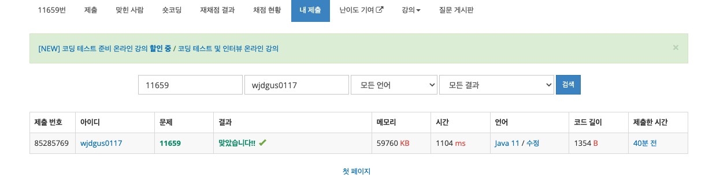
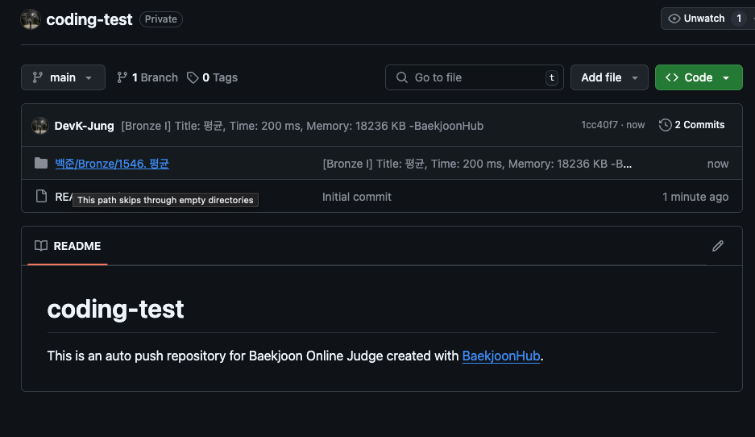
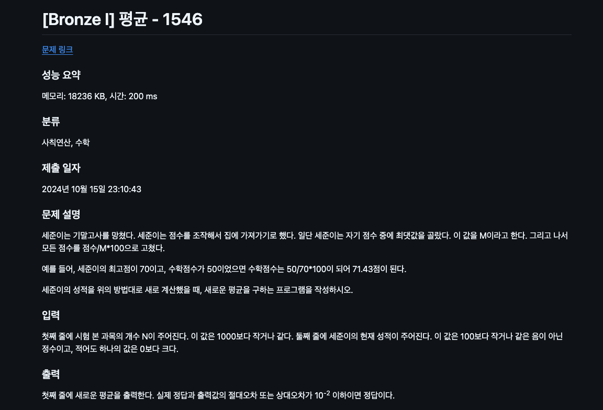

> 코딩 테스트 문제를 푼 후에 개인 Github에 올리고 싶지만 각 문제들을 수동으로 올리기에는 번거로움이 있습니다. 문제를 풀때마다 자동으로 Github에 올라가면 좋겠다..라고 생각하며 구글링을 해보니 **백준 허브** 라는 확장 프로그램 발견!
>
> 코딩테스트를 풀고 제출한것을 자동으로 github repository 에 commit 해주는 **백준 허브** 설정법에 대해 알아보겠습니다!

## 크롬 확장 프로그램 설치

---

> [백준허브 설치 링크](https://chromewebstore.google.com/detail/%EB%B0%B1%EC%A4%80%ED%97%88%EB%B8%8Cbaekjoonhub/ccammcjdkpgjmcpijpahlehmapgmphmk?hl=ko&utm_source=ext_sidebar)

- 위와 같이 확장 프로그램에 추가해줍니다.

## Github Repository 연동

---

### 확장 프로그램 클릭

### Authenticate 클릭

### Repostiroy 생성

- SelectBox에서 Create A new Private Repository를 선택해줍니다.
  - Link 를 클릭해 기존 repository에 연동도 가능합니다.
- 우측 Input에 생성할 Repository 명을 입력해주고 Get Started를 클릭

### Repository 생성 확인

### 제출한 문제 Github에 자동 commit 되는지 확인

- [백준 사이트](https://www.acmicpc.net/)에서 문제를 제출해줍니다.

### Repository 확인

- 성공 적으로 commit 된것을 확인할수 있습니다.

### readme.md

- 추가로 Readme.md도 자동 생성되며 성능, 분류, 제출 일자, 문제 설명, 입력, 출력 등과 같은 부가 정보를 확인하실 수 있습니다.

## 마무리

---

코딩 테스트 문제를 풀고 제출한 것을 개인 github repository에 자동으로 commit 해주는 크롬 확장프로그램 **백준 허브**에 대해서 알아봤습니다.

코딩테스트 장인이 되는 그날까지 화이팅입니다.

