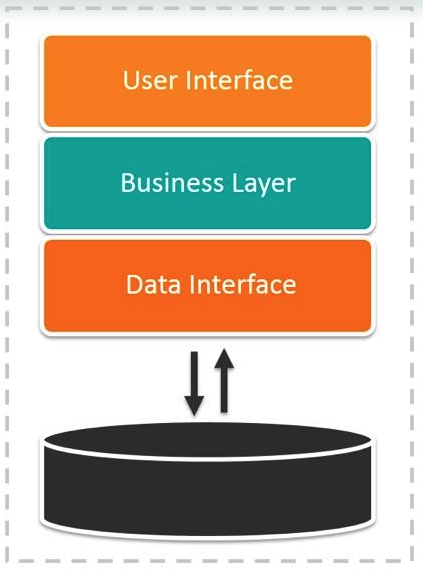
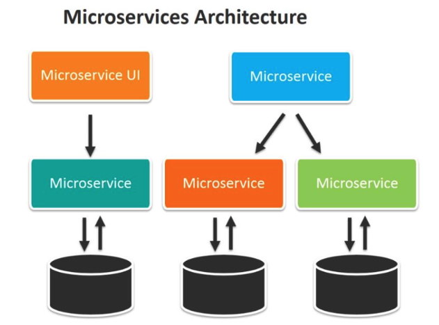

> 최근 MSA 를 공부하며 Monolithic Architecture와 Micro Service Architecture(MSA) 가 어떤 차이가 있으며 각 아키텍처의 특징이 무엇인지 확인해보겠습니다.

## 모놀리식 아키텍처 (Monolithic Architecture)

---

출처https://www.suse.com/c/rancher_blog/microservices-vs-monolithic-architectures/

### 모놀리식 아키텍처란?

>  모놀리식 아키텍처는 위 그림과 같이 애플리케이션의 모든 기능이 **하나의 코드베이스로 통합된 구조**입니다. 모든 컴포넌트(예: 사용자 인증, 결제 처리, 데이터베이스 관리 등) 가 단일 애플리케이션에 배포되고 운영됩니다. 모놀로식으로 개발한 애플리케이션은 MSA보다 상대적으로 구현이 쉽고, 덜 복잡하다는 장점이 있습니다.

### 장점

- **단순한 개발 및 배포**
  - 모든 코드가 하나의 프로젝트에 포함되어 있기 때문에 개발 환경과 배포 프로세스가 단순합니다.
  - 단일 애플리케이션이므로 빌드와 배포가 한 번에 이루어져, 초기 설정과 관리가 상대적 쉽습니다.
- **초기 개발 속도 빠름**
  - 처음 시스템 개발 시, 하나의 코드베이스에서 작업하므로 설정 및 개발 속도가 빠릅니다. 복잡한 서비스 분리를 고려하지 않고, 기능 추가와 수정이 용이합니다.
- **일관된 기술 스택**
  - 전체 시스템이 동일한 기술 스택을 사용하므로, 개발자들은 특정 기술 스택에 집중할 수 있고, 기술 스택 관리가 간단합니다.
- **통합된 테스트 및 디버깅**
  - 모든 코드가 하나의 프로젝트에 있기 때문에 테스트 및 디버깅이 일관되게 수행됩니다. 서비스 간 통신이나 복잡한 네트워크 상의 이슈를 고려할 필요 없습니다.
- **비용 절감**
  - 작은 규모의 프로젝트에서는 마이크로서비스 아키텍처를 사용하는 것보다 인프라 및 관리 비용이 저렴할 수 있습니다.
- **통합된 관리 및 보안**
  - 모든 컴포넌트가 하나의 애플리케이션 안에 포함되기 때문에, 보안 정책이나 로그 관리가 중앙화되어 간편하게 처리됩니다.
  - 개별 서비스 간의 네트워크 보안 이슈나 통신 장애를 고려할 필요가 적습니다.
- **개발 인력의 효율적인 관리**
  - 모놀리식 아키텍처에서는 모든 개발자가 같은 코드베이스를 다루기 때문에, 팀 간 협업과 코드 공유가 용이하고 개발 인력을 효율적으로 배치할 수 있습니다.

### 단점

- **규모가 커질수록 복잡성 증가**
  - 시스템이 커질수록 코드베이스가 복잡해지고, 유지보수가 어려워집니다. 하나의 모듈을 수정할 때 다른 모듈에 의도치 않은 영향을 줄 수 있습니다.
  - 코드베이스가 커지면 빌드, 테스트, 배포 시간이 길어져 생산성이 저하될 수 있습니다.

- **배포의 비효율성**
  - 일부 모듈만 변경이 되어도 전체 애플리케이션을 다시 빌드하고 배포해야 합니다. 이로 인해 배포 주기가 길어질 수 있으며, 작은 변경 사항에도 전체 시스템에 영향을 미칠 수 있습니다.
  - 변경된 부분과 상관없는 기능까지 위험에 노출되기 때문에, 잦은 배포가 필요한 애플리케이션에 불리합니다.

- **확장성의 한계**
  - 모놀리식 아키텍처에서는 애플리케이션을 전체를 수평 확장해야 하므로, 특정 기능만 확장하는 것이 불가능 합니다. 예를 들어, 트래픽이 많은 부분만 확장하고 싶어도 전체 시스템을 확장해야 하므로 비효율 적입니다.
  - 특정 기능이 과부하를 일으키면 전체 시스템의 성능에 영향을 줄 수 있습니다.

- **유지보수 및 업데이트의 어려움**
  - 많은 개발자들이 동일한 코드베이스를 관리해야 하기 때문에, 코드 충돌이나 의존성 문제가 자주 발생할 수 있습니다.
  - 새로운 기능을 추가하거나 업데이트할 때, 기존 기능과의 충돌을 방지하기 위해 많은 테스트와 검증이 필요합니다.

- **단일 장애점(Single Point of Failure)**
  - 모놀리식 애플리케이션은 하나의 실행 파일이나 프로세스로 동작하므로, 특정 기능이 실패하면 전체 애플리케이션이 중단될 수 있고 이로 인해 가용성이 낮아질 수 있습니다.

- **기술 채택의 제약**
  - 모놀리식 아키텍처에서는 모든 모듈이 같은 기술 스택을 공유해야 하기 때문에, 특정 기능에 적합한 다른 기술을 도입하기가 어렵습니다.

- **유연성 부족**
  - 비즈니스 요구 사항이 변화하거나 새로운 기능을 추가할 때, 전체 애플리케이션 구조를 변경해야 하는 경우가 많아 유연성이 부족합니다.

- **테스트 및 디버깅의 복잡성 증가**
  - 하나의 코드베이스에 모든 기능이 통합되어 있기 때문에, 버그가 발생하면 이를 추적하기 위해 많은 시간과 노력이 필요할 수 있습니다.

## 마이크로서비스 아키텍처 (Microservices Architecture)

---

출처https://www.suse.com/c/rancher_blog/microservices-vs-monolithic-architectures/

> MSA는 **Microservices Architecture**의 약자로, 애플리케이션의 각 기능을 독립된 서비스로 분리하여 각각 개별적으로 배포하고 운영하는 구조를 의미합니다. 각 서비스는 특정 기능을 담당하며, 서로 독립적으로 동작할 수 있습니다.
>
> 예를 들어, 사용자 관리 기능과 주문 처리 기능이 있다고 가정하면, **모놀리식 아키텍처**에서는 이 두 기능이 하나의 코드베이스에 통합되어 함께 관리됩니다. 반면 **MSA**에서는 사용자 관리와 주문 처리를 각각 별도의 코드베이스로 분리하여, 서로 독립적으로 개발하고 배포할 수 있습니다. 이로 인해 각 서비스는 별도로 유지보수되고, 필요한 기능만 확장하거나 수정할 수 있어 유연성과 확장성이 높아집니다.

### 장점

- **독립적인 배포 및 개발**
  - 각 마이크로서비스는 독립적으로 개발, 테스트, 배포될 수 있어, 전체 시스템에 영향을 주지 않고 특정 서비스만 업데이트할 수 있습니다.
  - 개발팀은 각 서비스에만 집중할 수 있으며, 서로 다른 팀이 병렬로 작업할 수 있어 개발 속도가 빨라집니다.
- **확장성(Scalability)**
  - 트래픽이 많이 몰리는 서비스만 독립적으로 확장할 수 있기 때문에 효율적인 자원 관리가 가능합니다.
- **탄력적인 기술 스택 선언**
  - 각 서비스는 독립적인 기술 스택을 사용할 수 있으므로, 서비스의 요구에 맞는 언어나 프레임워크를 선택할 수 있습니다. 즉, 성능이 중요한 서비스는 성능 최적화된 기술을, 개발 속도가 중요한 서비스는 개발을 지원하는 기술을 도입할 수 있습니다.
- **유지보수 용이성**
  - 각 마이크로서비스는 상대적으로 작고 명확한 기능만을 담당하기 때문에, 코드베이스가 작고 유지보수가 쉬워집니다.
  - 새로운 기능 추가나 버그 수정이 더 빠르고 간편하며, 각 서비스의 변경이 다른 서비스에 미치는 영향을 최소화 할 수 있습니다.
- **고가용성(High Availability)**
  - 장애가 발생한 서비스만 재배포하거나 수정할 수 있으므로, 서비스 중단 시간을 최소화할 수 있습니다.
- **자동화된 배포 및 지속적 통합/배포(CI/CD)**
  - 마이크로서비스 아키텍처는 자동화된 배포 파이프라인과 잘 결합되며, 지속적 통합(CI) 및 지속적 배포(CD) 을 통해 빠른 기능 릴리즈와 테스트가 가능합니다.

### 단점

- **복잡한 서비스관리**
  - 여러 개의 독립된 서비스가 존재하기 때문에, 서비스 간 통신, 데이터 일관성 유지, 장애 처리 등 관리해야 할 요소가 많아집니다.
- **데이터 일관성 문제**
  - 각 서비스가 독립적으로 데이터베이스를 관리하기 때문에, 서비스 간 데이터의 일관성을 보장하기 어렵습니다. 이를 해결하기 위해서는 분산 트랜잭션이나 이벤트 기반 아키텍처를 도입해야 하며, 이과정이 복잡하고 성능에 영향을 줄 수 있습니다.
- **배포 및 모니터링 복잡성**
  - 개별 서비스가 독립적으로 배포되기 때문에, 배포 파이프라인과 모니터링 시스템을 각 서비스별로 구축해야 합니다. 이를 자동화하고 관리하는 데 추가적인 도구와 인프라가 필요합니다.
- **개발 속도 저하**
  - 서비스 간의 통신 방식(API, 메시지 큐 등)을 설계하고 관리하는 데 시간이 많이 소요될 수 있으며, 서비스 간의 변경 사항을 조정하는 데 추가적인 작업이 필요합니다.
- **인프라 비용 증가**
  - 각 서비스가 독립적으로 배포되고 확장되기 때문에, 이를 관리하기 위한 서버, 네트워크, 모니터링 도구 등 인프라 지원의 필요가 증가합니다.
- **개발 및 운영 인력의 전문성 요구**
  - 마이크로서비스 환경에서는 각 서비스가 독립적으로 동작하며, 다양한 기술 스택을 사용할 수 있기 때문에, 이를 관리하고 운영하기 위한 팀의 기술적 역량이 높아야 합니다.
- **서비스 간 네트워크 지연 및 장애 위험**
  - 마이크로서비스는 서로 독립적으로 동작하지만, 많은 경우 서비스 간 통신이 필요합니다. 이로 인해 네트워크지연이나 장애가 발생하면 전체 시스템 성능에 영향을 줄 수 있습니다.

## 비교

---

| **특징**        | **모놀리식 아키텍처**                               | **마이크로서비스 아키텍처**                         |
| --------------- | --------------------------------------------------- | --------------------------------------------------- |
| **구조**        | 하나의 통합된 애플리케이션                          | 여러 개의 독립된 서비스                             |
| **배포**        | 전체 시스템을 한 번에 배포                          | 서비스별로 개별적으로 배포 가능                     |
| **확장성**      | 전체 시스템을 수직 확장                             | 필요한 서비스만 수평 확장 가능                      |
| **유지보수**    | 코드베이스가 커지면 관리가 어려움                   | 각 서비스가 독립적이라 유지보수가 용이              |
| **의존성**      | 서비스 간 의존성이 높음                             | 서비스 간 의존성이 낮음                             |
| **기술 스택**   | 단일 기술 스택 사용                                 | 서비스별로 다양한 기술 스택 사용 가능               |
| **복잡성**      | 애플리케이션이 커지면 복잡성이 증가                 | 서비스 간 통신 및 관리가 복잡할 수 있음             |
| **단일 장애점** | 한 서비스 장애 시 전체 시스템이 영향을 받을 수 있음 | 특정 서비스 장애가 다른 서비스에 미치는 영향이 적음 |

## 마치며

---

마이크로서비스가 각 모듈을 독립적으로 관리하고 배포할 수 있다는 점에서 확실히 많은 장점을 제공하는것 같습니다. 특히 대규보 시스템이나 복잡한 비즈니스 요구 사항을 가진 프로젝트에서는 MSA가 확장성과 유연성 측면에서 유리합니다.

그러나 작은 규모의 시스템에서는 MSA의 복잡성이 오히려 불필요한 리소스 소모를 초래할 수 있으며, 과도한 인프라 요구로 인해 비용이 증가할 수 있습니다. 서비스 간의 통신이나 데이터 일관성 문제를 해결하기 위한 추가적인 작업이 발생할 수 있고, 복잡한 관리 및 운영 환경이 오버헤드를 일으킬 가능성도 있습니다.

따라서 MSA를 도입하기 전 시스템의 규모와 복잡도를 면밀히 검토하고, 실제고 MSA가 필요한지 신중히 판단하는 것이 중요합니다. 크지 않은 시스템에서는 오히려 모놀리식 아키텍처가 더 적합할 수 있으며, 마이크로서비스는 그 복잡성ㅇ르 감당할 수 있을 만큼의 이점을 제공해야 도입할 가치가 있습니다. MSA는 분명 강력한 아키텍처이지만, 필요 이상의 복잡도를 피하기 위해 적절한 시점과 상황에서 도입하는 것이 성공의 열쇠입니다.
