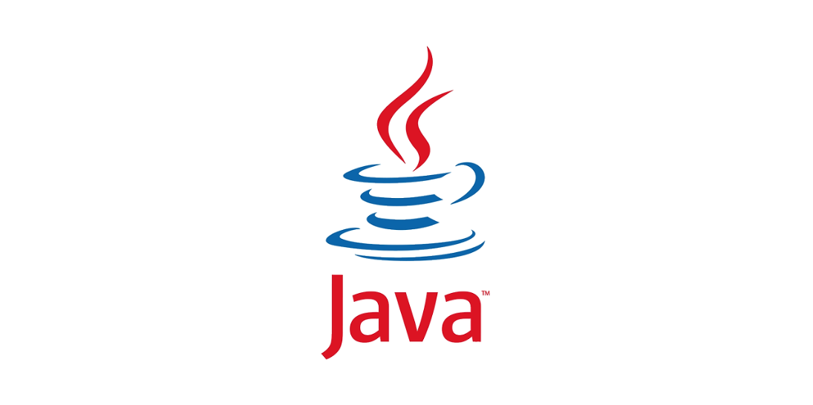

> 프로젝트를 수행하던 중 DTO간 변환 로직을 구현할 일이 빈번하게 생깁니다. 이때 생성자를 통한 변환, 정적 팩토리 메서드, ModelMapper, MapStruct 등 다양한 방법이 있지만 이번 글에서는 **정적 팩토리**를 제대로 이해하고 사용하기 위해 정리를 해봤습니다.


## 정적 팩토리 메서드(Static Factory Method) 란?

---

> **정적 팩토리 메서드란?**
>
> 정적 팩토리 메서드는 직접적인 객체 생성을 위해 `new` 키워드를 사용하지 않고, 객체 생성을 책임지는 `static` 메서드를 통해 변환하는 방법입니다.

### 장점

- **명확한 코드:** 명확한 네이밍으로 변환 목적을 쉽게 이해할 수 있습니다.  - Ex) 'fromEntity()', 'toDto()'
- **유연한 로직 추가:** 유연한 로직 적용이 가능해, 변환 중 복잡한 연산이 필요하거나 변환 로직을 커스터마이즈할 때 유용합니다.
- **의존성 없음:** 외부 의존성 없음으로 코드가 가벼우며, 직접 구현한 방식이므로 성능 또한 우수합니다.


### 단점

- **직접 코드 작성 필요:** 모든 변환 로직을 수동으로 작성해야 하므로, 코드 중복이 발생할 수 있습니다.
- **변환 로직 증가 시 관리 어려움:** 필드가 많아질수록 변환 메서드 관리가 어려워지고 코드가 복잡해질 수 있습니다.


### 성능

- 정적 팩토리 메서드는 직접적으로 구현한 방식으로 성능 면에서 가장 빠른 편에 속합니다.


## 생성자 변환과 비교

---


> 조슈아 블로크의 저서 **[이펙티브 자바]** 책을 보면 **'생성자 대신 정적 팩토리 메서드를 고려하라'** 라는 조언이 있습니다. 아래에서 그 이유도 같이 살펴보겠습니다.


- **명확한 네이밍:** 생성자랑 다르게 정적 팩토리 메서드는 이름을 자유롭게 지정할 수 있기 때문에, 메서드 이름을 통한 객체 생성 의도를 명확히 전달할 수 있습니다. 
  - tip. 정적 팩토리 메서드를 구성하고자 하면, 반드시 생성자에 `private` 접근 제어자를 두어 외부에서 `new` 키워드를 이용하여 객체를 생성하는 것을 잊지 말자.

``` java
  // 명확한 네이밍: 이름을 통해 객체 생성 의도를 명확히 전달
    public static Person of(String name, int age) {
        return new Person(name, age);
    }
```


- **캐싱 및 인스턴스 재사용 가능**: 정적 팩토리 메서드는 객체를 새로 생성하지 않고 기존 객체를 재사용하거나 캐싱할 수 있습니다. 이는 메모리 절약과 성능 최적화 측면에서 유리하며, 생성자는 새로운 인스턴스를 반환하므로, 객체 재사용이 불가합니다.

```java
    // 캐싱 및 인스턴스 재사용 가능: 동일한 이름을 가진 인스턴스 캐싱
    private static final Map<String, Person> cache = new HashMap<>();

    public static Person getCachedPerson(String name) {
        // 캐시된 객체가 있는 경우 반환, 없으면 생성 후 캐싱
        return cache.computeIfAbsent(name, key -> new Person(key, 30));
    }
```


- **서브클래스 반환 가능**: 정적 팩토리 메서드는 반환 타입을 자유롭게 조정할 수 있어, 서브클래스를 반환하거나 인터페이스로 감싸서 반환하는 것도 가능합니다. 반면 생성자는 직접저긍로 클래스를 인스턴스화 하기 때문에 이런 유연성이 없습니다.

```java
    // 서브클래스 반환 가능: 서브클래스 객체 반환을 통해 유연성 제공
    public static Person createStudent(String name) {
        return new Student(name, 20); // 서브클래스인 Student 반환
    }
```


- **코드 간결성**: 복잡한 객체 생성 로직을 캡슐화할 수 있어 코드가 간결해집니다. 예를 들어 다수의 매개변수를 받거나 복잡한 초기화가 필요한 경우에 생성 로직을 정적 메서드 내부에 작성해 호출을 간단하게 유지할 수 있습니다.

```java
    // 코드 간결성: 복잡한 초기화 로직을 정적 팩토리 메서드로 캡슐화
    public static Person withComplexInitialization(String name, int age) {
        Person person = new Person(name, age);
        // 복잡한 초기화 로직
        person.initialize();
        return person;
    }

    private void initialize() {
        // 복잡한 초기화 로직 예시
        System.out.println("Initializing complex settings for " + name);
    }

```


- **타입 추론 가능**: Java에서 제네릭 타입 인스턴스를 생성할 때, 정적 팩토리 메서드가 타입 추론을 돕는 경우가 있습니다. 예를 들어, `Map<String, List<String>> map = new HashMap<>()`와 같은 다이아몬드 연산자(`<>`)를 사용할 수 있어 코드가 더 간결해집니다.

```java
// Student 서브클래스
class Student extends Person {
    private int grade;

    // private 생성자: 외부에서 직접 생성하지 못하게 함
    private Student(String name, int age) {
        super(name, age);
        this.grade = 1;
    }

    public int getGrade() {
        return grade;
    }
}

// 예시로 타입 추론이 가능한 정적 팩토리 메서드 클래스
class GenericsExample {
    public static <K, V> Map<K, V> newHashMap() {
        return new HashMap<>();
    }
}
```


## 정적 팩토리 메서드 네이밍 규칙

---

> 정적 팩토리 메서드는 다른 정적 메서드들과 역할 구분을 위해 독자적인 **네이밍 컨벤션(Convention)**이 존재합니다.

| 메서드 네이밍              | 설명                                                         | 예시                             |
| -------------------------- | ------------------------------------------------------------ | -------------------------------- |
| `of()`                     | 여러 개의 매개 변수를 통해 객체 생성                         | `Map.of('key','value')`          |
| `from()`                   | 하나의 매개변수를 통해 객체 생성                             | `List.from(array)`               |
| `valueOf()`                | `from()`과 유사하지만, 조금 더 구체적인 반환을 의미<br />보통 기본 타입이나 특수한 형식을 변환할 때 사용 | `Integer.valueOf(int)`           |
| `Instance()/getInstance()` | 싱글톤 패턴이나 공유 가능한 인스턴스를 반활할 때 사용        | `Calendar.getInstance()`         |
| `create()`                 | 새로운 인스턴스를 생성할 때 사용, 항상 새로운 객체 반환      | `Connection.create()`            |
| `newInstance()`            | `create()` 와 유사하게 항상 새로운 객체 반환, 더 명확하게 새로운 인스턴스임을 전달하고자 할 때 사용 | `Class.newInstance()`            |
| `getType()`                | 특정 타입의 인스턴스를 반환할 때 사용합니다. 기본 객체 외의 특정 타입을 반환해야  할 때 사용됩니다. | `Files.getFileStore(path)`       |
| `newType()`                | 특정 타입의 새로운 객체를 반환하며, `getType()` 과 유사하지만 새로운 인스턴스임을 나타냅니다. | `BufferedReader.newLineReader()` |
| `type()`                   | 간결하게 하나의 타입을 반환하는 경우 사용합니다. 주로 빌더 패턴이나 특정 타입의 객체를 쉽게 반환할 때 사용합니다. | Shape.circle(radius)             |

`of()`와 `create()`가 헷갈려 알아봤는데, `of`는 특정 값이나 다른 객체로부터 변환된 새로운 객체를 반환해야 할 때, `create`는 독립적인 인스턴스가 필요하여, 새로운 객체를 반환해야 할 때 사용하는 차이가 있었습니다.


## 예시 코드

---

> 위 네이밍 규칙대로 샘플 코드를 작성해봅시다.

- 객체를 만들고 생성자는 private으로!

``` java
public class User {
    private String name;
    private int age;


    // tip.생성자는 private으로 생성하여 new 키워드 사용을 막습니다.
    private User(String name, int age) {
        this.name = name;
        this.age = age;
    }
}
```

- **`of()`**

```java
    // of(): 매개변수로 주어진 값을 기반으로 객체 반환
    public static User of(String name, int age) {
        return new User(name, age);
    }
```

- **`from()`**

```java
    // from(): 다른 객체(Person)로 부터 변환
    public static User from(Person person) {
        return new User(person.getName(), person.getAge());
    }
```

- **`valueOf()`**

```java
    // valueOf(): 문자열이나 특정 형식을 변환하여 생성
    public static User valueOf(String nameWithAge) {
        String[] parts = nameWithAge.split(",");
        String name = parts[0].trim();
        int age = Integer.parseInt(parts[1].trim());

        return new User(name, age);
    }
```

- **`getInstance()`**

```java
    // getInstance(): 싱글톤처럼 공유 가능한 인스턴스 반환
    private static final User DEFAULT_USER = new User("user01", 20);
    public static User create(String name, int age) {
        return new User(name, age);
    }
```

- **`newInstance()`**

``` java
    // newInsatnce(): 명시적으로 새로운 인스턴스를 생성할 때
    public static User newInstance(String name, int age) {
        return new User(name, age);
    }
```

- **`getType()`**

```java
    // getType(): 타입을 반환하는 정적 팩토리 메서드 (예시로 Adult 반환)
    public static User getAdultInstance(String name) {
        return new User(name, 20);
    }
```

- **`newType()`**

```java
    // newType(): 특정 조건에 따른 새로운 타입의 인스턴스를 반환
    public static User newTeenager(String name) {
        return new User(name, 16);
    }
```

- **`type()`**

```java
    // type(): 특정 역할이나 성격을 나타내는 메서드(예: 관리자나 일반 사용자)
    public static User admin() {
        return new User("admin01", 35);
    }
```


## 마치며

---

정적 팩토리 메서드는 성능상으로도 준수하고 위에서 살펴 보았듯이 여러 장점을 갖고 있습니다. 허나 작은 규모의 프로젝트나 변환할 필드가 많지 않은 간단한 DTO 변환에서는 유리하지만, 큰 규모의 프로젝트나 변환할 필드가 많은 경우에는  `ModelMapper`나 `MapStruct` 라이브러리를 통한 변환도 고려해 봐야할거 같습니다.


> **참고**
>
> - https://inpa.tistory.com/entry/GOF-%F0%9F%92%A0-%EC%A0%95%EC%A0%81-%ED%8C%A9%ED%86%A0%EB%A6%AC-%EB%A9%94%EC%84%9C%EB%93%9C-%EC%83%9D%EC%84%B1%EC%9E%90-%EB%8C%80%EC%8B%A0-%EC%82%AC%EC%9A%A9%ED%95%98%EC%9E%90

