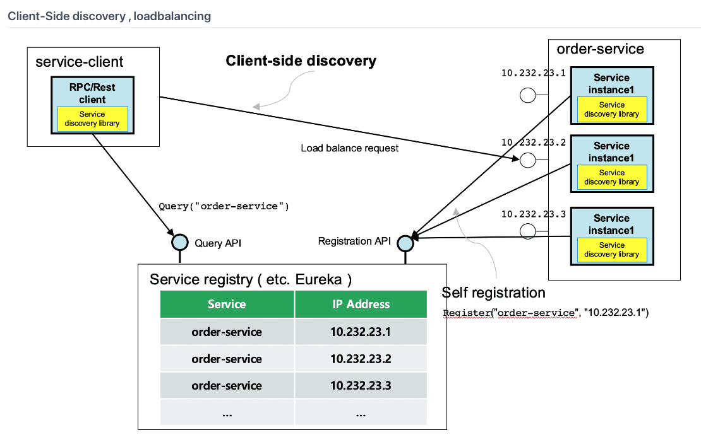
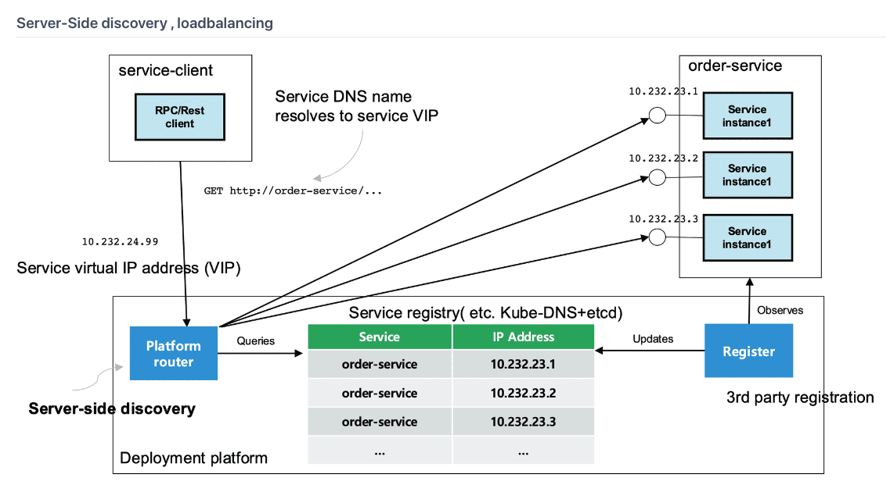
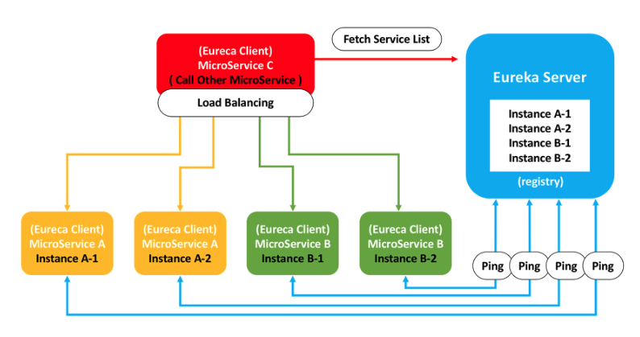
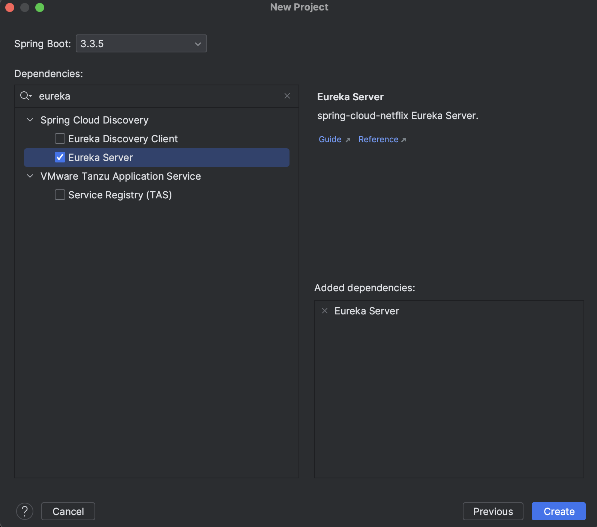
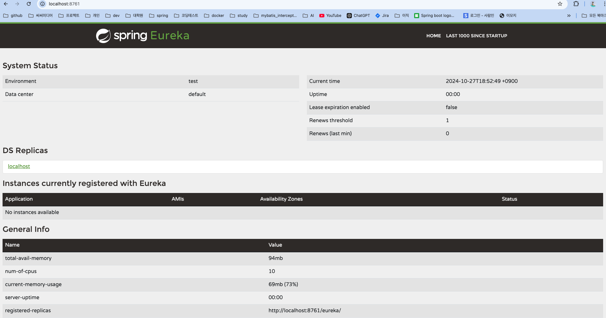
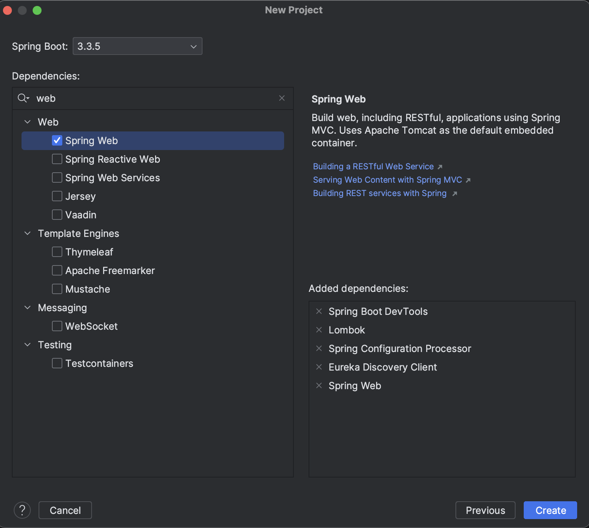
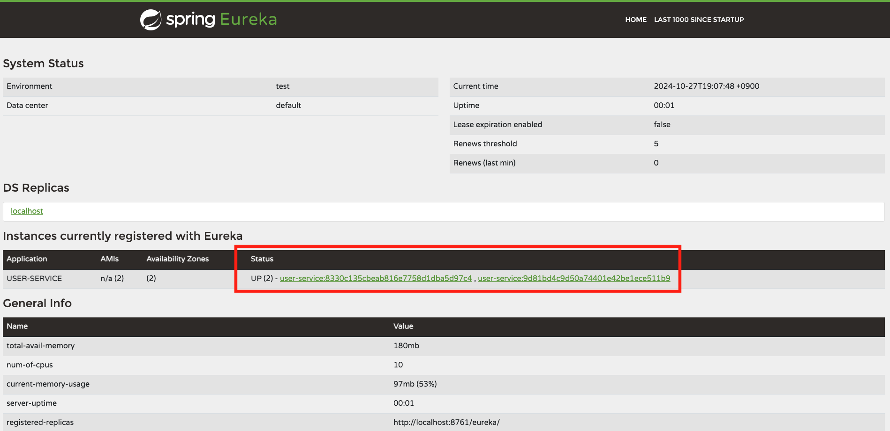

> MSA에서 각 마이크로서비스가 확장되거나 축소될 때 해당 서비스의 정보(IP, Port)를 수동으로 업데이트해야 하는 불편함이 있습니다. 특히 클라우드 환경에서는 동적으로 Scale-out 되는 경우가 많아, 이러한 작업들이 더욱 번거로워질 수 있습니다. 이를 해결하기 위해 **Service Discovery** 라는 개념이 도입되었고, 이번 글에서는 MSA에서 효율적인 서비스 연결을 위해 필수적인 **Service Discovery**에 대해 알아보고 **spring cloud netflix eureka** 를 통해 이를 직접 구현해보겠습니다.


## Service Discovery 란?

---

> **Service Discovery 패턴이란?**
>
> 마이크로서비스 아키텍처(MSA)에서는 각 서비스의 네트워크 위치(IP 주소, 포트 번호 등)를 수동으로 관리하는것은 매우 비효율적입니다. 특히 서비스의 인스턴스가 동적으로 확장/축소되거나 위치가 변경될 때, 모든 서비스에 대해 수동으로 위치를 업데이트하는 것은 번거롭고 오류가 발생하기 쉽습니다. **Service Discovery 패턴**은 이러한 문제를 해결하기 위해 도입된 개념으로, 각 서비스가 **자동으로 서로의 위치를 찾아 통신할 수 있도록 지원**합니다. 각 서비스는 Service Discovery를 통해 자신의 위치를 등록하고, 필요할 때 다른 서비스의 위치를 조회할 수 있습니다.
>
> Service Discovery는 기본적으로 서비스의 **등록(Registration)**과 **조회(Lookup)** 기능을 제공합니다. 이 기능을 통해 서비스는 쉽게 확장/축소되며, 네트워크 변화에 유연하게 대처할 수 있습니다.


## Service Discovery의 핵심 개념

---

### Service Registry

- 사용 가능한 서비스 인스턴스를 중앙에서 관리하는 위치 정보 데이터베이스 역할을 합니다. 모든 서비스는 시작 시 이 레지스트리에 자신을 등록하고 종료 시에는 등록을 해제합니다. - 즉, **서비스들의 정보(IP, Port 등)를 저장하는 주소록**이라고 보면 될 것 같습니다.
- 서비스 레지스트리는 각 서비스의 상태를 주기적으로 확인(헬스 체크) 하여 상태가 좋지 않은 인스턴스를 목록에서 제거함으로써 시스템의 신뢰성을 높입니다.
- 구현 방식에 따라 Client-Side 또는 Server-Side Discovery 방식으로 구분되며, 이를 통해 서비스의 위치 정보를 관리합니다.


### Client-Side Discovery와 Load Balancing



출처: https://www.msaschool.io/operation/design/design-six/

- Client-Side Discovery 에서는 **클라이언트가 직접 서비스 레지스트리(Service Registry)**에 문의하여 필요한 서비스의 위치를 조회합니다. 이후, 클라이언트는 조회한 위치를 기반으로 로드 밸런싱 알고리즘을 적용하여 요청을 분배합니다.
- 이 방식에서는 클라이언트가 서비스 인스턴스의 위치를 조회하고 로드 밸런싱까지 담당하게 되므로, 클라이언트가 네트워크 위치와 로드 밸런싱 전략을 제어할 수 있다는 장점이 있습니다.
- 예) Spring Cloud Eureka, Netflix Ribbon
- 장점
  - 비교적 간단
  - 호출하려는 서비스를 알고 있기 때문에 서비스에 맞는 로드밸런싱 방식을 각자 구현 가능

- 단점
  - 각 서비스마다 서비스 레지스트리를 구현해야 하는 종속성이 생김
  - 서비스마다 다른 언어를 사용하고 있다면 언어별 또는 프레임워크별로 구현 필요


### Server-Side Discoery 와 Load Balancing



출처: https://www.msaschool.io/operation/design/design-six/

- Server-Side Discovery는 **클라이언트가 요청을 특정 로드 밸런서(ex: AWS ELB, Google Load Balancer)**에 보내고, 이 로드 밸런서가 요청을 해당 서비스 인스턴스로 전달하는 방식입니다.
- 로드 밸런서가 중앙에서 서비스 위치를 조회하고 요청을 분배하므로, 클라이언트는 단순히 로드 밸런서의 위치만 알면 됩니다.
- 예) Kubernetes에서의 서비스 디스커버리, AWS Elastic Load Balancer
- 장점
  - 디스커버리 로직을 클라이언트에서 분리 가능
  - 클라이언트 쪽에서 이런 로직을 몰라도 됨
  - 쿠버네티스 서비스 제공자(EKS, AKS, GKS 등) 에서는 이와 같은 기능을 무료로 제공

- 단점
  - 로드밸런서는 배포 환경에 구축이 되어야 함
  - public cloud에서 로드 밸런서를 생성하면 각 환경에 맞는 로드밸런서 등이 자동 생성되지만, private cloud에서는 로드밸런서를 직접 생성해 주어야 함
  - 서비스 디스커버리가 죽으면 전체 시스템이 동작하지 않기 때문에 고가용성 등 더 많은 관리 필요


## Eureka 란?

---


> **Eureka 란?**
>
> Eureka는 Netflix에서 제공한 MSA를 위한 클라우드 오픈 소스입니다. Eureka는 LB와 Middle-tier Server에 에러 대응을 위한 Rest 기반 서비스입니다.



출처 https://velog.io/@jkijki12/Eureka%EB%9E%80


## Spring Cloud Neflix Eureka로 Service Discovery 구현

---


### Eureka Server 프로젝트 생성

Service Registry에 해당하는 Eureka Server를 먼저 생성해보겠습니다.

>- Spring Boot 3.3.5
>- Eureka Server



#### application.yml

``` yaml
server:
  port: 8761

spring:
  application:
    name: eureka-server

eureka:
  client:
    register-with-eureka: false # Eureka Server에 등록하지않음
    fetch-registry: false # 다른 서비스의 레지스트리 정보를 가져오지 않도록 지정
```

- `eureka.client.register-with-eureka`
  -  Eureka Server에 자신을 등록하지 않도록 지정하는 설정
  - Eureka Client는 자신을 Eureka 서버에 등록하여 다른 서비스가 접근할 수 있게 합니다. 하지만 Eureka 서버 자체는 다른 Eureka 서버에 등록할 필요 없기 때문에 `false`로 설정해줍니다
- `eureka.client.fetch-registry`
  - 다른 서비스의 레지스트리 정보를 거져오는 설정
  - Eureka Client는 기본적으로 Eureka 서버에 등록된 서비스 목록을 주기적으로 가져와 로컬 캐시에 저장하고, 이를 통해 다른 서비스 위치를 조회합니다. 하지만 Eureka 서버는 스스로 레지스트리를 관리하므로 서비스의 레지스트리 정보를 가져올 필요가 없어 `false`로 설정합니다.

### EurekaServerApplication

```java
package com.example.eurekaserver;

import org.springframework.boot.SpringApplication;
import org.springframework.boot.autoconfigure.SpringBootApplication;
import org.springframework.cloud.netflix.eureka.server.EnableEurekaServer;

@EnableEurekaServer
@SpringBootApplication
public class EurekaServerApplication {

    public static void main(String[] args) {
        SpringApplication.run(EurekaServerApplication.class, args);
    }

}

```

- `@EnableEurekaServer` : Eureka Server 기능을 활성화하며, 이 서버가 중앙 서비스 레지스트리 역할을 수행하게 됩니다.

### 실행



- Eureka Server 화면이 뜨는것을 확인할 수 있습니다.
- 현재 등록된 Eureka Client가 없으니 Eureka Client도 등록해봅시다.

### Eureka Client 프로젝트 생성

User Service 프로젝트를 생성해 Eureka Server에 등록해보겠습니다.

>- Spring Boot 3.3.5
>- Spring Boot DevTools
>- Lombok
>- Spring Configuration Processor
>- Eureka Discovery Client
>- Spring Web

#### 


### application.yml

``` yaml
server:
  port: 0 # random port
spring:
  application:
    name: user-service

eureka:
  instance:
    instance-id: ${spring.application.name}:${spring.application.instance_id:${random.value}}
  client:
    register-with-eureka: true # Eureka server에 등록
    fetch-registry: true # registry에 있는정보 가져오기
    service-url:
      defaultZone: http://127.0.0.1:8761/eureka # Eureka Server url
```

- **`server.port: 0`**
  -  **랜덤한 포트**에서 시작되도록 합니다.

- **`eureka.instance.instance-id`**
  - 기본적으로 Eureka 서버에 등록될 때는 `spring.application.name`과 `port`를 기준으로 인스턴스를 구분합니다. 그러나 `server.port`를 `0`으로 설정하여 랜덤 포트를 사용하면, 여러 개의 `user-service` 인스턴스가 떠도 하나의 인스턴스로 인식될 수 있습니다. 이를 방지하기 위해 **`${spring.application.name}:${spring.application.instance_id:${random.value}}`** 형식으로 설정하여 **고유한 랜덤 값**으로 인스턴스를 구분할 수 있습니다.

- **`eureka.client.register-with-eurek`**

  - **Eureka 서버에 이 클라이언트를 등록**하도록 설정합니다.

  - 이를 통해 `user-service`는 Eureka 서버의 레지스트리에 등록되어 다른 서비스들이 조회할 수 있습니다.

- **`eureka.client.fetch-registry`**

  - **Eureka 서버로부터 다른 서비스들의 레지스트리 정보를 가져오도록 설정**합니다.

  - 이 설정으로 `user-service`는 다른 서비스 위치를 조회하고, 동적으로 연결할 수 있게 됩니다.

- **`eureka.client.service-url.defaultZone`**

  - Eureka 서버의 **URL**을 설정하여 `user-service`가 `http://127.0.0.1:8761/eureka` 주소에 있는 서버에 연결합니다.

  - 여기서 `defaultZone`은 Eureka 서버의 기본 URL을 의미하며, 클라이언트가 이 주소를 통해 등록 및 조회를 수행합니다.

  - Spring Boot에서는 보통 스네이크 케이스를 사용하지만, `serviceUrl` 은 `Map<String, String` 형식으로 정의되어있기 때문에 `defaultZone`은 camelCase로 입력해야합니다.


### 실행

저는 USER-SERVICE를 두개 띄웠고 그럼 아래와 같이 Eureka Server에 USER-SERVICE가 두개 등록된것을 확인할 수 있습니다.



[코드확인](https://github.com/DevK-Jung/service-discovery)

## 마치며

---

이번 글에서는 **Service Discovery** 패턴이 무엇이고 이를 Eureka로 어떻게 구현할 수 있는지 간단히 살펴보았습니다. Service Discovery는 각 서비스가 동적으로 연결되고 관리되는 마이크로서비스 아키텍처(MSA)의 핵심 요소로, 서비스 간 통신의 복잡성을 줄이고 유연성을 높입니다. 특히, 클라우드 환경에서 서비스가 자동으로 확장 및 축소될 때 중요한 역할을 하고있습니다.<br>더 깊이 있는 설정과 추가 기능이 필요하다면 [spring-cloud-netflix reference](https://cloud.spring.io/spring-cloud-netflix/reference/html/#service-discovery-eureka-clients) 를 참고하면 도움이 될 것 같습니다ㅎㅎ<br>MSA 의 효율적인 운열을 위해 필수 요소인 Service Discovery를 살펴봤고 다음 글에서는 spring gateway에 대해서 한번 정리해볼까합니다.

<br>

> - 참고
>
>   - https://cloud.spring.io/spring-cloud-netflix/reference/html/#service-discovery-eureka-clients
>
>   - https://github.com/joneconsulting/msa_with_spring_cloud/tree/main/pdf
>
>   - https://velog.io/@jkijki12/Eureka%EB%9E%80
>
>   - https://www.msaschool.io/operation/design/design-six/
>
>   - https://ksh-coding.tistory.com/137#%F0%9F%8E%AF%20Github%20Repository%20%EB%A7%81%ED%81%AC%20(%EC%A0%84%EC%B2%B4%20%EC%BD%94%EB%93%9C)-1
>
>   - https://www.inflearn.com/course/%EC%8A%A4%ED%94%84%EB%A7%81-%ED%81%B4%EB%9D%BC%EC%9A%B0%EB%93%9C-%EB%A7%88%EC%9D%B4%ED%81%AC%EB%A1%9C%EC%84%9C%EB%B9%84%EC%8A%A4/dashboard

