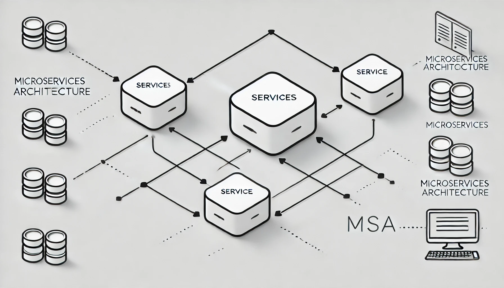
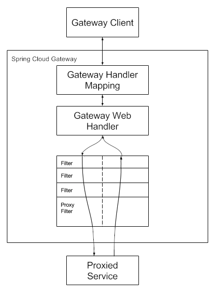

> 지난 포스팅에서는 Eureka를 활용한 **서비스 디스커버리(Service Discovery)**에 대해 알아보았습니다. 이번 글에서는 **Spring Cloud Gateway**를 사용해, 서비스 디스커버리에 등록된 각 마이크로서비스 간의 연결을 관리하고 라우팅을 수행하는 방법을 알아보고, 실제 구현해보겠습니다.


## Spring Cloud Gateway란?

---

>**Spring Cloud Gateway**는 클라우드 환경에서 마이크로서비스를 효율적으로 관리하는 API Gateway 솔루션입니다. 이를 통해 클라이언트 요청을 받아 각 마이크로서비스로 연결하고, 요청 전,후에 다양한 필터 로직을 적용할 수 있습니다. Spring Cloud Gateway는 **Reactive Server**와 **MVC 방식**을 모두 지원하며, 이번 포스팅에서는 **Reactive Server 방식**을 중심으로 설명하겠습니다.


### Sprign Cloud Gateway 핵심 용어

- **Route**: 클라이언트 요청을 특정 서비스로 전달하는 경로 설정입니다. 각 라우트는 ID, 목적지 URI, 그리고 요청을 전달할 조건인 Predictae와 Filter로 구성됩니다. Route를 통해 Gateway가 요청을 어느 서비스로 라우팅할지 정의할 수 있습니다.
- **Predicate**: 요청을 특정 Route로 매칭시키는 조건입니다. HTTP 요청의 경로나 헤더, 메소드 등의 속성에 따라 요청이 해당 Route에 매칭되는지 확인합니다. 예를 들어, 특정 URL 경로나 HTTP 메소드(GET, POST 등) 에 기반해 라우트를 지정할 수 있습니다.
- **Filter**: 요청 전후에 수행할 다양한 부가 작업을 정의합니다. 요청을 특정 마이크로서비스로 라우팅하기 전에 인증, 로깅, 수정 등의 처리를 수행하거나, 응답을 가곡하는 데 사용할 수 있습니다. 필터는 사전(Pre)필터와 사후(Post)필터로 나뉘며, 요청의 흐름에서 다양한 부가 작업을 지원합니다.

<br>

## 작동 원리 및 주요 기능

---

### 작동 원리



[출처 Spring Cloud Gateway](https://docs.spring.io/spring-cloud-gateway/reference/spring-cloud-gateway/how-it-works.html)

- 클라이언트가 Spring Cloude Gateway로 요청을 보내면, **Gateway Handler Mapping**이 경로를 확인해 요청과 일치하는지 판단합니다. 경로가 일치하면 요청이 **Gateway Web Handler**로 전달되며, 이 핸들러는 요청에 대해 **필터 체인**을 통해 작업을 수행합니다. 필터는 프록시 요청이 전달되기 전과 후 모두에서 로직을 실행할 수 있어 그림에서 점선 기준으로 "사전" 필터와 "사후" 필터로 나뉩니다. 먼저 모든 사전 필터 수행 후 Proxied Service에서 요청이 수행되고 응답 후에 사후 팔터를 통해 로직이 실행됩니다.


### 주요 기능

- **라우팅**: HTTP 요청을 적절한 마이크로서비스로 라우팅
- **필터링**: 인증, 로깅, 요청, 수정 등의 작업을 필터를 통해 구현
- **로드 밸런싱**: 여러 인스턴스 간 트래픽 분산
- **보안**: 인증 및 권한 부여 기능 제공
- **모니터링 및 추적**: 마이크로서비스 간 요청 추적 및 모니터링


## predicate 설정

---


> **predicate 란**
>
> 요청을 특정 Route로 매칭시키는 조건입니다. HTTP 요청의 경로나 헤더, 메소드 등의 속성에 따라 요청이 해당 Route에 매칭되는지 확인합니다. 예를 들어, 특정 URL 경로나 HTTP 메소드(GET, POST 등) 에 기반해 라우트를 지정할 수 있습니다.

####  predicate 구성

> predicate 구성은 application.yaml 에 구성하는 방식중 2가지 방식이 있습니다.

- key, value를 `=` 로 구성, value 는 `,`로 구분

``` yaml
spring:
  cloud:
    gateway:
      routes:
      - id: after_route
        uri: https://example.org
        predicates:
        - Cookie=mycookie,mycookievalue
```


- `name`, `args`로 구성

```yaml
spring:
  cloud:
    gateway:
      routes:
      - id: after_route
        uri: https://example.org
        predicates:
        - name: Cookie
          args:
            name: mycookie
            regexp: mycookievalue
```

### 다양한 predicate

> 요청 Route와 매핑 시키기 위한 다양한 방식이 존재합니다. 특정 시간 이후에는 해당 Route로 매핑시키거나 특정 쿠키가 존재할 경우, host 경로 , Path 일치 등 다양한 방식이 존재하며 이번 포스팅에서는 **Path**를 통한 조건을 확인해보겠습니다. 다양한 조건은 [SpringCloudGateway Reference Docs](https://docs.spring.io/spring-cloud-gateway/reference/spring-cloud-gateway/request-predicates-factories.html) 를 참고하세요

```yaml
spring:
  application:
    name: apigateway-service
  cloud:
      routes:
        - id: user-service
          uri: lb://USER-SERVICE
          predicates:
            - Path=/user-service/**
```

- `Path= /user-service/` 로 들어오면 Eureka Server에 **USER-SERVICE**로 보내라는 설정입니다.


## Filter 설정

---

> **Filter란?**
>
> 요청 전후에 수행할 다양한 부가 작업을 정의합니다. 요청을 특정 마이크로서비스로 라우팅하기 전에 인증, 로깅, 수정 등의 처리를 수행하거나, 응답을 가곡하는 데 사용할 수 있습니다. 필터는 사전(Pre)필터와 사후(Post)필터로 나뉘며, 요청의 흐름에서 다양한 부가 작업을 지원합니다.

### Filter 구성

> yaml 파일에서 간단하게 Filter 추가가 가능합니다. Spring Cloud Gateway에서 정의해둔 `AddRequestHeader`등과 같은 필터를 사용해 간단하게 추가할 수도 있고, CustomFilter 로직을 java로 구현한후 해당 클래스 명을 yaml에 명시해 등록할 수도 있습니다.
>
> 더 자세한 내용은 [Spring Cloud Gateway Reference Docs](https://docs.spring.io/spring-cloud-gateway/reference/spring-cloud-gateway/gatewayfilter-factories/addrequestheader-factory.html) 를 참고하세요

- Yaml 로 등록
  - `AddRequestHeader` 를 통해 requestHeader에 특정 값을 추가시킵니다.

``` yaml
spring:
  cloud:
    gateway:
      routes:
      - id: add_request_header_route
        uri: https://example.org
        filters:
        - AddRequestHeader=X-Request-red, blue
```

- CustomFilter 등록

``` java
package com.example.apigatewayservice.filter;

import lombok.extern.slf4j.Slf4j;
import org.springframework.cloud.gateway.filter.GatewayFilter;
import org.springframework.cloud.gateway.filter.factory.AbstractGatewayFilterFactory;
import org.springframework.http.server.reactive.ServerHttpRequest;
import org.springframework.http.server.reactive.ServerHttpResponse;
import org.springframework.stereotype.Component;
import reactor.core.publisher.Mono;

@Slf4j
@Component
public class CustomFilter extends AbstractGatewayFilterFactory<CustomFilter.Config> {

    public CustomFilter() {
        super(Config.class);  // Config 클래스를 지정하여 필터를 초기화
    }

    @Override
    public GatewayFilter apply(Config config) {
        return (exchange, chain) -> {
            ServerHttpRequest request = exchange.getRequest();
            ServerHttpResponse response = exchange.getResponse();

            log.info("Custom PRE filter: request id -> {}", request.getId());

            return chain.filter(exchange)
                    .then(Mono.fromRunnable(() -> {
                        log.info("Custom POST filter: response code -> {}", response.getStatusCode());
                    }));
        };
    }

    public static class Config {
    }
}

```

```yaml
spring:
  application:
    name: apigateway-service
  cloud:
      routes:
        - id: user-service
          uri: lb://USER-SERVICE
          predicates:
            - Path=/user-service/**
        - id: first-service
          uri: lb://FIRST-SERVICE
          predicates:
            - Path=/first-service/**
          filters:
            - CustomFilter
```


### Globa Filter 등록

- 각 서비스들에 대해서 Filter를 등록할 수 있지만 인증, 인가 처리 등 공통 로직에 대한 Global Filter를 정의할 수 있습니다.

``` java
package com.example.apigatewayservice.filter;

import lombok.Data;
import lombok.extern.slf4j.Slf4j;
import org.springframework.cloud.gateway.filter.GatewayFilter;
import org.springframework.cloud.gateway.filter.factory.AbstractGatewayFilterFactory;
import org.springframework.http.server.reactive.ServerHttpRequest;
import org.springframework.http.server.reactive.ServerHttpResponse;
import org.springframework.stereotype.Component;
import reactor.core.publisher.Mono;

@Slf4j
@Component
public class GlobalFilter extends AbstractGatewayFilterFactory<GlobalFilter.Config> {

    public GlobalFilter() {
        super(Config.class);  // Config 클래스를 지정하여 필터를 초기화
    }

    @Override
    public GatewayFilter apply(Config config) {
        return (exchange, chain) -> {
            ServerHttpRequest request = exchange.getRequest();
            ServerHttpResponse response = exchange.getResponse();

            log.info("Global filter baseMessage -> {}", config.getBaseMessage());

            if (config.isPreLogger())
                log.info("Global Filter Start: request id -> {}", request.getId());

            return chain.filter(exchange)
                    .then(Mono.fromRunnable(() -> {
                        if (config.isPreLogger())
                            log.info("Global Filter End: responseCode -> {}", response.getStatusCode());
                    }));
        };
    }

    @Data
    public static class Config {
        private String baseMessage;
        private boolean preLogger;
        private boolean postLogger;
    }
}

```

```yaml
spring:
  application:
    name: apigateway-service
  cloud:
    gateway:
      default-filters:
        - name: GlobalFilter
          args:
            baseMessage: Global Filter Base Message
            preLogger: true
            postLogger: true
```


## 구현

---

### 준비사항

- Gateway를 실행시키기 위해서는 아래 항목들 준비가 필요합니다. 제 [Github](https://github.com/DevK-Jung/msa-practice) 에 해당 항목들 준비되어있으니 확인해보세용
- 추가로 gateway에 연결시킬 sample Microservice인 FirstService와 SecondService 프로젝트를 준비해두었습니다.

> - Eureka Server
> - FirstService (Sample MicroService)
> - SecondService (Sample MicroService)

### project 생성

> - Java 17
> - Spring Boot 3.3.4
> - Spring Gateway
> - Spring Cloud Netflix Eureka Client

### build.gradle

``` groovy
plugins {
    id 'java'
    id 'org.springframework.boot' version '3.3.4'
    id 'io.spring.dependency-management' version '1.1.6'
}

group = 'com.example'
version = '0.0.1-SNAPSHOT'

java {
    toolchain {
        languageVersion = JavaLanguageVersion.of(17)
    }
}

configurations {
    compileOnly {
        extendsFrom annotationProcessor
    }
}

repositories {
    mavenCentral()
}

ext {
    set('springCloudVersion', "2023.0.3")
}

dependencies {
    implementation 'org.springframework.cloud:spring-cloud-starter-gateway'
    implementation 'org.springframework.cloud:spring-cloud-starter-netflix-eureka-client'
    compileOnly 'org.projectlombok:lombok'
    annotationProcessor 'org.projectlombok:lombok'
    testImplementation 'org.springframework.boot:spring-boot-starter-test'
    testRuntimeOnly 'org.junit.platform:junit-platform-launcher'
}

dependencyManagement {
    imports {
        mavenBom "org.springframework.cloud:spring-cloud-dependencies:${springCloudVersion}"
    }
}

tasks.named('test') {
    useJUnitPlatform()
}

```


### application.yml

```yaml
server:
  port: 8000
eureka:
  client:
    fetch-registry: true
    register-with-eureka: true
    service-url:
      defaultZone: http://localhost:8761/eureka

spring:
  application:
    name: apigateway-service
```

- `server.port`: service port 를 8000으로 세팅
- `eureka.client.fetch-registry`: 다른 서비스들의 정보를 현재 서비스 인스턴스가 Eureka 서버로부터 가져올지 여부를 지정
- `eureka.client.register.with-eureka`: 현재 애플리케이션을 Eureka 서버에 등록할지 여부를 지정
- `eureka.client.service-url.defaultZone`: Eureka 서버 url 지정


### Routes 등록

``` yaml
spring:
  application:
    name: apigateway-service
  cloud:
      routes:
        - id: first-service
          uri: lb://FIRST-SERVICE
          predicates:
            - Path=/first-service/**
        - id: second-service
          uri: lb://SECOND-SERVICE
          predicates:
            - Path=/second-service/**
```

- **id**:

  - **설명**: 각 라우트를 식별하는 고유 ID입니다.
  - **예시**: `user-service`, `first-service`, `second-service`

  **uri**:

  - **설명**: 요청을 전달할 대상 서비스의 URI를 지정합니다.
  - **값**: `lb://<SERVICE-NAME>` 형식으로 설정되며, `lb`는 **로드 밸런서**를 의미합니다. `USER-SERVICE`, `FIRST-SERVICE`, `SECOND-SERVICE`는 각 대상 서비스의 이름입니다.
  - **동작**: Eureka와 같은 서비스 디스커버리에서 서비스 인스턴스의 위치를 동적으로 조회하여 로드 밸런싱을 통해 라우팅합니다.

  **predicates**:

  - **설명**: 요청이 라우트에 매칭되는 조건을 지정합니다.
  - **예시**: `Path=/user-service/**`는 `/user-service/`로 시작하는 모든 요청이 `user-service`로 라우팅됨을 의미합니다.
  - **용도**: 각 서비스별로 특정 경로 패턴을 정의하여, 해당 경로로 들어온 요청을 해당 서비스로 연결합니다.

 ### Global Filter 등록

``` java
package com.example.apigatewayservice.filter;

import lombok.Data;
import lombok.extern.slf4j.Slf4j;
import org.springframework.cloud.gateway.filter.GatewayFilter;
import org.springframework.cloud.gateway.filter.factory.AbstractGatewayFilterFactory;
import org.springframework.http.server.reactive.ServerHttpRequest;
import org.springframework.http.server.reactive.ServerHttpResponse;
import org.springframework.stereotype.Component;
import reactor.core.publisher.Mono;

@Slf4j
@Component
public class GlobalFilter extends AbstractGatewayFilterFactory<GlobalFilter.Config> {

    public GlobalFilter() {
        super(Config.class);  // Config 클래스를 지정하여 필터를 초기화
    }

    @Override
    public GatewayFilter apply(Config config) {
        return (exchange, chain) -> {
            ServerHttpRequest request = exchange.getRequest();
            ServerHttpResponse response = exchange.getResponse();

            log.info("Global filter baseMessage -> {}", config.getBaseMessage());

            if (config.isPreLogger())
                log.info("Global Filter Start: request id -> {}", request.getId());

            return chain.filter(exchange)
                    .then(Mono.fromRunnable(() -> {
                        if (config.isPreLogger())
                            log.info("Global Filter End: responseCode -> {}", response.getStatusCode());
                    }));
        };
    }

    @Data
    public static class Config {
        private String baseMessage;
        private boolean preLogger;
        private boolean postLogger;
    }
}

```

```yaml
spring:
  application:
    name: apigateway-service
  cloud:
    gateway:
      default-filters:
        - name: GlobalFilter
          args:
            baseMessage: Global Filter Base Message
            preLogger: true
            postLogger: true
```

### CustomFilter 등록

``` java
package com.example.apigatewayservice.filter;

import lombok.extern.slf4j.Slf4j;
import org.springframework.cloud.gateway.filter.GatewayFilter;
import org.springframework.cloud.gateway.filter.factory.AbstractGatewayFilterFactory;
import org.springframework.http.server.reactive.ServerHttpRequest;
import org.springframework.http.server.reactive.ServerHttpResponse;
import org.springframework.stereotype.Component;
import reactor.core.publisher.Mono;

@Slf4j
@Component
public class CustomFilter extends AbstractGatewayFilterFactory<CustomFilter.Config> {

    public CustomFilter() {
        super(Config.class);  // Config 클래스를 지정하여 필터를 초기화
    }

    @Override
    public GatewayFilter apply(Config config) {
        return (exchange, chain) -> {
            ServerHttpRequest request = exchange.getRequest();
            ServerHttpResponse response = exchange.getResponse();

            log.info("Custom PRE filter: request id -> {}", request.getId());

            return chain.filter(exchange)
                    .then(Mono.fromRunnable(() -> {
                        log.info("Custom POST filter: response code -> {}", response.getStatusCode());
                    }));
        };
    }

    public static class Config {
    }
}

```

```yaml
spring:
  application:
    name: apigateway-service
  cloud:
    gateway:
      default-filters:
        - name: GlobalFilter
          args:
            baseMessage: Global Filter Base Message
            preLogger: true
            postLogger: true
      routes:
          predicates:
            - Path=/first-service/**
          filters:
            #            - AddRequestHeader=first-request, first-request-header2
            - CustomFilter
        - id: second-service
          uri: lb://SECOND-SERVICE
          predicates:
            - Path=/second-service/**
          filters:
            - name: CustomFilter
```


## 마치며

----

Spring cloud gateway에 대해 알아보고 routes를 위한 predicate 설정 및 공통 filter와 custom filter들을 직접 설정해보았습니다. 이처럼 Spring Cloud Gateway는 마이크로서비스 아키텍처에서 필수적인 역할을 하는 API Gateway 솔루션입니다. 이를 잘 활용하면 마이크로서비스 환경에서의 복잡성을 줄이고 요청 흐름을 체계적으로 관리할 수 있습니다.

- 전체 코드: [GitHub](https://github.com/DevK-Jung/msa-practice)

<br>

>- 참고
>  - https://docs.spring.io/spring-cloud-gateway/reference/index.html
>  - https://www.inflearn.com/course/%EC%8A%A4%ED%94%84%EB%A7%81-%ED%81%B4%EB%9D%BC%EC%9A%B0%EB%93%9C-%EB%A7%88%EC%9D%B4%ED%81%AC%EB%A1%9C%EC%84%9C%EB%B9%84%EC%8A%A4/dashboard
>
>
