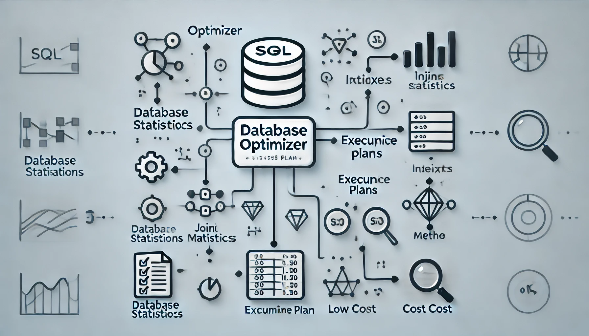
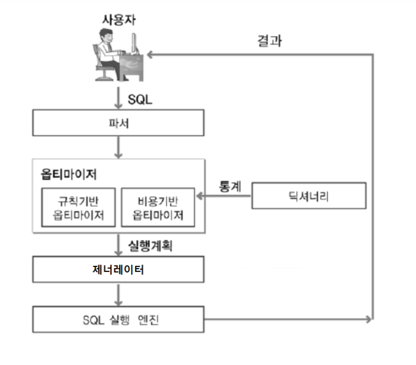

>오늘은 DB 성능 최적화의 핵심 엔진인 옵티마이저(Optimizer)에 대해 알아보겠습니다.

## 옵티마이저란?

---

> **옵티마이저(Optimizer)**는 데이터베이스 관리 시스템(DBMS)에서 **SQL 쿼리를 가장 빠르고 효율적으로 실행할 수 있는 방법을 찾아주는 핵심** 구성 요소입니다. SQL 쿼리가 실행될 때, 옵티마이저는 다양한 실행 계획(Execution Plan)을 생성하고, 이 중에서 비용이 가장 낮은 최적의 실행 계획을 선택하여 성능을 극대화합니다. 이 과정에서 테이블의 통계 정보, 인덱스, 조인 방식 등을 고려해 쿼리가 가장 효율적으로 실행될 수 있도록 지원합니다.

## Query 실행 절차

---

우선 SQL 쿼리 실행 절차를 살펴보겠습니다.

> **쿼리 실행 계획 4단계**
>
> Parsing -> Optimization > Generation > Exection

출처 https://velog.io/@kwontae1313/옵티마이저

### 1. Parsing

- 개발자가 작성한 SQL은 DBMS 내에서 실행 계획으로 바로 실행되는 것이 아니라, 먼저 SQL 파서를 통해 구성 요소별로 분해됩니다. 파서는 SQL을 파싱하여 파싱 트리를 생성하고, 이 과정에서 문법 검사를 수행합니다. 문법 오류가 발견되면 실행이 중단되고, 그렇지 않으면 정상적인 파싱 트리가 만들어집니다.

### 2. Optimization

- 옵티마이저는 파싱 트리를 바탕으로 최적화 작업을 수행합니다.
  - **Query Transformer**: SQL 트리 구조를 분석하여 효율적인 쿼리로 변환합니다. 불필요한 조건을 제거하고 복잡한 연산을 단순화하는 작업이 포함됩니다.
  - **Estimator**: 시스템 통계 정보(예: 테이블 크기, 인덱스 상태)를 기반으로 SQL 실행에 필요한 총 비용을 계산합니다.
  - **Plan Generator**: Estimator가 계산한 비용을 토대로 실행 계획 후보군을 생성하고, 이중에서 최적의 계획을 도출합니다.

### 3. Generation

- 옵티마이저가 선택한 최적의 실행 계획을 실제 SQL 엔진이 실행 가능한 코드나 프로시저로 변환합니다.

### 4. Execution

- 변환된 코드를 실행하고 결과를 생성하고 사용자에게 전달합니다.

 

## 옵티마이저(Optimizer) 주요 기능

---

> 위에서 살펴본 것 처럼 옵티마이저는 효율적인 쿼리로 변환, 총 비용 계산, 최적의 계획 도출 등 SQL 쿼리를 가장 빠르고 효율적으로 실행할 수 있는 방법을 찾아주는 핵심 구성 요소입니다. 그런 옵티마이저의 주요 기능에 대해서 좀 더 알아보겠습니다.

- **실행 계획 생성 및 선택**
  - 옵티마이저는 주어진 쿼리에서 사용 가능한 여러 실행 계획을 생성하고, 이 중에서 최적의 계획을 선택합니다. 실행 계획은 데이터를 어떤 순서로 검색하고, 어떤 인덱스를 사용할지 등을 정합니다.
- **비용 산출**
  - 생성된 각 실행 계획의 비용을 산출하여 비교하고, 비용이 가장 낮은 실행 계획을 선택합니다. 비용은 I/O, CPU 사용량, 메모리 사용량 등을 종합적으로 고려하여 계산됩니다.
- **조인 방식 최적화**
  - 여러 테이블을 조인할 때, Nested Loop, Merged join, Hash join 등 여러 조인 방식 중 가장 적합한 방식을 선택합니다. 조인 방식의 선택은 쿼리 성능에 큰 영향을 미칩니다.
- **인덱스 사용 최적화**
  - 인덱스를 사용할지 여부를 결정하고, 필요한 경우 인덱스를 사용해 테이블 검색 속도를 높입니다. 인덱스가 존재한다면 전체 테이블 스캔을 피하고 필요한 데이터에 빠르게 접근할 수 있습니다.
- **통계 정보 활용**
  - 옵티마이저는 테이블의 통계 정보를 기반으로 데이터 분포와 크기 등을 파악하여 쿼리를 최적화합니다. 데이터 통계는 옵티마이저가 비용을 계산하는 데 중요한 정보를 제공합니다.

## 옵티마이저 유형(RBO 와 CBO)

---

> 옵티마이저는 최적화 기반을 기준으로 규칙 기반 옵티마이저(RBO: Rule-Based Optimizer) 와 비용 기반 옵티마이저(CBO: Cost-Based Optimzier)로 나눠집니다.

 

### 규칙 기반 옵티마이저(RBO: Rule-Based Optimizer)

> **규칙 기반 옵티마이저(RBO: Rule-Based Optimizer)란?**
>
> 실행 계획을 결정할 때 미리 정해진 규칙에 따라 쿼리를 최적화하는 방식입니다. 주어진 규칙에 따라 쿼리를 실행하기 때문에 특정 상황에서는 비효율적일 수 있으며, 최신 DBMS에서는 잘 사용되지 않습니다.

- 규칙 기반 옵티마이저(RBO) 는 쿼리 실행 계획을 만들 때 일반적으로 사용되는 JOIN, WHERE 등의 SQL 구문에 대한 고정 규칙을 적용합니다. 일반적으로 규칙을 세워둘 때 실행 속도가 빠른 순으로 규칙을 세워두고 우선순위가 높은 방법을 채택하여 실행 계획을 세웁니다.
- 규칙이란 액세스 경로별 우선순위로서, 인덱스 구조, 연산, 조건절 형태가 순위를 결정짓는 주요인이 됩니다.
  - DBMS에서 제공하는 RBO 의 경우, 대부분의 경우 규칙의 우선순위를 사용자가 변경할 수 없습니다. 그러나 일부 DBMS(Oracle's ORESERED hint)에서는 사용자가 규칙의 우선순위를 변경할 수 있는 설정을 제공하기도 합니다.
- 일반적으로 고정된 RBO의 우선순위는 다음과 같습니다.

| 1    | ROWID를 사용한 단일 행인 겨우                                |
| ---- | ------------------------------------------------------------ |
| 2    | 클러스터 조인에 의한 단일 행인 경우                          |
| 3    | 유일하게 기본키(Primary Key)를 가진 해시 클러스터 키에 의한 단일 행인 경우 |
| 4    | 유일하게 기본키(Primary Key)에 의한 단일 행인 경우           |
| 5    | 클러스터 조인인 경우                                         |
| 6    | 해시 클러스터 조인인 경우                                    |
| 7    | 인덱스 클러스터 키인 경우                                    |
| 8    | 복합 칼럼 인덱스인 경우                                      |
| 9    | 단일 칼럼 인덱스인 경우                                      |
| 10   | 인덱스가 구성된 칼럼에서 제한된 범위를 검색하는 경우         |
| 11   | 인덱스가 구성된 칼럼에서 무제한 범위를 검색하는 경우         |
| 12   | 정렬-병합(Sort-Merge) 조인인 경우                            |
| 13   | 인덱스가 구성된 칼럼에서 MAX 혹은 MIN을 구하는 경우          |
| 14   | 인덱스가 구성된 칼럼에서 ORDER BY를 실행하는 경우            |
| 15   | 전체 테이블 스캔(FULL TABLE SCAN)하는 경우                   |

 

### 비용 기반 옵티마이저(CBO: Cost-Based Optimzier)

> **비용 기반 옵티마이저(CBO: Cost-Based Optimzier) 란?**
>
> 비용 기반 옵티마이저는 테이블의 통계 정보와 비용을 기반으로 실행 계획을 선택합니다. 데이터 분포, 테이블 크기, 조인 조건 등 다양한 요소를 고려해 가장 효율적인 경로를 찾아 성능을 극대화합니다. 대부분의 현대적인 DBMS는 비용 기반 옵티마이저를 사용합니다.

- 일반적으로 2000개에서 최대 10000개 까지 실행 계획을 세운 뒤 비용이 최소한으로 나온 실행 계획을 수행합니다.
- 실행 계획을 수립할 때 판단 기준이 되는 비용은 예상치입니다. 따라서 CBO는 비용을 예측하기 위해 테이블, 인덱스, 컬럼 등의 다양한 객체 통계 정보 및 시스템 통계 정보(CPU 속도, I/O 속도 등)을 이용합니다.

### 규칙 기반과 비용 기반 차이

| 구분                          | 규칙 기반 옵티마이저 (RBO)                                   | 비용 기반 옵티마이저 (CBO)                                   |
| ----------------------------- | ------------------------------------------------------------ | ------------------------------------------------------------ |
| **최적화 방식**               | 사전 정의된 규칙과 우선순위에 따라 실행 계획 선택            | 통계 정보를 기반으로 실행 비용을 계산하여 최적의 실행 계획 선택 |
| **통계 정보 사용 여부**       | 통계 정보 없이 규칙에 따라 실행 계획을 선택                  | 테이블 크기, 데이터 분포, 인덱스 유무 등 통계 정보를 바탕으로 실행 계획 수립 |
| **유연성**                    | 쿼리 구조에 따라 고정된 방식으로 처리되어 유연성이 낮음      | 통계 기반으로 다양한 실행 경로를 고려하여 유연성이 높음      |
| **복잡한 쿼리 최적화**        | 단순한 쿼리에는 효율적이나 복잡한 쿼리에서는 비효율적일 수 있음 | 복잡한 쿼리에서도 최적의 실행 계획을 세울 수 있음            |
| **쿼리 변환(Transformation)** | 지원하지 않음                                                | 쿼리를 효율적인 형태로 변환하여 최적의 성능 도출             |
| **사용 사례**                 | 오래된 시스템이나 작은 데이터셋에서 사용                     | 현대적 DBMS에서 기본 사용, 대규모 데이터셋에 적합            |
| **대표적인 DBMS**             | 일부 옛날 버전의 Oracle, MySQL 등                            | Oracle, PostgreSQL, MySQL, SQL Server 등 현대적 DBMS         |
| **실행 계획의 수**            | 사전 규칙에 의해 정해져 적은 수의 계획만 탐색                | 다양한 실행 계획을 평가하므로 탐색 범위가 넓고, 최대 수천 개까지 설정 가능 |

## 마치며

---

이번 글에서는 SQL 쿼리를 최적화하고 DB 성능을 극대화하는 핵심 구성 요소인 데이터베이스 옵티마이저에 대해 알아보았습니다. 현대 DBMS 대부분은 비용 기반 옵티마이저(CBO)를 사용하며, CBO는 최신 데이터 통계를 기반으로 최적의 실행 계획을 수립합니다. 이를 효과적으로 활용하려면 통계 정보의 주기적 업데이트와 적절한 인덱스 설정이 매우 중요해보입니다.

 

> **참고**
>
> [[DB\] DB 성능 개선 방법](https://cieloinvernale.tistory.com/40)
>
> [옵티마이저(optimizer)란 무엇일까?](https://velog.io/@kwontae1313/옵티마이저)
>
> [[DB\] 데이터베이스 옵티마이저(Optimizer)에 대하여](https://coding-factory.tistory.com/743)
>
> [[DB\] 데이터베이스 옵티마이저(Optimizer)란?](https://code-lab1.tistory.com/137)
>
> [[MySQL\] 옵티마이저와 힌트 1](https://hyuuny.tistory.com/207)
