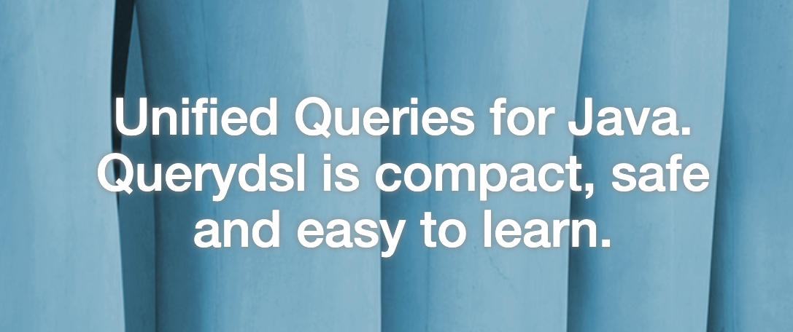
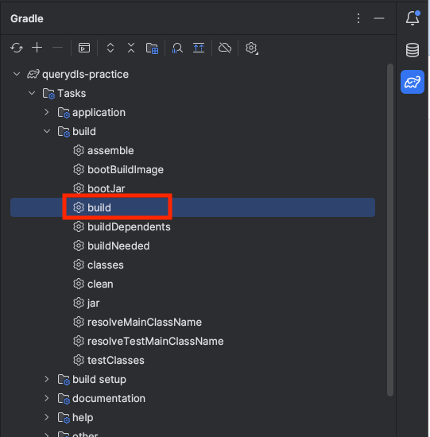
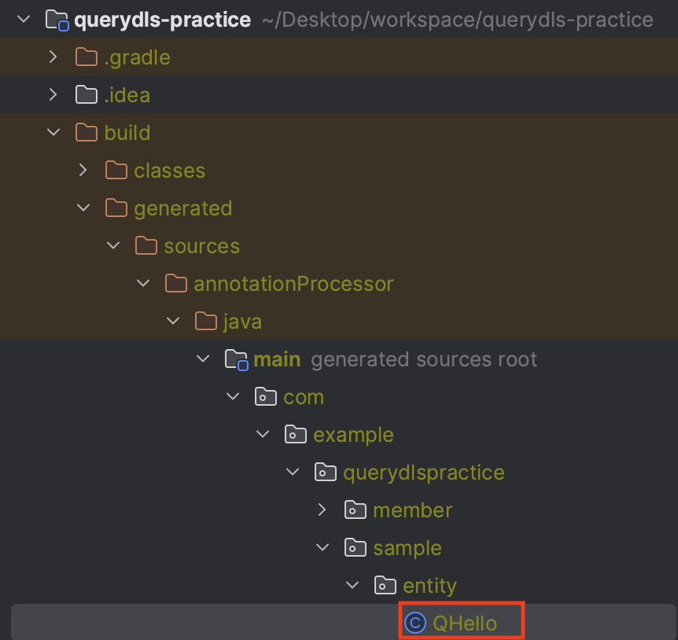

출처: http://querydsl.com/index.html

>Querydsl은 타입 안전성과 동적 쿼리 생성을 지원하는 Java 기반의 강력한 ORM 프레임워크입니다. Spring Data JPA만으로는 동적 쿼리 생성에 한계가 있어, 이를 보완하기 위해 Querydsl을 도입하는 경우가 많습니다. Querydsl을 사용하면 Java 코드만으로 데이터베이스와 상호작용할 수 있어 코드 가독성이 높아지고 유지보수가 쉬워지는 장점이 있습니다.
>
>이번 글에서는 Spring Boot 환경에서 Querydsl을 설정하는 방법에 대해서 알아보겠습니다.


## 프로젝트 스펙

---

> - Spring Boot 3.3.4
> - Java 17
> - Gradle
> - h2 DB
> - Spring Data JPA
> - Querydsl

### build.gradle

```groovy
plugins {
    id 'java'
    id 'org.springframework.boot' version '3.3.4'
    id 'io.spring.dependency-management' version '1.1.6'
}

group = 'com.example'
version = '0.0.1-SNAPSHOT'

java {
    toolchain {
        languageVersion = JavaLanguageVersion.of(17)
    }
}

configurations {
    compileOnly {
        extendsFrom annotationProcessor
    }
}

repositories {
    mavenCentral()
}

dependencies {
    implementation 'org.springframework.boot:spring-boot-starter-data-jpa'
    implementation 'org.springframework.boot:spring-boot-starter-web'
    compileOnly 'org.projectlombok:lombok'
    runtimeOnly 'com.h2database:h2'
    annotationProcessor 'org.projectlombok:lombok'
    testImplementation 'org.springframework.boot:spring-boot-starter-test'
    testRuntimeOnly 'org.junit.platform:junit-platform-launcher'

    // queryDSL 파라미터 바인딩된 쿼리 로그 확인
    implementation 'com.github.gavlyukovskiy:p6spy-spring-boot-starter:1.9.0'

    //test 롬복 사용
    testCompileOnly 'org.projectlombok:lombok'
    testAnnotationProcessor 'org.projectlombok:lombok'

    //Querydsl 추가
    implementation 'com.querydsl:querydsl-jpa:5.0.0:jakarta'
    annotationProcessor "com.querydsl:querydsl-apt:${dependencyManagement.importedProperties['querydsl.version']}:jakarta"
    annotationProcessor "jakarta.annotation:jakarta.annotation-api"
    annotationProcessor "jakarta.persistence:jakarta.persistence-api"
}

tasks.named('test') {
    useJUnitPlatform()
}

clean {
    delete file('src/main/generated') // clean 작업 수행시 생성된 Q클래스도 제거
}

```

- `p6spy-spring-boot-starter`: JPA 쿼리 로그를 전달된 파라미터와 함께 쉽게 확인할 수 있도록 해주는 라이브러리입니다.
- `querydsl-jpa`: QueryDsl의 JPA 모듈로, Querydsl을 사용해 JPA 기반의 동적 쿼리를 작성할 수 있습니다.
- `querydsl-apt`: Querydsl을 사용할 때 엔티티에 대응되는 Q클래스를 생성하는데 필요한 애노테이션 프로세시입니다.
  - ${dependencyManagement.importedProperties['querydsl.version']}: Spring의 Dependency Management 플로그인을 통해 자동으로 가져와 사용하는 방식입니다. `querydsl.version` dependencyManagement 블록이나 자동으로 관리되는 의존성 버전에서 가져옵니다.
- `jakarta.annotation-api`, `jakarta.persistence-api`: Querydsl과 JPA 환경에서 필요한 Jakarta 표준 API들을 정의합니다.

<br>

### application.yml

```yaml
spring:
  datasource:
    url: jdbc:h2:tcp://localhost/~/querydsl
    username: sa
    password:
    driver-class-name: org.h2.Driver

  jpa:
    database-platform: org.hibernate.dialect.H2Dialect # SQL 방언 설정
    hibernate:
      ddl-auto: create
    properties:
      hibernate:
        format_sql: true
        show_sql: true # 쿼리 system.out 으로 출력

logging:
  level:
    org.hibernate.sql: debug # hibernate가 생성하는 SQL 쿼리를 상세히 확인 할 수 있음

```

- `jpa.database-platform`: JPA 에서 사용할 데이터베이스의 SQL 방언(Dialect)를 설정합니다. Hibernates는 데이터베이스 종류에 맞춰 SQL 구문을 최적화하는데, 저는 H2 DB를 설정했으니 H2 Dialect를 사용하여 H2 데이터베이스에 맞는 SQL 을 생성하도록 합니다.
- `jpa.hibernate.ddl-auto`: 애플리케이션 시작 시 Entity에 맞춰 테이블을 어떻게 관리할지 설정합니다.
  - `create`: 테이블을 엔티티에 맞춰 생성해줍니다. 기존에 테이블이 존재하면 삭제(drop) 후 테이블을 생성하니 주의하세요.
  - `create-drop`: `create`와 유사하지만 애플리케이션 종료될 때 테이블을 삭제한다는 차이가 있습니다.
  - `update`: 엔티티로 등록된 클래스와 매핑되는 테이블이 없으면 새로 생성하는 것은 `create`와 동일하지만 기존 테이블이 존재한다면 위의 두 경우와 달리 테이블의 컬럼을 변경해줍니다.
  - `validate`: 엔티티와 테이블이 정상적으로 매핑되었는지만 검사합니다. 만약 테이블이 아예 존재하지 않거나, 테이블에 엔티티의 필드에 매핑되는 컬럼이 존재하지 않으면 예외를 발생시켜 애플리케이션을 종료합니다.
  - `none(default)`: 위 4가지 경우를 제외한 모든 경우에 해당합니다. 이 경우 아무일도 일어나지 않습니다. (SpringBoot의 경우 none이라고 명시하거나 아예 ddl-auto 속성을 명시하지 않으면 됨)
- `jpa.properties.hibernate.format_sql`: `true`로 설정 시 SQL 쿼리를 보기 쉽게 들여쓰기하여 출력하도록 합니다.
- `jpa.properties.hibernate.show_sql`: `true`로 설정 시 `System.out`에  SQL 쿼리를 출력합니다. 

<br>

###  Sample Entity 

```java
package com.example.querydlspractice.sample.entity;

import jakarta.persistence.Entity;
import jakarta.persistence.GeneratedValue;
import jakarta.persistence.Id;
import lombok.AccessLevel;
import lombok.Getter;
import lombok.NoArgsConstructor;
import lombok.Setter;

@Entity
@Getter
@Setter
@NoArgsConstructor(access = AccessLevel.PROTECTED)
public class Hello {
    @Id
    @GeneratedValue
    private Long id;
}

```

- `@NoArgsConstructor(access = AccessLevel.PROTECTED)`: 기본 생성자 접근 수준을 protected로 제한합니다.
  - JPA 는 프록시 생성을 위해 기본 생성자가 필요한데, 접근 수준이 `protected`라면 외부 접근을 차단하면서도 JPA 내부에서 접근이 가능합니다.

<br>

### 확인



- build 를 해줍니다.



- Q 클래스가 정상적으로 생성되었다면 설정 완료!


## 마치며

---

이상 Querydsl 기본적인 설정에 대해 알아보았습니다. 전체 코드는 제 [Github - querydsl](https://github.com/DevK-Jung/querydls-practice) 를 확인해주세요.


## Reference

---

- [http://querydsl.com/](http://querydsl.com/)
- [https://www.inflearn.com/course/querydsl-%EC%8B%A4%EC%A0%84/dashboard](https://www.inflearn.com/course/querydsl-%EC%8B%A4%EC%A0%84/dashboard)
- [https://colabear754.tistory.com/136](https://colabear754.tistory.com/136)


