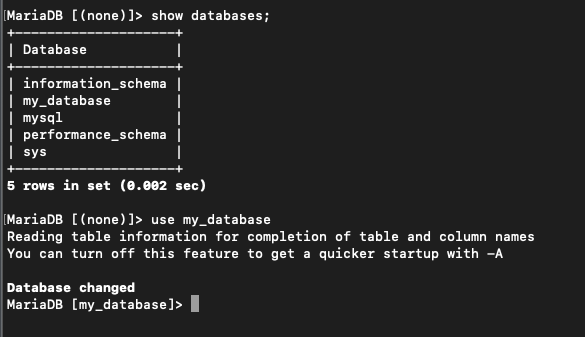
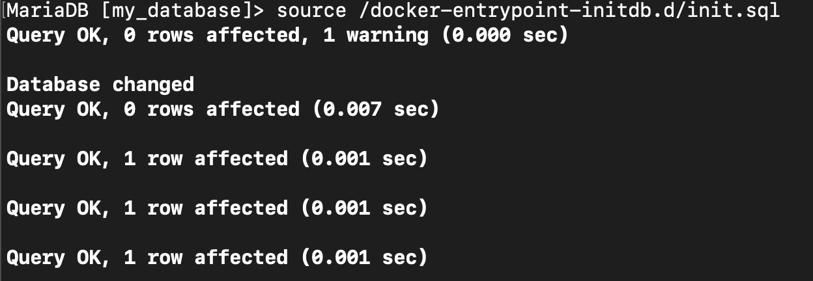
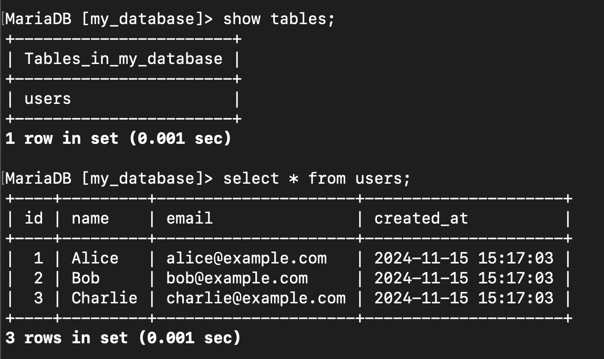

>프로젝트를 하다보면 대용량 데이터가 포함된 `.sql` 파일을 제공받는 경우가 있습니다. 하지만 DBeaver와 같은 툴에서 직접 복사하여 붙여넣어 실행하려고 하면, 파일 크기가 너무 커서 실행되지 않거나 에러가 발생할 수 있습니다. 이를 해결하기 위해 sql 파일을 실행해주는 `source` 명령어가 존재하며 오늘은 이 `source` 명령어 사용법에 대해 알아보겠습니다.


## Source 명령어 사용

---

### init.sql

- 저는 아래와 같이 테스트 쿼리를 구성한 후 init.sql이라고 저장하였습니다.

```sql
-- 데이터베이스 생성
CREATE DATABASE IF NOT EXISTS my_database;

-- 데이터베이스 사용
USE my_database;

-- 테이블 생성
CREATE TABLE IF NOT EXISTS users (
    id INT AUTO_INCREMENT PRIMARY KEY,
    name VARCHAR(100) NOT NULL,
    email VARCHAR(100) NOT NULL UNIQUE,
    created_at TIMESTAMP DEFAULT CURRENT_TIMESTAMP
);

-- 데이터 삽입
INSERT INTO users (name, email) VALUES ('Alice', 'alice@example.com');
INSERT INTO users (name, email) VALUES ('Bob', 'bob@example.com');
INSERT INTO users (name, email) VALUES ('Charlie', 'charlie@example.com');

```


### 명령어 사용

1. MariaDB 접속

```bash
mariadb -uroot -p
```

2. 작업할 Database로 접속해줍니다.

```sql
use [DatabaseName]
```



3. Source 실행

```sql
source [실행할 SQL파일경로]
```



4. 확인
   - 테이블 및 데이터가 정상적으로 들어간 것을 확인할 수 있습니다.




## 마치며

---

용량이 큰 .sql 파일은  위와 같이 `source`를 이용하면 간편하게 실행시킬 수 있습니다. 참고로 mysql에서도 사용 가능합니다.
