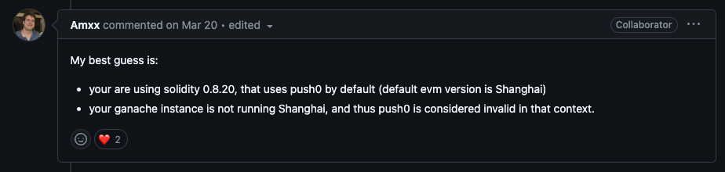
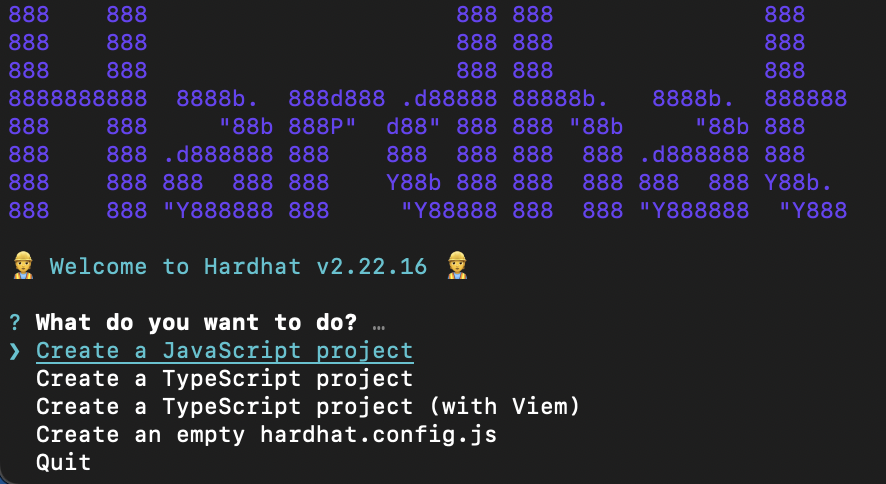
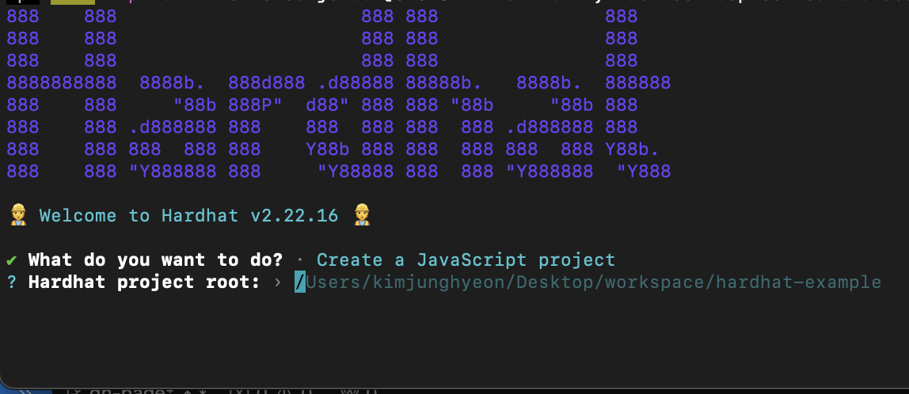
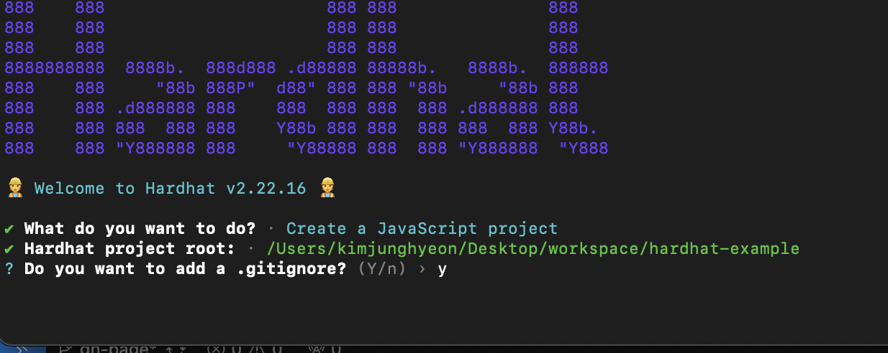
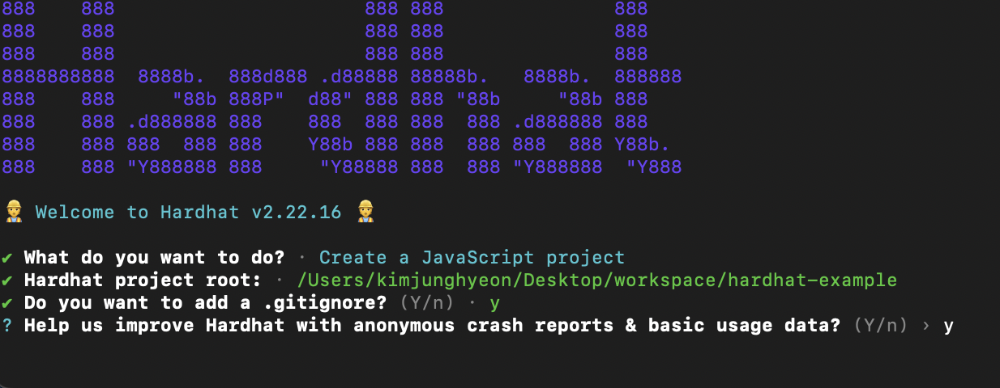
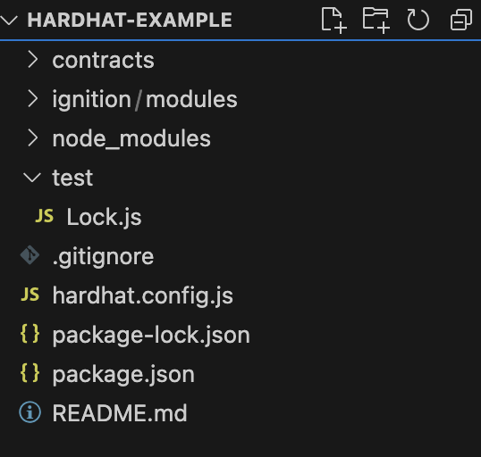
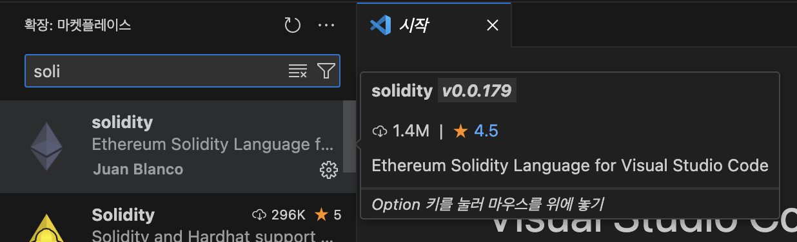

>Truffle Framework 를 활용하여 스마트 컨트랙트 예제를 연습하려 했으나. 무슨 이유에서인지 가나슈를 활용해 배포 시 아래와 같은 에러가 발생하였습니다. 
>
>```bash
>"KjhToken" hit an invalid opcode while deploying. Try:
>  * Verifying that your constructor params satisfy all assert conditions.
>  * Verifying your constructor code doesn't access an array out of bounds.
>  * Adding reason strings to your assert statements.
>```
>
>
>
>서칭을 좀 해보니 Amxx 씨가 아래와 같은 원인같다고 답변을 단 글을 발견하였습니다.
>
>- Solidity 0.8.20 버전은 기본적으로 Shanghai EVM 버전에서 도입된 PUSH0 명령어를 사용
>- Ganache가 Shanghai 버전을 지원하지 않는 경우, 이를 유효하지 않은 명령어(opcode)로 간주해 배포 실패
>
>이번 기회에 최신 EVM 및 Solidity 버전과의 호환성이 뛰어난 Hardhat을 활용해 스마트 컨트랙트 예제를 연습하기로 결정하였고 해당 내용에 대해서 정리한 글입니다.


## hardhat 이란?

---

Hardhat은 이더리움 스마트 컨트랙트 개발, 테스트, 배포를 위한 Javascript 기반 개발 환경입니다. 아래와 같은 특징을 가집니다.

- 주요 특징
  - Hardhat은 **Hardhat Runner**를 통해 컴파일, 테스트, 배포, 네트워크 실행 등 다양한 작업을 간편하게 수행할 수 있습니다. 
    - Ex. `npm hardhat compile`, `npx hardhat test`
  - 플러그인과 커스터마이징을 통해 기능을 확장할 수 있어 높은 유연성을 제공합니다.
  - 로컬 테스트를 위한 노트 실행 가능
    - `npx hardhat node` 명령어를 통해 가벼운 로컬 블록체인을 구성하여 개발할 수 있습니다.


## 개발환경 구성

---

> - Solidity: 0.8.27
> - Npm 7 이상
> - JavaScript

### 프로젝트 생성

```bash
npm init -y
```

- hardhat 실행

```
npx hardhat init
```

> 아래와 같은 선택 창이 뜹니다. 저는 TypeScript가 익숙치 않으니 JavaScript Project를 선택하겠습니다. 해당 위치에 커서를 두고 Enter를 눌러주세요



> 다음은 프로젝트 생성 경로를 지정해줍니다.



>  .gitignore 파일을 생성할지 물어봅니다. 저는 y로 하겠습니다.



> 오류 나면 익명으로 사용 데이터를 수집한다는데 마찬가지로 저는 y로 하겠습니다.




## 디렉토리 구조

---

>  위 과정을 완료하시면 Project root로 설정하신 디렉토리에 아래와 같이 초기 프로젝트 구성이 된 것을 확인하실 수 있습니다. 저는 visual Studio Code를 활용해 디렉토리를 연 상태입니다.



**핵심 구성 요소**

- `contracts/`: 스마트 컨트랙트의 **Solidity** 소스 파일이 저장되는 기본 위치입니다.
- `ignition/modules/`: 스마트 컨트랙트 배포 시 모듈식 배포 스크립트가 위치하는 디렉토리입니다. 참고로 `iginition`은 hardhat의 배포 관리 플러그인으로, 컨트랙트 배포를 더 체계적이고 반복 가능하게 관리할 수 있도록 도와주며 아래 구조와 같이 여러개의 모듈로 구성할 수 있습니다.

```
ignition/modules/
├── moduleA.js  # 배포 순서에 포함될 첫 번째 모듈
└── moduleB.js  # 두 번째 모듈
```

- `test/`: JavaScript 또는 TypeScript를 활용하여 테스트 스크립트를 작성하여 위치시키는 디렉토리입니다.
- `hardhat.config.js`:  Hardhat 환경 설정 파일로 네트워크, 컴파일러 옵션, 플러그인 등을 정의할 수있습니다.


## 예제 코드 확인하기

---

> Tip. 시작하기 앞서 Solidity 파일을 편하게 보기 위해 아래와 같이 Extension을 설치해주세요!




### contracts/Lock.sol

> 프로젝트 생성 후 자동으로 생성된 contracts/Lock.sol 파일을 확인해봅시다.<br>특정 시간 이후에만 소유자가 자금을 인출할 수 있도록 설계된 타임락(Time-Lock) 컨트랙트로 코드 설명은 주석을 통해서 작성하였습니다.<br>

```javascript
// SPDX-License-Identifier: UNLICENSED
pragma solidity ^0.8.27; // Solidity 컴파일러 버전을 지정합니다. (^0.8.27 이므로 해당 버전 이상을 사용해야 합니다.)

// Uncomment this line to use console.log
// import "hardhat/console.sol";

contract Lock {
    uint public unlockTime; // 잠금 해제 시간
    address payable public owner; // 컨트랙트 소유자 주소

    event Withdrawal(uint amount, uint when); // 이벤트: 출금 시 발생하며, 출금 금액(amount)와 시점(when)을 기록

		// 생성자(컨트랙트 배포 시 실행 됨): 입력 값으로 _unlockTiem(잠금 해제 시간)을 받습니다.
    constructor(uint _unlockTime) payable {
        require( // require(조건): 
            block.timestamp < _unlockTime, // _unlockTiem이 현재시간(block.timestampe)보다 미래의 시간이여야 합니다.
            "Unlock time should be in the future"
        );

        unlockTime = _unlockTime; // unlockTime 저장
        owner = payable(msg.sender); // 컨트랙트 배포 주소(msg.sender)를 소유자로 설정하며 payable 키워드를 통해 컨트랙트 배포 시 이더를 받을 수 있도록 허용합니다.
    }

		// 출금 함수: 
    function withdraw() public {
        // Uncomment this line, and the import of "hardhat/console.sol", to print a log in your terminal
        // console.log("Unlock time is %o and block timestamp is %o", unlockTime, block.timestamp);

        require(block.timestamp >= unlockTime, "You can't withdraw yet"); // 조건: 현재시간이 unlockTime 이상이어얗
        require(msg.sender == owner, "You aren't the owner"); // 호출자가 컨트랙트의 소유자(owner) 여야 함

        emit Withdrawal(address(this).balance, block.timestamp); // 이벤트 발생: 이벤트 호출을 통해 출금 금액과 시간을 기록

        owner.transfer(address(this).balance); // 컨트랙트 잔액을 소유자(owner)에게 전달
    }
}
```


### ignition/modules/Lock.js

> 다음은 배포 스크립트를 확인해봅시다.

```javascript
// This setup uses Hardhat Ignition to manage smart contract deployments.
// Learn more about it at https://hardhat.org/ignition

const { buildModule } = require("@nomicfoundation/hardhat-ignition/modules");

const JAN_1ST_2030 = 1893456000; // 기본 잠금해제 타임스탬프 2023년 1월 1일
const ONE_GWEI = 1_000_000_000n; // 1 Gwei 설정

module.exports = buildModule("LockModule", (m) => { // 모듈 이름 "LockModule" 로 설정
  // 파라미터 세팅
  const unlockTime = m.getParameter("unlockTime", JAN_1ST_2030);
  const lockedAmount = m.getParameter("lockedAmount", ONE_GWEI);

  // 스마트 컨트랙트 배포후 인스턴스 반환
  const lock = m.contract("Lock", [unlockTime], {
    value: lockedAmount,
  });

  return { lock };
});

```

- `const { buildModule } = require("@nomicfoundation/hardhat-ignition/modules");` Iginition의 주요 함수로 배포 과정을 정의하는데 사용

### test/Lock.js

> test 코드는 길어서 하나씩 뜯어보겠습니다.

```javascript
const {
  time,
  loadFixture,
} = require("@nomicfoundation/hardhat-toolbox/network-helpers");
const { anyValue } = require("@nomicfoundation/hardhat-chai-matchers/withArgs");
const { expect } = require("chai");
```

- 테스트에 필요한 의존성을 가져오는 부분입니다.
  - `time`: 시간관련 도구를 제공하며 특정 시점으로 네트워크 시간을 이동하여 테스트 가능하게 해줍니다.
  - `loadFixture`: 테스트 고정값(Fixture)을 설정하여 각 테스트 실행 전 상태를 초기화합니다.
  - `anyValue`: 이벤트 매처에서 특정 값 대신 "어떤 값이라도 허용" 하도록 지정합니다.
  - `expect`:  Chai의 기본 매처로, 테스트 결과를 검증합니다.

```javascript
async function deployOneYearLockFixture() {
  const ONE_YEAR_IN_SECS = 365 * 24 * 60 * 60; // 1년을 초 단위로 표현
  const ONE_GWEI = 1_000_000_000; // 1 Gwei

  const lockedAmount = ONE_GWEI;
  const unlockTime = (await time.latest()) + ONE_YEAR_IN_SECS; // 현재 시간 + 1년

  // 기본으로 첫 번째 계정(owner)이 컨트랙트를 배포
  const [owner, otherAccount] = await ethers.getSigners();

  const Lock = await ethers.getContractFactory("Lock"); // Lock 컨트랙트 가져오기
  const lock = await Lock.deploy(unlockTime, { value: lockedAmount }); // 배포

  return { lock, unlockTime, lockedAmount, owner, otherAccount };
}
```

- 테스트 시 동일한 초기 상태(컨트랙트 배포 등)을 재사용 하기 위해 테스트 전 고정값을 지정합니다. 이를 통해 테스트 시 같은 초기 값을 갖고 있는 컨트랙트로 테스트할 수 있습니다.

```javascript
describe("Deployment", function () {
  it("Should set the right unlockTime", async function () {
    const { lock, unlockTime } = await loadFixture(deployOneYearLockFixture);

    expect(await lock.unlockTime()).to.equal(unlockTime);
  });

  it("Should set the right owner", async function () {
    const { lock, owner } = await loadFixture(deployOneYearLockFixture);

    expect(await lock.owner()).to.equal(owner.address);
  });

  it("Should receive and store the funds to lock", async function () {
    const { lock, lockedAmount } = await loadFixture(deployOneYearLockFixture);

    expect(await ethers.provider.getBalance(lock.target)).to.equal(
      lockedAmount
    );
  });

  it("Should fail if the unlockTime is not in the future", async function () {
    const latestTime = await time.latest();
    const Lock = await ethers.getContractFactory("Lock");
    await expect(Lock.deploy(latestTime, { value: 1 })).to.be.revertedWith(
      "Unlock time should be in the future"
    );
  });
});

```

- 배포 테스트
  - 배포된 컨트랙트의 `unlockTime`과 `owner`가 올바르게 설정됐는지 검증합니다.
  - 컨트랙트 잠금 금액(`lockedAmount`)를 정확히 보유하는지 검증합니다.
  - 과거 시점의 `unlockTime`으로 배포 시 실패 여부 확인합니다.

```javascript
describe("Withdrawals", function () {
  describe("Validations", function () {
    it("Should revert with the right error if called too soon", async function () {
      const { lock } = await loadFixture(deployOneYearLockFixture);

      await expect(lock.withdraw()).to.be.revertedWith(
        "You can't withdraw yet"
      );
    });

    it("Should revert with the right error if called from another account", async function () {
      const { lock, unlockTime, otherAccount } = await loadFixture(
        deployOneYearLockFixture
      );

      await time.increaseTo(unlockTime);

      await expect(lock.connect(otherAccount).withdraw()).to.be.revertedWith(
        "You aren't the owner"
      );
    });

    it("Shouldn't fail if the unlockTime has arrived and the owner calls it", async function () {
      const { lock, unlockTime } = await loadFixture(
        deployOneYearLockFixture
      );

      await time.increaseTo(unlockTime);

      await expect(lock.withdraw()).not.to.be.reverted;
    });
  });

```

- 출금 테스트
  - 잠금 해제 시간 전 출금 시 실패 여부 확인
  - 소유자가 아닌 계정에서 출금 시 실패 여부 확인
  - 잠금 해제 시간이 된 후 소유자가 출금할 때 성공 여부 확인


### hardhat.config.js

```javascript
require("@nomicfoundation/hardhat-toolbox");

/** @type import('hardhat/config').HardhatUserConfig */
module.exports = { 
  solidity: "0.8.27", // Solidity 컴파일러 버전 지정
};

```

- **`@nomicfoundation/hardhat-toolbox`**: Harahat 에서 자주 사용되는 기능과 플러그인을 하나의 패키지로 통합한 툴박스 패키지입니다.
  - 주요 포함 라이브러리
    - **`@nomiclabs/hardhat-ethers`**: Ethers.js와의 통합
    - **`@nomiclabs/hardhat-waffle`**: Waffle 기반 스마트 컨트랙트 테스트 기능 제공
    - **`hardhat-etherscan`**: Etherscan에 컨트랙트를 검증 및 업로드
    - **`hardhat-gas-reporter`**: 가스 사용량 분석 및 보고서 생성
- 추가 적인 설정은 [hardhat Docs](https://hardhat.org/hardhat-runner/docs/config) 를 참고하세요!


## 컨트랙트 배포

---

### compile

아래 명령어를 통해 스마트 컨트랙트를 컴파일 해줍시다.

```bash
npx hardhat compile
```

결과

```bash
➜  hardhat-example npx hardhat compile
Downloading compiler 0.8.27
Compiled 1 Solidity file successfully (evm target: paris).
```

### test

배포 전 컨트랙트 코드 테스트를 위해 테스트 코드를 실행해 줍시다.

```bash
npx hardhat test
```

결과

```bash
➜  hardhat-example npx hardhat test


  Lock
    Deployment
      ✔ Should set the right unlockTime (617ms)
      ✔ Should set the right owner
      ✔ Should receive and store the funds to lock
      ✔ Should fail if the unlockTime is not in the future
    Withdrawals
      Validations
        ✔ Should revert with the right error if called too soon
        ✔ Should revert with the right error if called from another account
        ✔ Shouldn't fail if the unlockTime has arrived and the owner calls it
      Events
        ✔ Should emit an event on withdrawals
      Transfers
        ✔ Should transfer the funds to the owner


  9 passing (649ms)
```

### deploy

> 배포 전 로컬 테스트를 위해 로컬 노드를 실행해 줍시다.
>
> ```bash
> npx hardhat node
> ```
>
> - 기본 127.0.0.1에 8545 port로 실행되지만 --hostname 과 -- port를 지정하여 실행할 수 도 있습니다.
>
> ```bash
> npx hardhat node --hostname 127.0.0.1 --port 8545.
> ```
>
> 결과
>
> ```bash
> ➜  hardhat-example npx hardhat node
> Started HTTP and WebSocket JSON-RPC server at http://127.0.0.1:8545/
> 
> Accounts
> ========
> 
> WARNING: These accounts, and their private keys, are publicly known.
> Any funds sent to them on Mainnet or any other live network WILL BE LOST.
> 
> Account #0: 0xf39Fd6e51aad88F6F4ce6aB8827279cffFb92266 (10000 ETH)
> Private Key: 0xac0974bec39a17e36ba4a6b4d238ff944bacb478cbed5efcae784d7bf4f2ff80
> 
> Account #1: 0x70997970C51812dc3A010C7d01b50e0d17dc79C8 (10000 ETH)
> Private Key: 0x59c6995e998f97a5a0044966f0945389dc9e86dae88c7a8412f4603b6b78690d
> 
> Account #2: 0x3C44CdDdB6a900fa2b585dd299e03d12FA4293BC (10000 ETH)
> Private Key: 0x5de4111afa1a4b94908f83103eb1f1706367c2e68ca870fc3fb9a804cdab365a
> 
> Account #3: 0x90F79bf6EB2c4f870365E785982E1f101E93b906 (10000 ETH)
> Private Key: 0x7c852118294e51e653712a81e05800f419141751be58f605c371e15141b007a6
> 
> Account #4: 0x15d34AAf54267DB7D7c367839AAf71A00a2C6A65 (10000 ETH)
> Private Key: 0x47e179ec197488593b187f80a00eb0da91f1b9d0b13f8733639f19c30a34926a
> 
> Account #5: 0x9965507D1a55bcC2695C58ba16FB37d819B0A4dc (10000 ETH)
> Private Key: 0x8b3a350cf5c34c9194ca85829a2df0ec3153be0318b5e2d3348e872092edffba
> 
> Account #6: 0x976EA74026E726554dB657fA54763abd0C3a0aa9 (10000 ETH)
> Private Key: 0x92db14e403b83dfe3df233f83dfa3a0d7096f21ca9b0d6d6b8d88b2b4ec1564e
> 
> Account #7: 0x14dC79964da2C08b23698B3D3cc7Ca32193d9955 (10000 ETH)
> Private Key: 0x4bbbf85ce3377467afe5d46f804f221813b2bb87f24d81f60f1fcdbf7cbf4356
> 
> Account #8: 0x23618e81E3f5cdF7f54C3d65f7FBc0aBf5B21E8f (10000 ETH)
> Private Key: 0xdbda1821b80551c9d65939329250298aa3472ba22feea921c0cf5d620ea67b97
> 
> Account #9: 0xa0Ee7A142d267C1f36714E4a8F75612F20a79720 (10000 ETH)
> Private Key: 0x2a871d0798f97d79848a013d4936a73bf4cc922c825d33c1cf7073dff6d409c6
> 
> Account #10: 0xBcd4042DE499D14e55001CcbB24a551F3b954096 (10000 ETH)
> Private Key: 0xf214f2b2cd398c806f84e317254e0f0b801d0643303237d97a22a48e01628897
> 
> Account #11: 0x71bE63f3384f5fb98995898A86B02Fb2426c5788 (10000 ETH)
> Private Key: 0x701b615bbdfb9de65240bc28bd21bbc0d996645a3dd57e7b12bc2bdf6f192c82
> 
> Account #12: 0xFABB0ac9d68B0B445fB7357272Ff202C5651694a (10000 ETH)
> Private Key: 0xa267530f49f8280200edf313ee7af6b827f2a8bce2897751d06a843f644967b1
> 
> Account #13: 0x1CBd3b2770909D4e10f157cABC84C7264073C9Ec (10000 ETH)
> Private Key: 0x47c99abed3324a2707c28affff1267e45918ec8c3f20b8aa892e8b065d2942dd
> 
> Account #14: 0xdF3e18d64BC6A983f673Ab319CCaE4f1a57C7097 (10000 ETH)
> Private Key: 0xc526ee95bf44d8fc405a158bb884d9d1238d99f0612e9f33d006bb0789009aaa
> 
> Account #15: 0xcd3B766CCDd6AE721141F452C550Ca635964ce71 (10000 ETH)
> Private Key: 0x8166f546bab6da521a8369cab06c5d2b9e46670292d85c875ee9ec20e84ffb61
> 
> Account #16: 0x2546BcD3c84621e976D8185a91A922aE77ECEc30 (10000 ETH)
> Private Key: 0xea6c44ac03bff858b476bba40716402b03e41b8e97e276d1baec7c37d42484a0
> 
> Account #17: 0xbDA5747bFD65F08deb54cb465eB87D40e51B197E (10000 ETH)
> Private Key: 0x689af8efa8c651a91ad287602527f3af2fe9f6501a7ac4b061667b5a93e037fd
> 
> Account #18: 0xdD2FD4581271e230360230F9337D5c0430Bf44C0 (10000 ETH)
> Private Key: 0xde9be858da4a475276426320d5e9262ecfc3ba460bfac56360bfa6c4c28b4ee0
> 
> Account #19: 0x8626f6940E2eb28930eFb4CeF49B2d1F2C9C1199 (10000 ETH)
> Private Key: 0xdf57089febbacf7ba0bc227dafbffa9fc08a93fdc68e1e42411a14efcf23656e
> ```
>
> 20 개의 Account가 생성되며 각 10000 ETH 씩 주어집니다. 컨트랙트 배포 시 특정 Account를 지정하지 않으면 #01 account default 로 지정이 됩니다.

배포 명령어

```
npx hardhat ignition deploy ./ignition/modules/Lock.js --network localhost
```

- ignition module 파일과 network를 지정하여 배포해줍니다.

결과

```
➜  hardhat-example npx hardhat ignition deploy ./ignition/modules/Lock.js --network localhost
Hardhat Ignition 🚀

Deploying [ LockModule ]

Batch #1
  Executed LockModule#Lock

[ LockModule ] successfully deployed 🚀

Deployed Addresses

LockModule#Lock - 0x5FbDB2315678afecb367f032d93F642f64180aa
```

```bash
WARNING: These accounts, and their private keys, are publicly known.
Any funds sent to them on Mainnet or any other live network WILL BE LOST.

eth_chainId
hardhat_metadata
eth_accounts
hardhat_getAutomine
eth_chainId
eth_getBlockByNumber
eth_getTransactionCount (3)
eth_getBlockByNumber
eth_getTransactionCount
eth_getBlockByNumber
eth_chainId
eth_maxPriorityFeePerGas
eth_estimateGas
eth_call
  Contract deployment: Lock
  Contract address:    0x5fbdb2315678afecb367f032d93f642f64180aa3
  From:                0xf39fd6e51aad88f6f4ce6ab8827279cfffb92266
  Value:               1. gwei

eth_sendTransaction
  Contract deployment: Lock
  Contract address:    0x5fbdb2315678afecb367f032d93f642f64180aa3
  Transaction:         0xc5939a2e5819250c146a878b3b1bbe38682b205c84ece6379bdeab27e7b655ef
  From:                0xf39fd6e51aad88f6f4ce6ab8827279cfffb92266
  Value:               1. gwei
  Gas used:            326100 of 326100
  Block #1:            0x86d2ff4f2ae5af50780068ce0f3352b4740cf9e0e0e8bdab92df4c2dfddabf25

eth_getTransactionByHash
eth_getBlockByNumber
eth_getTransactionReceipt
```


## 마치며

---

이번 포스팅에서는 **Hardhat**을 활용해 스마트 컨트랙트를 **컴파일**, **테스트**, **배포**하는 과정을 살펴보았습니다. 
다음 포스팅에서는 스마트 컨트랙트를 **직접 구현**하는 방법을 다룰 예정입니다.<br>읽어주셔서 감사합니다!


## 코드

---

- https://github.com/DevK-Jung/hardhat-example

## Reference

---

- https://hardhat.org/hardhat-runner/docs/getting-started
