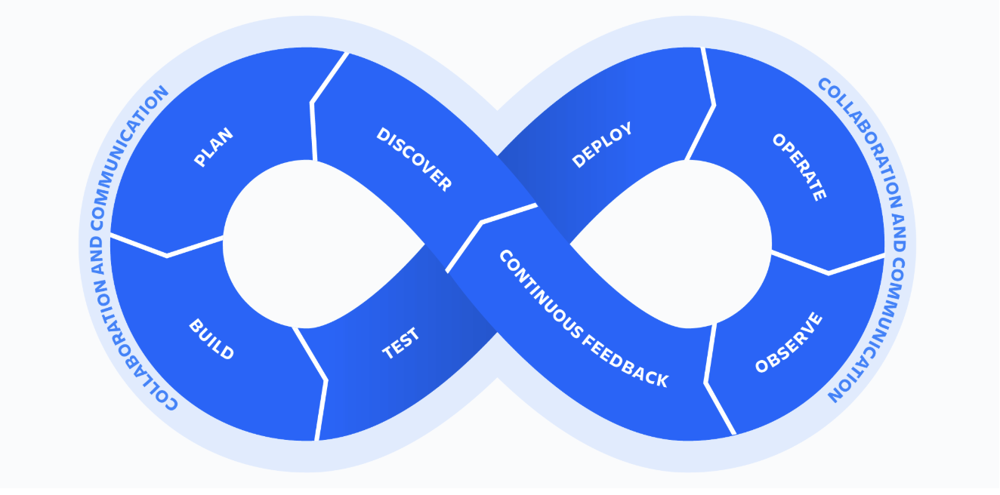

그림 출처: https://www.atlassian.com/ko/devops

> 오늘은 자주 듣지만 명확하게 이게 뭐다! 라고 설명하기 어려웠던 **DevOps** 를 소프트웨어 라이프사이클과 함께 알아보도록 하겠습니다.

## DevOps란?

---

>  DevOps 는 Development(개발) 와 Operations(운영)의 합성어 입니다. 말 그대로 소프트웨어 개발과 운영의 협업과 통합을 목적으로 하는 문화, 철학 또는 방법론을 의미하는 단어입니다. 조직이 소프트웨어의 개발과 배포 과정을 더욱 빠르고 효율적으로 수행할 수 있도록 돕는 것을 목표로 하며 이를 위해 자동화, 지속적 통합 및 배포(CI/CD), 협업 중심의 프로세스 등이 활용됩니다.

즉 개발과 운영의 통합을 의미하는건데 이해를 돕기위해 소프트웨어 라이프사이클 DevOps 8단계를 통해 DevOps에 대해서 좀 더 살펴보겠습니다.

그림 출처: https://www.atlassian.com/ko/devops

- 무한 루프를 나타내는 위 그림의 왼쪽 루프는 개발을 나타내고 오른쪽 루프는 운영을 나타내며 일반적으로 8단계로 구성됩니다. DevOps 8 단계는 소프트웨어 라이프사이클의 주요 단계를 DevOps 관점에서 설명하는 구조입니다.
- `Plan(계획) > Build(빌드) > Test(테스트) > Deploy(배포) > Operate(운영) >Observe(관측) > Continuous FeedBack(지속적 피드백) > Discover(발견) > 다시 Plan(다시 계획)` 각 단계는 소프트웨어 개발, 운영, 개선의 주요 과정을 나타내며, **지속적인 피드백**을 기반으로 점진적인 발전을 목표로 하고있습니다.

## DevOps 8 단계

---

> 이번에는 DevOps 라이프사이클을 구성하는 각 단계별 특징과 주요 도구를 살펴보겠습니다.

### 1. Plan(계획)

- 특징: 소프트웨어의 목표와 요구 사항을 정의하고, 팀의 작업 흐름을 설계
  - 요구사항 수집 및 정의
  - 애자일, 스크럼 등의 방법론을 사용해 작업 분배
  - 프로젝트 일정 수립
- 도구: Jira, Confluence

### 2. Build(빌드)

- 특징: 작성된 소스 코드를 컴파일하고 애플리케이션 실행 파일(패키지) 생성 단계
  - 애플리케이션 패키징
  - CI 파이프라인 실행
- 도구: Maven, Gradle

### 3. Test(테스트)

- 특징: 빌드된 애플리케이션이 의도대로 동작하는지 확인하는 단계로 테스트 자동화 도구를 활용해 품질 보증
  - 자동화된 테스트 도구로 반복 작업 감소
  - 성능 및 보안 테스트
- 도구: Junit, SonarQube, Black Duck

### 4. Deploy (배포)

- 특징: 테스트를 통과한 애플리케이션을 프로덕션 또는 스테이징 환경에 배포
  - 지속적 배포(CD)를 통해 신속한 업데이트
  - Canary 배포, Blue-Green 배포 등의 전략 사용
  - 프로덕션 환경에서의 무중단 배포
- 도구: Kubernetes

### 5. Operate (운영)

- 특징: 배포된 애플리케이션이 안정적으로 실행되도록 관리하고, 최적의 상태를 유지하는 단계
  - 애플리케이션 및 인프라 유지 관리
  - 로그 분석 및 자원 최적화
  - 장애 복구 및 운영 이슈 대응
- 도구: Ansible, Terraform

### 6. Observe (관측)

- 특징: 프로덕션 환경에서 애플리케이션의 상태를 모니터링하고 성능 및 에러 데이터를 수집하는 단계
  - 실시간 로그 분석
  - 성능 메트릭 수집 및 알림 설정
  - 애플리케이션 사용 데이터 기반 개선
- 도구: Prometheus, Grafana, ELK Stack

### 7. Continuous Feedback (지속적 피드백)

- 특징: 운영 및 모니터링 결과를 분석하여, 다음 개발 주기에 반영할 피드백을 제공
  - 사용자 피드백 수집
  - 장애 및 성능 데이터를 기반으로 개선 방안 제안
  - DevOps 프로세스 최적화
- 도구: Grafana

### 8. Discover (발견)

- 특징: 지속적인 개선과 혁신을 위해 새로운 기능과 기술을 모색
  - 트렌드 조사 및 기술 도입 검토
  - 사용자 요구를 반영한 새로운 기능 설계
  - A/B 테스트를 통한 검증

## DevOps의 핵심 원칙

---

- **문화적 변화**
  - 개발자와 운영팀 간의 협업과 신뢰를 기반으로 한 새로운 업무 문화 형성
- **자동화**
  - 빌드, 테스트, 배포 등 반복 작업의 자동화를 통해 시간 절약과 에러 감소
- **지속적 통합 및 배포(CI/CD)**
  - 코드 변경 사항을 지속적으로 통합하고, 자동화된 테스트를 통해 신속하게 배포
- **모니터링과 피드백**
  - 시스템 운영 상태를 실시간으로 모니터링하고, 데이터를 기반으로 개선점을 도출

## 마치며

---

이번 포스팅에서는 DevOps에 대해서 알아보았습니다. DevOps를 한 줄로 정의해보면 `개발과 운영을 연결하여, 지속적 개선과 자동화를 핵심으로 소프트웨어 개발의 속도와 품질을 높이는 문화적 방법론` 이라고 정리할 수 있을것 같습니다. 오늘도 읽어주셔서 감사합니다. ㅎㅎ

## Reference

---

- <https://www.atlassian.com/ko/devops>
