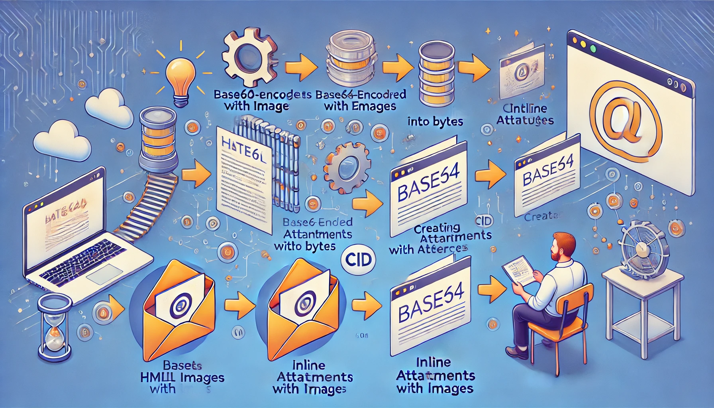

> 프로젝트를 수행하던 중 Base64로 인코딩된 이미지 데이터가 포함된 html Content를 메일로 전송하면, 메일 서버가 보안 및 성능 문제로 인해 `` 태그를 삭제하고 메일을 발송하는 문제가 있었습니다. 이번 포스팅에서는 해당 문제를 해결했던 방법을 공유하겠습니다.

## 시작하기 전에

---

글을 쓰기 전에 저의 경우에는 이미 콘텐츠에 Base64로 인코딩된 데이터가 저장되고 있었지만 html 에서 Base64로 인코딩된 이미지를 사용하는 것은 데이터 크기가 원본 데이터보다 약 33%로 증가하여 html 문서의 전체 크기가 불필요하게 커지기 때문에 비효율적이므로 지양하는 것이 좋습니다.  가능하다면 S3와 같은 외부 스토리지에 저장하고 저장된 이미지의 Public URL을 `` 속성에 삽입하여 활용하는것이 효율적인 방법입니다.


## 기술 스택

---

- Spring Boot 3.3.5
- Java: 17
- 메일 라이브러리: org.apache.commons:commons-email:1.6.0


## 해결 방법

---

- Base64로 인코딩된 데이터를 HTML Content에서 추출 후 Base64 디코딩하여 INLINE 첨부파일로 전환, CID(Content ID) 를 활용해 이미지가 HTML에서 참조될 수 있도록 처리

> **INLINE 첨부방식이란?**
>
> - INLINE 첨부방식은 다운로드가 주 목적인 일반 첨부방식과 달리, HTML 콘텐츠 내부에서 파일을 직접 참조해 렌더링되도록 설정하는 방식입니다. 첨부파일에 `CID(Content ID)`를 부여한 뒤, `` 형태로 HTML에서 참조하므로 별도의 다운로드 없이 이메일 본문에 즉시 표시할 수 있습니다. 다만, 파일이 첨부파일로 포함되기 때문에 이메일 크기가 커질 수 있다는 점은 고려해야 합니다.

## 코드

---

``` java
import org.apache.commons.codec.binary.Base64;
import org.apache.commons.mail.HtmlEmail;
import javax.mail.util.ByteArrayDataSource;
import java.util.regex.Matcher;
import java.util.regex.Pattern;

public class MailHelper {

    // 정규식: Base64 이미지 패턴 추출
    private static final Pattern BASE64_IMAGE_PATTERN = Pattern.compile("src=\"data:(.+?);base64,(.+?)\"");
    private static final String EMAIL_IMAGE_CID_PREFIX = "image";

    /**
     * HTML 콘텐츠에서 Base64 이미지를 추출하고 INLINE 첨부로 변환.
     * 
     * @param content HTML 콘텐츠
     * @param email   HtmlEmail 객체
     * @return CID로 변환된 HTML 콘텐츠
     * @throws Exception 이미지 처리 실패 시 예외 발생
     */
    public String extractAndEmbedImages(String content, HtmlEmail email) throws Exception {
        Matcher matcher = BASE64_IMAGE_PATTERN.matcher(content);
        int imageCounter = 0;

        while (matcher.find()) {
            String mimeType = matcher.group(1);    // 이미지 MIME 타입 (예: image/png)
            String base64Data = matcher.group(2); // Base64 인코딩 데이터

            // Base64 데이터를 디코딩하여 바이트 배열 생성
            byte[] imageBytes = Base64.decodeBase64(base64Data);

            // ByteArrayDataSource 생성
            ByteArrayDataSource dataSource = new ByteArrayDataSource(imageBytes, mimeType);

            // 고유 Content ID 생성
            String contentId = EMAIL_IMAGE_CID_PREFIX + (++imageCounter);

            // HtmlEmail 객체에 첨부파일 추가 (CID 참조 설정)
            email.embed(dataSource, contentId, mimeType);

            // HTML 콘텐츠의  태그를 CID 참조로 변경
            content = content.replace(matcher.group(0), "src='cid:" + contentId + "'");
        }

        return content;
    }
}

```


## 마치며

---

위에 글에서 말씀드렸다시피 html content에 base64 인코딩 데이터를 사용하는 것은 가능하다면 지양하는 것이 좋습니다. <br>읽어주셔서 감사합니다 !


## Reference

---

[Apache Commons Email User Guide](https://commons.apache.org/proper/commons-email/userguide.html)

[HtmlEmail Javadoc](https://javadoc.io/doc/org.apache.commons/commons-email/latest/org/apache/commons/mail/HtmlEmail.html)
