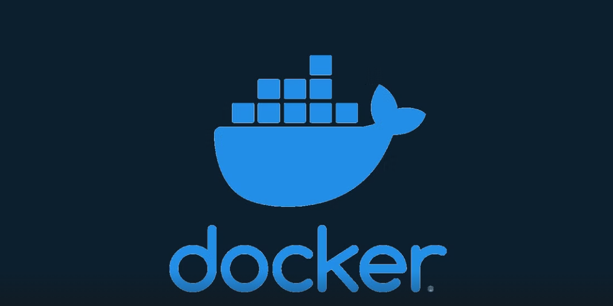
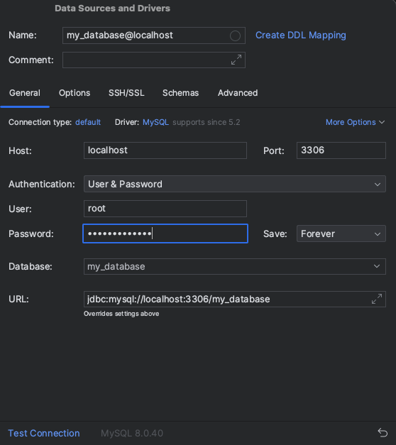
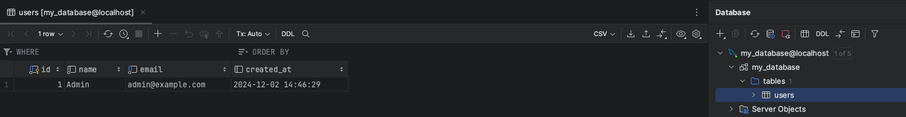

 

이미지출처: https://www.howtogeek.com/devops/how-to-share-docker-images-with-others/

## Dockerfile이란 ?

---

> Dockerfile은 도커 이미지를 생성하기 위한 설정 파일로, 텍스트 명령어를 통해 애플리케이션 환경을 구성하는 과정을 정의합니다. 이를 통해 이미지 빌드 과정을 자동화하고, 일관된 환경을 손쉽게 배포할 수 있습니다.
>
> 이번 포스팅에서는 Dockerfile 작성 방법을 알아보고, 간단한 예제를 통해 직접 이미지를 생성하고 컨테이너를 실행하는 방법을 살펴보겠습니다.

## Dockerfile 특징

---

 > Dockerfile을 작성하기 전, 아래와 같은 특징을 확인하고 가겠습니다.

1. **명령어 대소문자 구분** 
   - Dockerfile은 대소문자를 구별하지 않지만, 인수와 명령어를 쉽게 구별하기 위해 **명령어는 대문자**로 작성하는 것이 관례입니다.

2. **명령어 실행 순서**  
   - Dockerfile의 명령어는 작성된 순서대로 실행됩니다.  
   - 첫 번째 명령어는 반드시 **`FROM`**으로 시작해야 합니다.

3. **주석 처리 지원**  
   - 주석은 **`#`**으로 작성할 수 있습니다.

## Dockerfile 명령어 요약 

---

> Dockerfile에서 제공하는 명령어는 아래와 같습니다. 

| **명령어**        | **설명**                                                     | **예시**                                                     |
| ----------------- | ------------------------------------------------------------ | ------------------------------------------------------------ |
| **`FROM`**        | 베이스 이미지를 지정합니다.                                  | `FROM eclipse-temurin:17-jdk-alpine`                         |
| **`ARG`**         | 빌드 타임 변수를 정의합니다.                                 | `ARG JAR_FILE=target/myapp.jar`                              |
| **`CMD`**         | 컨테이너 실행 시 기본 명령어를 지정합니다.                   | `CMD ["java", "-jar", "/app/myapp.jar"]`                     |
| **`COPY`**        | 로컬 파일/디렉토리를 컨테이너로 복사합니다.                  | `COPY target/myapp.jar /app/myapp.jar`                       |
| **`ENTRYPOINT`**  | 컨테이너 실행 시 항상 실행되어야 할 기본 실행 파일을 지정합니다. | `ENTRYPOINT ["java", "-jar"]`                                |
| **`ENV`**         | 환경 변수를 설정합니다.                                      | `ENV SPRING_PROFILES_ACTIVE=prod`                            |
| **`EXPOSE`**      | 애플리케이션이 수신 대기하는 포트와 프로토콜을 정의합니다.   | `EXPOSE 8080`                                                |
| **`ADD`**         | 로컬 또는 원격 파일/디렉토리를 추가합니다.                   | `ADD https://example.com/config.json /app/config.json`       |
| **`HEALTHCHECK`** | 컨테이너 상태 확인 명령을 정의합니다.                        | `HEALTHCHECK CMD curl -f http://localhost:8080/actuator/health || exit 1` |
| **`LABEL`**       | 이미지에 메타데이터를 추가합니다.                            | `LABEL maintainer="developer@example.com"`                   |
| **`ONBUILD`**     | 부모 이미지에서 빌드 시 실행할 명령을 정의합니다.            | `ONBUILD ADD . /src`                                         |
| **`RUN`**         | 명령어를 실행하여 이미지를 빌드합니다.                       | `RUN apk add --no-cache bash`                                |
| **`SHELL`**       | 명령 실행 시 사용할 기본 셸을 설정합니다.                    | `SHELL ["/bin/bash", "-c"]`                                  |
| **`STOPSIGNAL`**  | 컨테이너 종료를 위한 시스템 호출 신호를 지정합니다.          | `STOPSIGNAL SIGTERM`                                         |
| **`USER`**        | 컨테이너 명령 실행 시 사용할 사용자와 그룹을 설정합니다.     | `USER nonroot`                                               |
| **`VOLUME`**      | 데이터 지속성을 위해 볼륨을 마운트합니다.                    | `VOLUME /data`                                               |
| **`WORKDIR`**     | 컨테이너 내 작업 디렉토리를 변경합니다.                      | `WORKDIR /app`                                               |


## Dockerfile 명령어 상세 설명

---

> 앞서 Dockerfile의 주요 명령어를 표로 간단히 정리했지만, 이번에는 각 명령어의 **옵션**과 **세부 사항**을 자세히 살펴보겠습니다.

### FROM

>  기본으로 사용할 이미지를 설정합니다.

```dockerfile
FROM [--platform=<platform>] <image>[@<digest>] [AS <name>]
```

```dockerfile
# 예시
FROM mysql:8.0
```

- `--platform=<platform>`
  - 멀티아키텍처 지원 이미지를 사용할 경우 플랫폼(예: linux/amd64, linux/arm64)를 명시합니다.
  - 주로 멀티아키텍처 환경에서 정확한 플랫폼을 지정할 때 사용됩니다.

-  `<image>` 
  - 사용할 Docker 이미지 이름을 지정합니다.

-  `@<digest>`
  - 이미지의 버전을 보장할 수 있도록합니다.
  - 기본값: latest 

- `as <name>`
  - 멀티스테이지  빌드에서 사용할 때만 필요합니다.
  - 단일 스테이지 빌드에서는 생략가능


### ARG 

> **빌드 타임 변수**를 정의합니다. 여러 변수를 한줄로 정의 가능합니다.

``` dockerfile
ARG <name>[=<default value>] [<name>[=<default value>]...]
```

```dockerfile
# 예시
ARG APP_VERSION=1.0

COPY myapp-${APP_VERSION}.jar /app/myapp.jar # ${변수명} or $변수명으로 사용 가능
```

- `<name>`: 변수의 이름
-  `=<default value>`: 기본값


### CMD

> 컨테이너 실행 시 사용할 기본 명령어를 지정합니다. 아래 3가지 방식으로 정의 할 수 있습니다. 

#### 방법 1: JSON 배열 형식으로 실행

```dockerfile
CMD ["executable","param1","param2"]
```

```dockerfile
# 예시
CMD ["java", "-jar", "app.jar"]
```

#### 방법 2: Exec 형식 (ENTRYPOINT와 함께 사용)

```dockerfile
CMD ["param1","param2"] # (exec form, as default parameters to ENTRYPOINT)
```

```dockerfile
# 예시
ENTRYPOINT ["java", "-jar"]
CMD ["app.jar"]
```

#### 방법 3: Shell 형식

```dockerfile
CMD command param1 param2 # (shell form)
```

```dockerfile
# 예시
CMD echo "Hello, World!"
```


### COPY

> 로컬 파일/디렉토리를 컨테이너로 복사합니다.

```dockerfile
COPY [OPTIONS] <src> ... <dest>
COPY [OPTIONS] ["<src>", ... "<dest>"]
```

```dockerfile
# 예제
COPY file1.txt file2.txt /usr/src/things/
```

- `<src>`: 복사할 소스 파일 또는 디렉토리 경로, 여러 개 지정 가능

-  `<dest>`: 컨테이너 내에서 파일 또는 디렉토리가 복사될 목적지

-  `OPTIONS`: 복사 동작을 변경하기 위한 선택적 옵션

  -  사용 가능 옵션

    | 옵션            | 설명                                                         | 최소 Dockerfile 버전 |
    | --------------- | ------------------------------------------------------------ | -------------------- |
    | **`--from`**    | 멀티스테이지 빌드에서 이전 빌드 스테이지의 소스를 복사합니다. | 모든 버전            |
    | **`--chown`**   | 파일 또는 디렉토리의 소유자와 그룹을 설정합니다.             | 모든 버전            |
    | **`--chmod`**   | 복사된 파일의 권한을 설정합니다.                             | Docker 1.2 이상      |
    | **`--link`**    | 심볼릭 링크를 그대로 유지하거나 파일로 복사할지 설정합니다.  | Docker 1.4 이상      |
    | **`--parents`** | 소스 경로의 디렉토리 구조를 그대로 보존합니다.               | Docker 1.7-labs 이상 |
    | **`--exclude`** | 복사에서 특정 파일이나 디렉토리를 제외합니다.                | Docker 1.7-labs 이상 |


### ENTRYPOINT 

> 컨테이너 실행 시 항상 실행되어야 할 기본 실행 파일을 지정합니다. 특정 작업에 고정된 동작으로 설정할 때 유용합니다. 아래 2가지 방식으로 정의 할 수 있습니다. 

#### 방법1:  JSON 배열 형식으로 실행

```dockerfile
ENTRYPOINT ["executable", "param1", "param2"]
```

```dockerfile
# 예제
ENTRYPOINT ["ping", "-c", "3"]
```

#### 방법 2: Shell 형식

```dockerfile
ENTRYPOINT command param1 param2
```

```dockerfile
# 예제
ENTRYPOINT ping -c 3
```


### ENV 

> 환경 변수를 설정합니다. `ENV`로 설정한 변수는 빌드 중 뿐만이 아니라 **컨테이너 실행 시에도 유효**하며 여러 변수를 정의할 수 있습니다.

```dockerfile
ENV <key>=<value> [<key>=<value>...]
```

```dockerfile
# 예제
ENV BASE_URL=https://example.com
ENV API_URL=${BASE_URL}/api
```

- `<key>`: 변수 이름
-  `<value>`: 변수에 할당할 값  


### EXPOSE

>애플리케이션이 수신 대기하는 포트 및 프로토콜을 정의합니다

```dockerfile
EXPOSE <port> [<port>/<protocol>...]
```

```dockerfile
# 예제
EXPOSE 80/tcp
EXPOSE 80/udp
```

- `<port>`: 수신 대기 포트 선언
- `<protocol>`: protocol 선언 default 값 TCP
-  `docker run -p 80:80/tcp -p 80:80/udp ...` 와 같이 -p 옵션을 통해서 구성 가능 


 ### ADD 

> `ADD` 명령어는 Dockerfile에서 로컬 파일, 디렉토리 또는 원격 URL의 파일을 컨테이너 파일 시스템으로 복사하는 데 사용됩니다. 추가적으로, 압축 파일을 복사할 경우 자동으로 압축을 해제하는 기능도 제공합니다.

```dockerfile
ADD [OPTIONS] <src> ... <dest>
ADD [OPTIONS] ["<src>", ... "<dest>"]
```

- `<src>`: 복사할 소스 파일 또는 디렉토리 경로, 여러 개 지정 가능

-  `<dest>`: 컨테이너 내에서 파일 또는 디렉토리가 복사될 목적지

-  `OPTIONS`: 복사 동작을 변경하기 위한 선택적 옵션

  - 사용 가능 옵션  

    | **옵션**             | **설명**                                                    | **최소 Dockerfile 버전** |
    | -------------------- | ----------------------------------------------------------- | ------------------------ |
    | **`--keep-git-dir`** | `.git` 디렉토리를 포함하여 복사합니다.                      | 1.1                      |
    | **`--checksum`**     | 소스 파일의 체크섬을 계산하여 변경된 경우에만 복사합니다.   | 1.6                      |
    | **`--chown`**        | 컨테이너 내에서 파일의 소유자와 그룹을 설정합니다.          | 모든 버전                |
    | **`--chmod`**        | 복사된 파일의 권한을 설정합니다.                            | 1.2                      |
    | **`--link`**         | 심볼릭 링크를 그대로 복사하거나 실제 파일로 변환합니다.     | 1.4                      |
    | **`--exclude`**      | 지정된 패턴과 일치하는 파일/디렉토리를 복사에서 제외합니다. | 1.7-labs                 |


### HEALTHCHECK

> `HEALTHCHECK` 명령어는 컨테이너의 상태를 주기적으로 확인하기 위한 명령어를 정의합니다. 이를 통해 컨테이너가 올바르게 동작하고 있는지 확인할 수 있습니다.

```dockerfile
HEALTHCHECK [OPTIONS] CMD command
```

```dockerfile
# 예제 
HEALTHCHECK --interval=5m --timeout=3s 
  CMD curl -f http://localhost/ || exit 1
```

- `OPTION`  

  - 사용가능 옵션

    | 옵션                   | 기본값 | 설명                                                         |
    | ---------------------- | ------ | ------------------------------------------------------------ |
    | **`--interval`**       | `30s`  | 헬스체크 명령 실행 간격을 지정. (예: `10s`, `5m`)            |
    | **`--timeout`**        | `30s`  | 헬스체크 명령 실행의 최대 시간. 초과 시 실패로 간주.         |
    | **`--start-period`**   | `0s`   | 컨테이너 시작 후 헬스체크를 시작하기 전 대기 시간.           |
    | **`--start-interval`** | `5s`   | (실험적) 헬스체크의 재시작 간격을 설정.                      |
    | **`--retries`**        | `3`    | 상태를 `unhealthy`로 전환하기 전에 실패할 수 있는 최대 횟수. |


### LABEL

> 이미지에 메타데이터를 추가합니다. 이미지 작성자, 버전 정보, 라이선스 정보 등과 같은 부가적인 정보를 정의할 수 있습니다.

``` dockerfile
LABEL <key>=<value> [<key>=<value>...]
```

```dockerfile
# 예제
LABEL "com.example.vendor"="ACME Incorporated"
LABEL com.example.label-with-value="foo"
LABEL version="1.0"
LABEL description="This text illustrates 
that label-values can span multiple lines."
```

- `<key>`: 메타데이터의 이름.
-  `<value>`: 메타데이터에 해당하는 값.
-  여러 개의 키-값 쌍을 한 줄에 정의하거나 여러 줄로 나눌 수 있음.


### ONBUILD

> `ONBUILD` 명령어는 부모 이미지를 기반으로 새로운 이미지를 빌드할 때 실행될 **트리거 명령**을 정의합니다. 이는 부모 이미지를 사용하는 자식 이미지에서만 실행되며, 부모 이미지 빌드 시에는 실행되지 않습니다.

``` dockerfile
ONBUILD <INSTRUCTION>
```

```dockerfile
# 예제
ONBUILD ADD . /app/src
ONBUILD RUN /usr/local/bin/python-build --dir /app/src
```

- `<INSTRUCTION>`: 실행할 Dockerfile 명령어
  - ex) `ADD`, `RUN`, `COPY`


### RUN

> 이미지 빌드 중에 명령어를 실행하는 데 사용됩니다. 이 명령으로 소프트웨어 설치, 파일 구성, 애플리케이션 빌드 등의 작업을 수행할 수 있습니다. 작성 방법은 아래 두 가지 방법이 있습니다.

#### 방법 1: Shell 형식: 직관적이고 쉘 명령 실행에 적합

``` dockerfile
# Shell form:
RUN [OPTIONS] <command> ...
```

```dockerfile
# 예제
RUN apt-get update && apt-get install -y curl
```

- 셸(/bin/sh -c) 를 통해 실행 `&&` 로 명령어 연결 

#### 방법 2: Exec 형식: 안전하고 복잡한 명령어 실행에 유리

```dockerfile
# Exec form:
RUN [OPTIONS] [ "<command>", ... ]
```

``` dockerfile
# 예제
RUN ["apt-get", "update"]
```

- 셸(/bin/sh) 을 거치지 않고 직접 실행 

  -  사용가능 옵션

      | 옵션             | 설명                                                         | 최소 Dockerfile 버전 |
      | ---------------- | ------------------------------------------------------------ | -------------------- |
      | **`--mount`**    | 캐시나 임시 파일 시스템을 명령어 실행 중 사용할 수 있도록 설정. | 1.2                  |
      | **`--network`**  | 명령어 실행 시 사용할 네트워크 모드를 설정. (예: `default`, `none`, `host`, `bridge`) | 1.3                  |
      | **`--security`** | 명령어 실행 시 보안 옵션을 설정. (예: `insecure`, `sandbox`) | 1.1.2-labs           |

  -  Shell 형식과 Exec 형식 차이점   

      | **특성**               | **Shell 형식**                   | **Exec 형식**                     |
      | ---------------------- | -------------------------------- | --------------------------------- |
      | **구문**               | `RUN apt-get update`             | `RUN ["apt-get", "update"]`       |
      | **실행 방식**          | `/bin/sh -c`를 통해 실행         | 명령어가 직접 실행됨              |
      | **복잡한 명령어 처리** | 단일 문자열로 작성 가능          | JSON 배열로 작성해야 함           |
      | **사용 사례**          | 간단한 작업이나 쉘 스크립트 실행 | 안전하고 명확한 명령 실행 필요 시 |


### SHELL

> 사용할 기본 셸을 지정합니다. 기본적으로 Linux 기반 이미지는 `/bin/sh`, Windows 기반 이미지는 `cmd.exe`를 기본 셸로 사용합니다.   `SHELL`을 사용하면 기본 셸을 변경하거나 특정 명령어 실행 방식을 정의할 수 있습니다.

```dockerfile
SHELL ["executable", "parameters"]
```

```dockerfile
# 예제
FROM microsoft/windowsservercore

# Executed as cmd /S /C echo default
RUN echo default

# Executed as cmd /S /C powershell -command Write-Host default
RUN powershell -command Write-Host default

# Executed as powershell -command Write-Host hello
SHELL ["powershell", "-command"]
RUN Write-Host hello

# Executed as cmd /S /C echo hello
SHELL ["cmd", "/S", "/C"]
RUN echo hello
```

- `executable`: 사용할 셸 실행 파일. (예: `/bin/bash`, `powershell`)
-  `parameters`: 셸 실행 시 사용할 인자.
-  만일 위 예제와 같이 `SHELL` 이 여러번 등장하는 경우 맨 마지막 명령어만 수행됩니다.


### STOPSIGNAL

> 컨테이너를 종료할 때 사용할 **시스템 호출 신호(Signal)**를 정의합니다. 이 명령어를 사용하면 컨테이너 종료 시 실행 중인 프로세스가 신호를 받아 적절히 종료될 수 있도록 제어할 수 있습니다.

```dockerfile
STOPSIGNAL signal
```

- `signal`: 종료 시 컨테이너로 보낼 시스템 호출 신호.
  -  신호 이름(e.g., `SIGTERM`, `SIGKILL`) 또는 숫자 값(e.g., `15`, `9`)으로 지정 가능.
    -  `SIGTERM`: Ctrl+C와 유사한 인터럽트 신호로 프로세스가 정상적으로 종료할 기회를 가집니다.
    -  `SIGKILL`: 강제 종료 신호로 즉시 강제 종료됩니다.
- 프로세스가 정의된 시간(기본: 10초) 내에 종료하지 않으면 `SIGKILL`  신호를 강제로 전송합니다. 


### USER

>컨테이너 내 명령어 실행 시 사용할 **사용자(User)**와 **그룹(Group)**을 설정하는 데 사용됩니다. 이는 보안 강화를 위해 권장되며, 기본적으로 컨테이너 명령은 **root 사용자**로 실행됩니다.

```dockerfile
USER <user>[:<group>]
# or
USER <UID>[:<GID>]
```

```dockerfile
# 예제
FROM ubuntu:20.04

# 새로운 사용자 추가 - appuser
RUN useradd -m appuser

# 사용자 변경 - 이후 모든 명령은 appuser로 실행
USER appuser

CMD ["echo", "Hello from appuser"]
```

- `<user>`: 사용자 이름.
-  `<group>`: 그룹 이름. (선택 사항)
-  `<UID>`: 사용자 ID.
-  `<GID>`: 그룹 ID.


### VOLUME

>컨테이너 내 특정 디렉토리를 **호스트 머신**이나 **외부 스토리지**에 마운트하여 **데이터 지속성**을 보장합니다. 이를 통해 컨테이너가 삭제되어도 데이터가 유지되도록 설정할 수 있습니다.

```dockerfile
VOLUME ["/data", "/logs"]
```


### WORKDIR

> 컨테이너 내 작업 디렉토리를 변경합니다. `RUN`, `CMD`, `ENTRYPOINT`, `COPY`, `ADD` 에 대한 작업 디렉터리 설정을 합니다. `WORKDIR`가 존재하지 않더라도 후속 Dockerfile 명령어에 사용되면 디렉터리가 생성됩니다.

```dockerfile
WORKDIR /path/to/workdir
```

```dockerfile
# 예제 1
WORKDIR /a
WORKDIR b
WORKDIR c
RUN pwd
```

- `WORKDIR`는 여러번 설정될 수 있으며 위와 같은 경우 `pwd`의 결과는 `/a/b/c` 가 됩니다.

```dockerfile
# 예제 2
ENV DIRPATH=/path
WORKDIR $DIRPATH/$DIRNAME
RUN pwd
```


## 비슷한 명령어들 차이점 정리

---

> 위와 같이 정리해보니 `실행 명령(CMD, RUN, ENTRYPOINT)` `설정 변수 명령(ENV, ARG)` 등 비슷해 보이는 명령어들이 많아 보입니다. 좀 더 명확하게 파악하기 위해 개인적으로 비슷하다고 느꼈던 명령어들을 정리해 보았습니다.

### 실행 명령: CMD vs RUN vs ENTRYPOINT

| 명령어           | 목적                                                       | 실행 시점          | 덮어쓰기 가능 여부                    |
| ---------------- | ---------------------------------------------------------- | ------------------ | ------------------------------------- |
| **`CMD`**        | 컨테이너 실행 시 기본으로 실행할 명령을 정의.              | 컨테이너 실행 시점 | `docker run` 명령의 인자로 대체 가능. |
| **`RUN`**        | 이미지 빌드 과정에서 명령을 실행하여 결과를 이미지에 포함. | 이미지 빌드 시점   | 변경 불가능.                          |
| **`ENTRYPOINT`** | 컨테이너 실행 시 고정적으로 실행해야 하는 명령을 정의.     | 컨테이너 실행 시점 | `CMD`와 조합하여 인자만 변경 가능.    |

#### 예제

```dockerfile
# CMD: 기본 실행 명령
CMD ["echo", "Hello World"]

# RUN: 빌드 시 명령 실행
RUN apt-get update && apt-get install -y curl

# ENTRYPOINT: 고정 실행 명령
ENTRYPOINT ["echo"]
CMD ["Hello World"]
```


### 변수 명령: ENV vs ARG

| 명령어    | 목적                                       | 범위                           | 런타임 변경 가능 여부                  |
| --------- | ------------------------------------------ | ------------------------------ | -------------------------------------- |
| **`ENV`** | 컨테이너 내부에서 사용할 환경 변수를 설정. | 빌드 및 런타임 모두 사용 가능. | `docker run -e`로 런타임 값 변경 가능. |
| **`ARG`** | 빌드 시 사용할 변수 값을 설정.             | 빌드 시점에만 유효.            | `docker build --build-arg`로 값 전달.  |

#### 예제

```dockerfile
# ARG: 빌드 시 전달 가능
ARG APP_VERSION=1.0
RUN echo "Building version $APP_VERSION"

# ENV: 빌드 및 런타임 사용 가능
ENV APP_ENV=production
CMD ["echo", "Environment is $APP_ENV"]
```


### 파일 추가 명령: ADD vs COPY 

| 명령어     | 목적                                             | 추가 기능                      | 권장 사용                              |
| ---------- | ------------------------------------------------ | ------------------------------ | -------------------------------------- |
| **`ADD`**  | 파일 복사 및 URL 다운로드, 압축 파일 해제.       | 원격 URL 복사, 압축 해제 지원. | 고급 기능(URL, 압축 해제)이 필요할 때. |
| **`COPY`** | 단순히 로컬 파일이나 디렉토리를 컨테이너로 복사. | 없음.                          | 단순 복사 시 권장.                     |

#### 예제

```dockerfile
# ADD: URL에서 파일 다운로드
ADD https://example.com/config.tar.gz /app/

# COPY: 단순 파일 복사
COPY ./src /app/src
```


## .dockerignore 

---

> `.dockerignore` 파일은 `.gitignore` 처럼 제외할 디렉토리 또는 파일을 제외할때 작성됩니다. Docker에서 이미지를 빌드할 때 빌드 컨텍스트에 포함하지 않을 파일이나 디렉토리를 지정하는 데 사용됩니다. 이를 통해 Docker 이미지를 더 작게 유지할 수 있고 불필요한 파일로 인한 보안 이슈를 해결할수 있습니다. 

### 예제 

```dockerfile
# 빌드에 포함하지 않을 디렉토리
node_modules/
logs/
temp/
build/

# 특정 파일 제외
*.log
*.tmp

# Dockerfile과 .dockerignore 자체는 포함
!Dockerfile
!.dockerignore

# Git 관련 파일 제외
.git
.gitignore

# IDE 및 에디터 임시 파일 제외
*.swp
.idea/
.vscode/
*.bak
*.tmp
```


## Dockerfile을 통한 이미지 build

---

> Dockerfile을 기반으로 이미지를 생성하려면 `docker build` 명령어를 사용하며 Dockerfile이 위치한 디렉토리에서 실행해야 합니다. 관련해서 더 자세한 내용은 [Docker 공식 문서](https://docs.docker.com/get-started/docker-concepts/building-images/build-tag-and-publish-an-image/)를 참고하세요.

```bash
docker build -t [HOST[:PORT_NUMBER]/]PATH[:TAG] .
```

- `HOST[:PORT_NUMBER]`: 레지스트리 서버와 포트 지정 (예: `myregistry.example.com:5000`).  
- 호스트가 지정되지 않으면 기본적으로 `docker.io`  인 Docker의 공개 레지스트리가 사용됩니다. 
- `PORT_NUMBER`: 호스트 이름이 제공된 경우 레지스트리의 포트 번호를 지정합니다.
- `PATH`: 구성된 이미지 경로  
  - Docker Hub의 경우 다음과 같은 형식을 따르며`[NAMESPACE/]REPOSITORY` 여기서 namespace는 사용자 또는 조직의 이름이고 지정되지 않으면 `library` 의 네임스페이스가 사용됩니다. 

- `TAG`: 이미지의 다른 버전이나 변형을 식별하는 데 사용되는 식별자 입니다. 태그가 지정되지 않으면 `latest`로 지정됩니다. 


### 레지스트리 푸시 

> 레지스트리에 올리고 싶으면 아래와 같이 `docker push` 명령어를 사용하면 됩니다.

```bash
docker push my-username/my-image
```


## 예제

---

> 이번 예시에서는 간단한 dockerfile을 작성을 통해 mysql 이미지를 생성해보고 실행해보겠습니다. 

### mysql dockerfile 

> docker 26.0.0
>
>  mysql latest  

### init.sql

```sql
-- init.sql
CREATE DATABASE IF NOT EXISTS my_database;
USE my_database;

CREATE TABLE IF NOT EXISTS users (
    id INT AUTO_INCREMENT PRIMARY KEY,
    name VARCHAR(50) NOT NULL,
    email VARCHAR(100) NOT NULL UNIQUE,
    created_at TIMESTAMP DEFAULT CURRENT_TIMESTAMP
);

INSERT INTO users (name, email) VALUES ('Admin', 'admin@example.com');
```

#### dockerfile

- 위 `init.sql` 파일은 Docker 이미지를 빌드할 때 초기 테이블과 데이터를 생성하기 위해 실행됩니다.

### Dockerfile

``` dockerfile
# MySQL 기본 이미지 사용
FROM mysql:8.0

# 환경 변수 설정
ENV MYSQL_ROOT_PASSWORD=root_password
ENV MYSQL_DATABASE=my_database
ENV MYSQL_USER=my_user
ENV MYSQL_PASSWORD=my_password

# 초기화 SQL 스크립트 복사 mysql 공식 이미지는 /docker-entrypoint-initdb.d 디렉토리에 있는 sql 스크립트나 쉘 스크립트를 초기화 과정에서 자동으로 실행
COPY init.sql /docker-entrypoint-initdb.d/

# 데이터 저장 디렉토리 볼륨 설정
VOLUME /var/lib/mysql

# 기본 포트 노출
EXPOSE 3306

# 기본 실행
CMD ["mysqld"]
```

- **`FROM mysql:8.0`**
  - MySQL 8.0을 기반 이미지로 사용합니다.

- **환경 변수 설정 (`ENV`)**

  - `MYSQL_ROOT_PASSWORD`: MySQL root 사용자 비밀번호를 설정합니다.

  - `MYSQL_DATABASE`: 컨테이너 실행 시 생성할 기본 데이터베이스 이름을 지정합니다.

  - `MYSQL_USER` 및 `MYSQL_PASSWORD`: 생성할 일반 사용자의 이름과 비밀번호를 설정합니다.

- **초기화 SQL 복사 (`COPY`)**

  - `init.sql` 파일을 MySQL 이미지의 `/docker-entrypoint-initdb.d/` 디렉토리로 복사합니다.

  - MySQL은 해당 디렉토리에 있는 모든 스크립트를 초기화 단계에서 자동으로 실행합니다.

- **데이터 저장 볼륨 (`VOLUME`)**
  - `/var/lib/mysql` 경로를 호스트와 공유해 데이터가 영구 저장되도록 설정합니다.

- **포트 노출 (`EXPOSE`)**
  - MySQL 기본 포트인 `3306`을 외부에 노출합니다.

- **기본 실행 명령어 (`CMD`)**
  - 컨테이너가 시작되면 MySQL 서버(`mysqld`)가 실행됩니다.

### 이미지 build

```bash
docker build -t my-mysql-image .
```

- Dockerfile이 위치한 디렉토리에서 실행해주세요
- 뒤에 `.` 은 현재 디렉토리에서 실행할 것을 의미합니다

### 이미지 build 됐는지 확인

```bash
docker images
```

- 결과: 아래처럼 이미지가 있다면 성공 입니다.

  - ```bash
    ➜  Dockerfile-example docker images
    REPOSITORY       TAG       IMAGE ID       CREATED          SIZE
    my-mysql-image   latest    e180b768d253   53 seconds ago   608MB
    ```

### 컨테이너에서 이미지 실행

```bash
docker run -d --name mysql-container -p 3306:3306 my-mysql-image
```


### 결과

> 저는 IntelliJ datagrip을 활용하여 db에 연결하고 table과 데이터가 정상적으로 생성됐는지 확인하였습니다.





## 마치며

---

이번 포스팅에서는 Dockerfile 작성에 사용되는 명령어들을 알아보고 mysql 이미지를 생성하여 실행해보았습니다. 다음 포스팅에서는 여러 개의 컨테이너로 구성된 애플리케이션을 단일 YAML 파일(`docker-compose.yml`)로 설정하고, 한 번의 명령어로 여러 컨테이너를 동시에 실행, 종료, 관리할 수 있게 해주는 **Docker Compose**에 대해 알아보겠습니다. <br>감사합니다.  


## Reference

---

- <https://docs.docker.com/reference/dockerfile/#dockerfile-examples> 
