 

>로컬 환경에서 **ELK 스택 설정** 실습 중 **클러스터**가 필요하여, 간단하게 **Minikube**를 설치하고 설정하는 과정을 정리하였습니다. 로컬에서 Kubernetes 클러스터를 세팅하고, 간단한 예제를 통해 Minikube의 사용법을 알아보겠습니다.

## Minikube란?

---

> Minikube란 Kubernetes를 쉽게 배우고 개발할 수 있도록 하는 로컬 Kubernetes입니다. Docker 컨테이너나 가상 머신 환경만 있으면 Kubernetes를 `minikube start`  명령을 통해 사용할 수 있습니다. - [minikube Docs](https://minikube.sigs.k8s.io/docs/)<br>
>
> Minikube는 **로컬 환경**에서 **Kubernetes 클러스터**를 빠르고 쉽게 실행할 수 있도록 도와주는 도구입니다. 일반적으로 Kubernetes는 복잡한 환경에서 실행되지만, **개발**이나 **테스트 단계**에서는 간단한 클러스터가 필요합니다. Minikube는 **경량화된 싱글 노드 Kubernetes 클러스터**를 제공하여 개발자가 로컬에서 클러스터를 실행하고 애플리케이션을 배포할 수 있도록 지원합니다.

## 필요사항

---

- CPU: 2개 이상
- 메모리: 2GB 이상
- 디스크 공간: 20GB 이상
- 인터넷 연결
- 가상 머신 또느 컨테이너 매니저
  - [Docker](https://minikube.sigs.k8s.io/docs/drivers/docker/)
  - [QEMU](https://minikube.sigs.k8s.io/docs/drivers/qemu/)
  - [Hyperkit](https://minikube.sigs.k8s.io/docs/drivers/hyperkit/)
  - [Hyper-V](https://minikube.sigs.k8s.io/docs/drivers/hyperv/),
  - [KVM](https://minikube.sigs.k8s.io/docs/drivers/kvm2/)
  - [Parallels](https://minikube.sigs.k8s.io/docs/drivers/parallels/)
  - [Podman](https://minikube.sigs.k8s.io/docs/drivers/podman/)
  - [VirtualBox](https://minikube.sigs.k8s.io/docs/drivers/virtualbox/)
  - [VMware Fusion/Workstation](https://minikube.sigs.k8s.io/docs/drivers/vmware/)

## 설치하기

---

> 저는 Mac OS 환경에서 hombrew를 사용하여 minikube를 설치해보도록 하겠습니다.
>
> 다운로드 경로: <https://minikube.sigs.k8s.io/docs/start/?arch=%2Fmacos%2Farm64%2Fstable%2Fbinary+download>

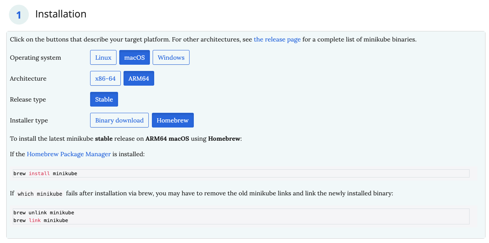

```bash
brew install minikube
```


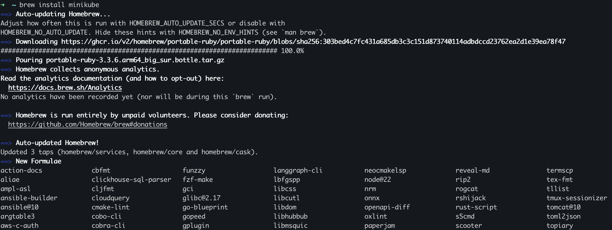


## 실행

---

> 설치가 완료되었으면 실행해보겠습니다. 이때 저는 docker 드라이버를 사용하였습니다. 실행 전 Docker를 실행해주세요!

```bash
minikube start
```

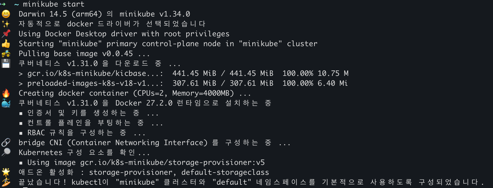

## 실행 확인

---

> 전체 네임스페이스의 Pod 정보를 조회하는 명령어를 통해 정상적으로 클러스터가 실행됐는지 확인해보겠습니다.

```
kubectl get po -A
```

- `kubectl`: Kubernetes 클러스터를 관리하기 위한 CLI 도구
- `get`: Kubernetes 리소스 조회를 위한 명령어
- `po`: Pod의 약자
- `-A`: --all-namespaces의 축약형 옵션으로, 모든 네임스페이스에 있는 리소스를 조회합니다.

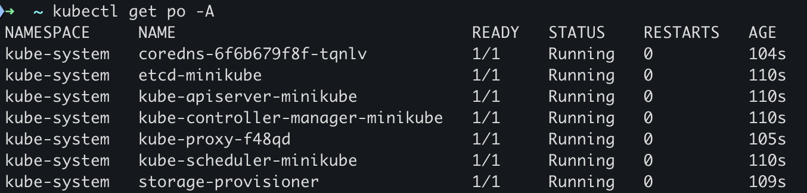

## minikube dashboard

---

> Minikube는 **Kubernetes 대시보드**를 GUI 형태로 제공합니다. 아래 명령어를 통해 dashboard를 실행해줍시다.

```bash
minikube dashboard
```

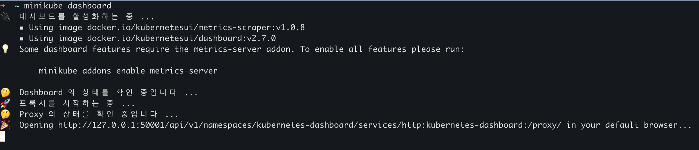

- Opening http에 출력된 url 로 들어가면 아래와 같이 minikube dashboard가 나오는 것을 확인할 수 있습니다. 현재는 실행 중인 deployment, pod, replica set이 없지만 아래 Application 배포 예제를 통해 Service를 배포하고 대시보드 상태가 변하는 것을 확인해 보겠습니다.

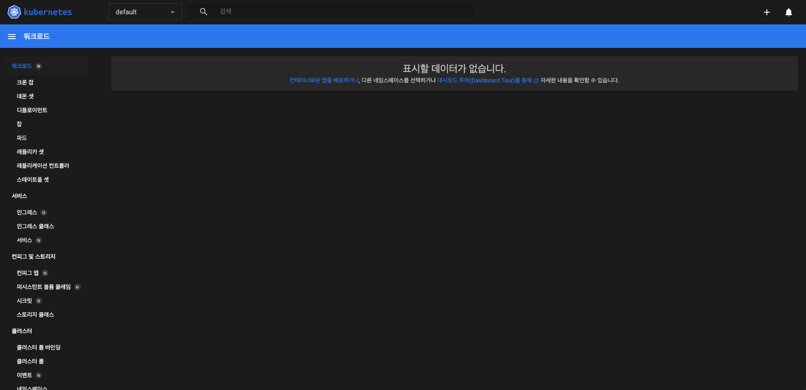


## Application 배포

---

> [minikube Docs](https://minikube.sigs.k8s.io/docs/start/?arch=%2Fmacos%2Farm64%2Fstable%2Fhomebrew#Service) 샘플 예제를 통해 Service를 배포해 보겠습니다. 추가적으로 해당 가이드에 LoadBalncer와 Ingress 예제도 있으니 참고하시면 좋을 것 같습니다.

### 1. Deployment 생성

```bash
kubectl create deployment hello-minikube --image=kicbase/echo-server:1.0
```

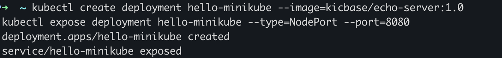

### 2. Deployment를 Service로 노출 (NodePort 방식, 포트 8080)

```bash
kubectl expose deployment hello-minikube --type=NodePort --port=8080
```

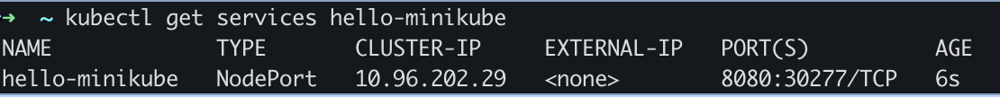

### 3. Service 접근

> 서비스 접근 방식은 Minikube를 통해 브라우저에서 바로 접근하는 방식과 `kubectl post-forward` 명령어를 통해 로컬 포트를 Minikube 서비스의 포트와 연결할 수 있는 방법 두 가지가 있습니다.

#### 3-1. Minikube 를 통해 접근

```
minikube service hello-minikube
```

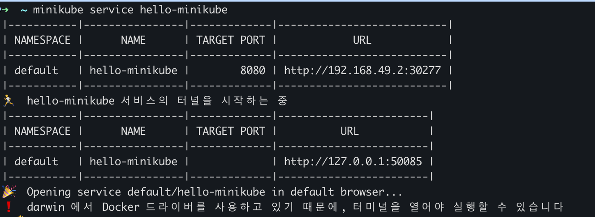

#### 3-2. kubectl을 사용하여 포트 전달하기

```bash
kubectl port-forward service/hello-minikube 7080:8080
```

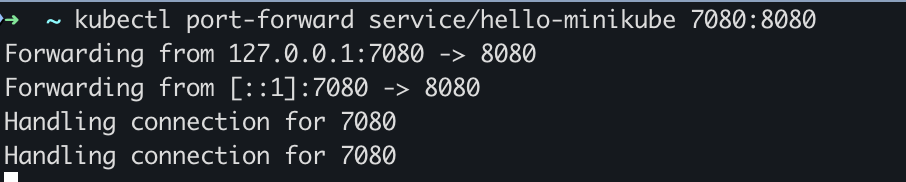

- <http://localhost:7080> 을 접근하여 서비스가 실행된것을 확인해봅시다.

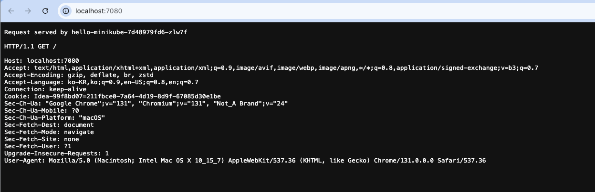

- minikube dashboard 변화 확인

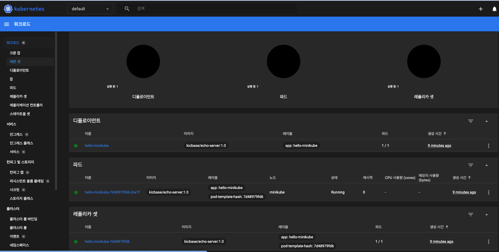


## Minikube 명령어

---

| **기능**                          | **명령어**                                                   | **설명**                                                     |
| --------------------------------- | ------------------------------------------------------------ | ------------------------------------------------------------ |
| **클러스터 시작**                 | `minikube start`                                             | Minikube 클러스터를 시작합니다.                              |
| **Kubernetes 대시보드 실행**      | `minikube dashboard`                                         | Minikube 클러스터의 Kubernetes 대시보드를 실행합니다.        |
| **애플리케이션 배포**             | `kubectl create deployment hello-minikube --image=kicbase/echo-server:1.0` | `hello-minikube`라는 Deployment를 생성하고 이미지를 배포합니다. |
| **서비스 노출(NodePort)**         | `kubectl expose deployment hello-minikube --type=NodePort --port=8080` | 배포된 Deployment를 NodePort 서비스로 노출하여 접근 가능하게 합니다. |
| **서비스 브라우저에서 열기**      | `minikube service hello-minikube`                            | 노출된 서비스를 브라우저에서 자동으로 엽니다.                |
| **클러스터 업그레이드**           | `minikube start --kubernetes-version=latest`                 | Kubernetes 클러스터를 최신 버전으로 업그레이드합니다.        |
| **두 번째 클러스터 시작**         | `minikube start -p cluster2`                                 | `cluster2`라는 이름으로 두 번째 클러스터를 시작합니다.       |
| **클러스터 일시 중지**            | `minikube pause`                                             | 현재 실행 중인 클러스터를 일시 중지합니다.                   |
| **클러스터 재개**                 | `minikube unpause`                                           | 일시 중지된 클러스터를 재개합니다.                           |
| **클러스터 중지**                 | `minikube stop`                                              | 클러스터를 중지하고 모든 리소스를 해제합니다.                |
| **클러스터 삭제**                 | `minikube delete`                                            | Minikube 클러스터를 삭제합니다.                              |
| **모든 클러스터 및 프로필 삭제**  | `minikube delete --all`                                      | 모든 Minikube 클러스터와 프로필을 삭제합니다.                |
| **메모리 설정 변경**              | `minikube config set memory 9001`                            | 클러스터의 메모리 설정을 변경합니다. (단위: MB) **재시작 필요** |
| **애드온 목록 보기**              | `minikube addons list`                                       | 설치 가능한 Kubernetes 애드온 목록을 확인합니다.             |
| **특정 Kubernetes 버전으로 실행** | `minikube start -p aged --kubernetes-version=v1.16.1`        | 지정된 Kubernetes 버전으로 두 번째 클러스터를 생성합니다.    |


## 마치며

---

> 이번 포스팅에서는 **Minikube 설치 및 실행**을 통해 클러스터를 시작하고, 간단한 예제 서비스를 배포해 확인해 보았습니다.
>
> 다음 포스팅에서는 **Minikube 클러스터에 ELK 스택**을 구성하는 방법을 다루겠습니다.
>
> 감사합니다.

## Reference

---

<https://minikube.sigs.k8s.io/docs/start/?arch=%2Fmacos%2Farm64%2Fstable%2Fbinary+download>
