> 오늘은 Spring Boot 를 활용하여 **멀티 모듈 프로젝트**를 구성하는 방법에 대해서 알아보겠습니다.

## 멀티 모듈 프로젝트란?

>멀티 모듈(Multi module) 프로젝트란 하나의 프로젝트를 기능별 또는 관심사별로 모듈화하여 프로젝트를 관리하는 방식입니다. 멀티 모듈 방식을 통해 대규모 애플리케이션에서 코드 재사용성과 유지보수성을 높이는데 효과적입니다.
>
>**장점**
>
>- 각 모듈이 독립적으로 동작할 수 있어 코드 중복을 줄이고 공통 기능(common)을 모듈로 분리해 다른 모듈에서 재사용할 수 있습니다.
>- 팀 협업이 용이해져 팀원들이 서로 다른 모듈을 개발하거나 수정할 때 충돌 가능성을 줄일 수 있습니다.
>- 향후 MSA로 확장하기에도 용이한 구조를 제공합니다.
>
>자 그럼 멀티 모듈 프로젝트를 구성하는 방법에 대해서 실습해보도록 하겠습니다.


## 실습 디렉토리 구조

---

> 저는 아래와 같이 4개의 모듈로 프로젝트를 구성할 계획입니다.
>
> 특이한 점은 각 모듈의 디렉토리 구조에서 **상위에 `multimodule` 디렉토리**가 포함되어 있다는 점입니다. 의존성을 주입하는 다양한 방법이 있지만, 저는 `basePackage`를 `com.example.multimodule`로 맞춰주면서 **`@ComponentScan`을 더 쉽게 구성**할 수 있도록 하기 위함입니다. 이러한 구조를 통해 모듈 간 의존성 관리를 명확히 하고, 공통 설정 및 로직을 간편하게 관리할 수 있습니다.

``` 
spring-multi-module-example/
├── module-common/
│   ├── src/main/java/com/example/multimodule/common/
│   └── build.gradle
├── module-api/
│   ├── src/main/java/com/example/multimodule/api/
│   └── build.gradle
├── module-storage/
│   ├── module-jpa/                # JPA 관련
│   │   ├── src/main/java/com/example/multimodule/storage/jpa/
│   │   └── build.gradle
│   └── build.gradle
├── module-infra/
│   ├── module-s3/                 # S3 관련
│   │   ├── src/main/java/com/example/multimodule/infra/s3/
│   │   └── build.gradle
│   └── build.gradle
└── build.gradle

```

- **module-common**
  - 역할
    - 공통적으로 사용되는 유틸리티 클래스, 공통 상수, 예외 처리, DTO
    - 모든 모듈에서 참조 가능
  - example
    - 공통 Response 개체 (ApiResponse 클래스)
    - Custom Exception 클래스 (BizException 클래스)
    - Logging 및 Validation 관련 유틸리티
- **module-api**
  - 역할
    - API 요청을 처리하고, Controller 및 Service 계층을 포함
    - 주로 클라이언트와 직접적으로 소통하는 역할
  - example
    - Rest API Controller
    - API 요청/응답을 위한 DTO
    - Service 계층과의 인터페이스
- **module-storage**
  - 역할
    - 외부 시스템과의 통합 및 인프라 관련 로직을 관리
    - 파일 스토리지, 메시지 큐, 외부 API 호출 등 기술적인 구현 세부 사항 포함
  - example
    - AWS S3 또는 Azure Blob과 같은 스토리지 연동 코드
    - Kafka, RabbitMQ등의 메시지 브로커 설정
    - 외부 API 통신 (예: HTTP Client)

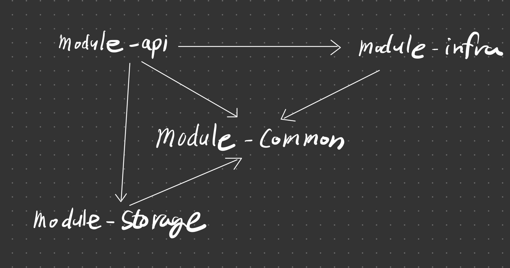

그럼 위의 그림과 같은 의존성을 갖게됩니다. 글씨를 잘 못써서 이해해주세요..ㅎㅎ

- `module-api` -> `module-common`, `module-storage`
- `module-storage` -> `module-common`
- `module-infra` -> `module-common`, `module-storage`

## 실습 환경

---

> - **운영체제**: Mac OS
> - **프레임워크**: Spring Boot 3.4.1
> - **Java 버전**: Java 17
> - **빌드 도구**: Gradle (Groovy DSL)
> - **프로젝트 구조**: Multi Module
> - **IDE**: IntelliJ IDEA


## 프로젝트 생성 및 루트 프로젝트 설정

---

> 이제 intellij 를 통해 root project를 생성하고 설정해보겠습니다.

### 프로젝트 생성

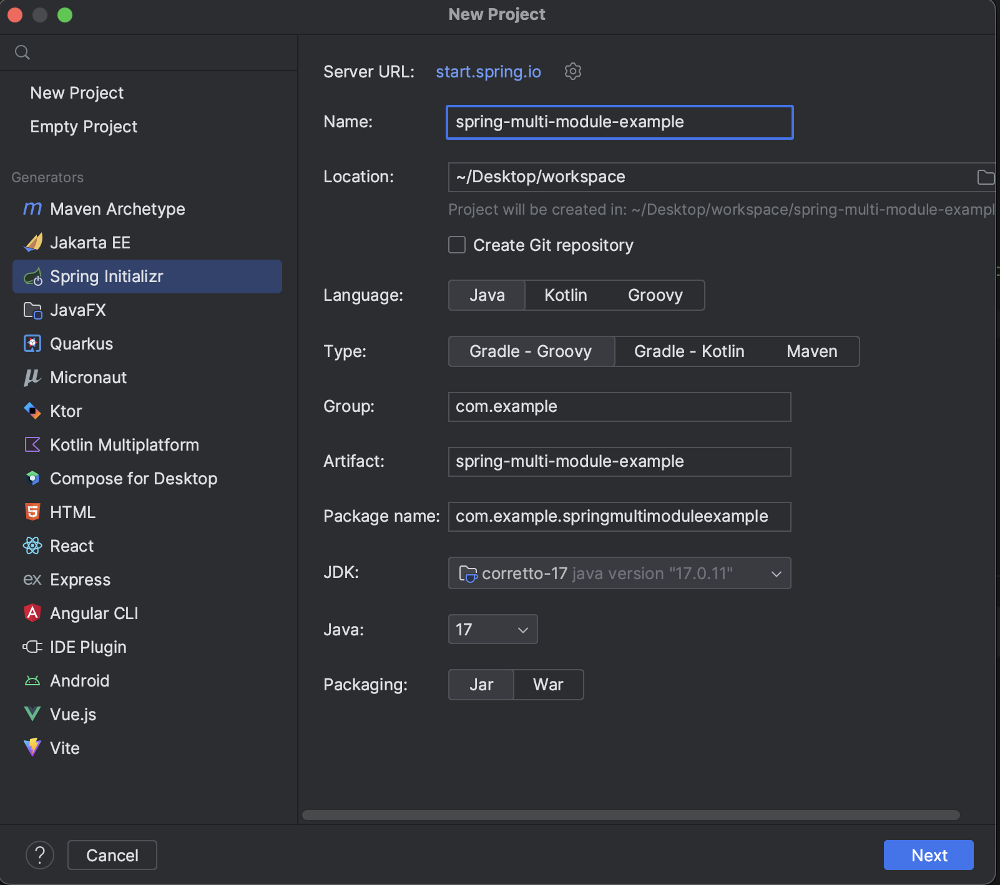

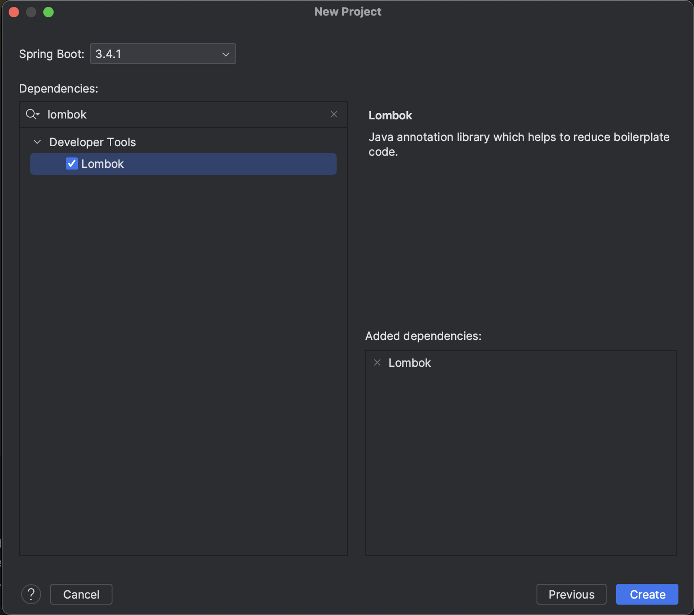

- subproject에서 모두 lombok을 사용 가능하게 할 거라 lombok 정도만 포함하도록 하겠습니다.

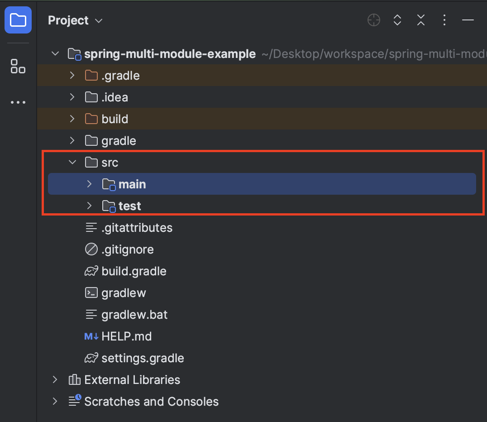

- 루트 프로젝트에서는 `src`가 필요없으니 시원하게 날려줍니다.

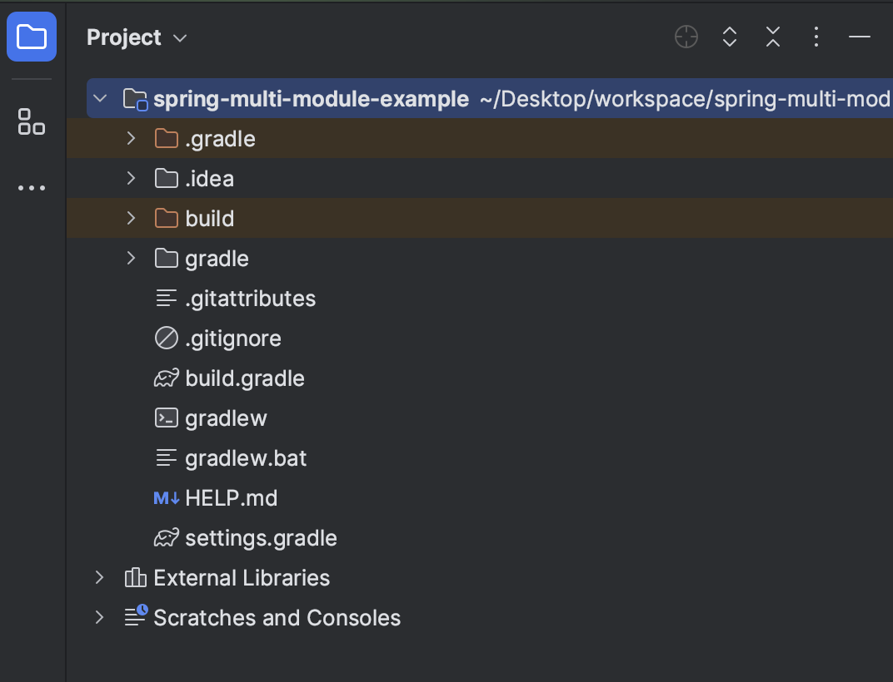

### build.gradle

> root project의 build.gradle 을 설정해줍시다. 자세한 설정은 [Gradle Docs](https://docs.gradle.org/current/userguide/plugins.html) 를 참고하세요.

#### 전체 build.gradle

```groovy
plugins {
    id 'java'
    id 'org.springframework.boot' version '3.4.1' apply false
    id 'io.spring.dependency-management' version '1.1.7' apply false
}

group = 'com.example'
version = '0.0.1-SNAPSHOT'

java {
    toolchain {
        languageVersion = JavaLanguageVersion.of(17)
    }
}

allprojects { // 루트를 포함한 전체 프로젝트 설정
    repositories {
        mavenCentral()
    }
}

subprojects { // 서브 프로젝트 설정
    apply plugin: 'java'
    apply plugin: 'org.springframework.boot'
    apply plugin: 'io.spring.dependency-management'

    dependencies {
        implementation 'org.springframework.boot:spring-boot-starter'
        compileOnly 'org.projectlombok:lombok'
        annotationProcessor 'org.projectlombok:lombok'
        testImplementation 'org.springframework.boot:spring-boot-starter-test'
    }

    configurations {
        compileOnly {
            extendsFrom annotationProcessor
        }
    }

    tasks.named('test') {
        useJUnitPlatform()
    }
}

```

> 설정을 하나씩 살펴보겠습니다.

``` groovy
plugins {
    id 'java'
    id 'org.springframework.boot' version '3.4.1' apply false
    id 'io.spring.dependency-management' version '1.1.7' apply false
}
```

- `plugins` 블록
  - 각 플로그인을 설정해줍니다.
  - apply false 설정을 통해 루트 프로젝트에서는 플러그인을 사용하지 않도록합니다.
    - 서브 프로젝트에서 개별적으로 적용할 수 있습니다.

``` groovy
group = 'com.example'
version = '0.0.1-SNAPSHOT'
```

- `group`
  - 프로젝트 그룹 ID 를 설정합니다. 서브 프로젝트에서 개별 적용 가능합니다.
- `version`
  - 프로젝트 버전을 설정합니다.

``` groovy
java {
    toolchain {
        languageVersion = JavaLanguageVersion.of(17)
    }
}
```

- `Java Toolchain` 설정
  - 프로젝트 내에서 사용할 Java 버전을 명시적으로 설정합니다.

```groovy
allprojects { // 루트를 포함한 전체 프로젝트 설정
    repositories {
        mavenCentral()
    }
}
```

- `allprojects`
  - 루트 프로젝트와 모든 하위 프로젝트에 공통적으로 적용되는 설정입니다.
  - `repositories`
    - 프로젝트에서 의존성을 다운로드할 위치를 설정합니다.
    - `mavenCentral()`은 Maven Central Repository 에서 의존성을 가져옵니다.

``` groovy
subprojects { // 서브 프로젝트 설정
    apply plugin: 'java'
    apply plugin: 'org.springframework.boot'
    apply plugin: 'io.spring.dependency-management'

    dependencies {
        implementation 'org.springframework.boot:spring-boot-starter'
        compileOnly 'org.projectlombok:lombok'
        annotationProcessor 'org.projectlombok:lombok'
        testImplementation 'org.springframework.boot:spring-boot-starter-test'
    }

    configurations {
        compileOnly {
            extendsFrom annotationProcessor
        }
    }

    tasks.named('test') {
        useJUnitPlatform()
    }
}
```

- `subprojects`
  - 모든 하위 프로젝트에서 공통적으로 적용되는 설정입니다.
  - `apply plugin` 을 통해 각 하위에서 해당 plugin 들을 적용해줍니다.
  - `dependencies`
    - 하위 프로젝트에 적용할 라이브러리들을 적어줍니다.

### setting.gradle

> 모듈들을 포함 시키기 위해 root setting.gradle에 하위 모듈들을 include 해줍니다. 모듈을 생성하고 하는게 좋지만 저는 미리  적어주겠습니다.
>
> 이때 module-storage:db-jpa, module-infra:s3 는 뒤에 하위 모듈이 붙여주었습니다. 추우 storage나 infra는 mybatis나 azure등 확장이 가능하기 때문에 해당 모듈내에 모듈을 또 다시 분리하여 관리하도록 하겠습니다.

```
rootProject.name = 'spring-multi-module-example'

include 'module-api'
include 'module-common'
include 'module-storage:db-jpa'
include 'module-infra:s3'
```


## module-common

---

> 이번에는 `module-common` 을 생성해보도록 하겠습니다. 이때 module-common 은 실행 가능한 jar로 사용하는게 아니라 다른 모듈들에서 라이브러리로 사용할거기 때문에 실행 불가능한 `jar`로 생성하도록 하겠습니다.

### module 생성

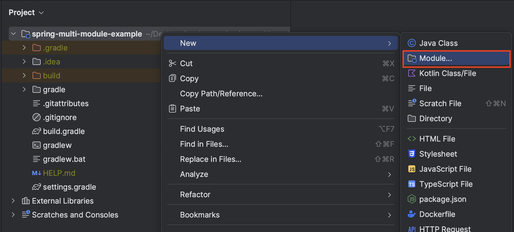

- root 프로젝트 우클릭 > New > Module

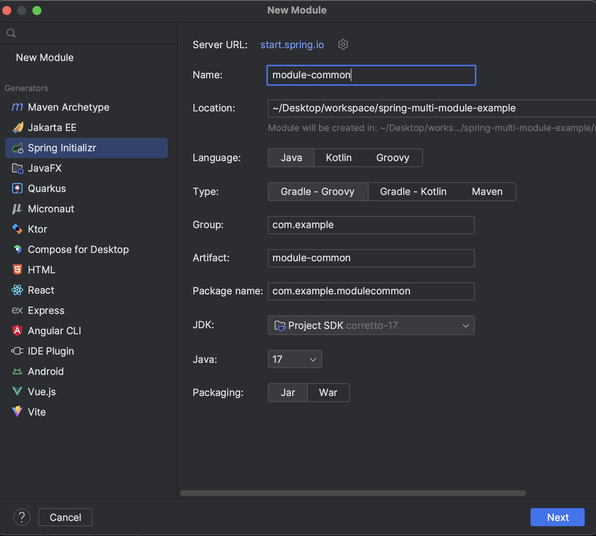

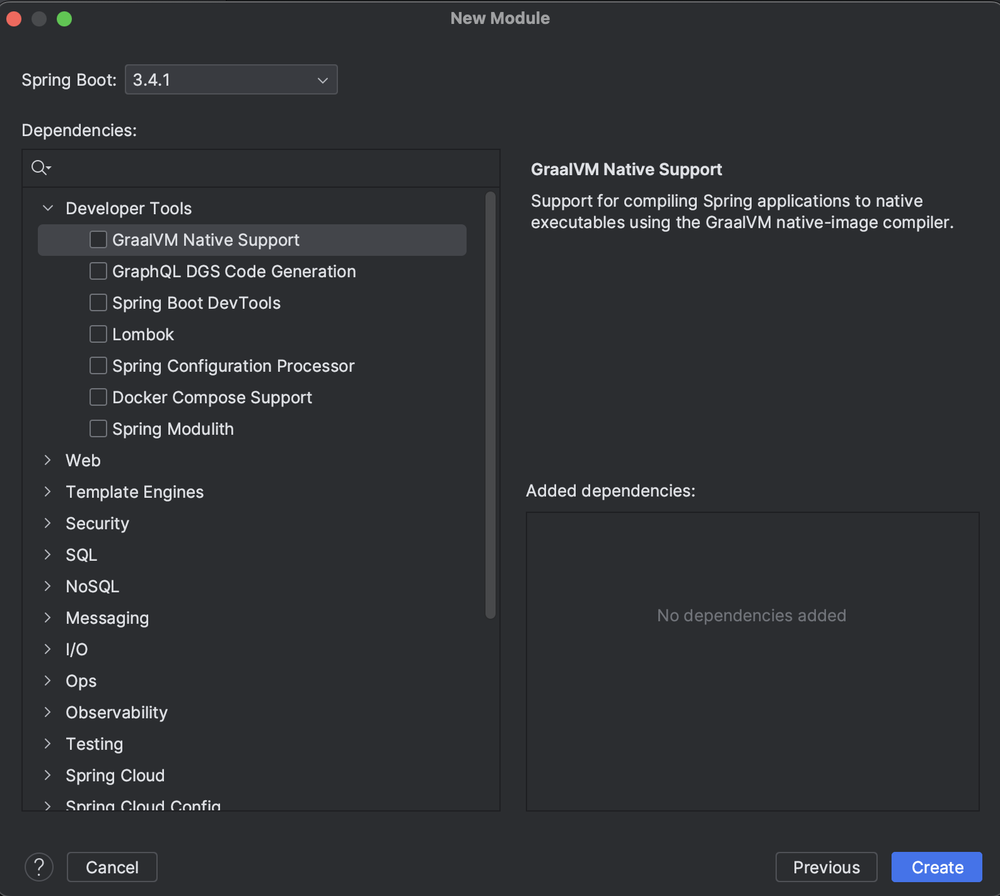

- 별도 라이브러리는 설정하지 않겠습니다.

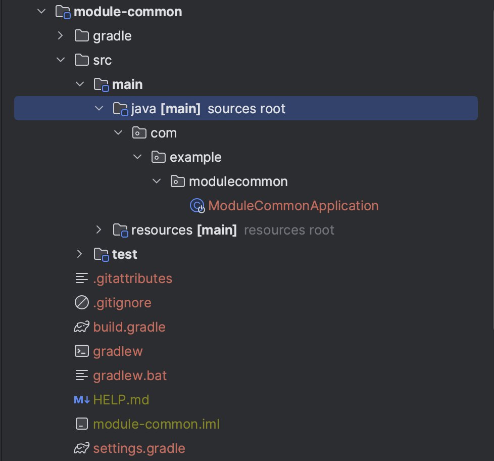

### 삭제 파일

> 서브 모듈은 루트 프로젝트의 Gradle 설정을 재사용하므로 불필요한 파일들을 제거합니다. 또한, 실행 가능한 JAR가 아닌 라이브러리 형태로 사용할 예정이므로 `main()` 메서드를 포함한 Main 클래스와 관련 리소스 파일도 삭제합니다.

#### 삭제 대상

- **Gradle 관련 파일**
  - `gradlew`
  - `gradlew.bat`
  - `settings.gradle`
- **Main 클래스**
  - `ModuleCommonApplication.java`
- **리소스 파일**
  - `resources` 디렉토리
- 테스트 디렉토리
  - `test` 디렉토리

### 추가

> 위에서 설명했듯이 componentScan을 간편하게 하기 위해 상위에 multimodule 디렉토리를 추가해주겠습니다.

### 최종

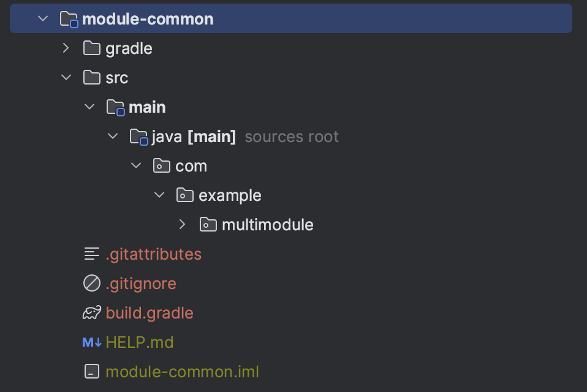


### build.gradle

> `module-common` 의 build.gradle 을 작성해보겠습니다.

``` groovy
jar {
    enabled = true // 일반 JAR 활성화
}
bootJar {
    enabled = false // 실행 가능한 JAR 비활성화
}


group = 'com.example'
version = '0.0.1-SNAPSHOT'

dependencies {
    // 필요한 의존성 등록
}
```

- `jar {enabed = true}` 
  - 일반 Jar 파일을 활성화합니다.
  - 일반 Jar는 실행 가능한 엔트리 포인트 (`main()` 메서드) 를 포함하지 않으며, 라이브러리 형태로 사용됩니다.
- `bootJar {enable = false}`
  - Spring Boot 플러그인이 기본적으로 생성하는 실행 가능한 Jar(Standalong JAR)를 비활성화합니다.
  - 실행 가능한 Jar 는 스프링 부트 애플리케이션에서만 필요하며, 라이브러리로 사용된 `module-common` 에서는 사용하지 않습니다.

### 샘플 코드

> `common` 모듈에서는 common 모듈을 사용하는 상위 모듈의 설정 파일(`application.yml`)에서 메시지를 읽어 전달하는 간단한 서비스를 구현해보겠습니다.
>
> 해당 예제는 [Spring Multi Module Guides](https://spring.io/guides/gs/multi-module)를 참고하였습니다.
> `com.example.multimodule.modulecommon.service` 경로에 `service` 패키지를 생성하고, 아래와 같이 코드를 작성합니다.

#### ServiceProperties.java

```java
package com.example.multimodule.modulecommon.service;

import org.springframework.boot.context.properties.ConfigurationProperties;

@ConfigurationProperties("service")
public class ServiceProperties {

    /**
     * A message for the service.
     */
    private String message;

    public String getMessage() {
        return message;
    }

    public void setMessage(String message) {
        this.message = message;
    }
}

```

#### MyService.java

```java
package com.example.multimodule.modulecommon.service;

import org.springframework.boot.context.properties.EnableConfigurationProperties;
import org.springframework.stereotype.Service;

@Service
@EnableConfigurationProperties(ServiceProperties.class)
public class MyService {

    private final ServiceProperties serviceProperties;

    public MyService(ServiceProperties serviceProperties) {
        this.serviceProperties = serviceProperties;
    }

    public String message() {
        return this.serviceProperties.getMessage();
    }
}
```


### 확인

> build를 눌러 이상이 없는지 확인해줍시다. 명령어로도 가능합니다.

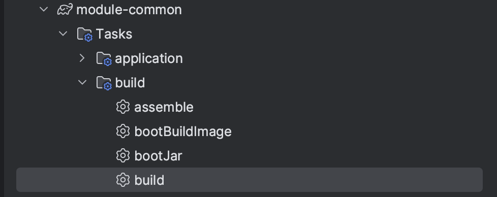

```bash
./gradlew :module-common:build
```


## module-storage

---

> 이번에는 DB 연결을 담당하는 `module-storage` 를 구성해보겠습니다. 특이사항은 추후 확장성을 고려하여 해당 모듈 밑에 jpa를 사용하는 `db-jpa` 하위 모듈을 추가해주겠습니다. 마찬가지로 실행 불가능한 jar 로 만들어 주겠습니다.

### module-storage 생성

module-common 과 같은 방법으로 생성해줍니다. 이때 common 모듈과 다른점은 하위 모듈을 추가로 생성할 거기 때문에 module-storage에서는 src 자체를 삭제해줍니다.

```
모듈 생성 -> 필요 없는 파일 제거
```

#### 삭제 대상

- **Gradle 관련 파일**
  - `gradlew`
  - `gradlew.bat`
  - `settings.gradle`
- /**SRC** 자체 삭제
- **리소스 파일**
  - `resources` 디렉토리
- 테스트 디렉토리
  - `test` 디렉토리

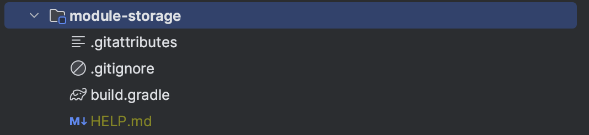

### build.gradle

```groovy
jar {
    enabled = true // 일반 JAR 활성화
}
bootJar {
    enabled = false // 실행 가능한 JAR 비활성화
}
```


### db-jpa 모듈 추가

#### 구성

> - **Persistence Context**: Spring Data JPA
> - **Database**: H2

module-storage 하위에 같은 방식으로 모듈을 추가해줍니다.

```
모듈 생성 -> 필요 없는 파일 제거 -> componentScan 을 위한 multimodule 디렉토리 상위에 생성
```

#### 삭제 대상

- **Gradle 관련 파일**
  - `gradlew`
  - `gradlew.bat`
  - `settings.gradle`
- **Main 클래스**
  - `...Application.java`
- **리소스 파일**
  - `resources` 디렉토리
- **테스트 디렉토리**
  - `test` 디렉토리

#### build.gradle

> `org.springframework.boot:spring-boot-starter-data-jpa` 의존성이 `api`로 설정되어 있습니다.
> JPA 라이브러리는 **`module-storage`를 사용하는 하위 모듈에도 전달**이 필요하기 때문에, `api`를 사용하여 의존성을 전달할 수 있습니다.
> 이때, **`java-library` 플러그인**을 추가해야 `api` 메서드를 사용할 수 있습니다.

```groovy
plugins {
    id 'java-library' // api 메서드 사용을 위한 플러그인
}

jar {
    enabled = true // 일반 JAR 활성화
}
bootJar {
    enabled = false // 실행 가능한 JAR 비활성화
}


dependencies {
    api 'org.springframework.boot:spring-boot-starter-data-jpa'
    runtimeOnly 'com.h2database:h2'
    testImplementation 'org.springframework.boot:spring-boot-starter-test'
    testRuntimeOnly 'org.junit.platform:junit-platform-launcher'
}

```

- **`java-library` 플러그인**

  - `api` 메서드를 활성화하여 의존성을 전달할 수 있게 합니다.

  - `api`로 선언된 의존성은 이 모듈(`module-storage:db-jpa`)을 참조하는 다른 모듈(`module-api`)에서도 사용할 수 있습니다.

- **`api`와 `implementation`의 차이**

  - **`api`**: 이 모듈을 의존하는 다른 모듈에서도 의존성을 전달.

  - **`implementation`**: 이 모듈 내부에서만 사용하는 의존성. 다른 모듈로 전달되지 않음.

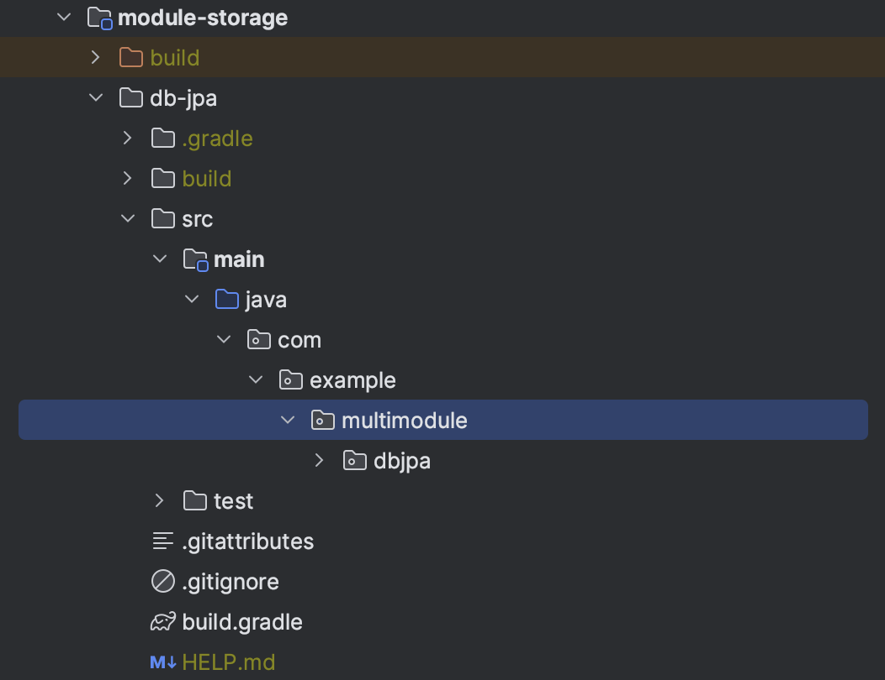


#### 샘플 코드

##### MemberEntity.java

```java
package com.example.multimodule.dbjpa.entity;

import jakarta.persistence.Column;
import jakarta.persistence.Entity;
import jakarta.persistence.GeneratedValue;
import jakarta.persistence.Id;
import lombok.*;

@Entity
@Getter
@Setter
@NoArgsConstructor(access = AccessLevel.PROTECTED)
@ToString(of = {"id", "username", "age"})
public class Member {
    @Id
    @GeneratedValue
    @Column(name = "member_id")
    private Long id;
    private String username;
    private int age;

    public Member(String username, int age) {
        this.username = username;
        this.age = age;
    }
}

```

#### MemberRepository.java

```java
package com.example.multimodule.dbjpa.repository;

import com.example.multimodule.dbjpa.entity.Member;
import org.springframework.data.jpa.repository.JpaRepository;

public interface MemberRepository extends JpaRepository<Member, Long> {
}
```

#### DbJpaConfig.java

```java
package com.example.multimodule.dbjpa.config;

import org.springframework.context.annotation.Configuration;
import org.springframework.boot.autoconfigure.domain.EntityScan;
import org.springframework.data.jpa.repository.config.EnableJpaRepositories;

@Configuration
@EntityScan(basePackages = "com.example.multimodule.dbjpa.entity") // 엔티티 스캔
@EnableJpaRepositories(basePackages = "com.example.multimodule.dbjpa.repository") // JPA 리포지토리 설정
public class DbJpaConfig {
    // 추가 설정이 필요하다면 여기에 작성
}

```


### 확인

> build를 눌러 이상이 없는지 확인해줍시다. 명령어로도 가능합니다.

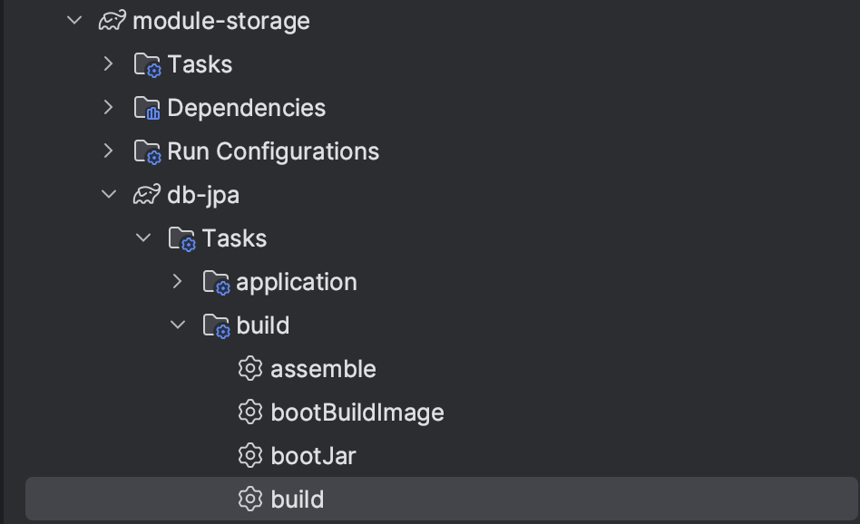

``` bash
./gradlew :module-storage:db-jpa:build
```


## module-api

> 이번에는 `module-api`를 구성해 보겠습니다. 실행 가능한 jar 이며 `module-common`, `module-storage:db-jpa` 를 사용하여 간단한 Controller와 Service 로직을 구현 후 정상 동작하는지 확인해보도록 하겠습니다. 

마찬가지로 다른 모듈을 생성했던 방식 그대로 루트 프로젝트 밑에 모듈을 생성해줍니다.

```
모듈 생성 -> 필요 없는 파일 제거 -> componentScan 을 위한 multimodule 디렉토리 상위에 생성(이때 테스트 디렉토리도 맞춰주세요)
```

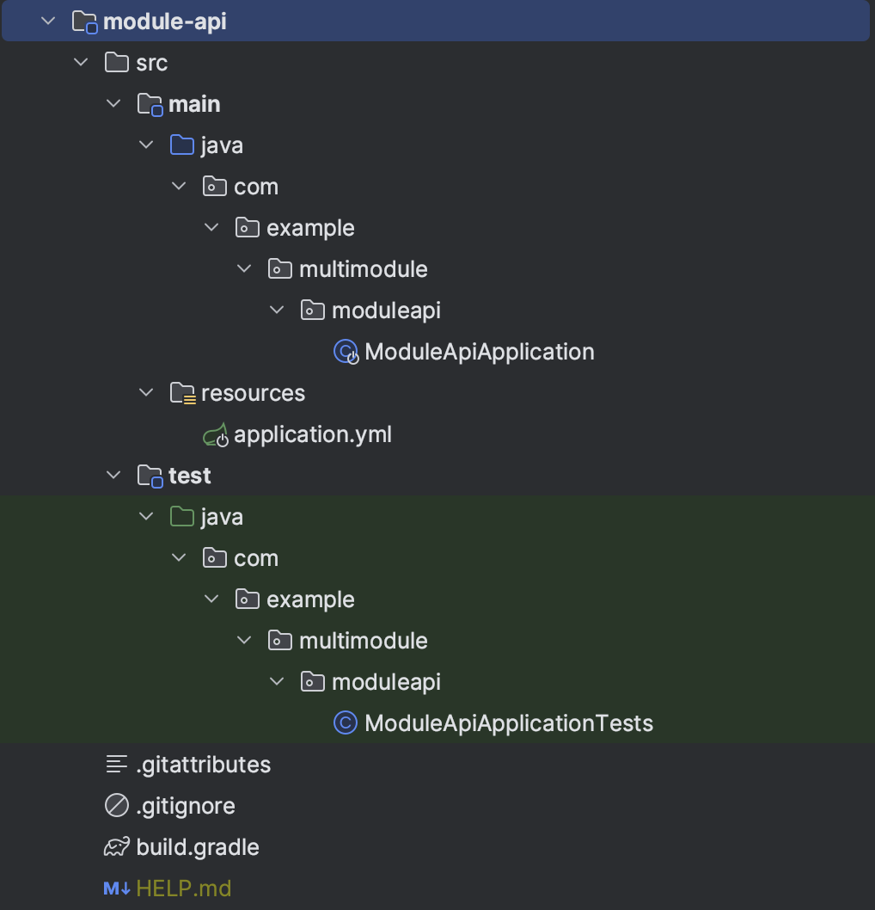

### 구성

> - spring-boot-starter-web
> - swagger
> - Spring-boot-starter-jdbc
> - :module-common
> - :module-storage:db-jpa'

### build.gradle

``` groovy
group = 'com.example'
version = '0.0.1-SNAPSHOT'

dependencies {
    implementation project(':module-common')
    implementation project(':module-storage:db-jpa')
    implementation 'org.springframework.boot:spring-boot-starter-web'
    implementation 'org.springdoc:springdoc-openapi-starter-webmvc-ui:2.2.0' // 최신 버전
    implementation 'org.springframework.boot:spring-boot-starter-jdbc'
    testImplementation 'org.springframework.boot:spring-boot-starter-test'
    testRuntimeOnly 'org.junit.platform:junit-platform-launcher'
}
```

- 다른 파일들과 다르게 `jar {enabed = true}` , `bootJar {enable = false}` 설정이 없습니다. 해당 모듈은 실행가능한 jar로 생성할거기 때문에 설정을`jar {enabed = false}` , `bootJar {enable = trye}`로 잡아도 되지만 굳이 잡지 않아도 bootJar로 실행이 됩니다.
- 위에서 만든 `:module-common`, `:module-storage:db-jpa` 를 사용하기 위해 implementation 해줍니다.

### application.yml

```yaml
spring:
  application:
    name: module-api

  # module-storage:db-jpa 설정
  datasource:
    url: jdbc:h2:tcp://localhost/~/multimodule
    username: sa
    password:
    driver-class-name: org.h2.Driver

  jpa:
    database-platform: org.hibernate.dialect.H2Dialect # SQL 방언 설정
    hibernate:
      ddl-auto: create
    properties:
      hibernate:
        format_sql: true
        show_sql: true # 쿼리 system.out 으로 출력
        dialect: org.hibernate.dialect.H2Dialect # SQL 방언 설정
        use_sql_comments: true # 실행되는 쿼리 주석이 나옴

logging:
  level:
    org.hibernate.sql: debug

# module-common 설정
service:
  message: "My first multi module project"

springdoc: # swagger 설정
  swagger-ui:
    path: /swagger-ui/index.html
    groups-order: DESC # path, query, body, response 순으로 출력
    tags-sorter: alpha # 태그를 알파벳 순으로 정렬
    operations-sorter: method  # delete - get - patch - post - put 순으로 정렬, alpha를 사용하면 알파벳 순으로 정렬 가능
```

- **service.message**: `module-common`에서 설정한 메시지 출력을 위한 설정
- **spring.datasource.jpa**: `module-storage:db-jpa` jpa 설정
- **springdoc**: swagger 설정

### ModuleApiApplication.java

```java
package com.example.multimodule.moduleapi;

import org.springframework.boot.SpringApplication;
import org.springframework.boot.autoconfigure.SpringBootApplication;
import org.springframework.boot.autoconfigure.domain.EntityScan;
import org.springframework.data.jpa.repository.config.EnableJpaRepositories;

@SpringBootApplication(scanBasePackages = {"com.example.multimodule"})
public class ModuleApiApplication {

    public static void main(String[] args) {
        SpringApplication.run(ModuleApiApplication.class, args);
    }

}

```

- 위에서 설명한대로 componentScan을 위해 scanBasePacakges를 추가해줍니다.

### SampleService.java

```java
package com.example.multimodule.moduleapi.sample.service;

import com.example.multimodule.dbjpa.entity.Member;
import com.example.multimodule.dbjpa.repository.MemberRepository;
import com.example.multimodule.modulecommon.service.MyService;
import lombok.RequiredArgsConstructor;
import org.springframework.stereotype.Service;
import org.springframework.transaction.annotation.Transactional;

import java.util.List;

@Service
@Transactional
@RequiredArgsConstructor
public class SampleService {

    private final MyService myService; // module-common
    private final MemberRepository memberRepository; // module-storage:db-jpa

    public String commonModuleTest() {
        return myService.message();
    }

    public boolean memberSave() {
        Member testMember = new Member("username", 10);
        memberRepository.save(testMember);
        return true;
    }

    public List<Member> getMembers() {
        return memberRepository.findAll();
    }
}
```

### SampleController.java

```java
package com.example.multimodule.moduleapi.sample.controller;

import com.example.multimodule.dbjpa.entity.Member;
import com.example.multimodule.moduleapi.sample.service.SampleService;
import io.swagger.v3.oas.annotations.Operation;
import io.swagger.v3.oas.annotations.tags.Tag;
import lombok.RequiredArgsConstructor;
import org.springframework.web.bind.annotation.GetMapping;
import org.springframework.web.bind.annotation.PostMapping;
import org.springframework.web.bind.annotation.RestController;

import java.util.List;

@Tag(name = "SampleController")
@RestController
@RequiredArgsConstructor
public class SampleController {

    private final SampleService sampleService;

    @Operation(summary = "common module message 테스트")
    @GetMapping("/module-common/message")
    public String getCommonModuleMessage() {
        return sampleService.getCommonModuleMessage();
    }

    @Operation(summary = "storage module 사용하여 test member 저장")
    @PostMapping("/module-storage/members")
    public boolean membersSave() {
        return sampleService.memberSave();
    }

    @Operation(summary = "storage module 사용하여 test member 조회")
    @GetMapping("/module-storage/members")
    public List<Member> getMembers() {
        return sampleService.getMembers();
    }
}

```


## 확인

> `module-api` 를 실행 후 swagger 를 통해 요청을 날려봅시다. 이때 h2 db를 실행 후 애플리케이션을 실행해 주세요.

<http://localhost:8080/swagger-ui/swagger-ui/index.html> 로 접속하여 확인합니다.

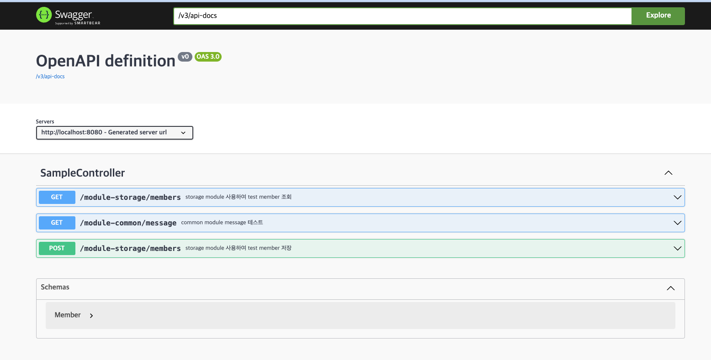

#### 테스트

##### module-common

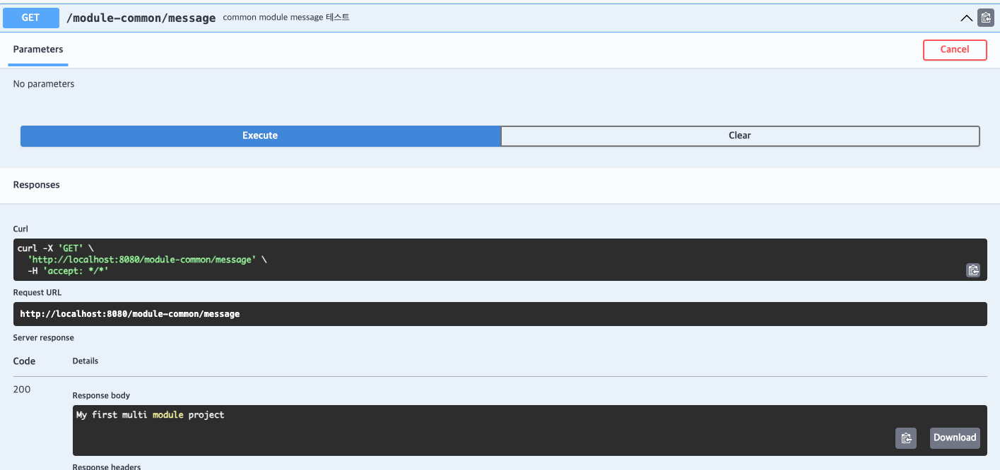

##### module-storage

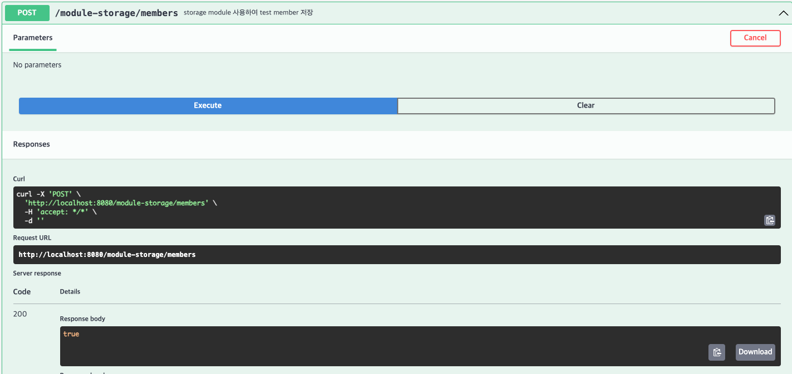

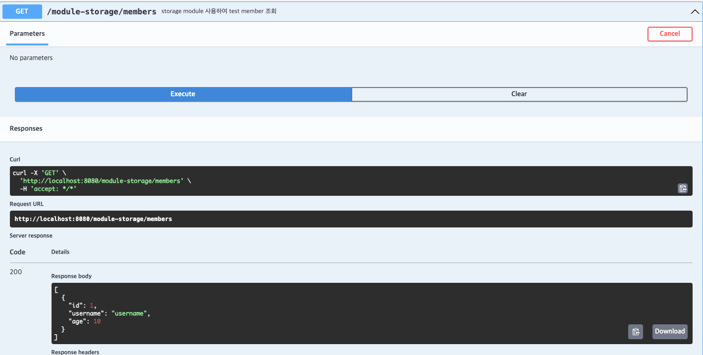


## 마치며

---

`module-infra`는 `module-storage`와 동일한 형식으로 구성되어 있어 별도로 설명하지 않았습니다.

이번 포스팅에서는 멀티 모듈 프로젝트를 통해 코드를 분리하고 **재사용성과 유지보수성을 높이는 방법**을 다뤘습니다.
초반 설정 과정에서 다소 복잡함이 있을 수 있지만, 운영 및 관리 측면에서 **효율적이고 체계적인 구조**를 제공한다는 점에서 충분히 도입할 가치가 있다고 판단됩니다. 감사합니다 ㅎㅎ


## Reference

---

- <https://spring.io/guides/gs/multi-module>
- <https://github.com/spring-guides/gs-multi-module/tree/main/complete/library>
- <https://docs.gradle.org/current/userguide/plugins.html>
- <https://jaeseo0519.tistory.com/359>


## 전체 코드

---

- <https://github.com/DevK-Jung/spring-boot-multi-module-example>
