> 최근 프로젝트에서 **무결성이 중요한 데이터**를 안전하게 관리하기 위해 블록체인을 활용하여 백엔드 시스템을 구축할 기회가 생겼습니다. 데이터의 신뢰성을 확보하면서도 효율적인 운영을 위해 **Hedera Consensus Service(HCS)**를 사용하였는데 HCS는 **검증 가능한 타임스탬프**와 **이벤트 순서 보장** 기능을 제공하며, 특히 **낮은 수수료**로 인해 프로젝트 요구사항에 적합했습니다. 이번 포스팅에서는 HCS가 무엇인지 확인해보고 간단한 코드를 통해 HCS를 구현해 보도록 하겠습니다.

## Hedera Consensus Service란?

---

> **Hedera Consensus Service(HCS)**는 **Web2**와 **Web3 애플리케이션**에서 불변성과 타임스탬프가 보장된 **분산 감사 로그**를 생성하기 위한 전문 도구입니다.
> 메시지가 Hedera 네트워크에 제출되면 **타임스탬프가 부여**되고, **공정하게 정렬**되어 합의가 이루어집니다.- [hedera](https://hedera.com/consensus-service)
>
> HCS는 다양한 프로덕션 환경에서 활용되며, 주요 사용 사례는 다음과 같습니다:
>
> - **공급망 관리**: 공급망 전반에서 데이터 출처를 추적.
>
> - **자산 전송 기록**: 블록체인 네트워크 간의 자산 이동 기록.
>
> - **DAO(탈중앙화 자율 조직)**: 투표 데이터의 기록 및 집계.
>
> - **IoT 모니터링**: IoT 장치의 활동 및 데이터를 기록.
>
>   

쉽게 말해, **무결성과 데이터 순서가 중요한 데이터를 Hedera 블록체인에 메시지로 전송**하면, 해당 메시지는 **고유한 타임스탬프와 함께 기록**되며, **정확한 순서와 무결성**이 보장된다는 뜻입니다.


### Hedera Consensus Service를 선택한 이유

> 데이터를 블록체인에 기록하는 방법은 여러 방법이 있었지만 HCS를 선택한 이유는 다음과 같습니다.

### 1. 순서 보장

모든 메시지가 타임스탬프와 함께 기록되어 데이터의 정확성과 신뢰성을 제공합니다.

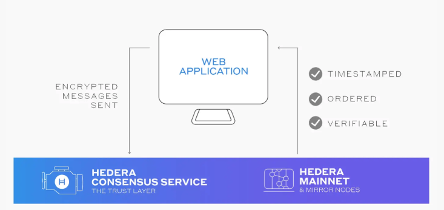

출처: <https://hedera.com/consensus-service>

### 2. 높은 처리량

**Hedera**는 높은 처리량(TPS)을 자랑하며, 초당 수천 건의 트랜잭션을 처리할 수 있는 성능을 제공합니다. 2023년 기준으로 Hedera 메인넷은 평균 **2,500 TPS**를 기록하며, 블록체인 네트워크 실시간 상태를 모니터링할 수 있는 [Chainspect](https://chainspect.app/dashboard)에서 **1위를 기록**하기도 했습니다.

현재 순위는 하락하여 18위에 머물고 있지만, 여전히 **높은 처리량**을 제공하며 안정적인 성능을 유지하고 있습니다.

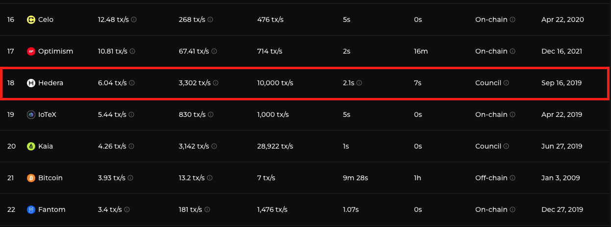

출처 <https://chainspect.app/dashboard>

### 3. 저렴한 수수료

헤데라 컨센서스 서비스(HCS) 동작 방식을 간단히 설명해보면 우선 메시지를 저장할 주제(Topic)를 생성하고 해당 주제에 메시지를 전송하는 식으로 데이터를 기록합니다. 이때 토픽 생성이나 메시지 전송에 있어서 굉장히 저렴한 수수료를 갖고 있어 부담없이 블록체인에 메시지를 기록할 수 있습니다.

2024-12-31일 기준입니다. 사용하시기 전에 [헤데라 사이트](https://hedera.com/consensus-service)를 참고하셔서 수수료를 다시 한번 확인해주세요.

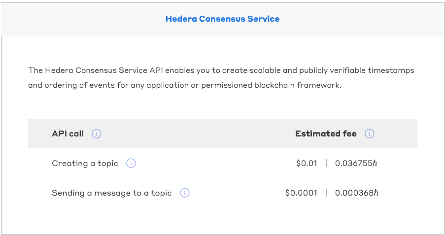

출처 <https://hedera.com/consensus-service>


## HCS 동작 방식

---

> HCS는 다음 단계로 동작합니다.
>
> 토픽 만들기 -> 메시지 보내기 -> 프로세스 -> 감사

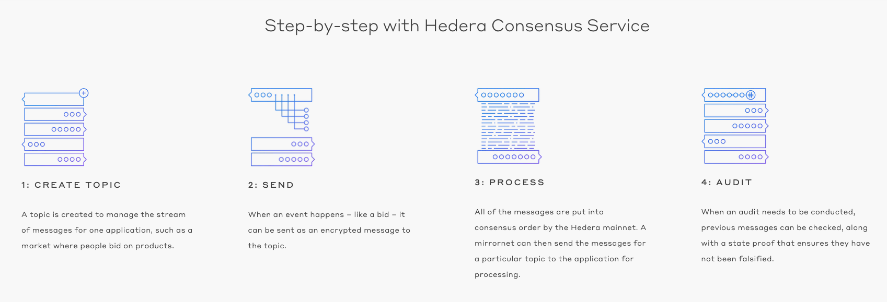

출처 <https://hedera.com/consensus-service>

- CREATE TOPIC(토픽 만들기): 데이터를 저장할 컨테이너 준비
- SEND(메시지 보내기): 데이터를 블록체인에 기록 - 토픽에 전송
- PROCESS(프로세스): 네트워크가 데이터를 정렬하고 무결성 보장 - 합의 순서로 배치
- AUDIT(감사): 기록된 데이터를 추적하고 신뢰성 확인


## 직접 구현해보기

---

> [Hedera SDK](https://docs.hedera.com/hedera/sdks-and-apis/sdks)를 활용하여 직접 Hedera Consensus Service를 구현해보도록 하겠습니다. 코드를 통해 Topic을 생성해보고 해당 Topic에 메시지를 제출해보며 hedera blockchain explorer인 [hashscan](https://hashscan.io/testnet/dashboard) 을 통해 확인해보겠습니다. 이번 포스팅에서는 토픽 생성, 메시지 제출만 확인해 볼 것이며  [전체 코드](https://github.com/DevK-Jung/hedera-example) 에는 토픽 제거, 토픽 수정 등도 구현해 두었으니 자세한 내용을 확인하고 싶으시면 해당 코드를 참고해주세요!

### 시작하기전에 - 계정 생성

Hedera 계정이 필요합니다. <https://portal.hedera.com/login> 로 들어가 계정을 생성하여 accountId와 PrivateKey를 준비해주세요. 저희는  돈이 들지 않도록 Testnet 에서 개발을 하도록 하겠습니다. Create a Testnet account 를 눌러서 testnet용 계정을 생성해주세요.

 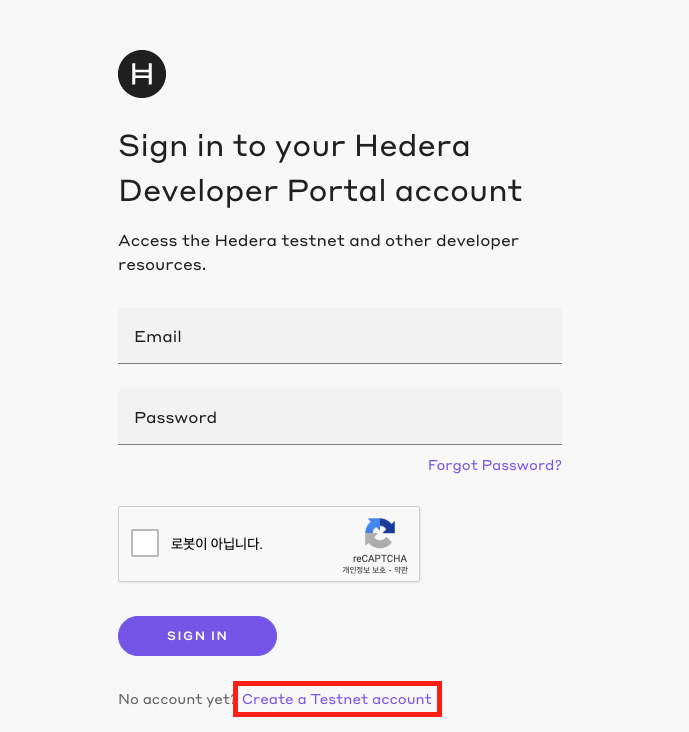

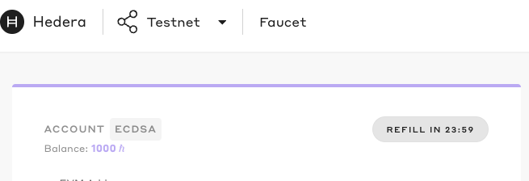

- 계정을 생성하면 아래 정보가 화면에 표시됩니다.

  - **사용할 주요 정보**
  - **Account ID**: Hedera 계정의 고유 식별자.
    
  - **DER Encoded Private Key**: 계정의 개인 키. 안전하게 저장하세요.
    
- **잔액 확인**
    - **Balance**: 1,000 HBAR가 기본적으로 제공됩니다.
  
    - 이 HBAR는 **테스트넷에서 주제(Topic)를 생성하거나 메시지를 제출할 때 수수료**로 사용됩니다.
  
  - **Testnet HBAR 리필**
  - 우측의 **Refill 버튼**을 사용하면 하루에 한 번 **추가 HBAR**를 받을 수 있습니다.
  
  


### 기술 스펙

- **Framework**: Spring Boot 3.4.1

- **Build Tool**: Gradle

- **모듈 구성**: 멀티모듈 (common, consensus)

- **Dependencies**:

  ```groovy
  implementation 'com.hedera.hashgraph:sdk:2.46.0'
  implementation 'io.grpc:grpc-netty-shaded:1.64.0'
  ```

  

### 디렉토리 구조

> 저는 consensus Service 외에도 다른 기능들도 구현하고 모듈별로 관리하기 위해 멀티모듈 구조로 구현하였습니다. 아래는 디렉토리 구조입니다.

```
hedera-example
├── common
├── consensus
```

#### **common** 모듈

- **`ClientConfig`**: Hedera Client 객체를 생성하고, Bean으로 등록하여 싱글톤으로 관리합니다.
  - testnet으로 설정되어있습니다. mainnet으로 변경을 원하면 `Client client = Client.forMainnet();`으로 변경해주세요
- **`AbstractHederaHelper`**: 공통 로직 및 응답 객체 생성을 담당하는 추상 클래스입니다.
- **`HederaTransactionResponseVo`**: 트랜잭션 응답 정보를 관리하는 공통 VO 클래스입니다.
- **`HederaResponseUtils`**: 응답 생성을 돕는 유틸리티 클래스입니다.

#### **consensus** 모듈

- **`ConsensusHelperV1.java`**
  - Topic 관련 CRUD 및 메시지 전송 기능 구현:
    - **Topic 생성**: 새로운 Topic을 생성합니다.
    - **Topic 수정**: 기존 Topic의 속성을 업데이트합니다.
    - **Topic 삭제**: Topic을 삭제합니다.
    - **메시지 전송**: 지정된 Topic에 메시지를 제출합니다.
    - **Topic 정보 조회**: Topic의 세부 정보를 조회합니다.

### Common 모듈

#### ClientConfig.java

```java
@Configuration
public class ClientConfig {

    @Bean
    public Client client(@Value("${hedera.account-id}") String accountId,
                         @Value("${hedera.private-key}") String privateKey) {

        // Operator account ID and private key from string value
        AccountId myAccountId = AccountId.fromString(accountId);
        PrivateKey myPrivateKey = PrivateKey.fromString(privateKey);

        // Pre-configured client for test network (testnet)
        Client client = Client.forTestnet();

        //Set the operator with the account ID and private key
        client.setOperator(myAccountId, myPrivateKey);

        return client;
    }
}
```

- hedera network와 통신하기 위한 Client 객체를 Bean 으로 등록해줍니다. 이때 accountId, privateKey는 해당 모듈을 사용하는 쪽의 설정파일을 통해 받도록 하겠습니다.
  - `Client` 객체를 들어가보면 아시겠지만 `AutoCloseable` 을 구현하고 있어 처음에는 `try-with-resources`를 통해 사용할 때마다 `Client` 인스턴스를 생성하고 `close()` 했지만 Channel이 제대로 닫히지 않는 이슈가 있어 hedera 측에 문의해본 결과 singleton으로 사용해보라고하여 Bean으로 등록하여 사용하도록 수정하였습니다.

#### HederaTransactionResponseVo.java

```java
package com.example.hedera.common.vo;

import com.hedera.hashgraph.sdk.ExchangeRate;
import com.hedera.hashgraph.sdk.Status;
import com.hedera.hashgraph.sdk.TransactionReceipt;
import lombok.AccessLevel;
import lombok.Getter;
import lombok.RequiredArgsConstructor;

import java.util.Objects;

@Getter
@RequiredArgsConstructor(access = AccessLevel.PRIVATE)
public final class HederaTransactionResponseVo<T> {
    private final Status status;
    private final String transactionId;
    private final ExchangeRate exchangeRate;
    private final T result;

    public static <T> HederaTransactionResponseVo<T> of(TransactionReceipt receipt, T result) {
        Objects.requireNonNull(receipt);

        return new HederaTransactionResponseVo<>(
                Objects.requireNonNull(receipt.status, "Status cannot be null"),
                receipt.transactionId != null ? receipt.transactionId.toString() : "UNKNOWN_TRANSACTION_ID",
                receipt.exchangeRate,
                result
        );
    }
}

```

- Hedera Transaction 시 공통 응답으로 던져줄 공통 Vo를 생성해주었습니다.
  - `status`: 트랜잭션 상태 값을 저장합니다.
  - `transactionId`: 트랜잭션의 고유 식별자(ID)를 저장합니다.
  - `exchangeRate`: 트랜잭션 관련 거래 정보를 저장합니다.
  - `result`: 트랜잭션 결과 데이터를 담습니다.

#### HederaResponseUtils.java

```java
package com.example.hedera.common.utils;

import com.example.hedera.common.vo.HederaTransactionResponseVo;
import com.hedera.hashgraph.sdk.TransactionReceipt;
import lombok.experimental.UtilityClass;

@UtilityClass
public class HederaResponseUtils {
    public <T> HederaTransactionResponseVo<T> makeResponse(TransactionReceipt receipt, T result) {
        return HederaTransactionResponseVo.of(receipt, result);
    }
}

```

- Hedera 응답 관련 Utils
  - `makeResponse(TransactionReceipt receipt, T result)`: response 객체를 생성합니다.

#### AbstractHederaHelper.java

```java
package com.example.hedera.common.core;

import com.example.hedera.common.utils.HederaResponseUtils;
import com.example.hedera.common.vo.HederaTransactionResponseVo;
import com.hedera.hashgraph.sdk.TransactionReceipt;

public abstract class AbstractHederaHelper {
    protected final <T> HederaTransactionResponseVo<T> makeTransactionResponse(TransactionReceipt receipt, T result) {
        return HederaResponseUtils.makeResponse(receipt, result);
    }
}

```

- Hedera 관련 클래스에서 공통 처리 로직을 추상화 하였습니다. 이를 상속받아서 사용가능하도록 할 것입니다.


### consensus 모듈

#### application.yml

```yaml
hedera:
  account-id: ${accountId}
  private-key: ${privateKey}
```

- common module에서 Client 객체를 생성하기 위해 application.yml에 accountId 와 privateKey를 입력해주세요
  - accountId: 계정 생성시 부여받은 accountId
  - privateKey: 계정 생성시 부여받은 DER Encoded Private Key

#### ConsensusHelperV1.java

> topic 생성과 해당 topic에 message를 제출하는 코드를 살펴보겠습니다. 위에서도 말씀 드렸지만 토픽 삭제 및 토픽 수정 등과 같은 로직도 확인하고 싶으시면 제 [github](https://github.com/DevK-Jung/hedera-example) 를 참고해주세요

##### createTopic

토픽 생성 로직을 구현해보겠습니다. 

```java
@Slf4j
@Component
public class ConsensusHelperV1 extends AbstractHederaHelper implements ConsensusHelper {

    private final Client client;
    private final AccountId accountId;
    private final PrivateKey privateKey;

    public ConsensusHelperV1(Client client,
                             @Value("${hedera.account-id}") String accountId,
                             @Value("${hedera.private-key}") String privateKey) {
        this.client = client;
        this.accountId = AccountId.fromString(accountId);
        this.privateKey = PrivateKey.fromString(privateKey);
    }
  
    /**
     * 기본 설정을 사용해 새로운 토픽을 생성합니다.
     * <p>
     * 기본 설정:
     * - AdminKey와 SubmitKey는 운영자의 개인 키를 사용합니다.
     * - 자동 갱신 기간(Auto-renew period)은 92일로 설정됩니다.
     *
     * @param topicMemo 메모
     * @return 생성된 토픽의 ID를 문자열로 반환합니다.
     * @throws PrecheckStatusException 요청이 Hedera 네트워크의 사전 검사 단계에서 실패할 경우 발생합니다.
     * @throws TimeoutException        요청 시간이 초과될 경우 발생합니다.
     * @throws ReceiptStatusException  트랜잭션 영수증 상태가 실패로 반환될 경우 발생합니다.
     */
@Override
    public HederaTransactionResponseVo<TopicResponseVo> createTopic(String topicMemo) throws PrecheckStatusException, TimeoutException, ReceiptStatusException {

        return createTopic(privateKey, privateKey, topicMemo, accountId, Duration.ofDays(92));
    }

      /**
     * 사용자 정의 설정을 사용해 새로운 토픽을 생성합니다.
     *
     * @param adminKey           AdminKey는 토픽 업데이트 및 삭제를 제어합니다. (null로 설정하면 업데이트는 가능하지만 삭제는 불가능합니다.)
     * @param submitKey          SubmitKey는 메시지 제출 권한을 제어합니다. (null로 설정하면 모든 사용자가 메시지를 제출할 수 있습니다.)
     * @param topicMemo          토픽 메모(선택 사항, 최대 100바이트).
     * @param autoRenewAccountId 자동 갱신 비용을 부담할 계정 ID(선택 사항).
     * @param autoRenewPeriod    자동 갱신 주기(선택 사항, 30~92일 사이의 값).
     * @return 생성된 토픽의 ID
     * @throws PrecheckStatusException 요청이 Hedera 네트워크의 사전 검사 단계에서 실패할 경우 발생합니다.
     * @throws TimeoutException        요청 시간이 초과될 경우 발생합니다.
     * @throws ReceiptStatusException  트랜잭션 영수증 상태가 실패로 반환될 경우 발생합니다.
     */
@Override
    public HederaTransactionResponseVo<TopicResponseVo> createTopic(Key adminKey,
                                                                    Key submitKey,
                                                                    String topicMemo,
                                                                    AccountId autoRenewAccountId,
                                                                    Duration autoRenewPeriod)
            throws PrecheckStatusException, TimeoutException, ReceiptStatusException {

        TopicCreateTransaction transaction =
                getTopicCreateTransaction(adminKey, submitKey, topicMemo, autoRenewAccountId, autoRenewPeriod);

        //Sign with the client operator private key and submit the transaction to a Hedera network
        TransactionResponse txResponse = transaction.execute(client);

        //Request the receipt of the transaction
        TransactionReceipt receipt = txResponse.getReceipt(client);

        if (!Status.SUCCESS.equals(receipt.status))
            throw new RuntimeException("Failed create Topic");

        //Get the topic ID
        TopicId newTopicId = receipt.topicId;

        log.debug("The new topic ID is {}", newTopicId);

        if (newTopicId == null)
            throw new IllegalStateException("Topic ID cannot be null");

        return makeTransactionResponse(receipt, new TopicResponseVo(newTopicId.toString()));
    }

    private TopicCreateTransaction getTopicCreateTransaction(Key adminKey,
                                                             Key submitKey,
                                                             String topicMemo,
                                                             AccountId autoRenewAccountId,
                                                             Duration autoRenewPeriod) {
        //Create the transaction
        TopicCreateTransaction transaction = new TopicCreateTransaction();

        if (adminKey != null) transaction.setAdminKey(adminKey);
        if (submitKey != null) transaction.setSubmitKey(submitKey);
        if (StringUtils.isNotBlank(topicMemo)) transaction.setTopicMemo(topicMemo);
        if (autoRenewAccountId != null) transaction.setAutoRenewAccountId(autoRenewAccountId);
        if (autoRenewPeriod != null) transaction.setAutoRenewPeriod(autoRenewPeriod);

        return transaction;
    }
```

- 파라미터 설명

  - **`adminKey` (선택 사항)**
    - 토픽의 **업데이트** 및 **삭제 권한**을 제어합니다.
    - `null`로 설정 가능하지만, 이 경우 **업데이트는 가능**하나 **삭제는 불가능**합니다.

  - **`submitKey` (선택 사항)**

    - 메시지 제출 권한을 제어합니다.

    - `null`로 설정하면 **모든 사용자가 메시지를 제출**할 수 있습니다.

  - **`topicMemo` (선택 사항)**

    - 토픽에 대한 **메모**를 입력합니다.

    - 최대 **100바이트**까지 입력 가능.

  - **`autoRenewAccountId` (선택 사항)**

    - 토픽의 **자동 갱신 시 수수료를 지불할 계정**을 지정합니다.

    - 현재 HCS에서는 적용되지 않지만, 미래를 대비해 설정할 것을 권장합니다.

  - **`autoRenewPeriod` (선택 사항)**

    - 토픽의 **자동 갱신 주기**를 설정합니다.

    - 30~92일 사이의 값을 지정할 수 있습니다.
    - 현재 HCS에서는 적용되지 않지만, 미래를 대비해 설정할 것을 권장합니다.

#### submitMessage

토픽에 메시지를 전송하는 submitMessage를 구현해보겠습니다.

```java
/**
     * submit Message
     * <p>
     *
     * @param topicId    topicId
     * @param message    message - 최대 크기 1024byte(1kb)
     * @param chunkSize  메시지에 대한 개별 청크의 최대 크기 - default 1024
     * @param maxChuncks 메시지 분할 할 수 있는 최대 청크 수 - 기본 값 20
     * @return HederaTransactionResponseVo<MessageResponseVo>
     * @throws PrecheckStatusException PrecheckStatusException
     * @throws TimeoutException        TimeoutException
     * @throws ReceiptStatusException  ReceiptStatusException
     */
    @Override
    public HederaTransactionResponseVo<MessageResponseVo> submitMessage(@NonNull String topicId,
                                                                        @NonNull String message,
                                                                        Integer chunkSize,
                                                                        Integer maxChuncks)
            throws PrecheckStatusException, TimeoutException, ReceiptStatusException {

        // Check if the message exceeds 1KB
        if (message.getBytes(StandardCharsets.UTF_8).length > 1024)
            throw new IllegalArgumentException("Message size exceeds 1KB limit");

        //Create the transaction
        TopicMessageSubmitTransaction transaction = new TopicMessageSubmitTransaction()
                .setTopicId(getTopicId(topicId))
                .setMessage(message);

        if (chunkSize != null) transaction.setChunkSize(chunkSize);
        if (maxChuncks != null) transaction.setMaxAttempts(maxChuncks);

        // Sign with the client operator key and submit transaction to a Hedera network, get transaction ID
        TransactionResponse txResponse = transaction.execute(client);

        // Request the receipt of the transaction
        TransactionReceipt receipt = txResponse.getReceipt(client);

        // Get the transaction consensus status
        Status transactionStatus = receipt.status;

        log.info("The transaction consensus status is " + transactionStatus);

        if (!Status.SUCCESS.equals(receipt.status))
            throw new RuntimeException("Failed submit message");

        return makeTransactionResponse(receipt, new MessageResponseVo(topicId, message, receipt.topicSequenceNumber));
    }
```

- 파라미터 설명

  - **`topicId`** (필수)

    - 메시지를 제출할 대상 **Topic ID**입니다.

    - Hedera 네트워크에서 메시지를 기록할 주제(Topic)를 식별합니다.

  - **`message`** (필수)

    - 제출할 메시지 내용입니다.

    - **최대 크기**: 1KB(1024바이트).

    - 메시지 크기가 제한을 초과하면 예외(`IllegalArgumentException`)가 발생합니다.

  - **`chunkSize`** (선택 사항)

    - 메시지를 분할할 때 **개별 청크의 최대 크기**를 지정합니다.

    - 기본값: **1024바이트**.

    - 메시지가 크기를 초과할 경우 청크로 나누어 전송됩니다.

  - **`maxChunks`** (선택 사항)

    - 메시지를 분할할 수 있는 **최대 청크 수**를 지정합니다.

    - 기본값: **20**.

    - 메시지가 지정된 청크 수를 초과하면 전송에 실패할 수 있습니다.

#### 전체코드

``` java
package com.example.hedera.consensus.helper;

import com.example.hedera.common.core.AbstractHederaHelper;
import com.example.hedera.common.vo.HederaTransactionResponseVo;
import com.example.hedera.consensus.vo.MessageResponseVo;
import com.example.hedera.consensus.vo.TopicResponseVo;
import com.hedera.hashgraph.sdk.*;
import lombok.NonNull;
import lombok.extern.slf4j.Slf4j;
import org.apache.commons.lang3.StringUtils;
import org.springframework.beans.factory.annotation.Value;
import org.springframework.stereotype.Component;

import java.nio.charset.StandardCharsets;
import java.time.Duration;
import java.time.Instant;
import java.util.concurrent.TimeoutException;

@Slf4j
@Component
public class ConsensusHelperV1 extends AbstractHederaHelper implements ConsensusHelper {

    private final Client client;
    private final AccountId accountId;
    private final PrivateKey privateKey;

    public ConsensusHelperV1(Client client,
                             @Value("${hedera.account-id}") String accountId,
                             @Value("${hedera.private-key}") String privateKey) {
        this.client = client;
        this.accountId = AccountId.fromString(accountId);
        this.privateKey = PrivateKey.fromString(privateKey);
    }

    /**
     * 기본 설정을 사용해 새로운 토픽을 생성합니다.
     * <p>
     * 기본 설정:
     * - AdminKey와 SubmitKey는 운영자의 개인 키를 사용합니다.
     * - 자동 갱신 기간(Auto-renew period)은 92일로 설정됩니다.
     *
     * @param topicMemo 메모
     * @return 생성된 토픽의 ID를 문자열로 반환합니다.
     * @throws PrecheckStatusException 요청이 Hedera 네트워크의 사전 검사 단계에서 실패할 경우 발생합니다.
     * @throws TimeoutException        요청 시간이 초과될 경우 발생합니다.
     * @throws ReceiptStatusException  트랜잭션 영수증 상태가 실패로 반환될 경우 발생합니다.
     */
    @Override
    public HederaTransactionResponseVo<TopicResponseVo> createTopic(String topicMemo) throws PrecheckStatusException, TimeoutException, ReceiptStatusException {

        return createTopic(privateKey, privateKey, topicMemo, accountId, Duration.ofDays(92));
    }

    /**
     * 사용자 정의 설정을 사용해 새로운 토픽을 생성합니다.
     *
     * @param adminKey           AdminKey는 토픽 업데이트 및 삭제를 제어합니다. (null로 설정하면 업데이트는 가능하지만 삭제는 불가능합니다.)
     * @param submitKey          SubmitKey는 메시지 제출 권한을 제어합니다. (null로 설정하면 모든 사용자가 메시지를 제출할 수 있습니다.)
     * @param topicMemo          토픽 메모(선택 사항, 최대 100바이트).
     * @param autoRenewAccountId 자동 갱신 비용을 부담할 계정 ID(선택 사항).
     * @param autoRenewPeriod    자동 갱신 주기(선택 사항, 30~92일 사이의 값).
     * @return 생성된 토픽의 ID
     * @throws PrecheckStatusException 요청이 Hedera 네트워크의 사전 검사 단계에서 실패할 경우 발생합니다.
     * @throws TimeoutException        요청 시간이 초과될 경우 발생합니다.
     * @throws ReceiptStatusException  트랜잭션 영수증 상태가 실패로 반환될 경우 발생합니다.
     */
    @Override
    public HederaTransactionResponseVo<TopicResponseVo> createTopic(Key adminKey,
                                                                    Key submitKey,
                                                                    String topicMemo,
                                                                    AccountId autoRenewAccountId,
                                                                    Duration autoRenewPeriod)
            throws PrecheckStatusException, TimeoutException, ReceiptStatusException {

        TopicCreateTransaction transaction =
                getTopicCreateTransaction(adminKey, submitKey, topicMemo, autoRenewAccountId, autoRenewPeriod);

        //Sign with the client operator private key and submit the transaction to a Hedera network
        TransactionResponse txResponse = transaction.execute(client);

        //Request the receipt of the transaction
        TransactionReceipt receipt = txResponse.getReceipt(client);

        if (!Status.SUCCESS.equals(receipt.status))
            throw new RuntimeException("Failed create Topic");

        //Get the topic ID
        TopicId newTopicId = receipt.topicId;

        log.debug("The new topic ID is {}", newTopicId);

        if (newTopicId == null)
            throw new IllegalStateException("Topic ID cannot be null");

        return makeTransactionResponse(receipt, new TopicResponseVo(newTopicId.toString()));
    }

    /**
     * update adminKey
     * 토픽 업데이트 및 토픽 삭제 거래를 승인하는 새로운 관리자 키를 설정합니다.
     *
     * @param topicId     topicId
     * @param adminKey    거래 서명할 adminKey
     * @param newAdminKey 수정할 adminKey
     * @return HederaTransactionResponseVo<TopicResponseVo>
     * @throws ReceiptStatusException  ReceiptStatusException
     * @throws PrecheckStatusException PrecheckStatusException
     * @throws TimeoutException        TimeoutException
     */
    @Override
    public HederaTransactionResponseVo<TopicResponseVo> updateAdminKey(@NonNull String topicId,
                                                                       @NonNull String adminKey,
                                                                       @NonNull String newAdminKey)
            throws ReceiptStatusException, PrecheckStatusException, TimeoutException {
        TopicUpdateTransaction transaction = new TopicUpdateTransaction()
                .setTopicId(TopicId.fromString(topicId))
                .setAdminKey(getPrivateKey(newAdminKey));

        return updateTopic(transaction, adminKey);
    }

    /**
     * update submitKey
     * 이 토픽에 메시지를 보내는 것을 허용하는 새로운 submitKey 를 토픽에 설정합니다.
     *
     * @param topicId      topicId
     * @param adminKey     거래 서명할 adminKey
     * @param newSubmitKey 수정할 submitKey
     * @return HederaTransactionResponseVo<TopicResponseVo>
     * @throws ReceiptStatusException  ReceiptStatusException
     * @throws PrecheckStatusException PrecheckStatusException
     * @throws TimeoutException        TimeoutException
     */
    @Override
    public HederaTransactionResponseVo<TopicResponseVo> updateSubmitKey(@NonNull String topicId,
                                                                        @NonNull String adminKey,
                                                                        @NonNull String newSubmitKey) throws ReceiptStatusException, PrecheckStatusException, TimeoutException {
        TopicUpdateTransaction transaction = new TopicUpdateTransaction()
                .setTopicId(TopicId.fromString(topicId))
                .setSubmitKey(getPrivateKey(newSubmitKey));

        return updateTopic(transaction, adminKey);
    }

    /**
     * update expirationTime
     * 만료 기간 수정
     *
     * @param topicId           topicId
     * @param adminKey          거래 서명할 adminKey
     * @param newExpirationTime 수정할 만료 기간
     * @return HederaTransactionResponseVo<TopicResponseVo>
     * @throws ReceiptStatusException  ReceiptStatusException
     * @throws PrecheckStatusException PrecheckStatusException
     * @throws TimeoutException        TimeoutException
     */
    @Override
    public HederaTransactionResponseVo<TopicResponseVo> updateExpirationTime(@NonNull String topicId,
                                                                             @NonNull String adminKey,
                                                                             @NonNull Instant newExpirationTime)
            throws ReceiptStatusException, PrecheckStatusException, TimeoutException {
        TopicUpdateTransaction transaction = new TopicUpdateTransaction()
                .setTopicId(TopicId.fromString(topicId))
                .setExpirationTime(newExpirationTime);

        return updateTopic(transaction, adminKey);
    }

    /**
     * update expirationTime
     * 만료 기간 수정
     *
     * @param topicId      topicId
     * @param adminKey     거래 서명할 adminKey
     * @param newTopicMemo 수정할 토픽 메모
     * @return HederaTransactionResponseVo<TopicResponseVo>
     * @throws ReceiptStatusException  ReceiptStatusException
     * @throws PrecheckStatusException PrecheckStatusException
     * @throws TimeoutException        TimeoutException
     */
    @Override
    public HederaTransactionResponseVo<TopicResponseVo> updateTopicMemo(@NonNull String topicId,
                                                                        @NonNull String adminKey,
                                                                        @NonNull String newTopicMemo)
            throws ReceiptStatusException, PrecheckStatusException, TimeoutException {
        TopicUpdateTransaction transaction = new TopicUpdateTransaction()
                .setTopicId(TopicId.fromString(topicId))
                .setTopicMemo(newTopicMemo);

        return updateTopic(transaction, adminKey);
    }

    /**
     * update AutoRenewAccountId
     * 자동 갱신 account 수정
     *
     * @param topicId               topicId
     * @param adminKey              거래 서명할 adminKey
     * @param newAutoRenewAccountId 수정할 자동 갱신 accountId
     * @return HederaTransactionResponseVo<TopicResponseVo>
     * @throws ReceiptStatusException  ReceiptStatusException
     * @throws PrecheckStatusException PrecheckStatusException
     * @throws TimeoutException        TimeoutException
     */
    @Override
    public HederaTransactionResponseVo<TopicResponseVo> updateAutoRenewAccount(@NonNull String topicId,
                                                                               @NonNull String adminKey,
                                                                               @NonNull String newAutoRenewAccountId)
            throws ReceiptStatusException, PrecheckStatusException, TimeoutException {
        TopicUpdateTransaction transaction = new TopicUpdateTransaction()
                .setTopicId(TopicId.fromString(topicId))
                .setAutoRenewAccountId(AccountId.fromString(newAutoRenewAccountId));

        return updateTopic(transaction, adminKey);
    }


    /**
     * update AutoRenewPeriod
     * 자동 갱신 기간 수정
     *
     * @param topicId            topicId
     * @param adminKey           거래 서명할 adminKey
     * @param newAutoRenewPeriod 수정할 자동 갱신 기간
     * @return HederaTransactionResponseVo<TopicResponseVo>
     * @throws ReceiptStatusException  ReceiptStatusException
     * @throws PrecheckStatusException PrecheckStatusException
     * @throws TimeoutException        TimeoutException
     */
    @Override
    public HederaTransactionResponseVo<TopicResponseVo> updateAutoRenewAccount(@NonNull String topicId,
                                                                               @NonNull String adminKey,
                                                                               @NonNull Duration newAutoRenewPeriod)
            throws ReceiptStatusException, PrecheckStatusException, TimeoutException {
        TopicUpdateTransaction transaction = new TopicUpdateTransaction()
                .setTopicId(TopicId.fromString(topicId))
                .setAutoRenewPeriod(newAutoRenewPeriod);

        return updateTopic(transaction, adminKey);
    }

    /**
     * clear adminKey
     *
     * @param topicId  topicId
     * @param adminKey 거래 서명할 adminKey
     * @return HederaTransactionResponseVo<TopicResponseVo>
     * @throws ReceiptStatusException  ReceiptStatusException
     * @throws PrecheckStatusException PrecheckStatusException
     * @throws TimeoutException        TimeoutException
     */
    @Override
    public HederaTransactionResponseVo<TopicResponseVo> clearAdminKey(@NonNull String topicId,
                                                                      @NonNull String adminKey)
            throws ReceiptStatusException, PrecheckStatusException, TimeoutException {
        TopicUpdateTransaction transaction = new TopicUpdateTransaction()
                .setTopicId(TopicId.fromString(topicId))
                .clearAdminKey();

        return updateTopic(transaction, adminKey);
    }

    /**
     * clearSubmitKey
     *
     * @param topicId  topicId
     * @param adminKey 거래 서명할 adminKey
     * @return HederaTransactionResponseVo<TopicResponseVo>
     * @throws ReceiptStatusException  ReceiptStatusException
     * @throws PrecheckStatusException PrecheckStatusException
     * @throws TimeoutException        TimeoutException
     */
    @Override
    public HederaTransactionResponseVo<TopicResponseVo> clearSubmitKey(@NonNull String topicId,
                                                                       @NonNull String adminKey)
            throws ReceiptStatusException, PrecheckStatusException, TimeoutException {
        TopicUpdateTransaction transaction = new TopicUpdateTransaction()
                .setTopicId(TopicId.fromString(topicId))
                .clearSubmitKey();

        return updateTopic(transaction, adminKey);
    }


    /**
     * clearTopicMemo
     *
     * @param topicId  topicId
     * @param adminKey 거래 서명할 adminKey
     * @return HederaTransactionResponseVo<TopicResponseVo>
     * @throws ReceiptStatusException  ReceiptStatusException
     * @throws PrecheckStatusException PrecheckStatusException
     * @throws TimeoutException        TimeoutException
     */
    @Override
    public HederaTransactionResponseVo<TopicResponseVo> clearTopicMemo(@NonNull String topicId,
                                                                       @NonNull String adminKey)
            throws ReceiptStatusException, PrecheckStatusException, TimeoutException {
        TopicUpdateTransaction transaction = new TopicUpdateTransaction()
                .setTopicId(TopicId.fromString(topicId))
                .clearTopicMemo();

        return updateTopic(transaction, adminKey);
    }

    /**
     * clearAutoRenewAccountId
     *
     * @param topicId  topicId
     * @param adminKey 거래 서명할 adminKey
     * @return HederaTransactionResponseVo<TopicResponseVo>
     * @throws ReceiptStatusException  ReceiptStatusException
     * @throws PrecheckStatusException PrecheckStatusException
     * @throws TimeoutException        TimeoutException
     */
    @Override
    public HederaTransactionResponseVo<TopicResponseVo> clearAutoRenewAccountId(@NonNull String topicId,
                                                                                @NonNull String adminKey)
            throws ReceiptStatusException, PrecheckStatusException, TimeoutException {
        TopicUpdateTransaction transaction = new TopicUpdateTransaction()
                .setTopicId(TopicId.fromString(topicId))
                .clearAutoRenewAccountId();

        return updateTopic(transaction, adminKey);
    }

    private HederaTransactionResponseVo<TopicResponseVo> updateTopic(@NonNull TopicUpdateTransaction transaction,
                                                                     @NonNull String adminKey)
            throws ReceiptStatusException, PrecheckStatusException, TimeoutException {

        //Sign the transaction with the admin key to authorize the update
        TopicUpdateTransaction signTx = transaction
                .freezeWith(client)
                .sign(getPrivateKey(adminKey));

        //Sign the transaction with the client operator, submit to a Hedera network, get the transaction ID
        TransactionResponse txResponse = signTx.execute(client);

        //Request the receipt of the transaction
        TransactionReceipt receipt = txResponse.getReceipt(client);

        //Get the transaction consensus status
        Status transactionStatus = receipt.status;

        log.debug("The transaction consensus status is " + transactionStatus);

        if (!Status.SUCCESS.equals(receipt.status))
            throw new RuntimeException("Failed update Topic");

        return makeTransactionResponse(receipt, new TopicResponseVo(transaction.getTopicMemo()));
    }

    /**
     * delete Topic
     * <p>토픽 삭제, 삭제 후 메시지 수신 불가하며 submitMessage 호출 실패, 토픽이 삭제된 후에도 미러 노드를 통해 이전 메시지 엑세스는 가능</p>
     * <ul>
     *      <li>토픽 생성 시 adminKey가 설정된 경우 토픽을 성공적으로 삭제하려면 adminKey에 서명해야 합니다.</li>
     *      <li>토픽 생성 시 adminKey가 설정되지 않은 경우 토픽을 삭제할 수 없으며 UNAUTHHORIZED 오류가 발생합니다.</li>
     * </ul>
     *
     * @param topicId  topicId
     * @param adminKey 토픽 생성 시 설정한 adminKey
     * @return
     * @throws ReceiptStatusException
     * @throws PrecheckStatusException
     * @throws TimeoutException
     */
    @Override
    public HederaTransactionResponseVo<TopicResponseVo> deleteTopic(@NonNull String topicId,
                                                                    @NonNull String adminKey)
            throws ReceiptStatusException, PrecheckStatusException, TimeoutException {
        //Create the transaction
        TopicDeleteTransaction transaction = new TopicDeleteTransaction()
                .setTopicId(getTopicId(topicId));

        //Sign the transaction with the admin key, sign with the client operator and submit the transaction to a Hedera network, get the transaction ID
        TransactionResponse txResponse = transaction
                .freezeWith(client)
                .sign(PrivateKey.fromString(adminKey))
                .execute(client);

        //Request the receipt of the transaction
        TransactionReceipt receipt = txResponse.getReceipt(client);

        //Get the transaction consensus status
        Status transactionStatus = receipt.status;

        log.debug("The transaction consensus status is " + transactionStatus);

        if (!Status.SUCCESS.equals(receipt.status))
            throw new RuntimeException("Failed delete Topic");

        return makeTransactionResponse(receipt, new TopicResponseVo(topicId));
    }

    /**
     * submit Message
     * <p>
     *
     * @param topicId    topicId
     * @param message    message - 최대 크기 1024byte(1kb)
     * @param chunkSize  메시지에 대한 개별 청크의 최대 크기 - default 1024
     * @param maxChuncks 메시지 분할 할 수 있는 최대 청크 수 - 기본 값 20
     * @return HederaTransactionResponseVo<MessageResponseVo>
     * @throws PrecheckStatusException PrecheckStatusException
     * @throws TimeoutException        TimeoutException
     * @throws ReceiptStatusException  ReceiptStatusException
     */
    @Override
    public HederaTransactionResponseVo<MessageResponseVo> submitMessage(@NonNull String topicId,
                                                                        @NonNull String message,
                                                                        Integer chunkSize,
                                                                        Integer maxChuncks)
            throws PrecheckStatusException, TimeoutException, ReceiptStatusException {

        // Check if the message exceeds 1KB
        if (message.getBytes(StandardCharsets.UTF_8).length > 1024)
            throw new IllegalArgumentException("Message size exceeds 1KB limit");

        //Create the transaction
        TopicMessageSubmitTransaction transaction = new TopicMessageSubmitTransaction()
                .setTopicId(getTopicId(topicId))
                .setMessage(message);

        if (chunkSize != null) transaction.setChunkSize(chunkSize);
        if (maxChuncks != null) transaction.setMaxAttempts(maxChuncks);

        // Sign with the client operator key and submit transaction to a Hedera network, get transaction ID
        TransactionResponse txResponse = transaction.execute(client);

        // Request the receipt of the transaction
        TransactionReceipt receipt = txResponse.getReceipt(client);

        // Get the transaction consensus status
        Status transactionStatus = receipt.status;

        log.info("The transaction consensus status is " + transactionStatus);

        if (!Status.SUCCESS.equals(receipt.status))
            throw new RuntimeException("Failed submit message");

        return makeTransactionResponse(receipt, new MessageResponseVo(topicId, message, receipt.topicSequenceNumber));
    }

    /**
     * topic 정보 조회
     *
     * @param topicId 토픽 아이디
     * @return TopicInfo
     * @throws PrecheckStatusException PrecheckStatusException
     * @throws TimeoutException        TimeoutException
     */
    @Override
    public TopicInfo getTopicInfo(String topicId) throws PrecheckStatusException, TimeoutException {
        //Create the account info query
        TopicInfoQuery query = new TopicInfoQuery()
                .setTopicId(TopicId.fromString(topicId));

        //Submit the query to a Hedera network
        TopicInfo info = query.execute(client);

        //Print the account key to the console
        log.debug("topicInfo: {}", info);

        //v2.0.0
        return info;
    }

    @Override
    public void getTopicMessages(String topicId,
                                 Instant subscribeStartTime,
                                 Instant subscribeEndTime) {
        //Create the query
        TopicMessageQuery topicMessageQuery = new TopicMessageQuery()
                .setTopicId(TopicId.fromString(topicId));

        if (subscribeEndTime != null) topicMessageQuery.setStartTime(subscribeStartTime);
        if (subscribeEndTime != null) topicMessageQuery.setEndTime(subscribeEndTime);

        topicMessageQuery.subscribe(client, topicMessage -> {
            System.out.println("at " + topicMessage.consensusTimestamp + " ( seq = " + topicMessage.sequenceNumber + " ) received topic message of " + topicMessage.contents.length + " bytes");
        });
    }

    private TopicCreateTransaction getTopicCreateTransaction(Key adminKey,
                                                             Key submitKey,
                                                             String topicMemo,
                                                             AccountId autoRenewAccountId,
                                                             Duration autoRenewPeriod) {
        //Create the transaction
        TopicCreateTransaction transaction = new TopicCreateTransaction();

        if (adminKey != null) transaction.setAdminKey(adminKey);
        if (submitKey != null) transaction.setSubmitKey(submitKey);
        if (StringUtils.isNotBlank(topicMemo)) transaction.setTopicMemo(topicMemo);
        if (autoRenewAccountId != null) transaction.setAutoRenewAccountId(autoRenewAccountId);
        if (autoRenewPeriod != null) transaction.setAutoRenewPeriod(autoRenewPeriod);

        return transaction;
    }

    private TopicId getTopicId(@NonNull String topicId) {
        return TopicId.fromString(topicId);
    }

    private PrivateKey getPrivateKey(@NonNull String privateKey) {
        return PrivateKey.fromString(privateKey);
    }

}

```


## 코드 테스트

> 테스트 코드를 통해 토픽을 생성해보고 메시지를 제출해보도록 하겠습니다.

### application-test.yml

저는 테스트 환경을 분리하기 위해 test 디렉토리 밑에  application-test.yml 설정 파일을 별도로 두었습니다. 이때도 accountId와 privateKey를 설정해주셔야합니다.

``` yaml
spring:
  application:
    name: consensus

hedera:
  account-id: ${accountId}
  private-key: ${privateKey}
```


### ConsensuHelperV1Test

#### createTopic() 

```java
@SpringBootTest
@ActiveProfiles("test")
class ConsensusHelperV1Test {
    @Autowired
    ConsensusHelperV1 consensusHelper;

    @Test
    void createTopic() throws ReceiptStatusException, PrecheckStatusException, TimeoutException {
        String topicMemo = "My First Topic";

        HederaTransactionResponseVo<TopicResponseVo> result = consensusHelper.createTopic(topicMemo);

        System.out.println("result.getResult().topicId() = " + result.getResult().topicId());

        Assertions.assertThat(result.getStatus()).isEqualTo(Status.SUCCESS);
        Assertions.assertThat(result.getResult().topicId()).isNotBlank();
    }
```

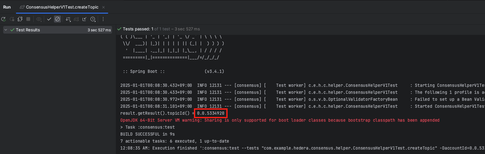

#### submitMessage

createTopic 시 생성된 topicId에다가 메시지를 제출해봅시다.

```java
    @Test
    void submitMessage() throws PrecheckStatusException, TimeoutException, ReceiptStatusException {
        String topicId = "0.0.5334920";
        String message = "hello, i'm kim";

        HederaTransactionResponseVo<MessageResponseVo> result
                = consensusHelper.submitMessage(topicId, message, null, null);

        Assertions.assertThat(result.getStatus()).isEqualTo(Status.SUCCESS);
        Assertions.assertThat(result.getResult().message()).isEqualTo(message);
    }
```

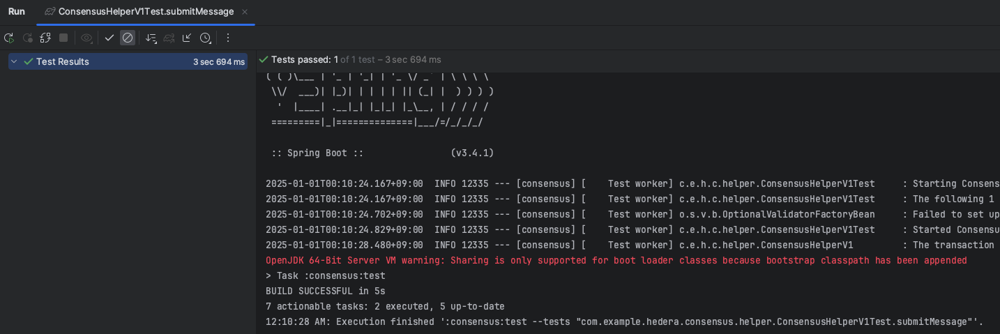

#### hashscan 확인

> 토픽이 제대로 생성되고 메시지가 전송이 됐는지 [hashscan](https://hashscan.io/testnet/dashboard)을 통해 확인해보겠습니다.

##### 생성된 토픽 아이디로 검색

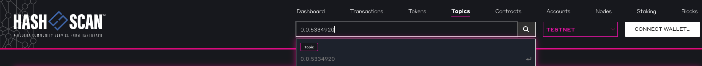

##### 토픽 정보 및 메시지 정보 확인

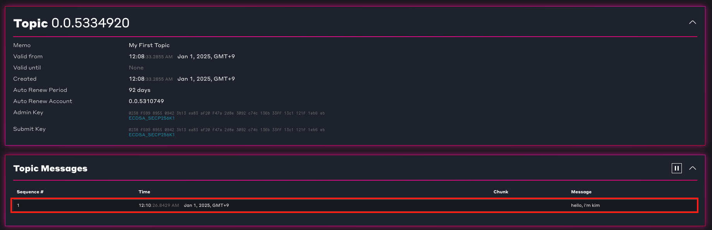

##### 메시지 정보 확인

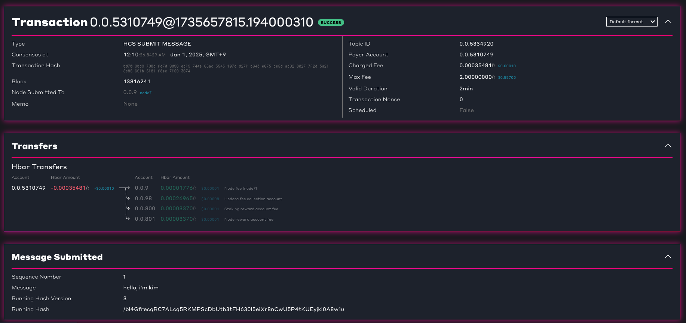


## 마치며

---

이번 포스팅에서는 **높은 처리량**과 **저렴한 수수료**로 데이터를 기록할 수 있는 **Hedera Consensus Service(HCS)**에 대해 알아보고, 이를 직접 구현해보았습니다. 프로젝트를 통해 HCS의 특징과 동작 방식을 이해하게 되었으며, **간단하지만 중요한 데이터**를 저장하는 데 활용도가 높은 서비스임을 확인할 수 있었습니다.

쓰다보니 2025년 새해가 되었습니다 ㅎㅎ 2024년도 다들 고생 많으셨고 2025년에도 열심히 개발해서 다들 원하는 바를 이루셨으면 좋겠습니다. 모두들 새해 복 많이 받으세요!


## Reference

---

- <https://docs.hedera.com/hedera>
- <https://github.com/hashgraph/hedera-sdk-java/blob/main/docs/java-app/java-app-quickstart.md>
- <https://hedera.com/consensus-service>
- <https://hashscan.io/testnet/dashboard>
- <https://chainspect.app/dashboard>


## 전체 코드

---

- <https://github.com/DevK-Jung/hedera-example>
