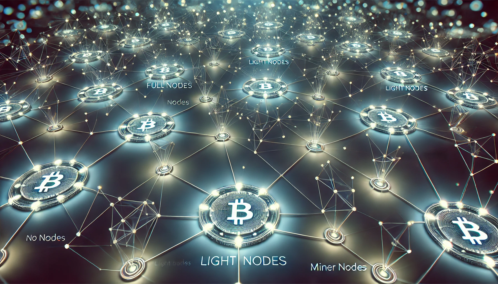

 

> 이번 포스팅에서는 블록체인 기술에서 데이터를 저장, 관리 및 교환하는 중요 구성 요소인 **"노드(Node)"** 의 정의와 대표적인 노드의 종류, 그리고 각 노드들의 역할에 대해 알아보겠습니다. 

## 노드(Node) 란? 

---

> 노드는 컴퓨터 네트워크를 구성하는 기본 단위로, 네트워크에 연결된 하나의 기기를 의미합니다. 이를테면 PC, 스마트폰, 태블릿 같은 장치 모두 노드로 간주될 수 있습니다.  

### 블록체인에서의 노드

> 자 그럼 블록체인에서의 노드는 무엇을 의미할까요? **블록체인에서의 노드(Node)**는 블록체인 네트워크에 참여하는 각 기기를 말합니다. 다시 말해, 블록체인 네트워크에 연결된 **개별적인 컴퓨터나 장치**를 의미하며, 이를 통해 네트워크에 기여하는 모든 참여자들의 기계를 노드라고 볼 수 있겠습니다. 이러한 노드(블록체인 참여자)들은 새로운 블록(데이터)을 생성하고, 블록체인 네트워크에서 이루어지는 거래 내역(트랜잭션)을 검증하며, 블록체인 데이터를 저장하고 관리하는 역할을 수행하게 됩니다.

## 노드 종류 

---

> 블록체인 네트워크에서 노드는 수행하는 역할에 따라 그리고 블록체인 시스템에 따라 다양한 유형으로 분류됩니다. 크게는 **데이터 가용성**에 따른 분류와 **특정 목적**에 따른 분류로 나뉩니다.

### 1. 데이터 가용성에 따른 분류

#### 1-1. 풀 노드(Full Node)

**풀 노드는 블록체인에서 이루어진 모든 거래 정보를 보유한 노드를 뜻합니다.** 모든 블록과 트랜잭션 데이터를 보관하며 다른 노드에 의존하지 않고 트랜잭션과 블록의 유효성을 독립적으로 검증하며 데이터를 계속 동기화하여 최신 상태를 유지한다는 특징을 지니고 있습니다. 허나 전체 데이터를 보관하는 만큼 많은 저장 공간과 처리 능력이 필요하며, 동기화에 많은 시간이 소요됩니다.

 

#### 1-2. 아카이브 노드(Archive Node)

아카이브 노드는 풀 노드보다 더 향상된 기능을 제공합니다. 이더리움 기준으로 풀 노드는 최근 128개 블록의 상태만 지니고 그 이전의 것은 지워냅니다. 반면 아카이브 노드는 **모든 블록의 모든 상태를 보존**하기 때문에 과거 잔고 정보를 조회하거나, 모든 블록을 확인하여 트랜잭션 내역 전체를 다시 실행하는 것이 가능합니다. 이를 통해 과거 데이터 복원 및 심층 분석에 사용되어 네트워크의 과거 데이터를 완벽히 복구 가능합니다. 허나 풀 노드에 비해 많은 데이터를 저장해야 하고 동기화 상태도 정확하게 유지시켜야 하기 때문에 높은 기술적 전문성과 막대한 운영 비용이 필요합니다.

 

#### 1-3. 프룬드 노드(Pruned Node) 

**특정 범위의 블록 데이터와 상태 값만 보관할 수 있도록 데이터의 범위를 지정하여 선택적으로 저장할 수 있는 노드**입니다.  일부 데이터만을 선택적으로 저장할 수 있기 때문에 저장 공간과 리소스를 감소 시킬 수 있습니다.

 

#### 1-4. 라이트 노드(Light Node)

라이트 노드는 풀 노드와 달리 전체 데이터를 저장하는 것이 아닌 **필요한 최소한의 데이터만 보관**합니다. 주로 블록의 헤더를 포함하는 일부 데이터만 가지고 있기에 저장 공간과 네트워크 리소스가 적게 필요하다는 장점이 있습니다. 하지만 전체 데이터를 저장하고 있지 않기에 필요한 데이터를 풀 노드로부터 요청해야해서 풀 노드의 의존적이며 독립적인 검증이 어렵다는 단점이 있습니다.

 

### 2. 특정 목적에 따른 분류

#### 2-1. 밸리데이터 노드(Validator Node) 

**`지분증명 - PoS(Proof of Stake)` 기반 네트워크에서 블록의 유효성을 검증하고 블록 생성에 참여하는 노드**로 새로운 트랜잭션을 검증하는 기능을 갖춘 풀 노드입니다.

 

#### 2-2. 마이닝 노드(Mining Node) 

**`작업증명 - PoW(Proof of Work)` 기반 네트워크에서 블록을 생성하고 트랜잭션을 처리하는 노드**로 밸리데이터 노드와 마찬가지로 트랜잭션을 검증하고 블록을 생성하는 풀 노드입니다. 

 

#### 2-3. RPC 노드(RPC Node)

**원격 프로시저 호출(RPC) 요청에 응답하여 사용자 및 애플리케이션이 블록체인 데이터에 접근할 수 있도록 하는 노드**로 요청에 응답할 수 있는 풀 노드를 지칭합니다. ` 'RPC 클라이언트 - 서버'`  모델에 따라 dApp은 클라이언트, 서버는 RPC 노드 역할을 하게 됩니다.

 

#### 2-4. 시드 노드(Seed Node)와 부트 노드(Boot Node)

**네트워크를 구성하는 노드들의 주소록**을 제공하여 다른 노드들이 네트워크에 쉽게 연결되도록 돕는 노드로 네트워크 연결성을 유지합니다. 시드 노드는 비트코인 네트워크에서 처음 등장했으며, 이더리움 호환 체인에서는 부트 노드라고 불립니다. 새로운 노드는 블록체인 네트워크에 참여하기 위해 이러한 시드 또는 부트 노드 중 하나와 연결되야하며 새로운 노드에게 네트워크 내에 활성화된 노드들의 IP 주소 목록을 제공함으로써, 노드 간의 중계자 역할을 수행하게 됩니다.

 

## 정리

---

| **분류**                      | **노드 종류**                                  | **설명**                                                     |
| ----------------------------- | ---------------------------------------------- | ------------------------------------------------------------ |
| **데이터 가용성에 따른 분류** | **풀 노드 (Full Node)**                        | 모든 블록 데이터를 보유하고 최근 상태 값만 저장하며, 독립적으로 트랜잭션과 블록의 유효성을 검증 가능. |
|                               | **아카이브 노드 (Archive Node)**               | 모든 블록 데이터와 상태 정보를 저장, 과거 데이터와 상태를 모두 복구 가능. |
|                               | **프룬드 노드 (Pruned Node)**                  | 저장 공간 절약을 위해 특정 범위의 블록 데이터와 상태 값만 보관하도록 커스텀 가능한 노드. |
|                               | **라이트 노드 (Light Node)**                   | 블록 헤더와 최근 블록 데이터를 저장, 저장 공간 및 네트워크 리소스 소비 감소. |
| **특정 목적에 따른 분류**     | **밸리데이터 노드 (Validator Node)**           | PoS(Proof of Stake) 기반 네트워크에서 트랜잭션과 블록의 유효성을 검증. |
|                               | **마이닝 노드 (Mining Node)**                  | PoW(Proof of Work) 기반 네트워크에서 블록을 생성하고 트랜잭션을 처리. |
|                               | **RPC 노드 (RPC Node)**                        | 사용자 및 애플리케이션이 블록체인 데이터에 접근할 수 있도록 API를 제공. |
|                               | **시드 노드(Seed Node), 부트 노드(Boot Node)** | 네트워크 연결성을 유지하며 블록체인 네트워크 내 노드 주소 정보를 관리 주소록 역할 |

## 마치며

---

이번 포스팅에서는 다양한 블록체인 노드 종류와 역할에 대해 간략하게 알아봤습니다. 그 밖에도 블록체인 시스템은 목적에 따라 여러 유형의 노드들이 존재하며, 각 노드는 네트워크의 안정성과 효율성을 유지하는 데 중요한 역할을 합니다. 블록체인 네트워크를 이해하고 활용할 때 이러한 노드들의 특성과 기능을 자세히 살펴보면 해당 블록체인의 특성을 파악하는데 많은 도움이 될 것 같습니다. 감사합니다.

## Reference 

---

 <https://brunch.co.kr/@gapcha/166> 

<https://medium.com/dsrv/%EB%85%B8%EB%93%9C-a-to-z-a0d79f5d125c>
