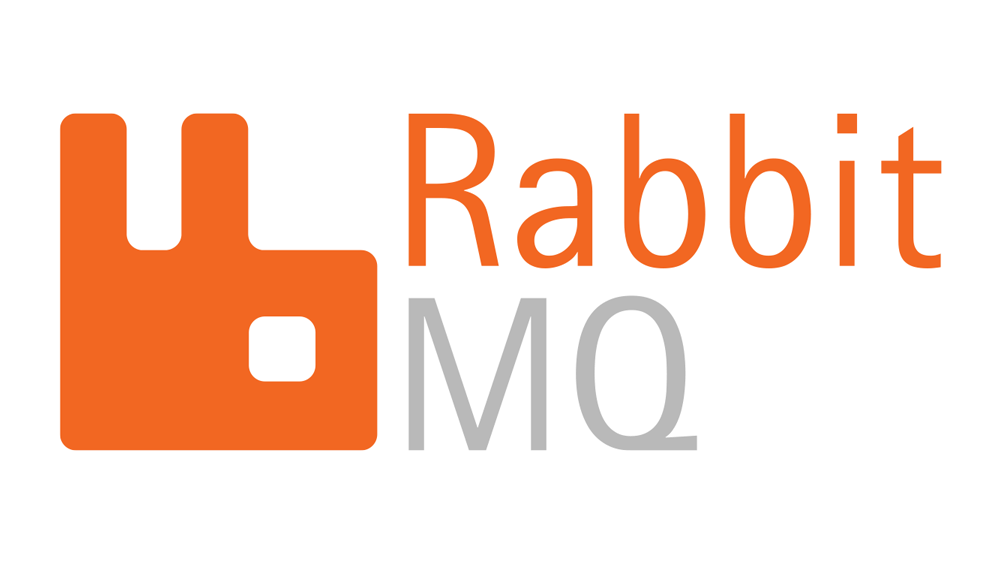
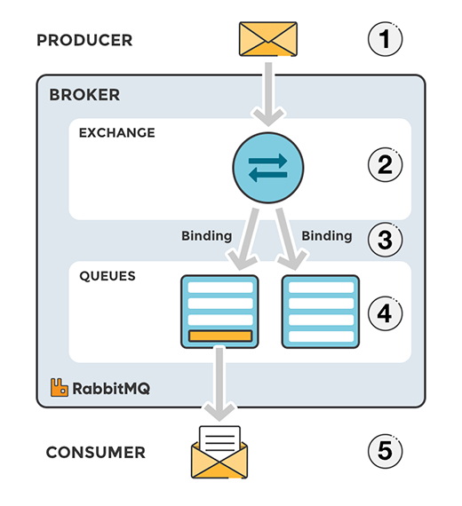
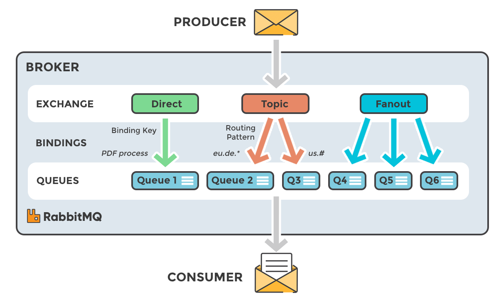
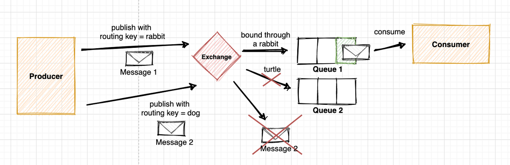
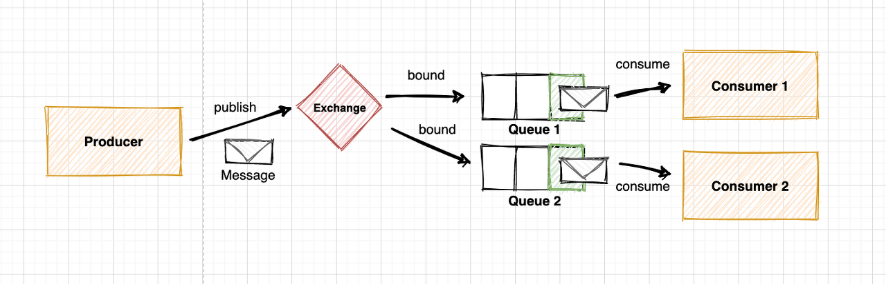
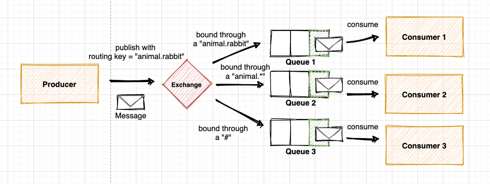
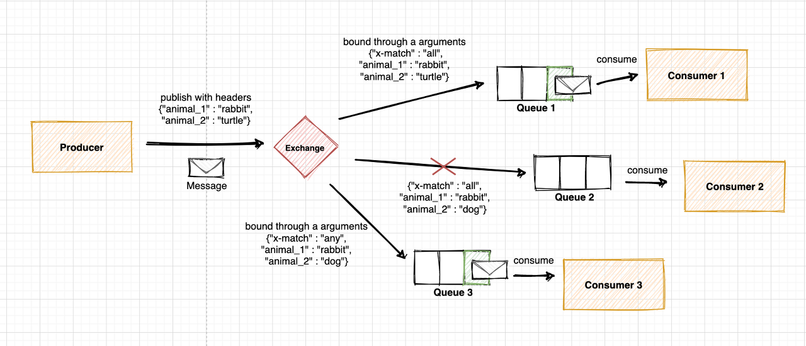

> 오늘은 메시지 브로커 중 하나인 RabbitMQ에 대해서 알아보도록 하겠습니다.

## RabbitMQ 란?

---

> **RabbitMQ**는 **메시지 브로커(Message Broker)** 또는 **메시지 큐(Message Queue)**라고 불리는 소프트웨어입니다. 이는 애플리케이션, 시스템 또는 서비스 간에 데이터를 교환하거나 통신을 관리하는 데 사용됩니다. RabbitMQ는 **AMQP(Advanced Message Queuing Protocol)**를 기반으로 설계되었으며, 분산 시스템에서 비동기 메시징을 지원합니다.
>
> > **AMQP(Advanced Message Queuing Protocol) 란?**
> >
> > 메시지 지향 미들웨어를 위한 오픈 표준 프로토콜입니다. 주로 메시지 브로커와 클라이언트 간에 데이터가 안전하고 신뢰성 있게 전송되도록 설계되었으며 메시징 시스템에서 상호 운용성을 보장하며, 비동기 메시징에 최적화 되어있는 프로토콜 입니다.

## 중요 개념

---

AMQP의 기본 개념이기도 하면서 RabbitMQ의 주요 구성 요소에 대해서 알아보도록 하겠습니다.

출처 <https://coding-start.tistory.com/371>

- **PRODUCER**: 데이터 송신자로 메시지를 생성하고 브로커(Broker)로 전송하는 역할 - 메시지에는 라우팅 키가 포함될 수 있음
- **BROKER** : 프로듀서(Producer)와 컨슈머(Consumer)간의 메시지를 중개하는 시스템
  - **EXCHANGE**: 메시지를 특정 큐로 라우팅하는 역할 - 4가지 타입이 존재
  - **Binding**: 익스체인지(Exchange)와 큐를 연결하는 설정
  - **QUEUES**: 메시지를 저장하는 공간으로, FIFO(First in, First Out) 방식으로 처리, 컨슈머가 메시지를 처리할 때까지 대기합니다.
- **CONSUMER**: 데이터 수신자로 큐에서 메시지를 읽고 처리하는 역할. 메시지 처리 후 브로커에 확인(Acknowledgment) 전송 가능

## Exchange Type 4가지

---

> 메시지를 특정 큐로 라우팅하는 방법은 4가지 방식이 있습니다.  이를 알기 전에 **라우팅 키(Rounting Key)** 에 대해서 간단히 이해하고 가겠습니다.  라우팅 키란 RabbitMQ에서 익스체인지(Exchange)가 메시지를 적절한 큐(Queue)로 라우팅할 때 사용하는 문자열입니다. 메시지를 보내는 프로듀서(Producer)가 설정하며, 익스체인지와 큐의 바인딩(Binding) 규칙에 따라 메시지가 특정 큐로 전달됩니다.  예를 들어, 주문 생성이라는 라우팅 키를 설정한다면 다음과 같이 설정할 수 있습니다. (예: `order.created`) 또한 `*`,` #`을 통해 특정 패턴과 매칭되는 큐로 메시지 전달도 가능합니다. 아래 Exchange Type을 살펴보며 좀 더 자세히 알아보겠습니다.

출처 <https://coding-start.tistory.com/371>

### 1. Direct Exchange

출처 <https://velog.io/@sdb016/RabbitMQ-%EA%B8%B0%EC%B4%88-%EA%B0%9C%EB%85%90>

- 라우팅 키를 정확히 일치시키는 큐로 메시지를 전달합니다.
- 1:1 또는 1:N 메시지 라우팅에 적합합니다.
- 라우팅 키가 일치하지 않으면 메시지는 삭제되거나 Dead Letter Queue로 이동합니다.
- ex) `rounting_key="rabbit"` 로 설정된 메시지는 `"rabbit"`로 바인딩된 큐에 전달됩니다.

### 2. Fanout Exchange

출처 <https://velog.io/@sdb016/RabbitMQ-%EA%B8%B0%EC%B4%88-%EA%B0%9C%EB%85%90>

- 연결된 모든 큐로 메시지를 브로드캐스팅 방식으로 전달합니다.
- 라우팅 키를 사용하지 않습니다.
- 실시간 알림 시스템, 채팅 애플리케이션, 로그 브로드캐스트 등에서 사용됩니다.

### 3. Topic Exchange

출처 <https://velog.io/@sdb016/RabbitMQ-%EA%B8%B0%EC%B4%88-%EA%B0%9C%EB%85%90>

- 라우팅 키의 패턴을 기반으로 메시지를 전달합니다.
- `*` 는 한 단어를, `#`는 여러 단어를 대체할 수 있는 와일드 카드로 사용됩니다.
- 다대다(M:N) 라우팅이 가능합니다.
- 복잡한 라우팅 조건을 설정할 수 있습니다.
- ex) `animal.*`, `#`

### 4. Heders Exchange

출처 <https://velog.io/@sdb016/RabbitMQ-%EA%B8%B0%EC%B4%88-%EA%B0%9C%EB%85%90>

- 메시지 헤더의 속성을 기준으로 라우팅합니다.
- 라우팅 키를 사용하지 않으며, 헤더 값과 바인딩 값이 일치해야 메시지를 전달합니다.
- `x-match` 속성
  - `all`: 헤더의 **모든 key-value 조건**을 만족해야 메시지가 큐로 전달됩니다.
  - `any`: 헤더 조건 중 **하나라도 만족**하면 메시지가 큐로 전달됩니다.

### 요약

| **타입**    | **라우팅 방식**                                          | **라우팅 키 사용 여부**    | **주요 사용 사례**            |
| ----------- | -------------------------------------------------------- | -------------------------- | ----------------------------- |
| **Direct**  | 라우팅 키와 바인딩 키가 **정확히 일치**할 때 메시지 전달 | 사용                       | 작업 큐(Task Queue)           |
| **Fanout**  | 라우팅 키 없이 모든 연결된 큐로 **브로드캐스트**         | 사용 안 함                 | 실시간 로그 전달, 이벤트 알림 |
| **Topic**   | 라우팅 키와 **패턴 매칭**(와일드카드 `*`, `#`)으로 전달  | 사용                       | 뉴스 분류, IoT 데이터 필터링  |
| **Headers** | 메시지 헤더의 **조건(key-value)** 기반으로 전달          | 사용 안 함, 대신 헤더 사용 | 복잡한 조건 기반 라우팅       |

## 마치며

---

오늘은 메시지 브로커 중 하나인 **RabbitMQ**에 대해 간단히 알아보았습니다. **MSA**를 공부하며 서비스 간 결합도를 줄이는 방법으로 RabbitMQ를 접하게 되었는데, 다른 다양한 사용 사례에 대해서도 살펴보면 큰 도움이 될 것 같습니다. 다음 포스팅에서는 RabbitMQ를 직접 설치하고, 간단한 예제를 통해 동작 방식에 대해 보다 깊이 알아보도록 하겠습니다. 
감사합니다.

## Reference

---

- <https://www.rabbitmq.com/>
- <https://coding-start.tistory.com/371>
- <https://velog.io/@sdb016/RabbitMQ-%EA%B8%B0%EC%B4%88-%EA%B0%9C%EB%85%90>
