> 오늘은 RabbitMQ를 직접 설치하고, RabbitMQ의 GUI 환경을 간단히 살펴보겠습니다. 이후 **Exchange**와 **Queue**를 생성하고, Binding으로 연결한 뒤 메시지를 직접 발행(Publish)하여 동작을 확인해보겠습니다.

## 설치하기

---

### 환경

- **운영체제:** macOS
- **설치 도구:** Homebrew
- **설치 사이트**: <https://www.rabbitmq.com/docs/install-homebrew>

### 1. hombrew update

설치하기 전 패키지 매니저를 최신 상태로 update 해줍니다.

```bash
brew update
```

### 2. RabbitMQ install

rabbitMQ 를 설치해줍니다.

``` bash
brew install rabbitmq
```

### 3. 설치된 RabbitMQ 정보 확인

```bash
brew info rabbitmq
```

아래 처럼 실행됐다면 RabbitMQ를 실행해 봅시다.

이때 rabbitMQ GUI 에 접속하기 위한 호스트와 포트 정보를 확인해주세요 `Management UI: http://localhost:15672`

```bash
❯ brew info rabbitmq
==> rabbitmq: stable 4.0.5 (bottled)
Messaging and streaming broker
https://www.rabbitmq.com
Installed
/opt/homebrew/Cellar/rabbitmq/4.0.5 (1,521 files, 23.3MB) *
  Poured from bottle using the formulae.brew.sh API on 2025-01-01 at 08:59:47
From: https://github.com/Homebrew/homebrew-core/blob/HEAD/Formula/r/rabbitmq.rb
License: MPL-2.0
==> Dependencies
Required: erlang ✔
==> Caveats
Management UI: http://localhost:15672
Homebrew-specific docs: https://rabbitmq.com/install-homebrew.html

To start rabbitmq now and restart at login:
  brew services start rabbitmq
Or, if you don't want/need a background service you can just run:
  CONF_ENV_FILE="/opt/homebrew/etc/rabbitmq/rabbitmq-env.conf" /opt/homebrew/opt/rabbitmq/sbin/rabbitmq-server
==> Analytics
install: 5,711 (30 days), 17,122 (90 days), 73,529 (365 days)
install-on-request: 5,706 (30 days), 17,114 (90 days), 73,520 (365 days)
build-error: 0 (30 days)
```

### 4. RabbitMQ 실행

위에서도 설명했지만  `brew info rabbitmq` 명령어를 통해 확인했던 `Management UI: http://localhost:15672` 로 실행됩니다.

아래 명령어 실행 후 <http://localhost:15672> 로 접속해봅시다.

```bash
brew services start rabbitmq
```

초기 아이디/비밀번호: guest/guest

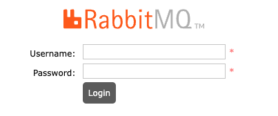

## RabbitMQ 메뉴

---

> 로그인을 하게 되면 아래와 같은 화면이 뜨는 것을 확인하실 수 있을 겁니다. 이번에는 각 메뉴들에 대해서 알아보도록 하겠습니다.

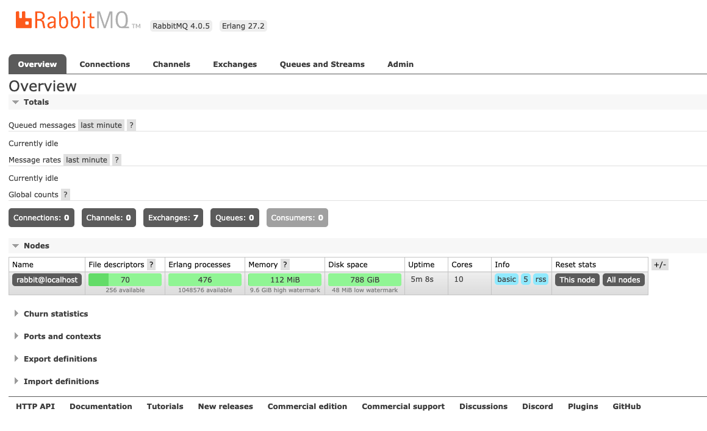

| **메뉴**               | **주요 기능**                               |
| ---------------------- | ------------------------------------------- |
| **Overview**           | 브로커 전체 상태와 성능 모니터링            |
| **Connections**        | 연결된 클라이언트의 정보와 상태 관리        |
| **Channels**           | 연결 내 생성된 채널 관리 및 처리량 모니터링 |
| **Exchanges**          | 메시지 라우팅을 위한 익스체인지 관리        |
| **Queues and Streams** | 큐 상태 및 메시지 소비 상태 관리            |
| **Admin**              | 사용자, 권한, 정책, 플러그인 설정 관리      |

### 1. Overview

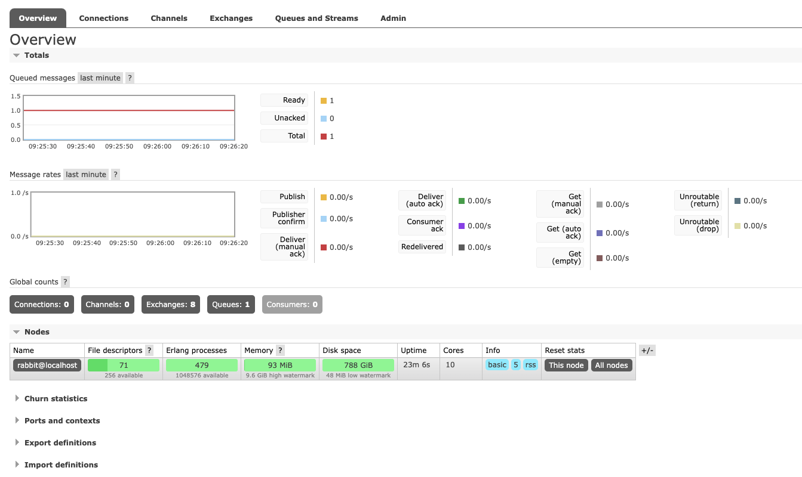

- RabbitMQ 브로커의 전체 상태와 성능을 한 눈에 확인할 수 있는 대시보드
  - 연결된 노드 수
  - 큐와 메시지 수
  - 교환 수

### 2. Connections

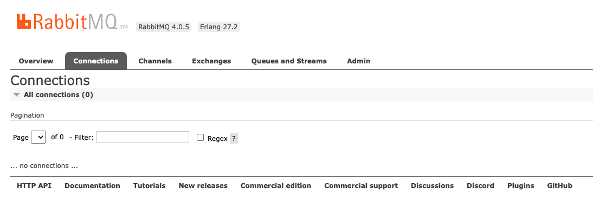

- RabbitMQ에 연결된 클라이언트를 관리합니다.
  - 연결된 클라이언트의 IP 주소 및 포트
  - 연결 상태(활성, 대기 등)
  - SSL 사용 여부

### 3. Channels

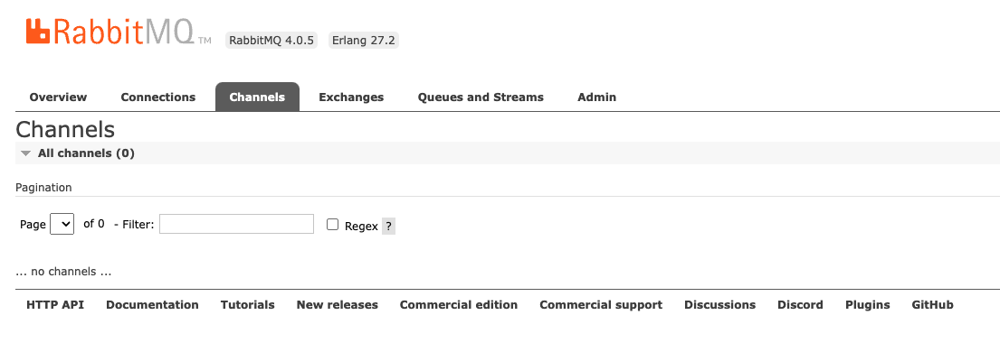

- 각 연결(Connections)에서 생성된 채널을 관리합니다. - RabbitMQ는 한 연결에서 여러 채널을 통해 메시지를 주고 받음
  - 채널별 소비 중인 큐와 처리량
  - 채널 상태 및 기본 설정

### 4. Exchanges

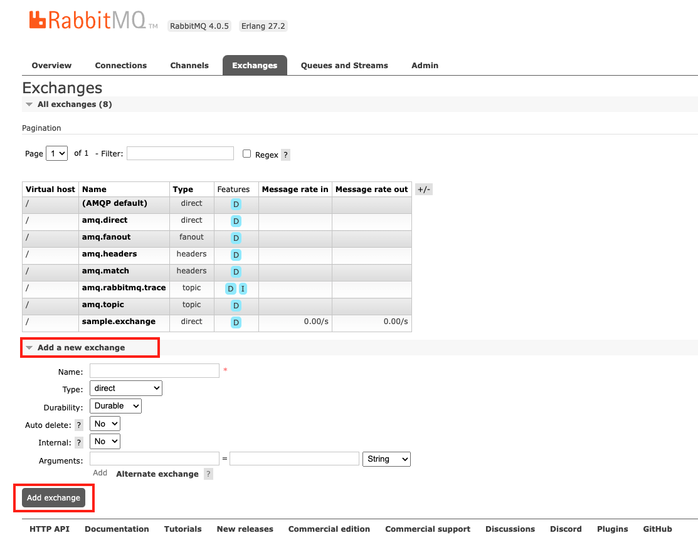

- RabbitMQ의 exchanges를 관리하고 설정합니다.
  - Add a new exchange를 눌러 새로운 exchange를 등록할 수 있습니다.

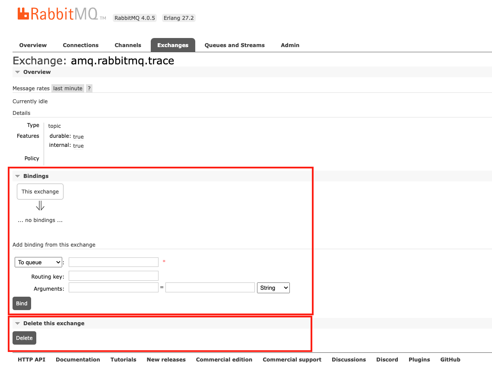

- Exchange 목록에서 exchange 이름을 클릭하면 상세 정보를 확인할 수 있으며 bindings 추가, exchange 제거와 같은 기능을 사용할 수 있습니다.

### 5. Queues and Streams

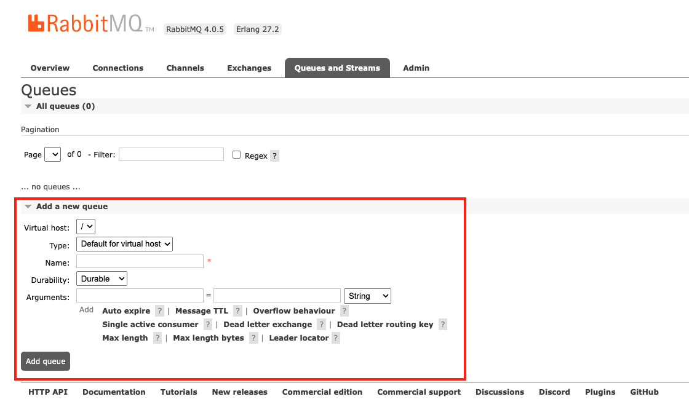

- RabbitMQ의 Queue를 관리하고 설정합니다.
  - Add a new queue를 눌러 새로운 queue를 등록할 수 있습니다.

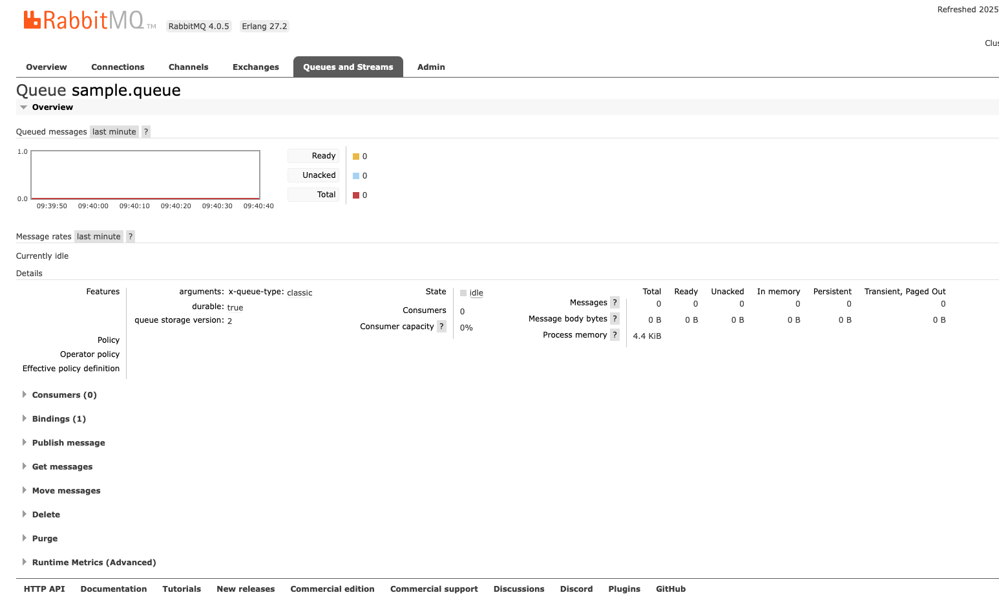

- queue 목록에서 queue 이름을 클릭하면 상세 정보를 확인할 수 있으며 아래 기능을 사용할 수 있습니다.
  - **Consumers**: 큐에 연결된 컨슈머 목록 및 상태 확인
  - **Bindings**: 큐와 익스체인지 간 바인딩 정보 확인 및 추가
  - **Publish message**: 큐로 직접 메시지 발행
  - **Get messages**: 큐에서 메시지 수동 조회 및 처리
  - **Delete**: 큐 제거
  - **Purge**: 큐의 대기 중인 메시지 모두 삭제
  - **Runtime Metric(Advanced)**: 큐의 성능 지표 확인(메시지 처리 속도, 리소스 사용량 등)

### 6. Admin

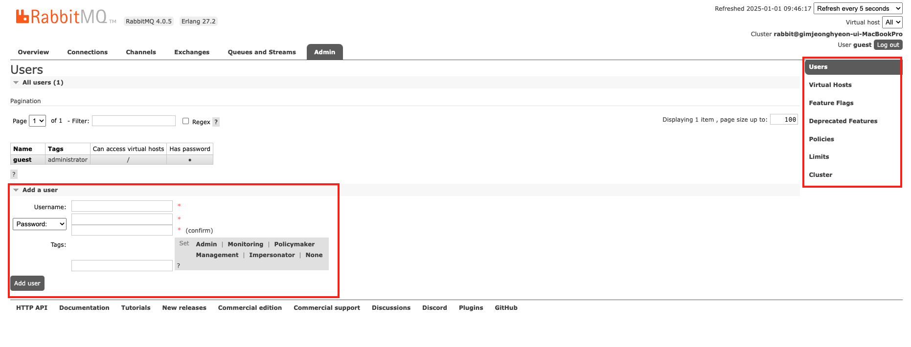

- **Users**: 사용자 계정 관리 및 권한 설정
- **Virtual Hosts**: 가상 호스트를 통해 리소스와 권한 분리
- **Feature Flags**: 새로운 기능 활성화 상태 확인 및 관리
- **Deprecated Features**: 사용 중단된 기능 목록 확인
- **Policies**: 큐와 메시지 TTL, HA, 복제 설정 등 브로커 정책 관리
- **Limits**: 클라이언트 연결 및 채널 수 제한으로 리소스 과다 사용 방지
- **Cluster**: RabbitMQ 클러스터 관리 및 노드 상태 모니터링


## 실습

---

> 이번에는 RabbitMQ GUI를 통해서 **Exchange**와 **Queue**를 생성하고, **Binding**으로 연결한 뒤 **메시지를 직접 발행(Publish)**하여 동작을 확인해보겠습니다.

### 1. exchange 생성

모든 설정은 default로 두고 name이 `test.exchange`인 exchange를 생성해 줍니다.

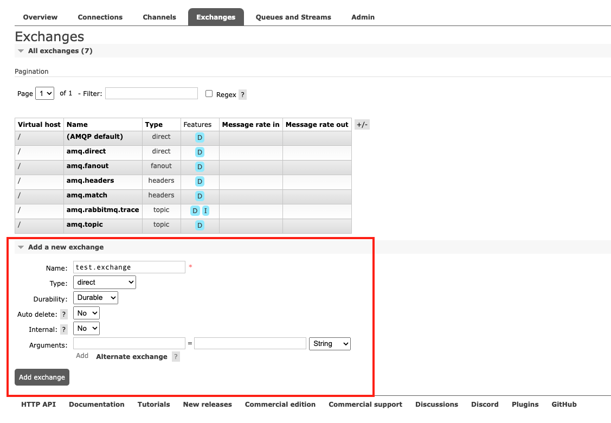

- **Name**: exchange 명

- **Type**: 타입

  - **Direct:** 라우팅 키와 정확히 일치하는 큐로 메시지를 전달

  - **Fanout:** 라우팅 키를 무시하고 모든 연결된 큐로 메시지를 전달

  - **Topic:** 라우팅 키의 패턴 매칭을 기반으로 메시지를 전달

  - **Headers:** 메시지 헤더 값을 기반으로 큐로 메시지를 전달

- **Durability**: 브로커 재시작 후에도 유지될지 여부

  - **Durable:** 브로커 재시작 후에도 익스체인지가 유지됨
  - **Transient:** 브로커 재시작 시 익스체인지가 삭제됨

- **Auto delete**: 익스체인지가 더 이상 사용되지 않을 때 자동 삭제 여부

  - **NO**: 익스체인지 수동으로 삭제될때 까지 유지
  - **YES**: 모든 바인딩 해제되면 익스체인지 삭제

- **Internal**: 익스체인지가 내부 용도로만 사용될지 여부 설정

  - **NO**: 프로듀서가 메시지를 직접 발행할 수 있음
  - **YES**: 프로듀서가 직접 메시지를 발행할 수 없음(다른 익스체인지만 메시지를 발행 가능)

- **Arguments**: 익스체인지의 동작을 세부적으로 제어할 수 있는 사용자 정의 매개변수 설정

  - **alternate-exchange:** 메시지가 라우팅되지 않을 경우 처리할 대체 익스체인지를 지정

### 2. queue 생성

모든 설정은 default로 두고 **Type: Classic** , **Name: test.queue** 인 queue를 생성해 줍시다.

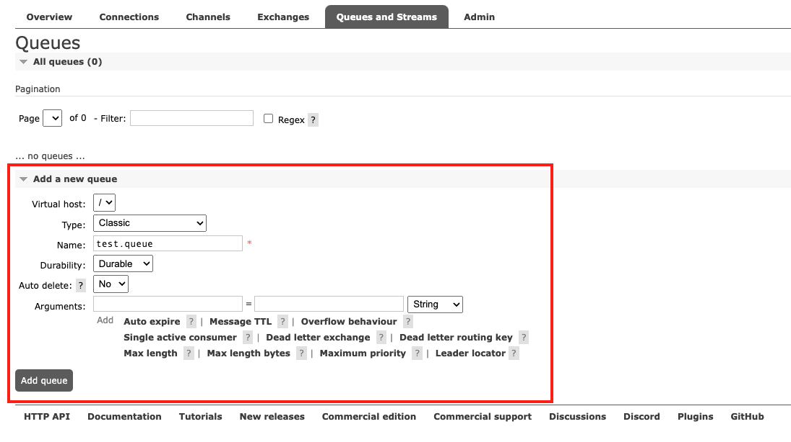

- **Virtual host**: 큐를 생성할 Virtual Host를 선택 - 기본값은 `/`(기본 vHost)
- **Type**: 큐의 유형을 지정합니다.
  - **Classic**: 
    - 가장 기본적인 큐 타입
    - 단일 노드에서 작동
    - 단일 프로듀서와 단일 컨슈머 사이에서만 동작
  - **Quorum**:
    - RabbitMQ 3.8+ 버전 부터 지원
    - 클러스터 전체에 걸쳐 데이터를 복제하여 고가용성을 제공
    - 여러 노드에 메시지를 복제하고 각 메시지에 대해 과반수 확인을 사용하여 안정성 확보
    - 대량의 메시지 처리에 적합
  - **Stream**:
    - RabbitMQ 3.9+ 버전부터 지원
    - 대량 이벤트 스트림 처리를 위해 설계
    - 쿼럼(Quorum)큐와 유사하지만, 주로 스트림 처리와 특화되어 있어 여러 컨슈머가 한 번에 메시지를 처리하는 경우에 유용
- **Name**: 큐의 고유한 이름을 지정합니다.
- **Durability**: 브로커 재시작 후에도 유지될지 여부
  - **Durable:** 브로커 재시작 후에도 큐가 유지됨
  - **Transient:** 브로커 재시작 시 큐가 삭제됨
- **Auto delete**: 큐가 사용되지 않을 때 자동으로 삭제될지 여부를 설정
  - **NO**: 수동으로 삭제하기 전까지 큐 유지
  - **YES**: 큐가 더 이상 사용되지 않으면 자동 삭제
- **Arguments**
  - **Auto expire:** 큐가 비활성 상태로 유지되는 최대 시간을 설정
  - **Message TTL:** 큐에 저장된 메시지의 최대 수명(밀리초)을 설정
  - **Overflow behaviour:** 메시지 초과 시 동작 설정(예: 오래된 메시지 삭제)
  - **Single active consumer:** 한 번에 한 컨슈머만 메시지를 처리하도록 설정
  - **Dead letter exchange:** 메시지가 처리되지 않을 경우 전송될 대체 익스체인지를 지정
  - **Dead letter routing key:** Dead Letter Exchange로 전송 시 사용할 라우팅 키를 설정
  - **Max length:** 큐에 저장할 수 있는 최대 메시지 수를 설정
  - **Max length bytes:** 큐의 최대 메시지 크기를 바이트 단위로 제한
  - **Maximum priority:** 메시지의 우선순위 기능을 설정(높은 숫자가 더 높은 우선순위)
  - **Leader locator:** 클러스터에서 큐 리더를 결정하는 방식 설정(예: `client-local`)


### 3. binding 설정

Exchanges 탭으로 가서 생성했던 `test.exchange` 상세로 이동합니다.

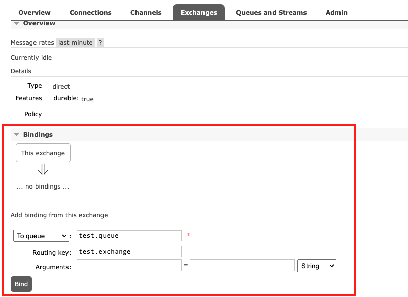

- Routing Key가 `test.queue`로 발행된 메세지가 있으면 `test.queue`로 전달된다.
- 해당 exchagne는 direct type으로 Routing Key가 정확하게 일치하는 경우에만 해당 큐로 전송된다.

### 4. 메세지 publish

Bindings 바로 아래 `Publish message`를 클릭해 아래와 같이 메시지를 전송해 봅시다.

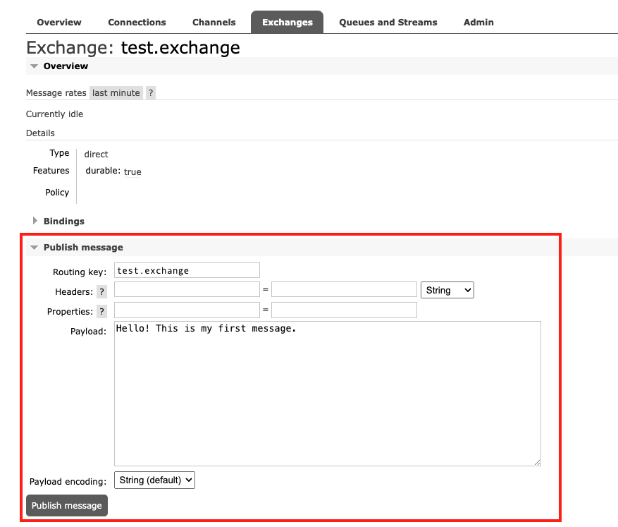

### 5. 메시지 확인

이번에는 `Queues and Streams` 탭으로 이동해 생성했던 test.queue 상세로 이동해줍니다. 그 후 `Get messages` 를 클릭해 message가 queue에 전달이 되었는지 확인해줍니다.

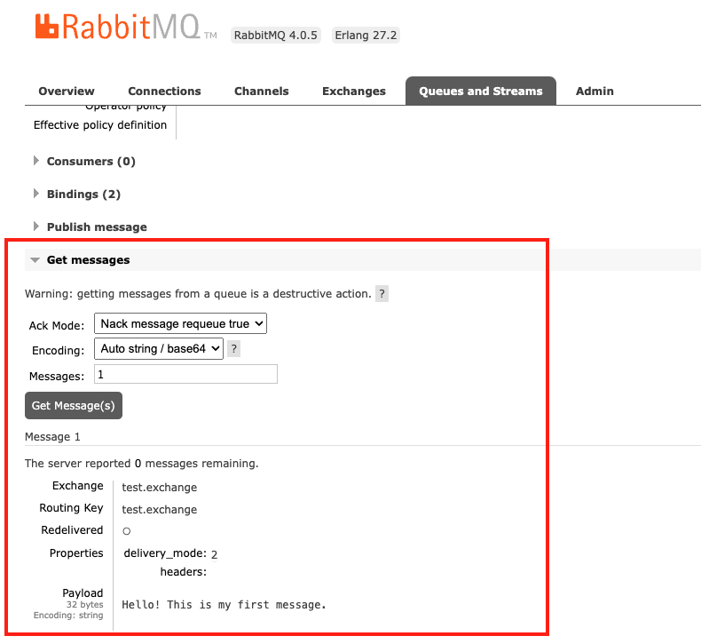


## RabbitMQ 종료 및 제거

---

### rabbitmq 종료

```
brew services stop rabbitmq
```

### 제거

rabbitmq를 제거하고 싶으면 아래 명령어를 쳐주세요

```bash
brew services stop rabbitmq

brew uninstall rabbitmq

# Now delete all node's data directories and configuration files.
# This assumes that Homebrew root is at /opt/homebrew
rm -rf /opt/homebrew/etc/rabbitmq/
rm -rf /opt/homebrew/opt/rabbitmq/
rm -rf /opt/homebrew/var/lib/rabbitmq/
# the launch agent file
rm -f $HOME/Library/LaunchAgents/homebrew.mxcl.rabbitmq.plist
```


## 마치며

---

이번 포스팅에서는 **Homebrew**를 사용해 RabbitMQ를 로컬 환경에 설치하고, RabbitMQ의 GUI를 통해 주요 메뉴를 살펴보았습니다. 모든 메뉴와 사용법을 다루지는 못했지만, 간단한 예제를 통해 메시지가 큐(Queue)로 전달되는 과정을 실습하며 RabbitMQ의 기본 개념을 이해하는 시간을 가졌습니다.<br>다음 포스팅에서는 **Spring Boot**와 RabbitMQ를 연동하여 **Producer**와 **Consumer**를 구현하고, 애플리케이션 간 메시지를 주고받는 실습을 진행해보겠습니다.<br>감사합니다.


## Reference

---

- <https://www.rabbitmq.com/docs/install-homebrew>
- <https://m.blog.naver.com/hj_kim97/223422458502>
