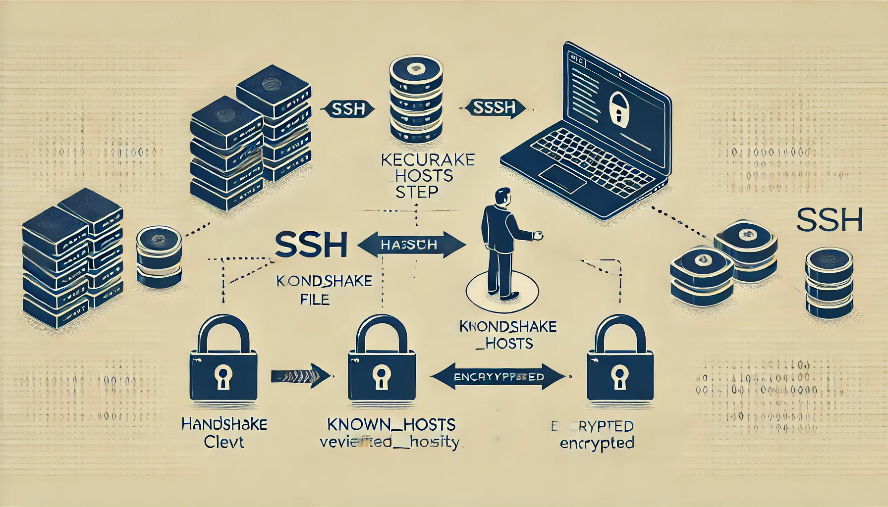
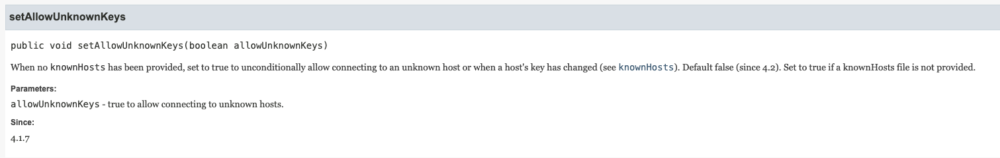

> Spring Integration SFTP를 활용해 원격 서버에서 파일을 가져오는 로직을 구현하는 과정에서 다음과 같은 오류가 발생했습니다.
> 해당 오류의 원인과 해결 방안을 정리한 글입니다.
>
> `org.apache.sshd.common.SshException: Server key did not validate`

## 원인

---

`DefaultSftpSessionFactory`를 사용하여 SFTP 연결을 시도하는 과정에서 문제가 발생했습니다.  해당 클래스에는 **`setAllowUnknownKeys`**라는 옵션이 있으며, 이는 **보안을 위해 등록되지 않은 호스트와의 연결을 차단**하는 역할을 합니다. 아래 그림처럼 default 가 `false`로 `known_hosts` 파일에 등록되지 않은 서버의 키는 기본적으로 차단됩니다.



출처 <https://docs.spring.io/spring-integration/api/org/springframework/integration/sftp/session/DefaultSftpSessionFactory.html#setAllowUnknownKeys(boolean)>


## known_hosts 파일이란?

---

`known_hosts` 는 SSH 연결 과정에서 사용되는 보안 파일입니다. SSH 클라이언트는 원격 서버에 연결할 때 서버의 신원을 확인하기 위해 `known_hosts` 파일을 참조합니다. 해당 파일은 사용자가 신뢰할 수 있는 서버의 공개 키(public key)를 저장하고 관리하는 역할을 합니다.

### 역할

- 서버 신원 확인
  - ssh는 서버의 공개 키를 사용해 신뢰성 검증
  - 서버 공개 키가 클라이언트의 `known_hosts` 파일에 존재할 경우, 해당 서버와의 연결이 신뢰할 수 있는 것으로 간주
- MITM(중간자 공격) 방지
  - 첫 연결 이후에는 공개 키를 비교하여 키가 변경되지 않았음을 확인
  - 이를 통해 중간자 공격을 방지


## 해결 방안

---

### 방안 1. setAllowUnknownKeys 설정 변경(권장 x)

아래와 같이 `factory.setAllowUnknownKeys(true)` 로 설정하여 known_hosts 파일을 확인하지 않고 모든 호스트에 대한 연결을 허용해줍니다. 허나 MITM 공격과 같은 보안 위협에 노출될 수 있으므로 권장하지 않습니다.

```java
DefaultSftpSessionFactory factory = new DefaultSftpSessionFactory();
factory.setAllowUnknownKeys(true);
```

### 방안2. `known_hosts` 파일에 호스트 수동 등록(권장 o)

`known_hosts` 파일에 연결하려는 호스트를 등록해 줍니다.

#### 등록 방법 1. SSH 명령어를 통한 자동 등록

SSH로 연결할 때 호스트 키가 자동으로 추가 됨 - 저는 프로젝트하는 곳에서 보안프로그램이 ssh 명령어를 막아 시도할 수 없었습니다

```bash
ssh <username>@<host>
```

#### 등록 방법 2. ssh-keyscan을 통한 수동 등록

```bash
ssh-keyscan -H <서버 IP 또는 도메인> >> ~/.ssh/known_hosts
```


## Reference

---

- <https://docs.spring.io/spring-integration/api/org/springframework/integration/sftp/session/DefaultSftpSessionFactory.html>
