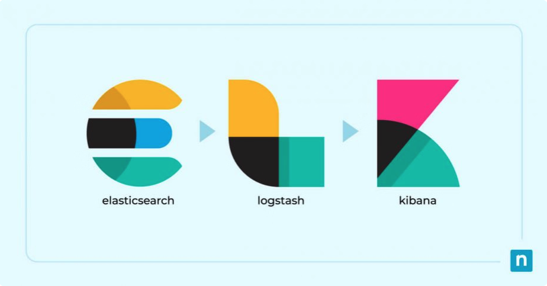
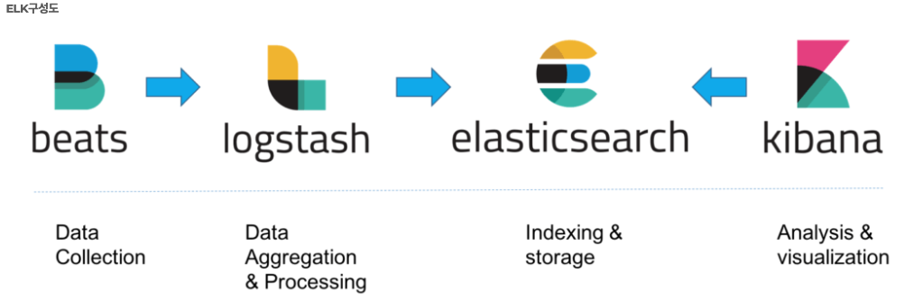
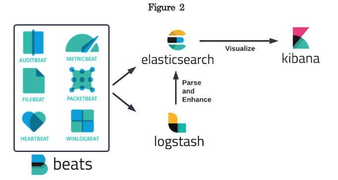
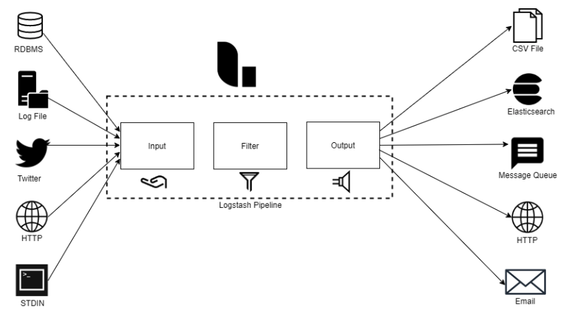
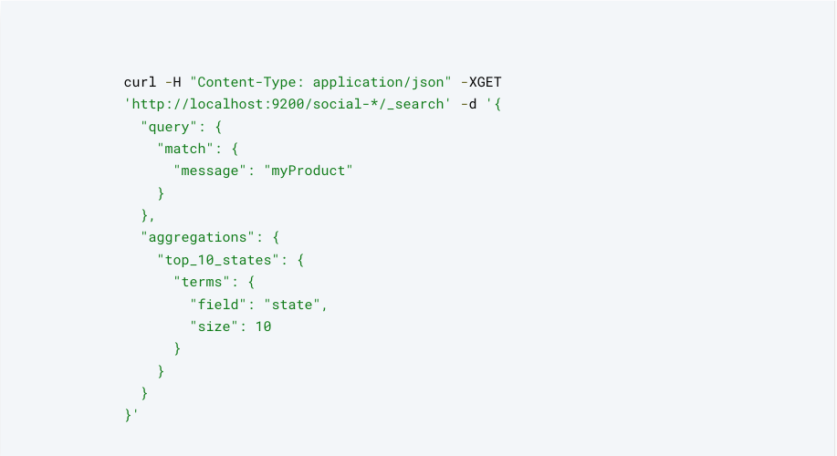
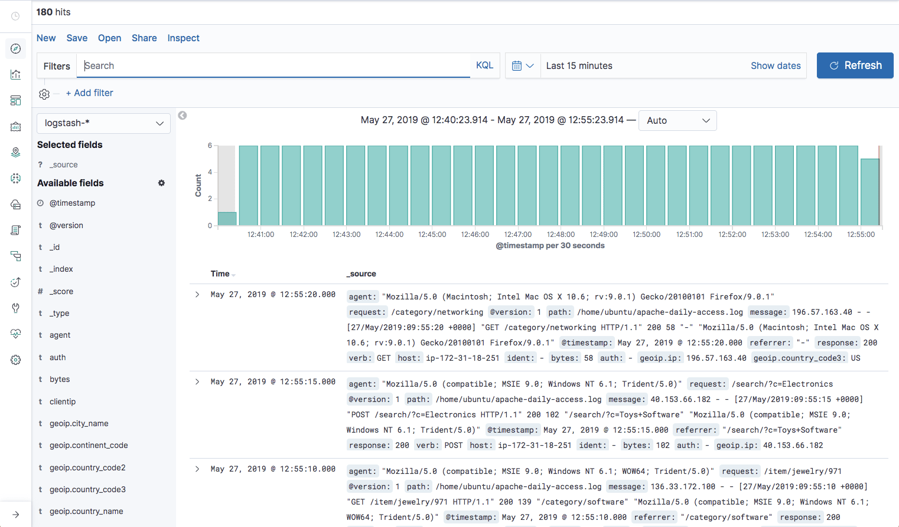
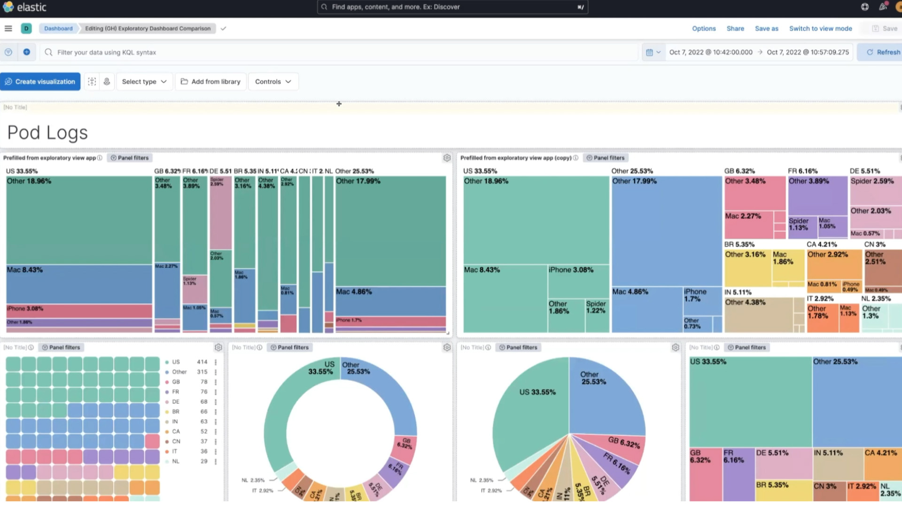

출처 <https://www.ninjaone.com/blog/what-is-elk-stack/>

>프로젝트 안정화 기간 동안 Kafka와 ELK 스택을 활용하여 5개 시스템의 로그를 중앙화하고, 모니터링 도구를 통해 오류나 특이사항을 실시간으로 파악하여 빠르게 대응할 수 있었습니다. 이번 포스팅에서는 이러한 역할을 수행하는 **ELK 스택**에 대해서 정리해보겠습니다.

## ELK 스택이란?

---

> ELK 스택은 Elasticsearch, Logstash, Kibana 의 세 가지 인기 있는 프로젝트로 구성된 스택을 의미하는 약어입니다. ELK 스택은 사용자에게 모든 시스템과 애플리케이션에서 로그를 집계하고 이를 분석하여 애플리케이션과 인프라 모니터링 시각화를 생성하고, 빠르게 문제를 해결하며 보안 분석할 수 있는 능력을 제공합니다. - [aws](https://aws.amazon.com/ko/what-is/elk-stack/)

위에 aws에서 설명한대로 ELK 는 Elasticsearch, Logstash, Kibana 의 약어로 이 3개의 도구를 사용하여 로그를 집계 및 분석하여 모니터링 시각화 할 수 있도록 도와주는 스택입니다. 추가로 여기에 beats라는 도구까지 포함해서 주로 사용됩니다. 

각 도구들에 대해 설명하기 전에 ELK 스택에 구성도를 살펴보겠습니다.



출처 <https://accordions.co.kr/accordion_tip/accordion-elk/>

ELK 스택은 로그를 수집, 처리, 저장, 시각화하기 위해 위 ELK 구성도에 나와있는대로 4가지 도구가 유기적으로 연결되어 동작합니다.

- **Beats**: 로그와 데이터를 수집하여 Logstash로 전달
- **Logstash**: Beats에서 전달받은 데이터를 변환하여 Elasticsearch로 전달
- **Elasticsearch**: 데이터를 저장하고 검색/분석 기능 제공
- **Kibana**: Elasticsearch에 저장된 데이터를 시각화 및 분석


## ELK 스택 도구 설명

---

### Beats

데이터를 수집하여 Logstash 또는 Elasticsearch 로 전송하는 데이터 발송자 역할을 합니다



출처 <https://dzone.com/refcardz/monitoring-and-the-elk-stack>

- 이러한 Beats에는 여러 종류가 있습니다.
  - **Filebeat**: 파일로 부터 로그 및 기타 데이터 수집 전용
  - **Metricbeat**: 시스템 및 애플리케이션 성능 메트릭 수집
  - **Packetbeat**: 네트워크 트래픽 데이터 수집
  - **Winlogbeat**: Windows 이벤트 로그 수집
  - **Heartbeat**: 서비스 가용성 모니터링

#### filebeat.yml

아래는 이해를 돕기 위한 filebeat의 설정 파일입니다. input 과 output을 설정하는데 input에서는 log를 수집하기 위한 파일 경로를 output에서는 logstash hosts를 설정하는 것을 볼 수 있습니다.

```yaml
 # 로그 입력 경로 설정
filebeat.inputs:
  - type: log
    paths:
      - /var/log/*.log

# Logstash 출력 설정 (선택적 사용)
output.logstash:
  hosts: ["localhost:5044"]
```


### Logstash

데이터 처리 및 변환 도구로, Beats로 부터 데이터를 전달 받아 원하는 형태로 가공한 후 Elasticsearch에 전달합니다. 



출처 <https://www.xplg.com/what-is-logstash/>

Logstash는 3가지 구성요소로 이루어져 있습니다.

- **Input**
  - 데이터를 수집
  - 예: beats, Http, kafka, 데이터베이스
- **Filter (옵션)**
  - 데이터를 변환하거나 필터링
  - 예: 필드 추가/삭제, 정규표현식을 사용한 데이터 가공
- **Output**
  - 데이터를 최종적으로 전달할 대상 정의
  - 예: elasticsearch, 파일, 데이터베이스 등

아래는 이해를 돕기위한 Logstash 설정 파일인 logstash.conf 파일 입니다.

``` 
input {
  beats {
    port => 5044
  }
}

filter {
  # Apache 로그 데이터 파싱
  grok {
    match => { "message" => "%{COMBINEDAPACHELOG}" }
  }

  # 날짜 파싱 및 표준화
  date {
    match => [ "timestamp", "dd/MMM/yyyy:HH:mm:ss Z" ]
    target => "@timestamp"
  }
}

output {
  # Elasticsearch로 전송
  elasticsearch {
    hosts => ["http://elasticsearch-0.elasticsearch-svc:9200"]
    index => "apache-logs-%{+YYYY.MM.dd}"
  }

  # 2. 특정 태그가 포함된 데이터만 별도 파일로 저장
  if "error" in [tags] {
    file {
      path => "/var/log/logstash/errors.log"
      codec => line { format => "%{message}" }
    }
  }
}

```


### Elasticsearch

분산형 검색 및 분석 엔진으로, 데이터 저장소의 핵심 역할을 합니다.



출처 <https://www.elastic.co/kr/elasticsearch>

특징

- **JSON 기반 저장**: 데이터를 키-값 쌍 형태로 JSON 형식으로 저장
- **스케일링**: 클러스터링을 통해 확장 가능
- **빠른 쿼리**: 데이터 색인을 기반으로 고속 검색 및 집계 지원
- **다양한 API 지원**: Restful API를 사용하여 유연한 데이터 접근


### Kibana

Elasticsearch에 저장된 데이터를 시각화하고 분석할 수 있는 도구입니다.



데이터 검색 - 출처 <https://logz.io/blog/kibana-tutorial-2/#kibanaaggregations>



데이터 시각화 - 출처 <https://www.elastic.co/kr/kibana>

특징

- **데이터 시각화**: 차트, 그래프, 맵 등 생성
- **Discover**: 저장된 데이터 탐색
- **Alerting**: 특정 조건이 충족되면 경고 알림 전송
- **Logs**: 실시간 로그 데이터 확인


## 마치며

---

이번 포스팅에서는 ELK 스택의 구성 요소와 각 도구의 역할에 대해 살펴보았습니다. 운영 단계에서 로그 관리를 효율적으로 수행하고, 시스템 모니터링과 에러 대응 속도를 크게 향상시키기 위해 ELK 스택 도입은 필수인것 같습니다. 읽어 주셔서 감사합니다 ㅎㅎ


## Reference

---

- <https://www.ninjaone.com/blog/what-is-elk-stack/>
- <https://aws.amazon.com/ko/what-is/elk-stack/>
- <https://www.elastic.co/>
- <https://www.xplg.com/what-is-logstash/>
- <https://logz.io/learn/complete-guide-elk-stack/#what-elk-stack>

