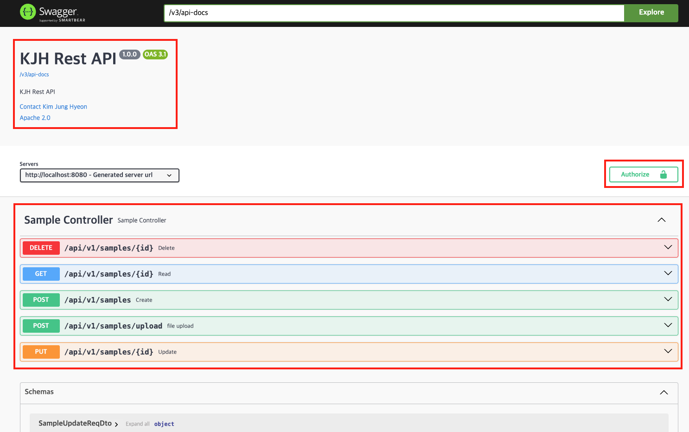
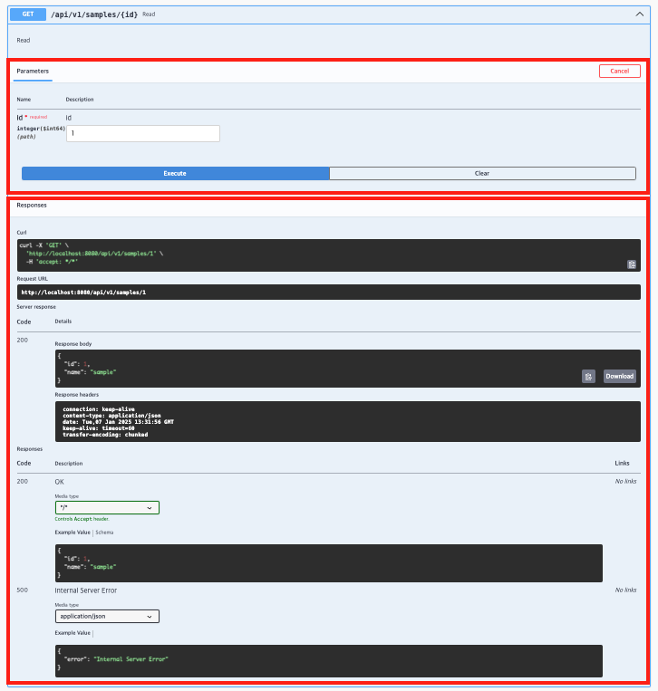

 

> 오늘은 API 문서 자동화 도구인 Swagger 에 대해서 알아보겠습니다.

## Swagger란?

---

**스웨거(Swagger)**는 REST API를 문서화하고 테스트하는 데 사용되는 **오픈 소스 프레임워크**로, **OpenAPI Specification(OAS)** 표준을 기반으로 동작합니다. Swagger는 API 명세를 명확하고 구조적으로 정의할 수 있도록 지원하며, API를 직접 호출하고 테스트할 수 있는 환경을 제공합니다. 스프링 환경에서는 Swagger 라이브러리를 활용하여 간단한 설정만으로 Controller에 구현한 API를 자동으로 문서화하고, 직관적인 GUI를 통해 API를 호출하고 테스트할 수 있습니다.

> ***OpenAPI Specification(OAS) 란?**
>
> **OpenAPI Specification(OAS)**은 REST API를 설계하고 문서화하기 위한 **표준화된 명세(Specification)**입니다. 이전에는 Swagger Specification으로 알려져 있었으나, 오픈 소스 커뮤니티로 이전되면서 **OpenAPI Initiative**에서 관리하게 되었고 이름이 변경되었습니다.


## Swagger 설정

---

### 환경

- **Spring Boot**: 3.4.1
- **Java**: 17
- **빌드 도구**: Gradle
- **Dependencies**
  - `org.springframework.boot:spring-boot-starter-web`
  - `org.springdoc:springdoc-openapi-starter-webmvc-ui:2.8.0`


### build.gradle

swagger를 사용하기 위해 `org.springdoc:springdoc-openapi-starter-webmvc-ui:2.8.0` 를 추가해 줍시다.

```groovy
// https://mvnrepository.com/artifact/org.springdoc/springdoc-openapi-starter-webmvc-ui
implementation 'org.springdoc:springdoc-openapi-starter-webmvc-ui:2.8.0'
```


### application.yml

Springdoc 관련 설정을 application.yml에 정의합니다. `info` 부분은 제가 커스텀 설정한 부분입니다. 아래 추가 설정을 통해 API 정보 및 jwt header 활성화 여부를 설정할 수 있습니다. 다른 다양한 설정은 <https://springdoc.org/#getting-started> 를 참고해주세요

```yaml
springdoc:
  packages-to-scan: com.kjung.boilerplate
  paths-to-match: /api/**
  api-docs:
    enabled: true # api Docs 활성화 여부
  swagger-ui:
    enabled: true # swagger ui 활성화 여부
    path: /swagger-ui.html
    tags-sorter: alpha # tag 활성화 여부
    operations-sorter: method # operation method 활성화 여부
    info:
      enabled: true # info 활성화 여부
      title: KJH Rest API # title
      description: KJH Rest API # description
      version: 1.0.0 # version
      contact:
        name: Kim Jung Hyeon
        email: dev.kjung@gmail.com
      license:
        name: Apache 2.0
        url: https://www.apache.org/licenses/LICENSE-2.0.html
      jwt-header-enabled: true # jwt header 활성화 여부
```

- **`packages-to-scan`** :Swagger가 문서화할 컨트롤러가 포함된 패키지를 지정합니다.
- **`paths-to-match`**: Swagger가 매칭하여 문서화할 API 경로를 지정합니다.
- **`api-docs`**
  - **`enabled`**: `/v3/api-docs` 경로를 활성화하여 API 명세(JSON 형식)를 제공할지 여부를 설정합니다.
- **`swagger-ui`**
  - **`enabled`**: Swagger UI의 활성화 여부를 설정합니다.
  - **`path`**: Swagger UI가 노출될 경로를 지정합니다.
  - **`tags-sorter`**: Swagger UI에서 태그를 정렬하는 기준을 지정합니다. (`alpha`: 알파벳 )
  - **`operations-sorter`**: Swagger UI에서 API 메서드(Operation)를 정렬하는 기준을 설정합니다. (`alpha`: 알파벳, `method`: Http method )
  - **`info`**:
    - **`enabled`**: Swagger 문서의 `info` 섹션을 활성화할지 여부를 설정합니다.
    - **`title`**: Swagger 문서의 제목을 설정합니다.
    - **`description`**: Swagger 문서의 설명을 작성합니다.
    - **`version`**: Swagger 문서의 버전을 설정합니다.
    - **`contact:`**
      - **`name`**: API 문서 담당자의 이름을 설정합니다.
      - **`email`**: API 문서 담당자의 이메일 주소를 설정합니다.
    - **`license`**
      - **`name`**: API 문서에서 표시할 라이선스 이름을 설정합니다.
      - **`url`**: 라이선스 정보를 제공하는 URL을 설정합니다.
    - **`jwt-header-enabled`**: JWT 헤더를 API 문서에서 활성화할지 여부를 설정합니다.


### SwaggerInfoProperties.java

위에서 설명 했듯이 Rest API Info 설정을 위한 Properties 클래스입니다.

``` java
package com.kjung.boilerplate.moduleapi.core.config.swagger;

import lombok.Getter;
import lombok.Setter;
import org.springframework.boot.autoconfigure.condition.ConditionalOnProperty;
import org.springframework.boot.context.properties.ConfigurationProperties;
import org.springframework.context.annotation.Configuration;

@Getter
@Setter
@ConditionalOnProperty(
        prefix = "springdoc.swagger-ui.info",
        name = "enabled",
        havingValue = "true"
)
@Configuration
@ConfigurationProperties(prefix = "springdoc.swagger-ui.info")
public class SwaggerInfoProperties {
    private boolean enabled;
    private String title;
    private String description;
    private String version;
    private Contact contact;
    private License license;
    private Boolean jwtHeaderEnabled;

    // Contact 클래스
    @Getter
    @Setter
    public static class Contact {
        private String name;
        private String email;
        private String url;

    }

    // License 클래스
    @Getter
    @Setter
    public static class License {
        private String name;
        private String url;

    }
}

```


### SwaggerConfig.java


``` java
package com.kjung.boilerplate.moduleapi.core.config.swagger;

import io.swagger.v3.oas.models.Components;
import io.swagger.v3.oas.models.OpenAPI;
import io.swagger.v3.oas.models.Operation;
import io.swagger.v3.oas.models.info.Contact;
import io.swagger.v3.oas.models.info.Info;
import io.swagger.v3.oas.models.info.License;
import io.swagger.v3.oas.models.media.Content;
import io.swagger.v3.oas.models.media.MediaType;
import io.swagger.v3.oas.models.responses.ApiResponse;
import io.swagger.v3.oas.models.security.SecurityScheme;
import org.springdoc.core.customizers.OpenApiCustomizer;
import org.springframework.boot.autoconfigure.condition.ConditionalOnBean;
import org.springframework.context.annotation.Bean;
import org.springframework.context.annotation.Configuration;
import org.springframework.http.HttpHeaders;
import org.springframework.http.HttpStatus;

import java.util.Map;

import static org.springframework.http.HttpStatus.INTERNAL_SERVER_ERROR;

/**
 * Swagger 설정
 * <a href="https://springdoc.org/#getting-started"/> 참고
 */
@Configuration
public class SwaggerConfig {

    @Bean
    @ConditionalOnBean(SwaggerInfoProperties.class)
    public OpenAPI customOpenAPI(SwaggerInfoProperties properties) {
        OpenAPI openAPI = createCustomOpenAPI(properties);

        // JWT 헤더 추가 여부 확인
        if (Boolean.TRUE.equals(properties.getJwtHeaderEnabled())) {
            openAPI.components(
                    new Components()
                            .addSecuritySchemes(
                                    HttpHeaders.AUTHORIZATION,
                                    new SecurityScheme()
                                            .type(SecurityScheme.Type.HTTP)
                                            .scheme("bearer")
                                            .bearerFormat("JWT")
                                            .name(HttpHeaders.AUTHORIZATION))
            );
        }

        return openAPI;
    }

    private OpenAPI createCustomOpenAPI(SwaggerInfoProperties properties) {
        Info info = new Info()
                .title(properties.getTitle())
                .description(properties.getDescription())
                .version(properties.getVersion());

        // Contact 정보 추가
        SwaggerInfoProperties.Contact contact = properties.getContact();

        if (contact != null) {
            info.setContact(
                    new Contact()
                            .name(contact.getName())
                            .email(contact.getEmail())
                            .url(contact.getUrl())
            );
        }

        // License 정보 추가
        SwaggerInfoProperties.License license = properties.getLicense();

        if (license != null) {
            info.setLicense(
                    new License()
                            .name(license.getName())
                            .url(license.getUrl())
            );
        }

        return new OpenAPI().info(info);
    }

    @Bean
    public OpenApiCustomizer customGlobalResponses() { // 공통 APIResponse 정의
        return openApi -> openApi.getPaths().values().forEach(pathItem -> pathItem.readOperations().forEach(operation -> {

//                    addApiResponse(operation, BAD_REQUEST); // 400
//                    addApiResponse(operation, UNAUTHORIZED); // 401
//                    addApiResponse(operation, FORBIDDEN); // 403
            addApiResponse(operation, INTERNAL_SERVER_ERROR); // 500

        }));
    }

    private void addApiResponse(Operation operation, HttpStatus httpStatus) {
        operation
                .getResponses()
                .addApiResponse(
                        String.valueOf(httpStatus.value()),
                        new ApiResponse()
                                .description(httpStatus.getReasonPhrase())
                                .content(
                                        new Content()
                                                .addMediaType(
                                                        org.springframework.http.MediaType.APPLICATION_JSON_VALUE,
                                                        new MediaType()
                                                                .example(Map.of("error", httpStatus.getReasonPhrase())) // todo 에러 DTO 필요
                                                )
                                )
                );
    }
}

```

**메서드 설명**

- **`customOpenAPI`**
  - `application.yml`에서 설정한 `info` 정보를 기반으로 Swagger 문서를 생성하기 위해 **OpenAPI 객체를 커스터마이징**하여 스프링 빈으로 등록합니다.
- **`customGlobalResponses`**
  - 모든 API에서 공통으로 사용되는 응답(`ApiResponse`)을 정의합니다.
    필요에 따라 다른 공통 응답 항목(예: 400, 403 등)을 추가로 정의할 수 있습니다.
- **`addApiResponse`**
  - `new MediaType().example(...)` : 응답 예시 데이터를 설정하며, 이 값을 원하는 형식으로 변경하여 커스터마이징할 수 있습니다.
    - 예: `{"error": "Internal Server Error"}` 같은 응답 예시 제공.


## 테스트용 Sample 로직 구현

---

### DTO

#### SampleDto.java

```java
package com.kjung.boilerplate.moduleapi.sample.dto;

import io.swagger.v3.oas.annotations.media.Schema;
import lombok.Getter;
import lombok.RequiredArgsConstructor;

@Getter
@RequiredArgsConstructor
public class SampleDto {
    @Schema(description = "id", example = "1")
    private final Long id;
    @Schema(description = "이름", example = "sample")
    private final String name;

}

```

#### SampleInsertReqDto.java

``` java
package com.kjung.boilerplate.moduleapi.sample.dto;

import io.swagger.v3.oas.annotations.media.Schema;
import jakarta.validation.constraints.NotBlank;
import lombok.Getter;
import lombok.Setter;

@Getter
@Setter
public class SampleInsertReqDto {
    @NotBlank
    @Schema(description = "이름", example = "sample")
    private String name;
}

```

#### SampleUpdateReqDto.ajva

````java
package com.kjung.boilerplate.moduleapi.sample.dto;

import io.swagger.v3.oas.annotations.media.Schema;
import jakarta.validation.constraints.NotBlank;
import lombok.Getter;
import lombok.Setter;

@Getter
@Setter
public class SampleUpdateReqDto {
    @NotBlank
    @Schema(description = "이름", example = "sample")
    private String name;
}
````


### Service

#### SampleService.java

```java
package com.kjung.boilerplate.moduleapi.sample.service;

import com.kjung.boilerplate.moduleapi.sample.dto.SampleDto;
import com.kjung.boilerplate.moduleapi.sample.dto.SampleInsertReqDto;
import com.kjung.boilerplate.moduleapi.sample.dto.SampleUpdateReqDto;

public interface SampleService {

    SampleDto getSample(Long id);

    SampleDto insertSample(SampleInsertReqDto param);

    SampleDto updateSample(Long id, SampleUpdateReqDto param);

    void deleteSample(Long id);
}

```

#### SampleServiceImpl.java

````java
package com.kjung.boilerplate.moduleapi.sample.service.impl;

import com.kjung.boilerplate.moduleapi.sample.dto.SampleDto;
import com.kjung.boilerplate.moduleapi.sample.dto.SampleInsertReqDto;
import com.kjung.boilerplate.moduleapi.sample.dto.SampleUpdateReqDto;
import com.kjung.boilerplate.moduleapi.sample.service.SampleService;
import lombok.extern.slf4j.Slf4j;
import org.springframework.stereotype.Service;

@Slf4j
@Service
public class SampleServiceImpl implements SampleService {

    @Override
    public SampleDto getSample(Long id) {
        log.info("조회");

        return new SampleDto(id, "sample");
    }

    @Override
    public SampleDto insertSample(SampleInsertReqDto param) {
        log.info("등록");

        return new SampleDto(1L, param.getName());
    }

    @Override
    public SampleDto updateSample(Long id, SampleUpdateReqDto param) {
        log.info("수정");

        return new SampleDto(id, param.getName());
    }

    @Override
    public void deleteSample(Long id) {
        log.info("삭제");
    }
}

````

### Controller

#### SampleController.java

````java
package com.kjung.boilerplate.moduleapi.sample.controller;

import com.kjung.boilerplate.moduleapi.sample.dto.SampleDto;
import com.kjung.boilerplate.moduleapi.sample.dto.SampleInsertReqDto;
import com.kjung.boilerplate.moduleapi.sample.dto.SampleUpdateReqDto;
import com.kjung.boilerplate.moduleapi.sample.service.SampleService;
import io.swagger.v3.oas.annotations.Operation;
import io.swagger.v3.oas.annotations.Parameter;
import io.swagger.v3.oas.annotations.tags.Tag;
import lombok.RequiredArgsConstructor;
import org.springframework.http.HttpStatus;
import org.springframework.http.MediaType;
import org.springframework.validation.annotation.Validated;
import org.springframework.web.bind.annotation.*;
import org.springframework.web.multipart.MultipartFile;

@Tag(name = "Sample Controller", description = "Sample Controller")
@RestController
@RequiredArgsConstructor
@RequestMapping("/api/v1/samples")
public class SampleController {

    private final SampleService sampleService;


    @Operation(summary = "Read", description = "Read")
    @GetMapping("/{id}")
    public SampleDto getSample(@Parameter(name = "id", description = "id", example = "1")
                               @PathVariable(name = "id") Long id) {
        return sampleService.getSample(id);
    }

    @Operation(summary = "Create", description = "Create")
    @ResponseStatus(HttpStatus.CREATED)
    @PostMapping
    public SampleDto insertSample(@Validated @RequestBody SampleInsertReqDto param) {
        return sampleService.insertSample(param);
    }

    @Operation(summary = "Update", description = "Update")
    @PutMapping("/{id}")
    public SampleDto updateSample(@Parameter(name = "id", description = "id", example = "1")
                                  @PathVariable(name = "id") Long id,
                                  @Validated @RequestBody SampleUpdateReqDto param) {
        return sampleService.updateSample(id, param);
    }

    @Operation(summary = "Delete", description = "Delete")
    @DeleteMapping("/{id}")
    public void deleteSample(@Parameter(name = "id", description = "id", example = "1")
                             @PathVariable(name = "id") Long id) {
        sampleService.deleteSample(id);
    }

    @Operation(summary = "file upload", description = "file upload")
    @ResponseStatus(HttpStatus.CREATED)
    @PostMapping(value = "/upload", consumes = {MediaType.MULTIPART_FORM_DATA_VALUE})
    public boolean upload(@Parameter(description = "file") final MultipartFile file) {
        return true;
    }
}

````


## 테스트

---

애플리케이션을 실행하고 <http://localhost:8080/swagger-ui/index.html> 를 통해 Swagger 문서를 확인해봅시다. 설정한 info 정보, jwt header 세팅을 위한 authorize 버튼, controller에 구현한 Rest API 목록이 표출되는 것을 확인할 수 있습니다.



RestAPI 목록중 하나를 펼쳐보면 아래와 같이 인자 값을 직접 설정하여 API를 호출해볼 수 있습니다.




## 마치며

---

오늘은 Controller에 작성한 코드로부터 자동으로 문서를 생성하고, 테스트까지 가능하게 해주는 **Swagger**에 대해 알아보았습니다.

과거에는 Rest API 스펙을 주고받기 위해 엑셀로 인터페이스 설계서를 작성하거나 Postman Collection을 만들어 전달해야 했습니다. 특히, 기업에서도 설계서를 문서 형태로 요구하는 경우가 많아, 변경 사항이 발생할 때마다 문서를 수정하고 다시 전달하는 번거로움이 있었습니다.

최근에는 많은 기업들이 **Swagger를 API 문서 표준으로 채택**하면서, Rest API 명세를 손쉽게 생성하고 공유할 수 있게 되었고, 이를 통해 내가 만든 API를 프론트엔드 개발자나 다른 협업 대상자에게 문서화된 형태로 **링크만 공유**하여 손쉽게 전달할 수 있게 되어 정말 편리해진 것 같습니다.

읽어주셔서 감사합니다! 🙏

## 전체 코드

---

- <https://github.com/DevK-Jung/hardhat-example> api-module 참고

## Reference

---

- <https://swagger.io/>
- <https://springdoc.org/#getting-started>
