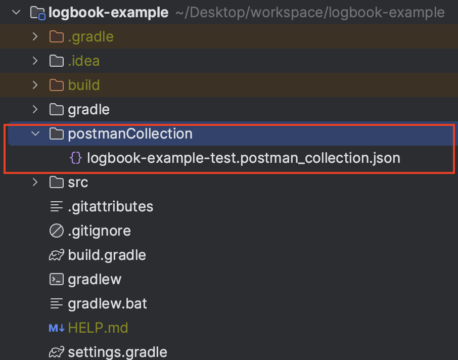
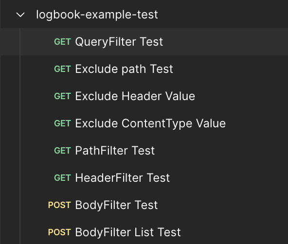
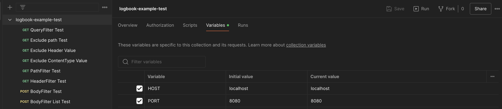
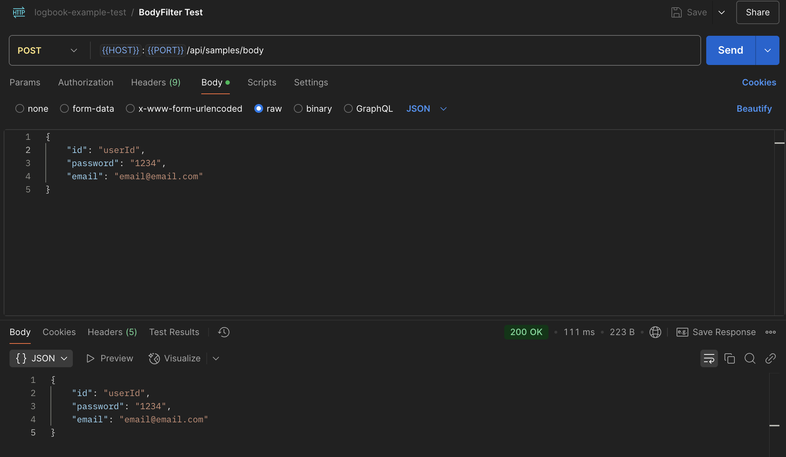
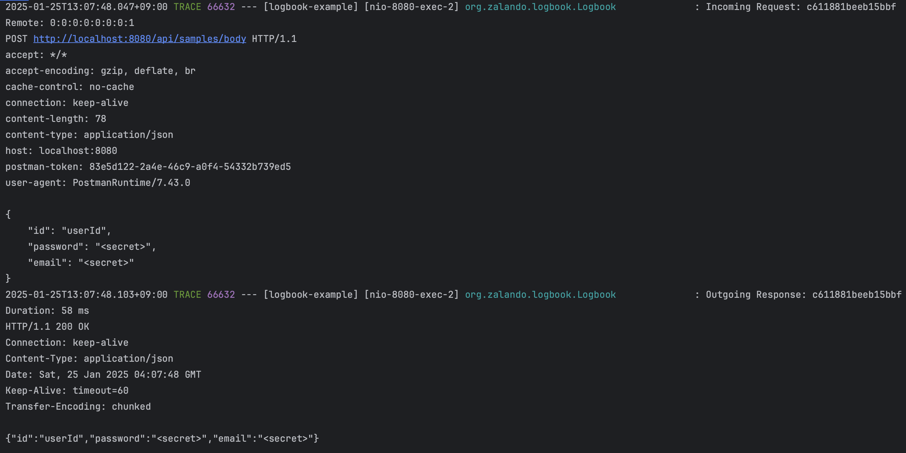

> 프로젝트 안정화 기간에 운영 담당자 분께서 **HTTP 요청 및 응답의 트래픽 정보**와 **Request/Response Body**를 상세히 로깅이 되면 좋겠다고 요청하셨습니다. 직접 **Filter**, **Interceptor**, 또는 **AOP**등을  활용하여 구현을 할까 고민하다. 이런 저런 예외 사항 등 고려 사항이 많아 라이브러리를 찾아보던 중 Logbook 이라는 라이브러리를 발견했습니다! 오늘은 이러한 Logbook 예제 코드를 구현해보고 사용 방법을 알아보겠습니다.

## Logbook

---

> **[Logbook](https://github.com/zalando/logbook)** **은 다양한 클라이언트 및 서버 측 기술에 대한 완전한 요청 및 응답 로깅을 가능하게 하는 확장 가능한 Java 라이브러리입니다.** 개발자는 애플리케이션이 수신하거나 전송하는 모든 HTTP 트래픽을 로깅할 수 있습니다. 이는 로그 분석, 감사 또는 트래픽 문제 조사에 사용할 수 있습니다. - [baeldung](https://www.baeldung.com/spring-logbook-http-logging) 

위 설명처럼 Logbook 은 HTTP 요청과 응답을 로깅하기 위한 Java 기반 라이브러리로 요청 및 응답에 대한 본문, 헤더 등 HTTP 메시지의 세부 정보를 로깅할 수 있고 민감한 정보를 마스킹하거나 로깅 메시지 자체의 포맷을 쉽게 변경할 수 있는 기능을 제공하는 등 간단한 설정만으로 손 쉬운 로깅을 가능하게 해줍니다.

## 특징 

---

#### 장점 

- **HTTP 로그의 가독성**: 요청 및 응답을 원하는 읽기 쉬운 포맷으로 출력 가능. - 포맷 직접 설정 가능
- **유연한 필터링**: 민감한 데이터에 대해 쉽게 마스킹이 가능하여 보안 강화
- **구성 가능성**: 로깅 수준, 헤더, 본문 등의 다양한 설정 가능 

#### 단점 

- **성능 문제**: 대규모 요청 처리 시 로깅이 성능에 영향을 미칠 수 있음


## Logbook 사용 환경 및 요구 사항 

---

 Logbook 사용 전 요구 사항은 아래와 같습니다. 버전이나 환경은 프로젝트에 따라 달라질 수 있으니, 최신 정보는 [Logbook 공식 문서](https://github.com/zalando/logbook)를 참고해주세요.

- **Java 8 이상** (Spring 6 / Spring Boot 3.x와 JAX-RS 3.x 사용 시 Java 17 필요)
- **빌드 도구**: Maven 또는 Gradle (Maven Central에서 다운로드 가능)
- **Spring Boot 2.x 또는 3.x** (선택 사항)
- **Servlet Container, Netty, OkHttp, JAX-RS 등** (선택 사항)


## 적용 코드

---

### 실습 환경

- **Spring Boot**: 3.4.2
- **Java**: 17
- **빌드 도구**: Gradle
- **사용 라이브러리**
  - `spring-boot-starter-web`
  - `logbook-spring-boot-starter:3.10.0`
  - `spring-boot-configuration-processor`
  -  `lombok`


### build.gradle

```groovy
plugins {
    id 'java'
    id 'org.springframework.boot' version '3.4.2'
    id 'io.spring.dependency-management' version '1.1.7'
}

group = 'com.example'
version = '0.0.1-SNAPSHOT'

java {
    toolchain {
        languageVersion = JavaLanguageVersion.of(17)
    }
}

configurations {
    compileOnly {
        extendsFrom annotationProcessor
    }
}

repositories {
    mavenCentral()
}

dependencies {
    implementation 'org.springframework.boot:spring-boot-starter-web'

    // https://mvnrepository.com/artifact/org.zalando/logbook-spring-boot-starter
    implementation 'org.zalando:logbook-spring-boot-starter:3.10.0'

    compileOnly 'org.projectlombok:lombok'
    annotationProcessor 'org.springframework.boot:spring-boot-configuration-processor'
    annotationProcessor 'org.projectlombok:lombok'
    testImplementation 'org.springframework.boot:spring-boot-starter-test'
    testRuntimeOnly 'org.junit.platform:junit-platform-launcher'
}

tasks.named('test') {
    useJUnitPlatform()
}

```


### application.yml

```yaml
spring:
  application:
    name: logbook-example

logging:
  level:
    org:
      zalando:
        logbook:
          Logbook: TRACE
```

요청과 응답을 로그를 기록하기 위해 Logbook 로거를 `TRACE` 레벨로 설정해줍니다.


### LogbookConfig.java

Logbook 주요 설정을 자바 코드를 통해 잡아보겠습니다. application.yml 설정 파일에서도 Logbook 설정을 할 수 있으며 다른 다양한 설정은 <https://github.com/zalando/logbook> 를 참고해주세요.

예제에서는 `/api/samples/exclude` URI, Content-Type이 `application/octet-stream`인 요청, 또는 헤더에 `x-secret: true`가 포함된 요청을 로깅에서 제외합니다. 또한, logbook에서 제공하는 다양한 필터를 통해 쿼리 파라미터, URL 경로, 헤더, 요청 및 응답 Body에서 민감한 데이터를 `<secret>`으로 대체하는 예제입니다.

``` java

package com.example.logbookexample.config;

import org.springframework.context.annotation.Bean;
import org.springframework.context.annotation.Configuration;
import org.springframework.http.HttpHeaders;
import org.springframework.http.MediaType;
import org.zalando.logbook.Logbook;
import org.zalando.logbook.core.*;
import org.zalando.logbook.json.JsonBodyFilters;

import java.util.Set;

import static org.zalando.logbook.core.Conditions.*;

@Configuration
public class LogbookConfig {

    private static final String SECRET = "<secret>";

    @Bean
    public Logbook logbook() {
        return Logbook.builder()
                .condition(
                        exclude( // 특정 요청 로깅 제외
                                requestTo("/api/samples/exclude"),
                                contentType(MediaType.APPLICATION_OCTET_STREAM_VALUE),
                                header("x-secret", "true")
                        )
                )
                .queryFilter(QueryFilters.replaceQuery("password", SECRET)) // 쿼리 파라미터 Secret 값으로 대체하여 로깅
                .pathFilter(PathFilters.replace("/api/samples/path/{test}", SECRET)) // 특정 경로 패턴 Secret 값으로 대체하여 로깅
                .headerFilter(HeaderFilters.replaceHeaders(HttpHeaders.AUTHORIZATION, SECRET)) // 헤더 값 Secret 값으로 대체하여 로깅
                .bodyFilter(JsonBodyFilters.replaceJsonStringProperty(Set.of("password", "email"), "<secret>")) // body 특정 필드 값 Secret 값으로 대체하여 로깅
                .sink(new DefaultSink( // 로깅 설정
                        new DefaultHttpLogFormatter(), // 로깅 포맷 설정
                        new DefaultHttpLogWriter() // 로깅 출력 설정
                ))
                .build();
    }

}
```

- **Condition**: 특정 요청을 로깅 대상에서 제외.

  - `/api/samples/exclude` 와 같은 경로를 로깅 대상에서 제외

  - `Content-Type`이 `application/octet-stream`인 요청 로깅 대상에서 제외

- **QueryFilter**: 쿼리 파라미터 `password` 값을 `<secret>`으로 대체

- **PathFilter**: URL Path의 `{test}` 부분을 `<secret>`으로 대체

- **HeaderFilter**: `Authorization` 헤더 값을 `<secret>`으로 마스킹

- **BodyFilter**: 요청/응답 Body의 JSON 데이터에서 `email`과 `password`를 마스킹


### Logbook 제공 필터

| Type             | Operates on                    | Applies to | Default                                                      |
| ---------------- | ------------------------------ | ---------- | ------------------------------------------------------------ |
| `QueryFilter`    | Query string                   | request    | `access_token`                                               |
| `PathFilter`     | Path                           | request    | n/a                                                          |
| `HeaderFilter`   | Header (single key-value pair) | both       | `Authorization`                                              |
| `BodyFilter`     | Content-Type and body          | both       | json: `access_token` and `refresh_token` form: `client_secret`, `password` and `refresh_token` |
| `RequestFilter`  | `HttpRequest`                  | request    | Replace binary, multipart and stream bodies.                 |
| `ResponseFilter` | `HttpResponse`                 | response   | Replace binary, multipart and stream bodies.                 |

출처 <https://github.com/zalando/logbook>

## 테스트를 위한 DTO 와 Controller 클래스 생성

---

### DTO

requestBody responseBody 로깅 테스트를 위해 간단한 DTO 클래스를 만들어주겠습니다.

#### ReqDto.java

``` java
package com.example.logbookexample.dto;

import lombok.Getter;
import lombok.Setter;

@Getter
@Setter
public class ReqDto {
    private String id;
    private String password;
    private String email;
}
```

#### RespDto.java

```java
package com.example.logbookexample.dto;

import lombok.Getter;
import lombok.RequiredArgsConstructor;

@Getter
@RequiredArgsConstructor
public class RespDto {
    private final String id;
    private final String password;
    private final String email;

    public static RespDto from(ReqDto reqDto) {
        return new RespDto(reqDto.getId(), reqDto.getPassword(), reqDto.getEmail());
    }
}
```

### SampleController.java

HTTP 요청 로깅 확인을 위한 Controller 클래스를 생성해 주겠습니다.

``` java
package com.example.logbookexample.controller;

import com.example.logbookexample.dto.ReqDto;
import com.example.logbookexample.dto.RespDto;
import org.springframework.http.HttpHeaders;
import org.springframework.http.MediaType;
import org.springframework.web.bind.annotation.*;

import java.util.List;

@RestController
@RequestMapping("/api/samples")
public class SampleController {

    // exclude test api: 로깅 제외
    @GetMapping("/exclude")
    public String exclude() {
        return "exclude";
    }

    // exclude test api: 특정 Header 값 로깅 제외
    @GetMapping("/exclude/header")
    public String excludeHeader(@RequestHeader("x-secret") String xSecret) {
        return "excludeHeader";
    }

    // exclude test api: 특정 Content-Type 로깅 제외
    @GetMapping(value = "/exclude/content-type", consumes = MediaType.APPLICATION_OCTET_STREAM_VALUE)
    public String excludeContentType() {
        return "excludeContentType";
    }

    // queryFiltering test api: 쿼리 파라미터 Secret 값으로 대체 로깅
    @GetMapping("/query")
    public String query(@RequestParam("password") String password) {
        return password;
    }

    // pathFilter test api: 쿼리 파라미터 Secret 값으로 대체 로깅
    @GetMapping("/path/{test}")
    public String path(@PathVariable("test") String test) {
        return test;
    }

    // headerFilter test api : 헤더 값 Secret 값으로 대체 로깅
    @GetMapping("/header")
    public String header(@RequestHeader(HttpHeaders.AUTHORIZATION) String authorization) {
        return authorization;
    }

    // bodyFilter test api : body 특정 필드 값 Secret 값으로 대체 로깅
    @PostMapping("/body")
    public RespDto body(@RequestBody ReqDto reqDto) {
        return RespDto.from(reqDto);
    }

    // bodyFilter test api : body list 특정 필드 값 Secret 값으로 대체 로깅
    @PostMapping("/body/list")
    public List<RespDto> body(@RequestBody List<ReqDto> reqDto) {
        return reqDto.stream()
                .map(RespDto::from)
                .toList();
    }
}
```


## 테스트

---

전체 코드는 제 개인 [Github](https://github.com/DevK-Jung/logbook-example) 에 올려두었습니다. API 테스트를 위한 PostmanCollection도 해당 프로젝트 내에 올려두었으니 참고해주세요! 해당 포스팅에서는 http 트랙픽과 request/response body 가 로깅이 되는지 민감한 정보가 로깅에서 감춰지는지 테스트해보겠습니다.

### postmanCollection 위치



### postman



### variables 설정



### BodyFilter Test





HTTP Header 정보와 Body 정보가 설정한대로 Trace 레벨로 로깅되는것을 확인할 수 있습니다. BodyFilter에 적용된 내용대로 password 정보와 email 정보도 <secret> 으로 치환되서 정상 출력 되는것을 확인할 수 있습니다.

## 마치며

---

오늘은 **HTTP 요청과 응답 로깅**을 위해 **Logbook 라이브러리**를 활용하는 방법을 살펴보았습니다. Logbook은 간단한 설정만으로 HTTP 요청/응답 로깅을 손쉽게 구현할 수 있어, 직접 Interceptor, Filter, AOP 등을 사용해 로깅 기능을 개발하는 것보다 훨씬 편리한 것 같습니다. 다만, 대규모 요청이 발생하는 시스템에서는 로깅이 성능에 영향을 미칠 수 있으므로, 이를 신중히 고려하고 적절히 설정하여 적용하는 것이 중요해 보입니다. 감사합니다.


## Reference

---

- <https://www.baeldung.com/spring-logbook-http-logging>
- <https://github.com/zalando/logbook>


## 전체 코드

---

- <https://github.com/DevK-Jung/logbook-example.git>
